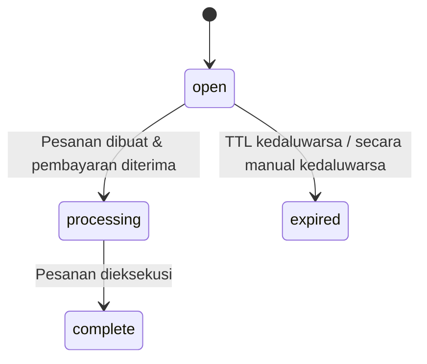

Sesi checkout memungkinkan Anda membuat objek pelacakan di server Anda sebelum pengguna memilih metode pembayaran. Sesi tersebut merupakan catatan database yang ringan -- tanpa panggilan API eksternal, tanpa pembuatan pesanan. Pesanan datang kemudian, ketika pengguna berkomitmen untuk membayar.

<Info>
  Mencari komponen checkout React? Lihat [Checkout](/anyspend/checkout). Halaman ini membahas **REST API** untuk alur yang didorong server.
</Info>

## URL Dasar

Semua endpoint sesi checkout berada pada layanan AnySpend:

```
https://api.anyspend.com
```

## Alur

<Steps>
  <Step title="Buat sesi di server Anda">
    `POST https://api.anyspend.com/checkout-sessions` mengembalikan `{ id, status: "open" }`
  </Step>
  <Step title="Pengguna memilih metode pembayaran">
    `POST https://api.anyspend.com/orders` dengan `checkoutSessionId` mengembalikan `{ id, globalAddress, oneClickBuyUrl }`
  </Step>
  <Step title="Pengguna membayar">
    **Crypto:** kirim ke `globalAddress` | **Fiat onramp:** alihkan ke `oneClickBuyUrl`
  </Step>
  <Step title="Poll untuk penyelesaian">
    `GET https://api.anyspend.com/checkout-sessions/:id` mengembalikan `{ status: "complete", order_id }`
  </Step>
</Steps>

### Mengapa memisahkan sesi dari pesanan?

- Metode pembayaran tidak perlu diketahui saat pembuatan sesi.
- Halaman checkout yang dihosting dapat memungkinkan pengguna memilih cara membayar.
- Pembuatan sesi adalah penulisan DB lokal, jadi tidak pernah gagal karena kesalahan API pihak ketiga.

## Siklus hidup status sesi



| Status | Arti |
|--------|------|
| `open` | Dibuat, menunggu pesanan/pembayaran |
| `processing` | Pembayaran diterima, pesanan sedang dieksekusi |
| `complete` | Pesanan berhasil dieksekusi |
| `expired` | TTL kedaluwarsa, pembayaran gagal, atau secara manual kedaluwarsa |

## Referensi API

### Membuat sesi

```
POST https://api.anyspend.com/checkout-sessions
```

Membuat sesi yang ringan. Tanpa pesanan, tanpa panggilan API eksternal.

```json
{
  "success_url": "https://merchant.com/success?session_id={SESSION_ID}",
  "cancel_url": "https://merchant.com/cancel",
  "metadata": { "sku": "widget-1" },
  "client_reference_id": "merchant-order-456",
  "expires_in": 1800
}
```

Semua bidang opsional. Konfigurasi pembayaran (jumlah, token, rantai) berada pada pesanan, bukan sesi.

### Membuat pesanan yang terkait dengan sesi

```
POST https://api.anyspend.com/orders
```

Lewati `checkoutSessionId` dalam badan pesanan standar untuk menghubungkan pesanan dengan sesi.

```json
{
  "recipientAddress": "0x...",
  "srcChain": 8453,
  "dstChain": 8453,
  "srcTokenAddress": "0x...",
  "dstTokenAddress": "0x...",
  "srcAmount": "1000000",
  "type": "swap",
  "payload": { "expectedDstAmount": "1000000" },
  "checkoutSessionId": "550e8400-..."
}
```

**Aturan validasi:**
- Sesi harus ada (`400` jika tidak ditemukan)
- Sesi harus `open` (`400` jika kedaluwarsa/processing/complete)
- Sesi tidak boleh sudah memiliki pesanan (`409 Conflict`)

### Mengambil sesi

```
GET https://api.anyspend.com/checkout-sessions/:id
```

Mengembalikan status sesi saat ini. Status disinkronkan dari pesanan yang mendasarinya pada setiap pengambilan.

| Query param | Deskripsi |
|-------------|-----------|
| `include=order` | Menyertakan objek pesanan lengkap dengan transaksi |

### Mengakhiri sesi

```
POST https://api.anyspend.com/checkout-sessions/:id/expire
```

Hanya berfungsi pada sesi dengan status `open`.

## Template URL Pengalihan

Gunakan variabel template dalam `success_url` dan `cancel_url`:

| Variabel | Digantikan dengan |
|----------|-------------------|
| `{SESSION_ID}` | UUID sesi checkout |
| `{ORDER_ID}` | Nilai yang sama (alias) |

Jika tidak ada variabel template yang hadir, `?sessionId=<uuid>` ditambahkan secara otomatis.

## Integrasi SDK

### Metode Layanan

```typescript
import { anyspend } from "@b3dotfun/sdk/anyspend";

// Membuat sesi checkout
const session = await anyspend.createCheckoutSession({
  success_url: "https://mysite.com/success/{SESSION_ID}",
  metadata: { sku: "widget-1" },
});

// Mengambil status sesi
const session = await anyspend.getCheckoutSession(sessionId);
```

### React hooks

#### `useCreateCheckoutSession`

Mutation hook untuk membuat sesi.

```tsx
import { useCreateCheckoutSession } from "@b3dotfun/sdk/anyspend";

const { mutate: createSession, data, isPending } = useCreateCheckoutSession();
```

#### `useCheckoutSession`

Query hook dengan auto-polling. Berhenti polling ketika status mencapai `complete` atau `expired`.

```tsx
import { useCheckoutSession } from "@b3dotfun/sdk/anyspend";

const { data: session, isLoading } = useCheckoutSession(sessionId);
```

### Prop Komponen

Komponen `<AnySpend>`, `<AnySpendCustom>`, dan `<AnySpendCustomExactIn>` menerima prop `checkoutSession` opsional:

```tsx
<AnySpend
  defaultActiveTab="fiat"
  destinationTokenAddress="0x833589fCD6eDb6E08f4c7C32D4f71b54bdA02913"
  destinationTokenChainId={8453}
  recipientAddress="0x..."
  checkoutSession={{
    success_url: "https://myshop.com/success?session={SESSION_ID}",
    cancel_url: "https://myshop.com/cancel",
    metadata: { sku: "widget-1" },
  }}
/>
```

Ketika `checkoutSession` diatur, komponen membuat sesi sebelum pesanan, dan menggunakan `success_url` sesi untuk pengalihan. Tanpa prop, alur yang ada bekerja sama seperti sebelumnya.

## Contoh

### Pembayaran Crypto

```typescript
const BASE_URL = "https://api.anyspend.com";

// 1. Buat sesi
const session = await fetch(`${BASE_URL}/checkout-sessions`, {
  method: "POST",
  headers: { "Content-Type": "application/json" },
  body: JSON.stringify({
    success_url: "https://mysite.com/success/{SESSION_ID}",
    metadata: { sku: "widget-1" },
  }),
}).then(r => r.json());

// 2. Buat pesanan yang terkait dengan sesi
const order = await fetch(`${BASE_URL}/orders`, {
  method: "POST",
  headers: { "Content-Type": "application/json" },
  body: JSON.stringify({
    recipientAddress: "0x...",
    srcChain: 8453,
    dstChain: 8453,
    srcTokenAddress: "0x833589fcd6edb6e08f4c7c32d4f71b54bda02913",
    dstTokenAddress: "0x833589fcd6edb6e08f4c7c32d4f71b54bda02913",
    srcAmount: "1000000",
    type: "swap",
    payload: { expectedDstAmount: "1000000" },
    checkoutSessionId: session.data.id,
  }),
}).then(r => r.json());

// 3. Pengguna mengirim crypto ke order.data.globalAddress

// 4. Poll sesi sampai selesai
const poll = setInterval(async () => {
  const s = await fetch(`${BASE_URL}/checkout-sessions/${session.data.id}`).then(r => r.json());
  if (s.data.status === "complete") {
    clearInterval(poll);
    // alihkan ke success_url atau tampilkan konfirmasi
  }
}, 3000);
```

### Fiat onramp (Coinbase/Stripe)

```typescript
const BASE_URL = "https://api.anyspend.com";

// Langkah 1-2 sama seperti di atas, tetapi sertakan konfig onramp dalam pembuatan pesanan:
const order = await fetch(`${BASE_URL}/orders`, {
  method: "POST",
  headers: { "Content-Type": "application/json" },
  body: JSON.stringify({
    // ... sama dengan bidang pesanan ...
    checkoutSessionId: session.data.id,
    onramp: {
      vendor: "coinbase",
      payment_method: "card",
      country: "US",
    },
  }),
}).then(r => r.json());

// Alihkan pengguna ke halaman checkout vendor
window.location.href = order.data.oneClickBuyUrl;

// Setelah vendor mengalihkan kembali, poll GET /checkout-sessions/:id untuk penyelesaian
