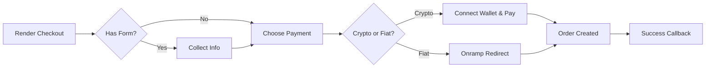

Komponen checkout menampilkan layout dua panel: ringkasan pesanan di satu sisi, pembayaran di sisi lain. Mereka mendukung crypto dan fiat, bidang formulir kustom, opsi pengiriman, kode diskon, dan pemicu alur kerja B3 opsional. [Lihat secara langsung](https://sdk-demo.anyspend.com/).

<Info>
  Untuk **sessions REST API** checkout (aliran berbasis sesi yang didorong backend), lihat [Checkout Sessions](/anyspend/checkout-sessions). Halaman ini membahas **komponen checkout React**.
</Info>

## Cara kerjanya



## Mulai cepat

<Steps>
  <Step title="Install the SDK">
    ```bash
    npm install @b3dotfun/sdk
    ```
  </Step>
  <Step title="Import the component">
    ```tsx
    import { AnySpendCheckout } from "@b3dotfun/sdk/anyspend/react";
    ```
  </Step>
  <Step title="Render the checkout">
    ```tsx title="Basic Checkout" icon="cart-shopping"
    <AnySpendCheckout
      recipientAddress="0xMerchantAddress..."
      destinationTokenAddress="0x833589fCD6eDb6E08f4c7C32D4f71b54bdA02913"
      destinationTokenChainId={8453}
      items={[
        {
          name: "Pro Plan - Monthly",
          description: "Unlimited access to all features",
          amount: "10000000", // 10 USDC (6 decimals)
          quantity: 1,
        },
      ]}
      organizationName="Acme Inc"
      organizationLogo="/acme-logo.svg"
      themeColor="#4f46e5"
      onSuccess={(result) => {
        console.log("Payment complete:", result.orderId);
      }}
    />;
    ```
  </Step>
</Steps>

---

## Komponen

### `<AnySpendCheckout>`

Komponen checkout utama menampilkan layout dua panel dengan panel ringkasan pesanan/keranjang dan panel pembayaran yang mendukung opsi crypto dan fiat. Secara opsional termasuk panel formulir untuk mengumpulkan informasi pelanggan, seleksi pengiriman, dan kode diskon.

#### Prop inti

<ParamField path="recipientAddress" type="string" required>
  Alamat dompet merchant untuk menerima pembayaran
</ParamField>

<ParamField path="destinationTokenAddress" type="string" required>
  Alamat kontrak token untuk penyelesaian (mis., USDC)
</ParamField>

<ParamField path="destinationTokenChainId" type="number" required>
  Chain ID untuk penyelesaian (mis., `8453` untuk Base)
</ParamField>

<ParamField path="items" type="CheckoutItem[]" required>
  Item baris yang ditampilkan di panel keranjang
</ParamField>

#### Branding

<ParamField path="organizationName" type="string">
  Nama merchant yang ditampilkan di header checkout
</ParamField>

<ParamField path="organizationLogo" type="string">
  URL untuk logo merchant
</ParamField>

<ParamField path="themeColor" type="string">
  Warna Hex untuk tema (mis., `"#4f46e5"`)
</ParamField>

<ParamField path="buttonText" type="string">
  Teks kustom untuk tombol pembayaran
</ParamField>

#### Ringkasan pesanan

<ParamField path="totalAmount" type="string">
  Timpa total yang dihitung dalam wei. Gunakan ketika total berbeda dari jumlah jumlah item (mis., setelah diskon atau biaya).
</ParamField>

<ParamField path="shipping" type="string | { amount: string; label?: string }">
  Biaya pengiriman. Kirim string untuk jumlah dalam wei, atau objek dengan label kustom.
</ParamField>

<ParamField path="tax" type="string | { amount: string; label?: string; rate?: string }">
  Jumlah pajak. Kirim string untuk jumlah dalam wei, atau objek dengan label dan tampilan tarif opsional (mis., `"8.5%"`).
</ParamField>

<ParamField path="discount" type="string | { amount: string; label?: string; code?: string }">
  Jumlah diskon (ditampilkan sebagai pengurangan). Kirim string untuk jumlah dalam wei, atau objek dengan label dan kode opsional.
</ParamField>

<ParamField path="summaryLines" type="CheckoutSummaryLine[]">
  Item baris ringkasan tambahan seperti biaya platform, tip, atau biaya layanan
</ParamField>

#### Pembayaran

<ParamField path="defaultPaymentMethod" type="PaymentMethod">
  Metode pembayaran mana yang akan diperluas secara awal. Opsi: `"crypto"`, `"coinbase"`, `"stripe"`.
</ParamField>

<ParamField path="senderAddress" type="string">
  Isi alamat pengirim untuk menampilkan saldo token sebelum koneksi dompet
</ParamField>

<ParamField path="checkoutSessionId" type="string">
  Hubungkan checkout ini ke sesi checkout backend untuk pelacakan
</ParamField>

#### Callback

<ParamField path="onSuccess" type="(result: { txHash?: string; orderId?: string }) => void">
  Dipanggil pada pembayaran berhasil
</ParamField>

<ParamField path="onError" type="(error: Error) => void">
  Dipanggil pada kesalahan pembayaran
</ParamField>

<ParamField path="returnUrl" type="string">
  URL untuk dialihkan setelah penyelesaian pembayaran
</ParamField>

<ParamField path="returnLabel" type="string">
  Label untuk tombol kembali/mengalihkan
</ParamField>

#### Opsi tampilan

<ParamField path="mode" type="'page' | 'embedded'" default="'page'">
  `page` untuk standalone, `embedded` untuk inline dalam layout Anda
</ParamField>

<ParamField path="showPoints" type="boolean" default="false">
  Tampilkan poin yang diperoleh dalam ringkasan status pesanan
</ParamField>

<ParamField path="showOrderId" type="boolean" default="false">
  Tampilkan ID pesanan dalam ringkasan status pesanan
</ParamField>

<ParamField path="footer" type="ReactNode | null">
  Footer kustom untuk ringkasan pesanan. Kirim `null` untuk menyembunyikan footer "Powered by" default.
</ParamField>

#### Kustomisasi

<ParamField path="slots" type="AnySpendSlots">
  Ganti bagian UI. Lihat [Kustomisasi](/anyspend/customization#slots).
</ParamField>

<ParamField path="content" type="AnySpendContent">
  Timpa teks/pesan. Lihat [Kustomisasi](/anyspend/customization#content).
</ParamField>

<ParamField path="theme" type="AnySpendTheme">
  Konfigurasi warna. Lihat [Kustomisasi](/anyspend/customization#theme).
</ParamField>

<ParamField path="classes" type="AnySpendCheckoutClasses">
  Penggantian kelas CSS. Lihat [Kustomisasi](/anyspend/customization#css-class-overrides).
</ParamField>

#### Formulir kustom

Kumpulkan informasi pelanggan selama checkout menggunakan skema JSON atau komponen React kustom.

<ParamField path="formSchema" type="CheckoutFormSchema">
  Skema JSON yang mendefinisikan bidang untuk dikumpulkan dari pelanggan (email, nama, alamat, dll.). Lihat [CheckoutFormSchema](#checkoutformschema) di bawah.
</ParamField>

<ParamField path="formComponent" type="React.ComponentType<CheckoutFormComponentProps>">
  Komponen React kustom untuk dirender sebagai formulir checkout. Gunakan ini ketika `formSchema` tidak cukup fleksibel.
</ParamField>

<ParamField path="onFormSubmit" type="(data: Record<string, unknown>) => void">
  Dipanggil ketika data formulir berubah. Data formulir juga secara otomatis disertakan dalam `callbackMetadata` pesanan.
</ParamField>

#### Opsi pengiriman

<ParamField path="shippingOptions" type="ShippingOption[]">
  Array opsi pengiriman untuk ditampilkan sebagai pemilih tombol radio. Opsi yang dipilih jumlahnya secara otomatis ditambahkan ke total pesanan.
</ParamField>

<ParamField path="collectShippingAddress" type="boolean">
  Ketika `true`, menampilkan formulir alamat pengiriman (jalan, kota, negara bagian, zip, negara). Alamat termasuk dalam `callbackMetadata` pesanan.
</ParamField>

<ParamField path="onShippingChange" type="(option: ShippingOption) => void">
  Dipanggil ketika pengguna memilih opsi pengiriman
</ParamField>

#### Kode diskon

<ParamField path="enableDiscountCode" type="boolean">
  Tampilkan bidang input kode diskon. Memerlukan `validateDiscount` untuk diatur.
</ParamField>

<ParamField path="validateDiscount" type="(code: string) => Promise<DiscountResult>">
  Fungsi asinkron untuk memvalidasi kode diskon terhadap backend Anda. Mengembalikan `DiscountResult` dengan jumlah diskon. Diskon yang divalidasi secara otomatis diterapkan ke total pesanan.
</ParamField>

<ParamField path="onDiscountApplied" type="(result: DiscountResult) => void">
  Dipanggil ketika kode diskon yang valid diterapkan
</ParamField>

---

### `<AnySpendCheckoutTrigger>`

Memperluas `AnySpendCheckout` dengan integrasi alur kerja B3. Ketika pengguna menyelesaikan pembayaran, alur kerja B3 secara otomatis dipicu dengan data pembayaran dan metadata kustom apa pun.

```tsx title="Checkout with Workflow" icon="bolt"
import { AnySpendCheckoutTrigger } from "@b3dotfun/sdk/anyspend/react";

<AnySpendCheckoutTrigger
  recipientAddress="0xMerchantAddress..."
  destinationTokenAddress="0x833589fCD6eDb6E08f4c7C32D4f71b54bdA02913"
  destinationTokenChainId={8453}
  items={[
    { name: "Pro Plan", amount: "10000000", quantity: 1 },
  ]}
  workflowId="wf_provision_subscription"
  orgId="org_acme"
  callbackMetadata={{
    inputs: {
      plan: "pro",
      userId: "user_123",
      email: "user@example.com",
    },
  }}
  onSuccess={(result) => console.log("Workflow triggered:", result)}
/>;
```

#### Prop alur kerja

Semua prop `<AnySpendCheckout>` didukung, ditambah:

<ParamField path="workflowId" type="string">
  ID alur kerja B3 untuk dipicu pada pembayaran berhasil
</ParamField>

<ParamField path="orgId" type="string">
  ID organisasi yang memiliki alur kerja
</ParamField>

<ParamField path="callbackMetadata" type="object">
  Metadata digabungkan ke dalam pesanan. Bidang `inputs` dapat diakses dalam alur kerja melalui `{{root.result.inputs.*}}`.
</ParamField>

<ParamField path="items" type="CheckoutItem[]">
  Opsional untuk `AnySpendCheckoutTrigger` — jika dihilangkan, hanya panel pembayaran yang ditampilkan (tanpa keranjang).
</ParamField>

<ParamField path="totalAmount" type="string">
  Diperlukan ketika `items` tidak disediakan (karena tidak ada yang dapat dihitung totalnya).
</ParamField>

---

## Tipe

### CheckoutItem

Setiap item dalam keranjang checkout:

```typescript title="CheckoutItem" icon="code"
interface CheckoutItem {
  /** Pengenal unik untuk item */
  id?: string;
  /** Nama item */
  name: string;
  /** Deskripsi singkat */
  description?: string;
  /** URL gambar item */
  imageUrl?: string;
  /** Harga dalam wei (unit terkecil dari token tujuan) */
  amount: string;
  /** Kuantitas */
  quantity: number;
  /** Metadata kustom ditampilkan sebagai pasangan label: nilai (mis., { "Size": "Large" }) */
  metadata?: Record<string, string>;
}
```

### CheckoutSummaryLine

Item baris tambahan dalam ringkasan pesanan:

```typescript title="CheckoutSummaryLine" icon="code"
interface CheckoutSummaryLine {
  /** Label tampilan (mis., "Biaya Platform", "Tip") */
  label: string;
  /** Jumlah dalam wei. Nilai negatif ditampilkan sebagai pengurangan. */
  amount: string;
  /** Deskripsi atau catatan opsional */
  description?: string;
}
```

### CheckoutFormSchema

Definisikan bidang formulir kustom menggunakan skema JSON:

```typescript title="CheckoutFormSchema" icon="code"
interface CheckoutFormSchema {
  fields: CheckoutFormField[];
}

interface CheckoutFormField {
  /** Pengenal bidang unik */
  id: string;
  /** Tipe bidang */
  type: "text" | "email" | "phone" | "textarea" | "select" | "number" | "checkbox" | "address";
  /** Label tampilan */
  label: string;
  /** Teks placeholder */
  placeholder?: string;
  /** Apakah bidang diperlukan */
  required?: boolean;
  /** Nilai default */
  defaultValue?: string;
  /** Opsi untuk bidang tipe "select" */
  options?: { label: string; value: string }[];
  /** Aturan validasi */
  validation?: {
    pattern?: string;
    minLength?: number;
    maxLength?: number;
    min?: number;
    max?: number;
  };
}
```

<Tip>
  Tipe bidang `"address"` menampilkan formulir alamat lengkap (jalan, kota, negara bagian, zip, negara) secara otomatis — tidak perlu mendefinisikan setiap sub-bidang.
</Tip>

### ShippingOption

```typescript title="ShippingOption" icon="code"
interface ShippingOption {
  /** Pengenal opsi unik */
  id: string;
  /** Nama tampilan (mis., "Pengiriman Standar") */
  name: string;
  /** Deskripsi opsional */
  description?: string;
  /** Biaya dalam wei */
  amount: string;
  /** Estimasi waktu pengiriman (mis., "5-7 hari kerja") */
  estimated_days?: string;
}
```

### DiscountResult

Dikembalikan oleh fungsi `validateDiscount` Anda:

```typescript title="DiscountResult" icon="code"
interface DiscountResult {
  /** Apakah kode valid */
  valid: boolean;
  /** Tipe diskon */
  discount_type?: "percentage" | "fixed";
  /** Nilai diskon (mis., "10" untuk 10%) */
  discount_value?: string;
  /** Jumlah diskon yang dihitung dalam wei */
  discount_amount?: string;
  /** Jumlah akhir setelah diskon dalam wei */
  final_amount?: string;
  /** Pesan kesalahan jika tidak valid */
  error?: string;
}
```

### AddressData

Struktur untuk alamat pengiriman yang dikumpulkan:

```typescript title="AddressData" icon="code"
interface AddressData {
  street: string;
  city: string;
  state: string;
  zip: string;
  country: string;
}
```

### CheckoutFormComponentProps

Prop yang diberikan ke komponen formulir kustom (via `formComponent` atau slot `checkoutForm`):

```typescript title="CheckoutFormComponentProps" icon="code"
interface CheckoutFormComponentProps {
  /** Panggil ketika nilai formulir berubah */
  onSubmit: (data: Record<string, unknown>) => void;
  /** Sinyal apakah formulir valid */
  onValidationChange: (isValid: boolean) => void;
  /** Data formulir saat ini */
  formData: Record<string, unknown>;
  /** Perbarui data formulir */
  setFormData: (data: Record<string, unknown>) => void;
}
```

---

## Contoh

### Toko e-commerce

```tsx title="Full E-Commerce Checkout" icon="store"
function CheckoutPage({ cart, shippingAddress }) {
  const subtotal = cart.reduce(
    (sum, item) => sum + BigInt(item.amount) * BigInt(item.quantity),
    0n
  );

  return (
    <AnySpendCheckout
      mode="page"
      recipientAddress="0xMerchantWallet..."
      destinationTokenAddress="0x833589fCD6eDb6E08f4c7C32D4f71b54bdA02913"
      destinationTokenChainId={8453}

      // Item keranjang
      items={cart.map((item) => ({
        name: item.name,
        description: item.variant,
        imageUrl: item.imageUrl,
        amount: item.amount,
        quantity: item.quantity,
        metadata: {
          "Size": item.size,
          "Color": item.color,
        },
      }))}

      // Ringkasan pesanan
      shipping={{ amount: "2000000", label: "Pengiriman Standar" }}
      tax={{ amount: "850000", label: "Pajak Penjualan", rate: "8.5%" }}
      discount={{ amount: "5000000", label: "Diskon Selamat Datang", code: "WELCOME10" }}
      summaryLines={[
        { label: "Biaya Platform", amount: "100000" },
      ]}

      // Branding
      organizationName="Acme Store"
      organizationLogo="/acme-logo.svg"
      themeColor="#4f46e5"
      buttonText="Selesaikan Pembelian"

      // Callback
      onSuccess={(result) => {
        createOrder({
          orderId: result.orderId,
          txHash: result.tx
