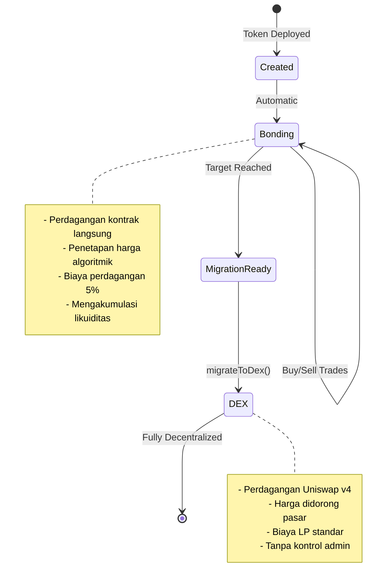
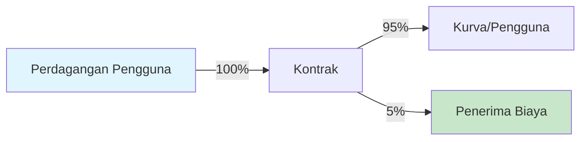

## Apa itu Fase Bonding?

Fase bonding adalah periode perdagangan awal di mana token dibeli dan dijual langsung dari smart contract menggunakan kurva penetapan harga algoritmik. Anggap ini sebagai pre-sale terdesentralisasi dengan pembuatan pasar otomatis.



## Bagaimana Cara Kerja Bonding

### Mekanisme Kurva Bonding

Selama bonding, kontrak bertindak sebagai market maker tunggal:

1. **Tanpa Buku Pesanan**: Harga ditentukan secara algoritmik
2. **Likuiditas Instan**: Selalu bisa membeli atau menjual
3. **Independensi Jalur**: Harga hanya bergantung pada pasokan, bukan riwayat
4. **Penetapan Harga Otomatis**: Tidak perlu pengaturan harga manual

## Operasi Perdagangan

### Membeli Token

<Tabs>
  <Tab title="Cara Kerja">
    **Alur Proses:**
    1. Pengguna mengirim ETH/B3 ke kontrak
    2. Kontrak menghitung token berdasarkan kurva
    3. Biaya 5% dipotong dan dikirim ke penerima
    4. Token dicetak dan dikirim ke pembeli
    5. Status kurva diperbarui
    
    **Contoh Kode:**
    ```typescript
    // Dapatkan kutipan terlebih dahulu
    const quote = await token.getAmountOfTokensToBuy(
      parseEther("1") // 1 ETH
    );
    console.log(`Akan menerima: ${formatEther(quote)} token`);
    
    // Eksekusi pembelian dengan perlindungan slippage
    const minTokens = quote * 0.95n; // Slippage 5%
    await token.buy(minTokens, "1");
    ```
  </Tab>
  
  <Tab title="Parameter">
    | Parameter | Tipe | Deskripsi |
    |-----------|------|-------------|
    | `minTokensOut` | uint256 | Token minimum yang diterima (perlindungan slippage) |
    | `ethAmount` | string/uint256 | Jumlah ETH yang akan dihabiskan |
    
    **Catatan Penting:**
    - Atur `minTokensOut` untuk melindungi dari front-running
    - Gunakan 0 untuk `minTokensOut` hanya pada periode aktivitas rendah
    - Transaksi dibatalkan jika slippage melebihi toleransi
  </Tab>
  
  <Tab title="Kasus Tepi">
    **Overflow Target:**
    - Jika pembelian melebihi target, kelebihan dikembalikan
    - Contoh: Target adalah 10 ETH, terkumpul adalah 9.5 ETH
    - Pengguna mengirim 1 ETH → 0.5 ETH digunakan, 0.5 ETH dikembalikan
    
    **Gas Tidak Cukup:**
    - Batas gas yang direkomendasikan: 200,000
    - Perhitungan kompleks mungkin memerlukan lebih
    
    **Jumlah Nol:**
    - Transaksi dengan 0 ETH akan dibatalkan
  </Tab>
</Tabs>

### Menjual Token

<Tabs>
  <Tab title="Cara Kerja">
    **Alur Proses:**
    1. Pengguna menyetujui pengeluaran token
    2. Pengguna memanggil sell dengan jumlah token
    3. Kontrak menghitung ETH berdasarkan kurva
    4. Biaya 5% dipotong dari hasil
    5. ETH dikirim ke penjual, token dibakar
    6. Status kurva diperbarui (harga menurun)
    
    **Contoh Kode:**
    ```typescript
    // Periksa saldo dan dapatkan kutipan
    const balance = await token.balanceOf(userAddress);
    const sellAmount = balance / 2n; // Jual setengah
    
    const quote = await token.getAmountOfEthToReceive(
      sellAmount
    );
    console.log(`Akan menerima: ${formatEther(quote)} ETH`);
    
    // Eksekusi penjualan dengan perlindungan slippage
    const minEth = quote * 0.95n; // Slippage 5%
    await token.sell(sellAmount, minEth);
    ```
  </Tab>
  
  <Tab title="Parameter">
    | Parameter | Tipe | Deskripsi |
    |-----------|------|-------------|
    | `tokenAmount` | uint256 | Jumlah token yang akan dijual |
    | `minEthOut` | uint256 | Minimum ETH yang diterima (perlindungan slippage) |
    
    **Catatan Penting:**
    - Memerlukan persetujuan token sebelum menjual
    - Dampak harga bisa signifikan untuk penjualan besar
    - Tidak bisa menjual lebih dari pasokan beredar
  </Tab>
  
  <Tab title="Dampak Harga">
    **Memahami Dampak Penjualan:**
    
    Menjual mengurangi jumlah yang terkumpul pada kurva, menyebabkan harga turun:
    
    | Ukuran Jual | Dampak Harga | Pemulihan Diperlukan |
    |-----------|--------------|-----------------|
    | 1% dari pasokan | ~1-2% | Kecil |
    | 5% dari pasokan | ~5-10% | Sedang |
    | 10% dari pasokan | ~15-25% | Signifikan |
    | 20% dari pasokan | ~30-50% | Besar |
    
    *Dampak sebenarnya tergantung pada faktor agresivitas*
  </Tab>
</Tabs>

## Struktur Biaya

### Cara Kerja Biaya



<AccordionGroup>
  <Accordion title="Biaya Beli">
    **Pada pembelian 1 ETH:**
    - 0.95 ETH masuk ke kurva bonding
    - 0.05 ETH masuk ke penerima biaya
    - Token dihitung berdasarkan nilai 0.95 ETH
    
    **Contoh:**
    ```typescript
    // Pengguna mengirim 1 ETH
    // Biaya: 0.05 ETH
    // Kurva menerima: 0.95 ETH
    // Token dicetak berdasarkan 0.95 ETH
    ```
  </Accordion>
  
  <Accordion title="Biaya Jual">
    **Pada penjualan dengan nilai 1 ETH:**
    - Pengguna menerima 0.95 ETH
    - 0.05 ETH masuk ke penerima biaya
    - Kurva berkurang sebesar 1 ETH penuh
    
    **Contoh:**
    ```typescript
    // Token bernilai 1 ETH pada kurva
    // Biaya: 0.05 ETH
    // Pengguna menerima: 0.95 ETH
    // Kurva turun sebesar 1 ETH
    ```
  </Accordion>
  
  <Accordion title="Distribusi Biaya">
    **Kemana biaya pergi:**
    - 100% ke alamat `feeRecipient` yang ditentukan
    - Bisa ke perbendaharaan proyek, pengembang, atau DAO
    - Ditentukan saat pembuatan token, tidak bisa diubah
    
    **Klaim biaya:**
    - Otomatis - tidak perlu klaim
    - Dikirim langsung pada setiap perdagangan
    - Tidak ada akumulasi di kontrak
  </Accordion>
</AccordionGroup>

### Ekonomi Biaya

| Volume Harian | Pendapatan Biaya | Pendapatan Bulanan |
|-------------|------------|----------------|
| 10 ETH | 0.5 ETH | ~15 ETH |
| 50 ETH | 2.5 ETH | ~75 ETH |
| 100 ETH | 5 ETH | ~150 ETH |
| 500 ETH | 25 ETH | ~750 ETH |

## Mekanik Target

### Memahami Target

Target adalah jumlah ETH/B3 yang harus terkumpul sebelum migrasi:

<Info>
  **Tujuan Target:**
  - Memastikan likuiditas yang cukup untuk Uniswap v4
  - Menciptakan tujuan yang jelas untuk komunitas
  - Mencegah migrasi prematur
  - Membangun momentum selama bonding
</Info>

### Mendekati Target

```typescript
// Memantau kemajuan menuju target
async function trackProgress(token: BondkitToken) {
  const progress = await token.getBondingProgress();
  
  if (progress.progress < 0.5) {
    console.log("🌱 Tahap awal - harga terbaik tersedia");
  } else if (progress.progress < 0.8) {
    console.log("🚀 Momentum terbangun - pertimbangkan untuk membeli");
  } else if (progress.progress < 1.0) {
    console.log("🔥 Hampir sampai - migrasi segera");
  } else {
    console.log("✅ Target tercapai - siap untuk migrasi!");
  }
  
  const remaining = progress.threshold - progress.raised;
  console.log(`Butuh ${formatEther(remaining)} ETH lagi`);
}
```

### Penanganan Overflow

Ketika pembelian akan melebihi target:

1. **Pengisian Sebagian**: Hanya jumlah yang diperlukan yang diterima
2. **Pengembalian Dana Otomatis**: Kelebihan dikembalikan dalam transaksi yang sama
3. **Penyelesaian Adil**: Tidak ada yang bisa membayar lebih di akhir

**Skenario Contoh:**
```
Target: 100 ETH
Saat ini: 99.5 ETH
Pengguna mengirim: 2 ETH

Hasil:
- 0.5 ETH diterima (tepat mencapai 100 ETH)
- 1.5 ETH dikembalikan
- Pengguna mendapatkan token untuk 0.5 ETH
- Migrasi sekarang tersedia
```

## Event & Pemantauan

### Event Kontrak

<Tabs>
  <Tab title="Event Beli">
    ```solidity
    event BondingCurveBuy(
        address indexed payer,
        address indexed recipient,
        uint256 tradingTokenIn,
        uint256 tokensOut,
        uint256 fee,
        uint256 totalRaisedBonding
    );
    ```
    
    **Mendengarkan di SDK:**
    ```typescript
    token.onBuy((event) => {
      console.log({
        pembeli: event.payer,
        ethDihabiskan: formatEther(event.tradingTokenIn),
        tokenDiterima: formatEther(event.tokensOut),
        biayaDibayar: formatEther(event.fee),
        totalTerkumpul: formatEther(event.totalRaisedBonding)
      });
    });
    ```
  </Tab>
  
  <Tab title="Event Jual">
    ```solidity
    event BondingCurveSell(
        address indexed penjual,
        uint256 tokensIn,
        uint256 tradingTokenOut,
        uint256 fee,
        uint256 totalRaisedBonding
    );
    ```
    
    **Mendengarkan di SDK:**
    ```typescript
    token.onSell((event) => {
      console.log({
        penjual: event.seller,
        tokenDijual: formatEther(event.tokensIn),
        ethDiterima: formatEther(event.tradingTokenOut),
        biayaDibayar: formatEther(event.fee),
        totalTerkumpul: formatEther(event.totalRaisedBonding)
      });
    });
    ```
  </Tab>
</Tabs>

### Pemantauan Real-Time

```typescript
// Penyiapan pemantauan lengkap
class BondingMonitor {
  constructor(private token: BondkitToken) {}
  
  async start() {
    // Status awal
    const progress = await this.token.getBondingProgress();
    console.log(`Mulai pada ${(progress.progress * 100).toFixed(2)}%`);
    
    // Memantau pembelian
    this.token.onBuy(async (event) => {
      const newProgress = await this.token.getBondingProgress();
      console.log(`BELI: ${formatEther(event.tokensOut)} token`);
      console.log(`Kemajuan: ${(newProgress.progress * 100).toFixed(2)}%`);
      
      if (newProgress.progress >= 1.0) {
        console.log("🎆 TARGET TERCAPAI! Migrasi tersedia.");
      }
    });
    
    // Memantau penjualan
    this.token.onSell(async (event) => {
      const newProgress = await this.token.getBondingProgress();
      console.log(`JUAL: ${formatEther(event.tokensIn)} token`);
      console.log(`Kemajuan: ${(newProgress.progress * 100).toFixed(2)}%`);
    });
  }
}

// Penggunaan
const monitor = new BondingMonitor(token);
await monitor.start();
```

## Strategi Fase Bonding

### Untuk Pembuat Token

<CardGroup cols={2}>
  <Card title="Membangun Momentum" icon="chart-line">
    - Mulai dengan agresivitas lebih rendah (30-50)
    - Tetapkan target yang dapat dicapai
    - Libatkan komunitas sejak dini
    - Sediakan peta jalan yang jelas
  </Card>
  
  <Card title="Maksimalkan Kesuksesan" icon="trophy">
    - Tanamkan likuiditas awal sendiri
    - Ciptakan insentif pembelian
    - Waktu pengumuman yang tepat
    - Rencanakan pasca-migrasi
  </Card>
</CardGroup>

### Untuk Pedagang

<CardGroup cols={2}>
  <Card title="Strategi Masuk" icon="door-open">
    - Beli awal untuk harga terbaik
    - Gunakan DCA untuk jumlah besar
    - Pantau faktor agresivitas
    - Periksa kemajuan target
  </Card>
  
  <Card title="Manajemen Risiko" icon="shield">
    - Selalu gunakan perlindungan slippage
    - Pahami dampak harga
    - Jangan FOMO dekat target
    - Rencanakan strategi keluar
  </Card>
</CardGroup>

## Transisi Pasca-Bonding

<Warning>
  **Kritis: Setelah Migrasi**
  
  Setelah `migrateToDex()` dipanggil:
  - ❌ Perdagangan kurva bonding secara permanen dinonaktifkan
  - ❌ Tidak ada lagi fungsi buy() atau sell()
  - ✅ Semua perdagangan pindah ke Uniswap v4
  - ✅ Mekanik AMM standar berlaku
  - ✅ Siapa pun dapat menyediakan likuiditas
  - ✅ Perdagangan sepenuhnya terdesentralisasi
</Warning>

## Langkah Selanjutnya

<CardGroup cols={3}>
  <Card title="Panduan Penetapan Harga" icon="tags" href="/bondkit/concepts/pricing">
    Memahami mekanik harga
  </Card>
  <Card title="Penetapan Target" icon="bullseye" href="/bondkit/concepts/targets">
    Memilih target yang tepat
  </Card>
  <Card title="Proses Migrasi" icon="rocket" href="/bondkit/guides/migration">
    Pelajari tentang transisi DEX
  </Card>
</CardGroup>
