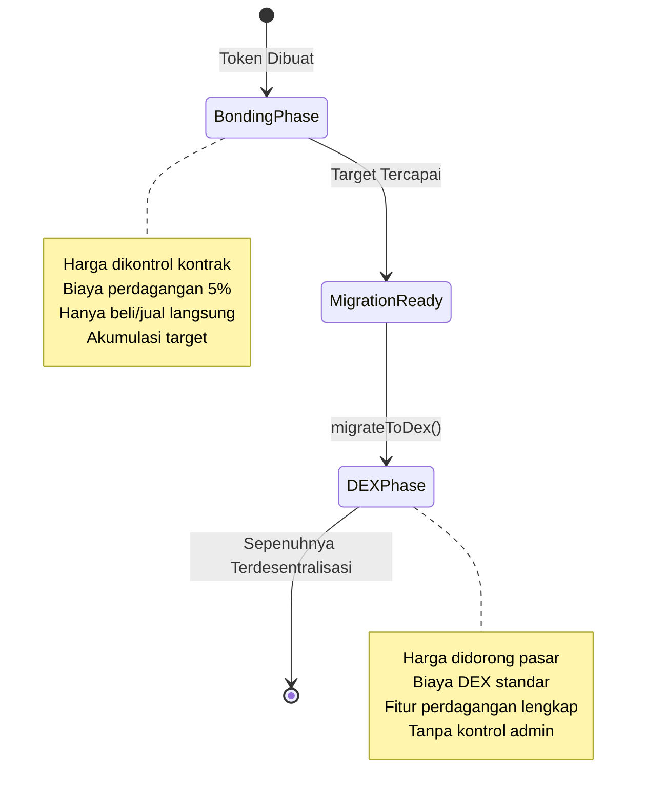

## Apa itu Fase DEX?

Fase DEX adalah tahap akhir dari siklus hidup token Bondkit, di mana perdagangan beralih dari kurva obligasi otomatis ke kolam Uniswap v4 yang sepenuhnya terdesentralisasi. Fase ini dimulai segera setelah migrasi dan mewakili desentralisasi penuh.



## Bagaimana Migrasi Bekerja

### Proses Transisi

Ketika `migrateToDex()` dipanggil setelah mencapai target:

1. **Status Kontrak**: Status token berubah menjadi `TokenStatus.Dex`
2. **Kolam Uniswap v4**: Kolam baru dibuat dengan likuiditas terakumulasi
3. **Inisialisasi Harga**: Harga awal kolam dihitung dari harga keluar kurva obligasi
4. **Pelepasan Kepemilikan**: Kepemilikan kontrak ditransfer ke alamat nol
5. **Perdagangan Diaktifkan**: Perdagangan DEX penuh dimulai segera

### Konfigurasi Kolam

**Pengaturan Kolam Otomatis:**
```typescript
// Kolam dibuat dengan parameter ini (dari migrasi)
const poolConfig = {
  currency0: tradingToken < bondkitToken ? tradingToken : bondkitToken,
  currency1: tradingToken < bondkitToken ? bondkitToken : tradingToken,
  fee: 3000,        // Biaya standar 0.3%
  tickSpacing: 60,  // Jarak tick standar
  hooks: customHook // Hook khusus Bondkit
};
```

**Likuiditas Awal:**
- **Token Perdagangan**: Semua dana terakumulasi dari fase obligasi
- **Token Bondkit**: Jumlah dihitung untuk cocok dengan harga keluar
- **Token LP**: Dibagi antara penerima biaya dan dibakar/didistribusikan

## Berdagang di Fase DEX

### Opsi Perdagangan

**Perdagangan DEX Standar:**
Token Bondkit dalam fase DEX dapat diperdagangkan menggunakan antarmuka yang kompatibel dengan Uniswap v4, agregator DEX, atau platform perdagangan.

**SDK Helper (Opsional):**
SDK menyediakan `BondkitSwapService` untuk integrasi yang disederhanakan jika diperlukan.

### Penemuan Harga & Likuiditas

**Harga Didorong Pasar:**
- Tidak lagi menggunakan kurva obligasi algoritmik
- Harga ditentukan oleh pasokan/permintaan
- Dinamika buku pesanan waktu nyata
- Tunduk pada volatilitas pasar

**Sumber Likuiditas:**
```typescript
// Likuiditas awal dari migrasi
const migrationData = {
  tradingTokenLiquidity: "10.0",    // ETH/B3 dari obligasi
  bondkitTokenLiquidity: "500000",  // Jumlah token dihitung
  initialPrice: "0.00002",          // Harga per token
  totalValueLocked: "20.0"          // TVL gabungan
};

// Likuiditas tambahan dari:
// - LP komunitas
// - Program insentif  
// - Akumulasi biaya perdagangan
```

## Perbedaan Utama dari Fase Obligasi

### Mekanika Perdagangan

| Aspek | Fase Obligasi | Fase DEX |
|--------|--------------|-----------|
| **Harga** | Kurva algoritmik | Pasokan/permintaan pasar |
| **Likuiditas** | Tidak terbatas (kontrak mencetak) | Likuiditas kolam terbatas |
| **Biaya** | 5% ke penerima biaya | 0.3% ke LP + protokol |
| **Tipe Pesanan** | Hanya beli/jual | Fitur DEX lengkap |
| **Dampak Harga** | Kurva dapat diprediksi | Tergantung kedalaman likuiditas |
| **MEV** | Tidak berlaku | Tunduk pada MEV |

### Perubahan Kontrak Cerdas

**Transisi Status:**
```typescript
// Periksa fase saat ini
const status = await token.getStatus();

if (status === TokenStatus.Dex) {
  // Gunakan metode perdagangan DEX
  const swapService = new BondkitSwapService(tokenAddress);
  // ... kode perdagangan DEX
} else if (status === TokenStatus.Bonding) {
  // Gunakan metode kurva obligasi
  await token.buy(amount, minTokensOut);
}
```

**Ketersediaan Metode:**
- ✅ `token.buy()` / `token.sell()` - **Dinonaktifkan** (akan membatalkan)
- ✅ Perdagangan DEX via `BondkitSwapService`
- ✅ Fungsionalitas ERC20 standar berlanjut
- ✅ Pemantauan event untuk perdagangan DEX

## Fitur DEX Lanjutan

### Integrasi Hook Kustom

Token Bondkit di Uniswap v4 termasuk hook kustom untuk fungsionalitas yang ditingkatkan:

```typescript
// Fitur hook (diterapkan secara otomatis)
const hookFeatures = {
  beforeSwap: "Perhitungan biaya kustom",
  afterSwap: "Pelacakan analitik", 
  beforeAddLiquidity: "Hadiah LP",
  afterRemoveLiquidity: "Penanganan biaya keluar"
};
```

### Analitik & Pemantauan

**Data Waktu Nyata:**
```typescript
import TradingView from "@b3dotfun/sdk/bondkit/components/TradingView";

// Grafik profesional dengan data DEX
function DEXTradingInterface({ tokenAddress, tokenSymbol }) {
  return (
    <div className="space-y-6">
      {/* Grafik harga dengan data DEX */}
      <TradingView 
        tokenAddress={tokenAddress}
        tokenSymbol={tokenSymbol}
        className="h-96 w-full"
      />
      
      {/* Antarmuka perdagangan */}
      <SwapInterface tokenAddress={tokenAddress} />
    </div>
  );
}
```

**Metrik Tersedia:**
- Umpan harga waktu nyata
- Volume dan perubahan 24 jam  
- Kedalaman likuiditas
- Data OHLCV historis
- Riwayat transaksi
- Analitik pemegang

### Penyediaan Likuiditas

**Menjadi LP:**
```typescript
// Menambah likuiditas ke kolam token Bondkit
import { Pool, Position } from "@uniswap/v3-sdk";

const position = new Position({
  pool: bondkitPool,
  liquidity: targetLiquidity,
  tickLower: lowerTick,
  tickUpper: upperTick
});

// Dapatkan biaya perdagangan + potensi insentif
```

**Manfaat LP:**
- **Biaya Perdagangan**: Dapatkan 0.3% dari semua volume tukar
- **Program Insentif**: Potensi hadiah tambahan
- **Apresiasi Harga**: Manfaat dari pertumbuhan token
- **Kerugian Impermanen**: Risiko AMM standar berlaku

## Analisis Dampak Migrasi

### Untuk Pemegang Token

**Efek Segera:**
- ✅ Token tetap sepenuhnya dapat ditransfer
- ✅ Dapat berdagang di pasar terbuka
- ✅ Tidak ada periode lock-up
- ⚠️ Harga sekarang tunduk pada volatilitas pasar
- ⚠️ Tidak ada likuiditas yang dijamin (tergantung pada kedalaman kolam)

**Manfaat Jangka Panjang:**
- 🚀 Akses ke ekosistem perdagangan yang lebih besar
- 🚀 Integrasi dengan protokol DeFi
- 🚀 Komposabilitas dengan token lain
- 🚀 Pencapaian desentralisasi sejati

### Untuk Proyek

**Perubahan Operasional:**
```typescript
// Pra-migrasi: Kontrol langsung
await token.buy(amount, minOut);    // ✅ Berfungsi
await token.migrateToDex();         // Aksi satu kali

// Pasca-migrasi: Berbasis pasar
await token.buy(amount, minOut);    // ❌ Membatalkan
await swapService.executeSwap(...); // ✅ Gunakan ini sebagai gantinya
```

**Tanggung Jawab Baru:**
- **Pembangunan Komunitas**: Mendorong volume perdagangan organik
- **Insentif Likuiditas**: Mendorong partisipasi LP  
- **Pemasaran**: Mempromosikan utilitas dan adopsi token
- **Integrasi**: Daftar di agregator dan platform DEX

## Praktik Terbaik untuk Fase DEX

### Untuk Pedagang

<AccordionGroup>
  <Accordion title="Strategi Perdagangan Optimal">
    **Manajemen Slippage:**
    - Gunakan slippage 0.5-2% untuk perdagangan kecil
    - Slippage lebih tinggi untuk jumlah besar
    - Periksa dampak harga sebelum eksekusi
    
    **Pertimbangan Waktu:**
    - Likuiditas lebih tinggi selama jam aktif
    - Pantau pergerakan LP besar
    - Gunakan pesanan batas jika tersedia
    
    **Contoh:**
    ```typescript
    const quote = await swapService.getSwapQuote({
      // ... parameter
      slippageTolerance: parseFloat(quote.priceImpact) > 5 ? 0.02 : 0.005
    });
    ```
  </Accordion>
  
  <Accordion title="Manajemen Risiko">
    **Analisis Likuiditas:**
    - Periksa TVL kolam sebelum perdagangan besar
    - Pantau aktivitas penyedia likuiditas
    - Pahami kerugian impermanen jika LP
    
    **Pemantauan Harga:**
    - Atur peringatan harga
    - Gunakan strategi stop-loss
    - Diversifikasi di beberapa token
  </Accordion>
</AccordionGroup>

### Untuk Pengembang

<AccordionGroup>
  <Accordion title="Pola Integrasi">
    **Pemeriksaan Status:**
    ```typescript
    async function getOptimalTradingMethod(token: BondkitToken) {
      const status = await token.getStatus();
      
      if (status === TokenStatus.Bonding) {
        return {
          method: "bonding",
          interface: token
        };
      } else if (status === TokenStatus.Dex) {
        return {
          method: "dex", 
          interface: new BondkitSwapService(token.contractAddress)
        };
      }
    }
    ```
    
    **Penanganan Kesalahan:**
    ```typescript
    try {
      // Selalu periksa fase terlebih dahulu
      const tradingMethod = await getOptimalTradingMethod(token);
      
      if (tradingMethod.method === "dex") {
        await tradingMethod.interface.executeSwap(params, wallet);
      }
    } catch (error) {
      if (error.message.includes("TradingDisabledDexPhaseActive")) {
        // Beralih ke perdagangan DEX
        const swapService = new BondkitSwapService(tokenAddress);
        await swapService.executeSwap(params, wallet);
      }
    }
    ```
  </Accordion>
</AccordionGroup>

## Pertanyaan Umum

<AccordionGroup>
  <Accordion title="Apakah token dapat kembali ke fase obligasi?">
    **Tidak** - Migrasi permanen dan tidak dapat dibalik. Setelah dalam fase DEX, token akan selalu diperdagangkan di Uniswap v4.
  </Accordion>
  
  <Accordion title="Apa yang terjadi pada likuiditas kurva obligasi yang tidak digunakan?">
    Semua token perdagangan terakumulasi dari fase obligasi menjadi likuiditas awal di kolam Uniswap v4, dipasangkan dengan token bondkit yang dihitung pada harga keluar.
  </Accordion>
  
  <Accordion title="Apakah ada pembatasan dalam fase DEX?">
    Tidak ada pembatasan - token menjadi ERC20 standar yang diperdagangkan di Uniswap v4. Komposabilitas DeFi penuh diaktifkan.
  </Accordion>
  
  <Accordion title="Bagaimana biaya perdagangan berbeda?">
    Fase DEX menggunakan biaya Uniswap v4 standar (0.3%) yang diberikan kepada penyedia likuiditas alih-alih biaya fase obligasi 5% ke penerima biaya.
  </Accordion>
</AccordionGroup>

## Langkah Selanjutnya

<CardGroup cols={2}>
  <Card title="Mulai Perdagangan DEX" icon="arrow-right" href="/bondkit/sdk/reference#bondkitswapservice">
    Pelajari cara menggunakan BondkitSwapService untuk perdagangan DEX
  </Card>
  <Card title="Tambahkan Grafik Perdagangan" icon="chart-line" href="/bondkit/sdk/reference#tradingview-component">  
    Integrasikan grafik TradingView untuk token DEX Anda
  </Card>
  <Card title="Menjadi LP" icon="coins" href="https://app.uniswap.org">
    Menyediakan likuiditas dan mendapatkan biaya perdagangan
  </Card>
  <Card title="Pantau Analitik" icon="analytics" href="https://info.uniswap.org">
    Lacak kinerja DEX token Anda  
  </Card>
</CardGroup>
