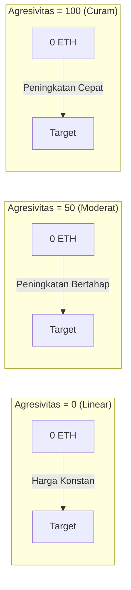

## Kurva Harga Visual



## Model Kurva Bonding

### Rumus Matematika

<Note>
  **Rumus Inti**
  ```
  S = S_final × (R / R_target)^eksponen
  ```
  Dimana:
  - `S` = Pasokan token saat ini
  - `S_final` = Pasokan token akhir
  - `R` = Jumlah yang telah terkumpul
  - `R_target` = Jumlah target
  - `eksponen = 1 / (1 + faktorAgresivitas/100)`
</Note>

### Memahami Eksponen

Faktor agresivitas mengontrol bagaimana eksponen mempengaruhi progresi harga:

| Agresivitas | Eksponen | Rumus Menjadi | Perilaku Harga |
|-------------|----------|---------------|----------------|
| 0 | 1.00 | S = S_final × (R/R_target) | Linear - token konstan per ETH |
| 25 | 0.80 | S = S_final × (R/R_target)^0.80 | Sedikit melengkung |
| 50 | 0.67 | S = S_final × (R/R_target)^0.67 | Kurva Moderat |
| 75 | 0.57 | S = S_final × (R/R_target)^0.57 | Kurva Curam |
| 100 | 0.50 | S = S_final × √(R/R_target) | Sangat Curam (akar kuadrat) |

### Contoh Dampak Harga

Mari kita lihat berapa banyak token yang dibeli dengan 1 ETH pada tahapan yang berbeda dengan target 10 ETH:

<Tabs>
  <Tab title="Agresivitas = 0">
    **Harga Linear (Adil untuk semua)**
    
    | ETH Terkumpul | Token per ETH | Perubahan Harga |
    |---------------|---------------|-----------------|
    | 0 → 1 ETH | 100,000 | Baseline |
    | 4 → 5 ETH | 100,000 | 0% |
    | 9 → 10 ETH | 100,000 | 0% |
    
    *Semua orang mendapatkan kesepakatan yang sama*
  </Tab>
  
  <Tab title="Agresivitas = 50">
    **Kurva Moderat (Seimbang)**
    
    | ETH Terkumpul | Token per ETH | Perubahan Harga |
    |---------------|---------------|-----------------|
    | 0 → 1 ETH | 146,000 | Baseline |
    | 4 → 5 ETH | 87,000 | -40% |
    | 9 → 10 ETH | 51,000 | -65% |
    
    *Pembeli awal mendapatkan 3x lebih banyak daripada pembeli akhir*
  </Tab>
  
  <Tab title="Agresivitas = 100">
    **Kurva Curam (Menguntungkan awal)**
    
    | ETH Terkumpul | Token per ETH | Perubahan Harga |
    |---------------|---------------|-----------------|
    | 0 → 1 ETH | 316,000 | Baseline |
    | 4 → 5 ETH | 89,000 | -72% |
    | 9 → 10 ETH | 31,000 | -90% |
    
    *Pembeli awal mendapatkan 10x lebih banyak daripada pembeli akhir*
  </Tab>
</Tabs>

## Kalkulator Harga Interaktif

```typescript
// Menghitung token yang diterima untuk jumlah ETH tertentu
function calculateTokensReceived(
  ethAmount: number,
  currentRaised: number,
  targetEth: number,
  totalSupply: number,
  aggressiveness: number
): number {
  const exponent = 1 / (1 + aggressiveness / 100);
  
  // Menghitung pasokan saat ini
  const currentSupply = totalSupply * 
    Math.pow(currentRaised / targetEth, exponent);
  
  // Menghitung pasokan setelah pembelian
  const newRaised = currentRaised + ethAmount;
  const newSupply = totalSupply * 
    Math.pow(newRaised / targetEth, exponent);
  
  // Token yang diterima = perbedaan pasokan
  return newSupply - currentSupply;
}

// Contoh penggunaan
const tokens = calculateTokensReceived(
  1,        // Pembelian 1 ETH
  5,        // 5 ETH sudah terkumpul
  10,       // Target 10 ETH
  1000000,  // Pasokan total 1M
  50        // Agresivitas 50%
);
console.log(`Anda akan menerima ${tokens.toFixed(0)} token`);
```

## Memilih Faktor Agresivitas Anda

### Kerangka Keputusan

<CardGroup cols={3}>
  <Card title="Rendah (0-30)" icon="equals">
    **Terbaik untuk:**
    - Peluncuran adil
    - Token komunitas
    - Harga stabil
    
    **Kelebihan:**
    - Kesempatan yang sama
    - Biaya yang dapat diprediksi
    - Kurang FOMO
    
    **Kekurangan:**
    - Tidak ada insentif awal
    - Momentum lebih lambat
  </Card>
  
  <Card title="Sedang (30-70)" icon="chart-line">
    **Terbaik untuk:**
    - Kebanyakan proyek
    - Pendekatan seimbang
    - Hadiah moderat
    
    **Kelebihan:**
    - Beberapa keuntungan awal
    - Masih dapat diakses
    - Momentum yang baik
    
    **Kekurangan:**
    - Kompleksitas moderat
    - Beberapa varians harga
  </Card>
  
  <Card title="Tinggi (70-100)" icon="rocket">
    **Terbaik untuk:**
    - Peluncuran hype
    - Menghargai penerima awal
    - Penggalangan dana cepat
    
    **Kelebihan:**
    - Insentif awal yang kuat
    - Menciptakan urgensi
    - Menghargai penganut
    
    **Kekurangan:**
    - Dapat terlihat tidak adil
    - Varians harga tinggi
    - Didorong oleh FOMO
  </Card>
</CardGroup>

## Mekanisme Penjualan

Ketika pengguna menjual token kembali ke kurva:

1. **Perhitungan Harga**: Menggunakan invers dari rumus pembelian
2. **Pengurangan Biaya**: Biaya 5% diterapkan pada hasil
3. **Pembaruan Kurva**: Mengurangi jumlah total yang terkumpul
4. **Dampak Harga**: Penjualan besar signifikan mempengaruhi harga

### Rumus Harga Jual

```typescript
// Menghitung ETH yang diterima untuk menjual token
function calculateEthReceived(
  tokenAmount: number,
  currentSupply: number,
  currentRaised: number,
  targetEth: number,
  totalSupply: number,
  aggressiveness: number
): number {
  const exponent = 1 / (1 + aggressiveness / 100);
  
  // Menghitung pasokan baru setelah penjualan
  const newSupply = currentSupply - tokenAmount;
  
  // Menghitung jumlah yang terkumpul yang sesuai
  const supplyRatio = newSupply / totalSupply;
  const newRaised = targetEth * 
    Math.pow(supplyRatio, 1 / exponent);
  
  // ETH yang diterima (sebelum biaya)
  const ethBeforeFees = currentRaised - newRaised;
  
  // Menerapkan biaya 5%
  return ethBeforeFees * 0.95;
}
```

## Kasus Tepi & Batasan

<Warning>
  **Pertimbangan Penting:**
  
  1. **Pengembalian Dana**: Jika pembelian melebihi target, kelebihan ETH dikembalikan
  2. **Jumlah Minimum**: Transaksi sangat kecil mungkin dibatalkan karena pembulatan
  3. **Pasokan Maksimum**: Tidak dapat melebihi `finalTokenSupply`
  4. **Batas Harga**: Agresivitas ekstrem dapat menyebabkan lonjakan harga
  5. **Slippage**: Selalu gunakan `minTokensOut` untuk perlindungan
</Warning>

## Contoh Nyata

### Studi Kasus: Token Peluncuran Adil
- **Agresivitas**: 10
- **Target**: 50 ETH
- **Hasil**: Harga hampir linear, komunitas menghargai keadilan

### Studi Kasus: Token Hype
- **Agresivitas**: 85
- **Target**: 100 ETH
- **Hasil**: Mencapai target dalam 2 jam, pembeli awal mendapat 8x

### Studi Kasus: Proyek Seimbang
- **Agresivitas**: 45
- **Target**: 25 ETH
- **Hasil**: Pertumbuhan stabil selama 3 hari, keuntungan 2,5x untuk pembeli awal

## Langkah Selanjutnya

<CardGroup cols={2}>
  <Card title="Tetapkan Agresivitas" icon="sliders" href="/bondkit/guides/set-aggressiveness">
    Pelajari cara memilih faktor yang tepat
  </Card>
  <Card title="Estimasi Harga" icon="calculator" href="/bondkit/guides/est-migration-price">
    Estimasi harga migrasi Anda
  </Card>
</CardGroup>

