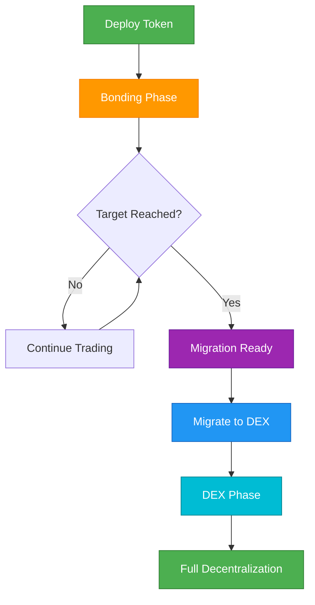

## Ikhtisar

Panduan ini mengajak Anda melalui siklus hidup lengkap dari token Bondkit, dari pembuatan awal hingga desentralisasi penuh. Memahami alur ini sangat penting untuk peluncuran dan pengelolaan token yang sukses.



## Fase 1: Pembuatan Token

### Perencanaan Pra-Peluncuran

<AccordionGroup>
  <Accordion title="Pilih Parameter Anda">
    **Keputusan Kritis:**
    
    | Parameter | Dampak | Rekomendasi |
    |-----------|---------|----------------|
    | **finalTokenSupply** | Total token yang pernah dibuat | 1M-100M token tipikal |
    | **aggressivenessFactor** | Kekurungan kurva harga | 30-60 untuk peluncuran seimbang |
    | **targetAmount** | Ambang batas migrasi | 5-50 token perdagangan |
    | **tradingToken** | Apa yang dibayar pengguna | Gunakan B3 untuk mainnet Base |
    
    **Konfigurasi Contoh:**
    ```typescript
    const tokenConfig = {
      name: "MyToken",
      symbol: "MTK",
      finalTokenSupply: parseEther("10000000"), // 10M token
      aggressivenessFactor: 45, // Kurva moderat
      targetAmount: parseEther("20"), // 20 token B3
      tradingToken: "0xB3B32F9f8827D4634fE7d973Fa1034Ec9fdDB3B3"
    };
    ```
  </Accordion>
  
  <Accordion title="Atur Struktur Biaya">
    **Strategi Distribusi Biaya:**
    
    ```typescript
    const feeConfig = {
      feeRecipient: "0x...", // Alamat treasury/tim Anda
      lpSplitRatioFeeRecipientBps: 2000n, // 20% ke penerima biaya
      // Sisa 80% menjadi token LP setelah migrasi
    };
    ```
    
    **Alur Biaya:**
    - **Fase Bonding**: 5% dari semua perdagangan → `feeRecipient`
    - **Pasca-Migrasi**: Biaya perdagangan 0.3% → penyedia LP
  </Accordion>
</AccordionGroup>

### Eksekusi Peluncuran

```typescript
import { BondkitTokenFactory } from "@b3dotfun/sdk/bondkit";
import { base } from "viem/chains";

// 1. Inisialisasi pabrik
const factory = new BondkitTokenFactory(
  base.id,
  process.env.WALLET_PRIVATE_KEY
);

// 2. Deploy dengan konfigurasi lengkap
const tokenAddress = await factory.deployBondkitToken({
  // Metadata token
  name: "MyToken",
  symbol: "MTK",
  
  // Ekonomi
  finalTokenSupply: parseEther("10000000"),
  aggressivenessFactor: 45,
  targetAmount: parseEther("20"),
  
  // Struktur biaya  
  feeRecipient: process.env.TREASURY_ADDRESS,
  lpSplitRatioFeeRecipientBps: 2000n,
  
  // Admin & migrasi
  migrationAdminAddress: process.env.ADMIN_ADDRESS,
  
  // Konfigurasi Uniswap V4
  bondingPhaseSplitter: "0x2AB69e0d9D20D3700466153D84a6574128154Fd2",
  v4PoolManager: "0x498581fF718922c3f8e6A244956aF099B2652b2b",
  v4Hook: "0xB36f4A2FB18b745ef8eD31452781a463d2B3f0cC",
  v4PoolFee: 3000,
  v4TickSpacing: 60,
  tradingToken: "0xB3B32F9f8827D4634fE7d973Fa1034Ec9fdDB3B3"
});

console.log(`✅ Token berhasil diterapkan: ${tokenAddress}`);
```

## Fase 2: Manajemen Fase Bonding

### Strategi Peluncuran

<Tabs>
  <Tab title="Pembangunan Komunitas">
    **Daftar Periksa Pra-Peluncuran:**
    - [ ] Kontrak token diverifikasi di Basescan
    - [ ] Saluran komunitas didirikan (Discord/Telegram)  
    - [ ] Materi pemasaran disiapkan
    - [ ] Strategi pembelian awal direncanakan
    - [ ] Dashboard pelacakan harga siap
    
    **Hari Peluncuran:**
    ```typescript
    // Terhubung ke token Anda
    const token = new BondkitToken(tokenAddress, privateKey);
    
    // Pembelian awal untuk menetapkan harga
    await token.buy(parseEther("1"), 0n); // 1 token B3
    
    // Umumkan peluncuran dengan data nyata
    const price = await token.getCurrentPrice();
    const progress = await token.getBondingProgress();
    
    console.log(`🚀 Live di ${formatEther(price)} B3 per token`);
    console.log(`🎯 ${(progress.progress * 100).toFixed(1)}% menuju migrasi`);
    ```
  </Tab>
  
  <Tab title="Pemantauan Kemajuan">
    **Dasbor Metrik Kunci:**
    ```typescript
    async function getDashboardData(token) {
      const [
        tokenDetails,
        currentPrice, 
        progress,
        totalSupply,
        status
      ] = await Promise.all([
        token.getTokenDetails(),
        token.getCurrentPrice(),
        token.getBondingProgress(), 
        token.getTotalSupply(),
        token.currentStatus()
      ]);
      
      return {
        // Info Token
        name: tokenDetails.name,
        symbol: tokenDetails.symbol,
        
        // Ekonomi
        currentPrice: formatEther(currentPrice),
        progress: (progress.progress * 100).toFixed(2) + '%',
        raised: formatEther(progress.raised),
        target: formatEther(progress.threshold),
        remaining: formatEther(progress.threshold - progress.raised),
        
        // Pasokan
        circulatingSupply: formatEther(totalSupply),
        
        // Status
        phase: status === 1 ? 'Bonding' : status === 2 ? 'DEX' : 'Lainnya'
      };
    }
    
    // Gunakan di dasbor Anda
    const data = await getDashboardData(token);
    ```
  </Tab>
  
  <Tab title="Penglibatan Komunitas">
    **Pembaruan Real-Time:**
    ```typescript
    // Siapkan pemantauan acara untuk pembaruan komunitas
    token.onBuy((event) => {
      const announcement = `
        🟢 PEMBELIAN BARU: ${formatEther(event.tokensOut)} ${symbol}
        💰 Dihabiskan: ${formatEther(event.ethIn)} B3
        👤 Pembeli: ${event.buyer}
      `;
      
      // Posting ke bot Discord/Telegram
      postToDiscord(announcement);
    });
    
    token.onSell((event) => {
      const announcement = `
        🔴 JUAL: ${formatEther(event.tokensIn)} ${symbol}
        💰 Diterima: ${formatEther(event.ethOut)} B3  
        👤 Penjual: ${event.seller}
      `;
      
      postToDiscord(announcement);
    });
    
    // Tonggak kemajuan
    const progress = await token.getBondingProgress();
    if (progress.progress >= 0.5 && progress.progress < 0.6) {
      postToDiscord("🎯 50% dana terkumpul! Setengah jalan menuju migrasi!");
    } else if (progress.progress >= 0.9) {
      postToDiscord("🔥 90% dana terkumpul! Migrasi segera!");
    }
    ```
  </Tab>
</Tabs>

### Mengelola Kurva Bonding

**Indikator Fase Bonding yang Sehat:**
- Volume perdagangan yang stabil
- Basis pemegang yang berkembang  
- Penglibatan komunitas aktif
- Kemajuan menuju target (tapi tidak terlalu cepat)
- Penjualan besar-besaran minimal

**Tanda Peringatan:**
- Tidak ada aktivitas perdagangan selama 24+ jam
- Satu whale mengendalikan persentase besar
- Pencapaian target cepat tanpa komunitas
- Volatilitas berlebihan dari bot

## Fase 3: Kesiapan Migrasi

### Daftar Periksa Pra-Migrasi

```typescript
async function checkMigrationReadiness(token) {
  const [canMigrate, progress, status] = await Promise.all([
    token.canMigrate(),
    token.getBondingProgress(),
    token.currentStatus()
  ]);
  
  const checks = {
    targetReached: canMigrate,
    progressComplete: progress.progress >= 1.0,
    stillBondingPhase: status === 1,
    communityReady: await checkCommunityConsensus(), // Logika Anda
    liquidityPlan: await checkPostMigrationPlan()     // Logika Anda
  };
  
  const allReady = Object.values(checks).every(Boolean);
  
  return {
    ready: allReady,
    checks,
    recommendation: allReady ? 
      "✅ Siap untuk migrasi!" : 
      "⏳ Atasi masalah sebelum migrasi"
  };
}
```

### Strategi Waktu Migrasi

<AccordionGroup>
  <Accordion title="Waktu Optimal">
    **Praktik Terbaik:**
    - Umumkan migrasi 24-48 jam sebelumnya
    - Pilih waktu aktivitas tinggi untuk komunitas Anda
    - Pastikan konsensus komunitas yang cukup
    - Siapkan pemasaran pasca-migrasi
    
    **Pengumuman Pra-Migrasi:**
    ```typescript
    const migrationData = await token.getMigrationData();
    
    const announcement = `
      🚀 MIGRASI DIJADWALKAN
      
      📊 Statistik Bonding Akhir:
      • Terkumpul: ${formatEther(progress.raised)} B3
      • Token Didistribusikan: ${formatEther(totalSupply)}
      
      🔄 Migrasi Akan Membuat:
      • LP Awal: ${formatEther(migrationData.ethForLp)} B3 + token
      • Harga Pembukaan: ~${calculateOpeningPrice(migrationData)} B3/token
      
      ⏰ Migrasi dalam 24 jam!
    `;
    ```
  </Accordion>
  
  <Accordion title="Eksekusi Migrasi">
    **Proses Migrasi:**
    ```typescript
    // Pemeriksaan akhir
    const readiness = await checkMigrationReadiness(token);
    if (!readiness.ready) {
      throw new Error(`Belum siap: ${JSON.stringify(readiness.checks)}`);
    }
    
    // Eksekusi migrasi
    console.log("🔄 Memulai migrasi ke Uniswap V4...");
    const migrationTx = await token.migrateToDex();
    
    // Tunggu konfirmasi
    const receipt = await token.waitForTransaction(migrationTx);
    
    if (receipt.status === 'success') {
      console.log("✅ Migrasi berhasil!");
      
      // Verifikasi status baru
      const newStatus = await token.currentStatus();
      console.log(`Status: ${newStatus === 2 ? 'Fase DEX' : 'Tidak Diketahui'}`);
      
      // Umumkan ke komunitas
      const announcement = `
        🎉 MIGRASI SELESAI!
        
        📍 Sekarang perdagangan di Uniswap V4
        🔗 Transaksi: ${migrationTx}
        💫 Token sekarang sepenuhnya desentralisasi!
      `;
      
      postToDiscord(announcement);
    }
    ```
  </Accordion>
</AccordionGroup>

## Fase 4: Operasi Fase DEX

### Pasca-Migrasi Langsung (24 Jam Pertama)

```typescript
// Inisialisasi alat perdagangan DEX
import { BondkitSwapService } from "@b3dotfun/sdk/bondkit";

const swapService = new BondkitSwapService(tokenAddress);

// Verifikasi fungsi DEX
const isSwapAvailable = await token.isSwapAvailable();
if (isSwapAvailable) {
  console.log("✅ Perdagangan DEX aktif");
  
  // Tes kutipan swap
  const quote = await swapService.getSwapQuote({
    tokenIn: "0xB3B32F9f8827D4634fE7d973Fa1034Ec9fdDB3B3",
    tokenOut: tokenAddress,
    amountIn: "1",
    tokenInDecimals: 18,
    tokenOutDecimals: 18,
    slippageTolerance: 0.005,
    recipient: testAddress
  });
  
  console.log(`Harga DEX: ${quote.executionPrice} B3 per token`);
}
```

### Strategi DEX Jangka Panjang

<Tabs>
  <Tab title="Manajemen Likuiditas">
    **Analisis Likuiditas Awal:**
    ```typescript
    async function analyzeLiquidity() {
      // Dapatkan info kolam (implementasi tergantung pada setup Anda)
      const poolData = await getUniswapV4PoolData(tokenAddress);
      
      return {
        totalValueLocked: poolData.tvl,
        tradingVolume24h: poolData.volume24h,
        priceImpactFor1k: await calculatePriceImpact(1000),
        liquidityUtilization: poolData.utilization,
        
        recommendations: {
          needsMoreLiquidity: poolData.tvl < minimumTVL,
          shouldIncentivize: poolData.utilization > 0.8,
          healthyTrading: poolData.volume24h > minimumVolume
        }
      };
    }
    ```
    
    **Program Insentif Likuiditas:**
    ```typescript
    // Struktur hadiah LP contoh
    const lpIncentives = {
      rewardToken: tokenAddress,
      dailyRewards: parseEther("1000"), // 1000 token per hari
      minimumLPTime: 7 * 24 * 3600, // 7 hari minimum
      bonusMultipliers: {
        week1: 2.0,  // 2x hadiah minggu pertama
        month1: 1.5, // 1.5x hadiah bulan pertama
        longTerm: 1.0 // Hadiah standar setelahnya
      }
    };
    ```
  </Tab>
  
  <Tab title="Transisi Komunitas">
    **Konten Edukasi:**
    ```typescript
    const migrationGuideForUsers = {
      trading: {
        before: "Gunakan token.buy() dan token.sell()",
        after: "Gunakan antarmuka DEX atau swapService.executeSwap()",
        walletSetup: "Tambahkan token ke MetaMask, gunakan antarmuka Uniswap"
      },
      
      benefits: {
        moreFeatures: "Pesanan batas, alat perdagangan lanjutan",
        composability: "Gunakan dengan protokol DeFi lain", 
        decentralization: "Tidak ada kontrol admin yang tersisa"
      },
      
      risks: {
        priceVolatility: "Harga didorong pasar, bisa volatil",
        liquidityRisk: "Perdagangan besar mungkin memiliki dampak harga",
        smartContractRisk: "Risiko DeFi standar berlaku"
      }
    };
    ```
    
    **Sumber Daya Komunitas:**
    - Dokumentasi yang diperbarui
    - Video tutorial perdagangan  
    - Panduan integrasi antarmuka DEX
    - Tutorial penyediaan likuiditas
  </Tab>
  
  <Tab title="Pemantauan & Analitik">
    **Dasbor Fase DEX:**
    ```typescript
    async function getDEXPhaseMetrics(tokenAddress) {
      return {
        // Harga & Volume
        currentPrice: await getCurrentDEXPrice(tokenAddress),
        volume24h: await get24hVolume(tokenAddress),
        priceChange24h: await getPriceChange24h(tokenAddress),
        
        // Likuiditas
        totalLiquidity: await getTotalLiquidity(tokenAddress),
        lpTokenHolders: await getLPHolderCount(tokenAddress),
        
        // Perdagangan
        transactions24h: await getTransactionCount24h(tokenAddress),
        uniqueTraders24h: await getUniqueTraders24h(tokenAddress),
        avgTradeSize: await getAvgTradeSize(tokenAddress),
        
        // Metrik Kesehatan
        liquidityUtilization: await getLiquidityUtilization(tokenAddress),
        priceImpact1k: await getPriceImpact(tokenAddress, 1000),
        holderDistribution: await getHolderDistribution(tokenAddress)
      };
    }
    ```
    
    **Pemantauan Otomatis:**
    ```typescript
    // Siapkan peringatan untuk acara penting
    const monitoringConfig = {
      priceAlerts: {
        change24h: 20, // Peringatan jika perubahan harga >20%
        volume: 10000, // Peringatan jika volume melebihi ambang batas
        liquidity: 5000 // Peringatan jika TVL turun di bawah ambang batas
      },
      
      actions: {
        onLowLiquidity: () => announceIncentiveProgram(),
        onHighVolatility: () => checkForManipulation(),
        onTradingHalt: () => investigateIssues()
      }
    };
    ```
  </Tab>
</Tabs>
