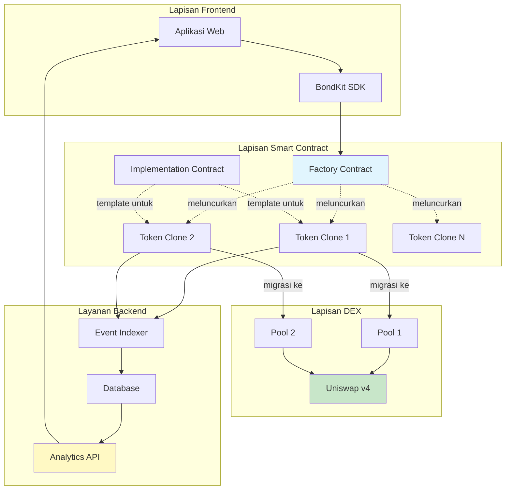

## Tinjauan Arsitektur



## Alur Produk secara Detail

<Steps>
  <Step title="Fase 1: Pembuatan Token">
    **Apa yang terjadi:**
    - Pengguna memanggil `deployBondkitToken()` pada Factory contract
    - Factory mengklon Implementation contract menggunakan pola proxy minimal
    - Token baru diinisialisasi dengan parameter khusus
    - Token secara otomatis memasuki fase bonding
    
    **Biaya Gas:** ~200,000 gas (90% lebih murah daripada penyebaran penuh)
    **Waktu:** ~15 detik
  </Step>
  
  <Step title="Fase 2: Perdagangan Kurva Bonding">
    **Apa yang terjadi:**
    - Pengguna membeli/menjual token langsung dari kontrak
    - Harga mengikuti kurva bonding algoritmik: `S = S_final × (R/R_target)^exponent`
    - Biaya 5% untuk semua perdagangan diberikan kepada penerima biaya
    - Kontrak mengakumulasi aset kutipan (ETH/B3) menuju target
    - Backend mengindeks semua transaksi untuk analitik
    
    **Mekanika perdagangan:**
    - Beli: Kirim ETH/B3, terima token dengan harga kurva saat ini
    - Jual: Kirim token, terima ETH/B3 dikurangi biaya
    - Pengembalian dana otomatis jika pembelian akan melebihi target
    
    **Durasi:** Sampai target tercapai (jam hingga minggu)
  </Step>
  
  <Step title="Fase 3: Migrasi DEX">
    **Apa yang terjadi:**
    - Admin memanggil `migrateToDex()` ketika target tercapai
    - Kontrak menghitung harga pasar yang adil sebagai `sqrtPriceX96`
    - Membuat dan menginisialisasi pool Uniswap v4
    - Mentrasfer likuiditas terakumulasi ke pool
    - Melepaskan kepemilikan ke alamat nol
    - Token menjadi ERC20 standar dengan perdagangan DEX
    
    **Pasca-migrasi:**
    - Kurva bonding dinonaktifkan secara permanen
    - Semua perdagangan melalui Uniswap v4
    - Tidak ada kontrol admin yang tersisa
    - Desentralisasi penuh tercapai
    
    **Biaya Gas:** ~500,000 gas
    **Waktu:** ~30 detik
  </Step>
</Steps>

## Komponen Sistem

### Smart Contracts

<AccordionGroup>
  <Accordion title="🏭 Factory Contract">
    **Tujuan:** Meluncurkan token bond baru secara efisien
    
    **Fungsi Utama:**
    - `deployBondkitToken()` - Membuat klon token baru
    - `getImplementationAddress()` - Mengembalikan alamat template
    - `setAllowedQuoteAsset()` - Fungsi admin untuk memasukkan daftar aset
    
    **Optimisasi Gas:**
    - Menggunakan pola proxy minimal EIP-1167
    - Berbagi logika di semua token
    - ~90% penghematan gas vs penyebaran individu
  </Accordion>
  
  <Accordion title="📜 Implementation Contract">
    **Tujuan:** Template untuk semua token bond
    
    **Fitur Inti:**
    - Kepatuhan standar ERC20
    - Matematika kurva bonding
    - Logika migrasi ke Uniswap v4
    - Sistem distribusi biaya
    
    **Transisi Status:**
    1. Belum Diinisialisasi → Fase Bonding
    2. Fase Bonding → Siap Migrasi
    3. Siap Migrasi → Fase DEX
  </Accordion>
  
  <Accordion title="🪙 Token Clones">
    **Tujuan:** Instansi token individu
    
    **Siklus Hidup:**
    - Dibuat melalui factory
    - Diinisialisasi dengan parameter unik
    - Mengelola kurva bondingnya sendiri
    - Migrasi sendiri ke Uniswap v4
    
    **Penyimpanan:**
    - Metadata token (nama, simbol)
    - Pasokan dan distribusi
    - Status kurva bonding
    - Parameter migrasi
  </Accordion>
</AccordionGroup>

### Layanan Backend

<AccordionGroup>
  <Accordion title="🔍 Event Indexer">
    **Tujuan:** Menangkap semua aktivitas on-chain
    
    **Memantau:**
    - Pembuatan token
    - Transaksi beli/jual
    - Event migrasi
    - Aktivitas transfer
    
    **Teknologi:**
    - Pemindaian blockchain real-time
    - Pengolahan log event
    - Sinkronisasi database
  </Accordion>
  
  <Accordion title="📊 Analytics Engine">
    **Tujuan:** Mengolah data mentah menjadi wawasan
    
    **Menghasilkan:**
    - Data candlestick OHLCV
    - Metrik volume
    - Pelacakan likuiditas
    - Riwayat harga
    - Statistik pengguna
    
    **Pembaruan:** Setiap blok (~2 detik)
  </Accordion>
  
  <Accordion title="🌐 REST API">
    **Tujuan:** Menyajikan data ke frontend
    
    **Endpoints:**
    - `/tokens` - Daftar semua token
    - `/tokens/{address}` - Detail token
    - `/tokens/{address}/transactions` - Riwayat perdagangan
    - `/tokens/{address}/ohlcv` - Data grafik
    - `/users/{address}/portfolio` - Kepemilikan pengguna
    
    **Format:** JSON dengan pagination
  </Accordion>
</AccordionGroup>

### Peran Pengguna

| Peran | Tanggung Jawab | Izin |
|------|-----------------|-------------|
| **Pencipta** | Meluncurkan token, menetapkan parameter, memulai migrasi | Kontrol penuh sampai migrasi |
| **Pedagang** | Beli/jual selama bonding, perdagangan di DEX | Hak perdagangan standar |
| **Penerima Biaya** | Menerima biaya perdagangan | Pendapatan pasif saja |
| **Admin Migrasi** | Menjalankan migrasi saat siap | Hak migrasi satu kali |
| **Penyedia LP** | (Pasca-migrasi) Menambahkan likuiditas ke Uniswap | Hak LP standar |

## Penyelaman Teknis Mendalam

### Matematika Kurva Bonding

Kurva bonding menentukan harga token berdasarkan pasokan:

```
Rumus Harga:
S = S_final × (R / R_target)^exponent

Dimana:
- S = Pasokan token saat ini
- S_final = Pasokan token akhir
- R = Jumlah yang terkumpul (ETH/B3)
- R_target = Jumlah target
- exponent = 1 / (1 + faktorAgresivitas/100)
```

**Perhitungan Contoh:**

| Agresivitas | Eksponen | Perilaku Harga |
|---------------|----------|----------------|
| 0 | 1.00 | Linier (harga konstan) |
| 25 | 0.80 | Kurva lembut |
| 50 | 0.67 | Kurva moderat |
| 75 | 0.57 | Kurva curam |
| 100 | 0.50 | Sangat curam (akar kuadrat) |

### Perhitungan Harga Migrasi

Saat bermigrasi ke Uniswap v4, kontrak:

1. **Menghitung harga keluar** dari kurva bonding
2. **Mengonversi ke format sqrtPriceX96**:
   ```
   sqrtPriceX96 = sqrt(harga) × 2^96
   ```
3. **Menginisialisasi pool** dengan harga ini
4. **Menambahkan likuiditas** menggunakan dana terakumulasi

### Teknik Optimisasi Gas

<Info>
  **Pola Proxy Minimal (EIP-1167)**
  
  Daripada menerapkan kode kontrak penuh untuk setiap token:
  - Terapkan satu kontrak implementasi (600KB)
  - Terapkan kontrak proxy kecil (45 byte masing-masing)
  - Proxy mendelegasikan semua panggilan ke implementasi
  - Hasil: 90% penghematan gas per penyebaran
</Info>

## Parameter Konfigurasi

### Parameter Pembuatan Token

| Parameter | Tipe | Rentang/Format | Dampak |
|-----------|------|--------------|--------|
| `name` | string | 1-50 karakter | Nama tampilan token |
| `symbol` | string | 2-10 karakter | Simbol perdagangan |
| `finalTokenSupply` | uint256 | > 0 | Total token yang dapat dicetak |
| `aggressivenessFactor` | uint8 | 0-100 | Kecerunan kurva |
| `targetEth` | uint256 | > 0 | Ambang batas migrasi |
| `feeRecipient` | address | Alamat valid | Menerima biaya |
| `lpSplitRatioFeeRecipientBps` | uint256 | 0-10000 | Bagian biaya LP (basis poin) |
| `migrationAdminAddress` | address | Alamat valid | Dapat memicu migrasi |

### Parameter Runtime

| Aksi | Parameter | Validasi |
|--------|------------|------------|
| Beli | `minTokensOut`, `ethAmount` | Perlindungan slippage |
| Jual | `tokenAmount`, `minEthOut` | Pemeriksaan saldo, slippage |
| Migrasi | Tidak ada | Target tercapai, hanya admin |

### Konstanta Sistem

| Konstanta | Nilai | Deskripsi |
|----------|-------|-------------|
| Biaya Perdagangan | 5% | Diterapkan pada semua perdagangan |
| Desimal | 18 | Desimal ERC20 standar |
| Target Min | 0.1 ETH | Target layak minimum |
| Agresivitas Maks | 100 | Faktor kurva maksimum |

## Pertimbangan Keamanan

<Warning>
  **Fitur Keamanan Penting:**
  
  1. **Pelepasan Kepemilikan**: Otomatis setelah migrasi
  2. **Tidak Ada Fungsi Mint**: Pasokan tetap saat pembuatan
  3. **Parameter Tidak Dapat Diubah**: Tidak dapat diubah pasca-penyebaran
  4. **Kontrak Diaudit**: Kode yang ditinjau secara profesional
  5. **Tidak Ada Pintu Belakang Admin**: Desentralisasi sejati
  6. **Perlindungan Slippage**: Terintegrasi dalam fungsi beli/jual
  7. **Perlindungan Overflow**: Matematika aman di seluruh
</Warning>

## Skenario Kegagalan & Penanganan

| Skenario | Respons Sistem |
|----------|----------------|
| Pembelian melebihi target | Pengisian sebagian, pengembalian kelebihan |
| Likuiditas tidak cukup untuk penjualan | Transaksi dibatalkan |
| Migrasi sebelum target | Transaksi dibatalkan |
| Upaya migrasi oleh non-admin | Transaksi dibatalkan |
| Upaya migrasi ganda | Transaksi dibatalkan |
| Operasi alamat nol | Transaksi dibatalkan |

## Langkah Selanjutnya

<CardGroup cols={2}>
  <Card title="Mekanika Harga" icon="chart-line" href="/bondkit/concepts/pricing">
    Memahami matematika kurva bonding
  </Card>
  <Card title="Panduan Migrasi" icon="rocket" href="/bondkit/guides/migration">
    Pelajari proses migrasi
  </Card>
</CardGroup>
