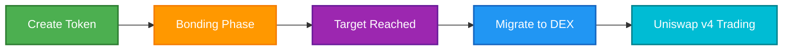

## Apa itu BondKit?

BondKit adalah platform peluncuran token lengkap untuk membuat "bond token" ERC20 di Base mainnet. Ini menyediakan solusi ujung-ke-ujung yang menangani segalanya mulai dari pembuatan token awal hingga perdagangan kurva obligasi dan akhirnya migrasi ke Uniswap v4 untuk perdagangan terdesentralisasi penuh.

### Komponen Utama

<Tabs>
  <Tab title="Smart Contracts">
    **Infrastruktur On-Chain yang Diaudit**
    - Kontrak pabrik untuk menerapkan token baru
    - Implementasi ERC20 dengan logika kurva obligasi
    - Inisialisasi kolam Uniswap v4 otomatis
    - Pola proxy minimal yang dioptimalkan gas
  </Tab>
  <Tab title="TypeScript SDK">
    **Alat yang Ramah Pengembang**
    - API sederhana untuk semua interaksi kontrak
    - Antarmuka yang aman tipe dengan dukungan TypeScript penuh
    - Manajemen transaksi bawaan
    - Berlangganan dan pemantauan event
  </Tab>
  <Tab title="Analytics Backend">
    **Layanan Data Waktu Nyata**
    - Pelacakan riwayat transaksi
    - Generasi data grafik OHLCV
    - Penyimpanan metadata token
    - REST API untuk integrasi frontend
  </Tab>
</Tabs>

## Cara Kerja BondKit



### Siklus Hidup Tiga Fase

1. **Fase Pembuatan**: Terapkan token Anda dengan parameter kustom
2. **Fase Bonding**: Pembuatan pasar otomatis via kurva obligasi
3. **Fase DEX**: Perdagangan terdesentralisasi penuh di Uniswap v4

## Fitur Inti

<AccordionGroup>
  <Accordion title="🏭 Pola Penerapan Factory">
    - **Klon Efisien Gas**: Menggunakan pola proxy minimal untuk mengurangi biaya penerapan sekitar ~90%
    - **Implementasi Standar**: Semua token berbagi logika yang telah teruji
    - **Penerapan Satu Klik**: Panggilan fungsi sederhana untuk membuat token baru
  </Accordion>
  
  <Accordion title="📈 Kurva Obligasi Dinamis">
    - **Agresivitas yang Dapat Dikonfigurasi**: Faktor dari 0-100 mengontrol progresi harga
    - **Penemuan Harga Otomatis**: Penetapan harga yang didorong pasar selama fase bonding
    - **Dukungan Beli & Jual**: Perdagangan dua arah penuh selama bonding
    - **Biaya Perdagangan 5%**: Diterapkan pada pembelian dan penjualan, didistribusikan ke penerima biaya
  </Accordion>
  
  <Accordion title="🎯 Migrasi Berbasis Target">
    - **Target yang Dapat Disesuaikan**: Tetapkan tujuan pendanaan Anda dalam ETH atau ERC20 yang diizinkan
    - **Deteksi Ambang Otomatis**: Kontrak melacak kemajuan ke target
    - **Migrasi Satu Klik**: Panggilan sederhana ke `migrateToDex()` saat siap
    - **Perhitungan Harga**: `sqrtPriceX96` dihitung on-chain untuk penetapan harga awal yang adil
  </Accordion>
  
  <Accordion title="🔄 Integrasi Uniswap v4">
    - **Pembuatan Kolam Otomatis**: Kolam diinisialisasi dengan harga keluar kurva obligasi
    - **Penyediaan Likuiditas**: Dana terkumpul menjadi likuiditas awal
    - **Pelepasan Kepemilikan**: Kontrak menjadi sepenuhnya terdesentralisasi pasca-migrasi
    - **Transisi Tanpa Hambatan**: Tidak diperlukan intervensi manual
  </Accordion>
  
  <Accordion title="📊 Analitik & Pemantauan">
    - **Pengindeksan Waktu Nyata**: Semua transaksi direkam dan diproses
    - **Data OHLCV**: Grafik perdagangan profesional tersedia via API
    - **Riwayat Transaksi**: Jejak audit lengkap untuk setiap token
    - **Pelacakan Portofolio**: Pantau beberapa token dan posisi
  </Accordion>
</AccordionGroup>

## Kasus Penggunaan

<CardGroup cols={3}>
  <Card title="🚀 Peluncuran Token" icon="rocket">
    **Untuk Proyek & Kreator**
    - Mekanisme peluncuran yang adil
    - Penemuan harga yang didorong komunitas
    - Tidak diperlukan likuiditas di muka
    - Perlindungan anti-bot bawaan
  </Card>
  
  <Card title="🎮 Gaming & NFT" icon="gamepad">
    **Untuk Proyek GameFi**
    - Peluncuran mata uang dalam game
    - Token proyek NFT
    - Distribusi token hadiah
    - Ekonomi yang dimiliki pemain
  </Card>
  
  <Card title="🏢 Integrasi DApp" icon="building">
    **Untuk Pengembang**
    - Pembuatan token secara programatik
    - Solusi white-label
    - Integrasi frontend kustom
    - Otomasi berbasis API
  </Card>
</CardGroup>

## Kemampuan Teknis

### Fitur Smart Contract
- ✅ Token obligasi yang sesuai dengan ERC20 dengan fungsionalitas tambahan
- ✅ Pola pabrik untuk penerapan yang efisien gas
- ✅ Parameter yang dapat dikonfigurasi (pasokan, target, agresivitas)
- ✅ Mekanisme distribusi biaya bawaan
- ✅ Migrasi otomatis Uniswap v4

### Fitur SDK
- ✅ Dukungan TypeScript penuh dengan definisi tipe
- ✅ Operasi asinkron berbasis Promise
- ✅ Pendengar event dan berlangganan
- ✅ Penanganan tanda terima transaksi
- ✅ Penanganan kesalahan dan logika pengulangan

### Fitur Analitik
- ✅ Pelacakan harga waktu nyata
- ✅ Metrik volume dan likuiditas
- ✅ Data transaksi historis
- ✅ Data candlestick OHLCV
- ✅ Pelacakan portofolio pengguna

## Memulai

<CardGroup cols={2}>
  <Card title="Request Access" icon="rocket" href="https://b3builders.typeform.com/bsmntdevelopers">
    Luncurkan dengan BondKit di Base
  </Card>
  <Card title="Chat with the Team" icon="discord" href="https://discord.gg/b3dotfun">
    Pertanyaan atau umpan balik? Bicaralah dengan kami di Discord
  </Card>
  
</CardGroup>

## Terminologi Kunci

<Tabs>
  <Tab title="Konsep Inti">
    | Istilah | Definisi |
    |------|------------|
    | **Fase Bonding** | Periode perdagangan awal dengan penetapan harga algoritmik via kurva obligasi |
    | **Bond Token** | Token ERC20 dengan mekanika kurva obligasi bawaan |
    | **Jumlah Target** | Tujuan pendanaan yang memicu kelayakan migrasi |
    | **Migrasi** | Transisi dari kurva obligasi ke Uniswap v4 |
    | **Aset Kutipan** | Mata uang yang digunakan untuk membeli token (ETH atau ERC20 yang diizinkan) |
  </Tab>
  
  <Tab title="Istilah Teknis">
    | Istilah | Definisi |
    |------|------------|
    | **Minimal Proxy** | Pola kloning kontrak yang efisien gas |
    | **Faktor Agresivitas** | Parameter (0-100) yang mengontrol kecuraman kurva harga |
    | **sqrtPriceX96** | Format harga Uniswap v4 untuk inisialisasi kolam |
    | **Penerima Biaya** | Alamat yang menerima biaya perdagangan selama bonding |
    | **Rasio Pembagian LP** | Persentase biaya penyedia likuiditas dalam basis poin |
  </Tab>
  
  <Tab title="Istilah SDK">
    | Istilah | Definisi |
    |------|------------|
    | **Kontrak Pabrik** | Kontrak utama untuk menerapkan token obligasi baru |
    | **Implementasi** | Kontrak templat yang diklon untuk setiap token |
    | **Klien Publik** | Koneksi blockchain hanya-baca |
    | **Klien Dompet** | Koneksi blockchain yang diaktifkan penulisan |
    | **Penyedia** | Antarmuka koneksi Web3 (mis., MetaMask) |
  </Tab>
</Tabs>

## Parameter Penting

<Note>
  **Jaringan Saat Ini**: Hanya Base Mainnet
  
  **Aset Kutipan yang Diizinkan**: 
  - Token B3 (aktif saat ini)
  - ETH (segera hadir)
  - Token tambahan dapat di-whitelist
  
  **Struktur Biaya**:
  - 5% pada semua perdagangan fase bonding
  - Rasio pembagian LP yang dapat disesuaikan untuk migrasi
  
  **Keamanan**:
  - Kontrak pintar yang diaudit
  - Pelepasan kepemilikan otomatis pasca-migrasi
  - Tidak ada kunci admin setelah fase DEX dimulai
</Note>

## Langkah Selanjutnya

<Steps>
  <Step title="Install SDK">
    Siapkan SDK BondKit di proyek Anda
    ```bash
    pnpm add @b3dotfun/sdk
    ```
  </Step>
  <Step title="Read Quickstart">
    Pelajari dasar-dasarnya dengan panduan langkah demi langkah kami
  </Step>
  <Step title="Explore Examples">
    Lihat implementasi dan demo yang berfungsi
  </Step>
  <Step title="Join Community">
    Dapatkan bantuan dan bagikan umpan balik di Discord
  </Step>
</Steps>
