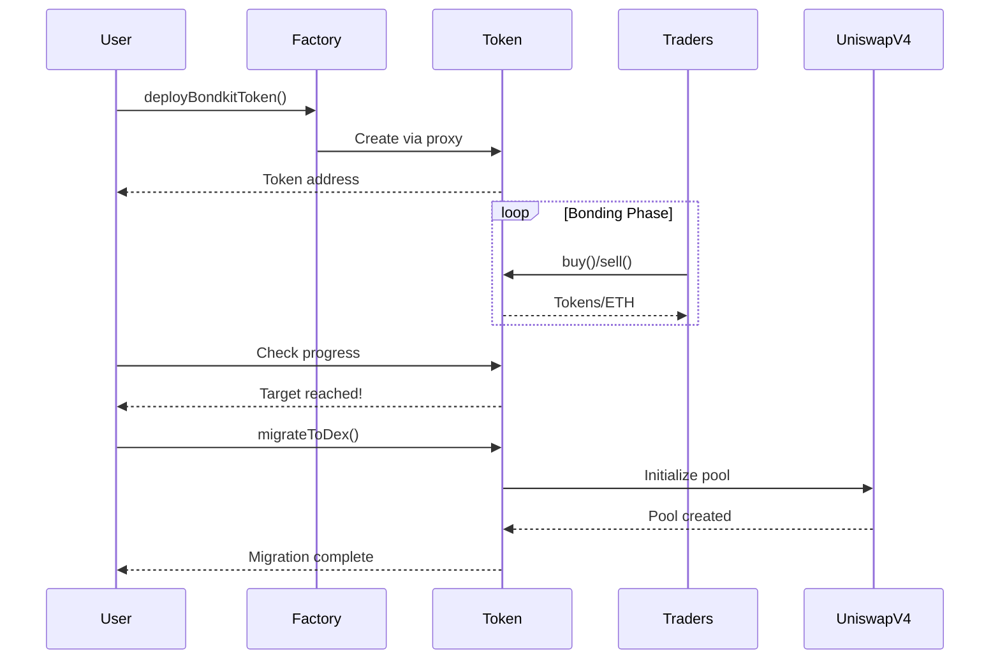

## Ikhtisar

Panduan cepat ini akan membimbing Anda melalui siklus hidup lengkap dari token BondKit dalam waktu kurang dari 5 menit. Anda akan belajar cara:

1. **Men-deploy** token obligasi baru
2. **Bertransaksi** selama fase bonding
3. **Memantau** kemajuan menuju target
4. **Migrasi** ke Uniswap v4

<Info>
  **Prasyarat**: Pastikan Anda telah menyelesaikan [instalasi](/bondkit/installation) dan memiliki dompet yang terisi di Base.
</Info>

## Diagram Alur Lengkap



## Langkah 1: Deploy Token Anda

### Deployment Dasar

```typescript
import { BondkitTokenFactory } from "@b3dotfun/sdk/bondkit";
import { base } from "viem/chains";
import { parseEther } from "viem";

// Inisialisasi factory
const factory = new BondkitTokenFactory(
  base.id, 
  process.env.WALLET_PRIVATE_KEY
);

// Deploy token Anda
const tokenAddress = await factory.deployBondkitToken({
  // Metadata token
  name: "My Awesome Token",
  symbol: "MAT",
  
  // Konfigurasi suplai (1 juta token)
  finalTokenSupply: parseEther("1000000"),
  
  // Pengaturan kurva bonding
  aggressivenessFactor: 35,  // 0-100, semakin tinggi = kurva semakin curam
  targetEth: parseEther("10"), // Target 10 ETH untuk migrasi
  
  // Konfigurasi fee
  feeRecipient: "0x742d35Cc6634C0532925a3b844Bc9e7595f0bEb1", // Alamat Anda
  lpSplitRatioFeeRecipientBps: 1000n, // 10% untuk penerima fee
  
  // Pengaturan migrasi
  migrationAdminAddress: "0x742d35Cc6634C0532925a3b844Bc9e7595f0bEb1",
  uniswapV2RouterAddress: "0x4752ba5DBc23f44D87826276BF6Fd6b1C372aD24" // Router V4
});

console.log("✅ Token berhasil di-deploy di:", tokenAddress);
```

### Memahami Parameter

<ParamField path="finalTokenSupply" type="bigint" required>
  Total suplai token (dengan 18 desimal). Contoh: `parseEther("1000000")` untuk 1M token.
</ParamField>

<ParamField path="aggressivenessFactor" type="number" required>
  Mengontrol kecuraman kurva bonding (0-100):
  - **0-30**: Harga linear, adil untuk semua pembeli
  - **30-60**: Kurva moderat, pendekatan seimbang
  - **60-100**: Agresif, memberi reward kepada pembeli awal
</ParamField>

<ParamField path="targetEth" type="bigint" required>
  Jumlah ETH yang diperlukan untuk mengaktifkan migrasi. Gunakan `parseEther("10")` untuk 10 ETH.
</ParamField>

<ParamField path="feeRecipient" type="address" required>
  Alamat yang menerima fee transaksi (5% dari semua transaksi).
</ParamField>

<ParamField path="lpSplitRatioFeeRecipientBps" type="bigint" required>
  Basis point (1/100 dari 1%) untuk pembagian fee LP. 1000 = 10%.
</ParamField>

## Langkah 2: Bertransaksi Selama Fase Bonding

### Inisialisasi Instansi Token

```typescript
import { BondkitToken } from "@b3dotfun/sdk/bondkit";
import { parseEther, formatEther } from "viem";

// Terhubung ke token yang telah di-deploy
const token = new BondkitToken(
  tokenAddress, 
  process.env.WALLET_PRIVATE_KEY
);
```

### Membeli Token

```typescript
// Dapatkan harga terlebih dahulu
const ethAmount = parseEther("1"); // 1 ETH
const expectedTokens = await token.getAmountOfTokensToBuy(ethAmount);

console.log(`1 ETH akan membeli: ${formatEther(expectedTokens)} token`);

// Eksekusi pembelian
const buyTx = await token.buy(
  0n,    // minTokensOut (0 = terima jumlah berapapun, gunakan untuk perlindungan slippage)
  "1"    // Jumlah ETH sebagai string
);

console.log("Pembelian selesai! Tx:", buyTx);
```

### Menjual Token

```typescript
// Periksa saldo token Anda
const balance = await token.getBalance(userAddress);
console.log(`Saldo Anda: ${formatEther(balance)} token`);

// Dapatkan kutipan jual
const tokensToSell = parseEther("1000");
const expectedEth = await token.getAmountOfEthToReceive(tokensToSell);

console.log(`Menjual 1000 token akan mengembalikan: ${formatEther(expectedEth)} ETH`);

// Eksekusi penjualan
const sellTx = await token.sell(
  tokensToSell,  // Jumlah token untuk dijual
  0n             // Min ETH out (untuk perlindungan slippage)
);

console.log("Penjualan selesai! Tx:", sellTx);
```

### Memantau Kemajuan

```typescript
// Periksa kemajuan bonding
const progress = await token.getBondingProgress();

console.log(`
  Kemajuan: ${(progress.progress * 100).toFixed(2)}%
  Terkumpul: ${formatEther(progress.raised)} ETH
  Target: ${formatEther(progress.threshold)} ETH
  Sisa: ${formatEther(progress.threshold - progress.raised)} ETH
`);

// Dapatkan harga token saat ini
const currentPrice = await token.getCurrentPrice();
console.log(`Harga saat ini: ${formatEther(currentPrice)} ETH per token`);

// Periksa apakah migrasi tersedia
const canMigrate = await token.canMigrate();
console.log(`Siap untuk migrasi: ${canMigrate}`);
```

### Memantau Event

```typescript
// Dengarkan event pembelian
token.onBuy((event) => {
  console.log("Pembelian baru:", {
    buyer: event.buyer,
    ethIn: formatEther(event.ethIn),
    tokensOut: formatEther(event.tokensOut)
  });
});

// Dengarkan event penjualan
token.onSell((event) => {
  console.log("Penjualan baru:", {
    seller: event.seller,
    tokensIn: formatEther(event.tokensIn),
    ethOut: formatEther(event.ethOut)
  });
});
```

## Langkah 3: Migrasi ke Uniswap v4

### Periksa Kesiapan Migrasi

```typescript
// Verifikasi target tercapai
const progress = await token.getBondingProgress();

if (progress.progress >= 1.0) {
  console.log("✅ Target tercapai! Siap untuk migrasi.");
  
  // Dapatkan detail migrasi
  const migrationData = await token.getMigrationData();
  console.log("Migrasi akan membuat pool dengan:", {
    ethLiquidity: formatEther(migrationData.ethForLp),
    tokenLiquidity: formatEther(migrationData.tokensForLp),
    initialPrice: formatEther(migrationData.sqrtPriceX96)
  });
} else {
  console.log(`⏳ Membutuhkan ${formatEther(progress.threshold - progress.raised)} ETH lagi`);
}
```

### Eksekusi Migrasi

```typescript
// Hanya admin migrasi yang dapat memanggil ini
if (await token.isMigrationAdmin(userAddress)) {
  console.log("🚀 Memulai migrasi ke Uniswap v4...");
  
  const migrationTx = await token.migrateToDex();
  console.log("Transaksi migrasi:", migrationTx);
  
  // Tunggu konfirmasi
  const receipt = await token.waitForTransaction(migrationTx);
  
  if (receipt.status === "success") {
    console.log("✅ Migrasi selesai!");
    console.log("Alamat pool Uniswap v4:", await token.getPoolAddress());
  }
} else {
  console.log("❌ Hanya admin migrasi yang dapat melakukan migrasi");
}
```

<Warning>
  **Penting**: Setelah migrasi:
  - Kepemilikan kontrak secara otomatis di-renounce
  - Perdagangan kurva bonding secara permanen dinonaktifkan
  - Semua perdagangan pindah ke Uniswap v4
  - Tidak ada lagi aksi admin yang mungkin
</Warning>

## Contoh Lengkap

Berikut adalah contoh kerja penuh yang menunjukkan seluruh siklus hidup:

```typescript
import { 
  BondkitTokenFactory, 
  BondkitToken 
} from "@b3dotfun/sdk/bondkit";
import { base } from "viem/chains";
import { parseEther, formatEther } from "viem";

async function launchToken() {
  // 1. Deploy token
  const factory = new BondkitTokenFactory(
    base.id,
    process.env.WALLET_PRIVATE_KEY
  );
  
  const tokenAddress = await factory.deployBondkitToken({
    name: "Demo Token",
    symbol: "DEMO",
    finalTokenSupply: parseEther("1000000"),
    aggressivenessFactor: 50,
    targetEth: parseEther("5"),
    feeRecipient: process.env.WALLET_ADDRESS,
    lpSplitRatioFeeRecipientBps: 1000n,
    migrationAdminAddress: process.env.WALLET_ADDRESS,
    uniswapV2RouterAddress: "0x4752ba5DBc23f44D87826276BF6Fd6b1C372aD24"
  });
  
  console.log("Token berhasil di-deploy:", tokenAddress);
  
  // 2. Bertransaksi selama bonding
  const token = new BondkitToken(
    tokenAddress,
    process.env.WALLET_PRIVATE_KEY
  );
  
  // Beli beberapa token
  await token.buy(0n, "0.5");
  console.log("Membeli token dengan 0.5 ETH");
  
  // Periksa kemajuan
  const progress = await token.getBondingProgress();
  console.log(`Kemajuan: ${(progress.progress * 100).toFixed(2)}%`);
  
  // 3. Terus bertransaksi sampai target tercapai...
  // (Dalam produksi, pengguna lain akan bertransaksi)
  
  // 4. Migrasi saat siap
  if (progress.progress >= 1.0) {
    await token.migrateToDex();
    console.log("Migrasi selesai! Token sekarang ada di Uniswap v4");
  }
}

launchToken().catch(console.error);
```

## Langkah Selanjutnya

<CardGroup cols={2}>
  <Card title="Konsep" icon="book" href="/bondkit/concepts/bonding-phase">
    Menyelami lebih dalam tentang kurva bonding dan penetapan harga
  </Card>
  <Card title="Referensi SDK" icon="code" href="/bondkit/sdk/reference">
    Jelajahi semua metode yang tersedia
  </Card>
  <Card title="Panduan" icon="compass" href="/bondkit/guides/choose-quote-asset">
    Pelajari strategi lanjutan
  </Card>
  <Card title="Demo Aplikasi" icon="desktop" href="https://github.com/b3dotfun/b3-monorepo/tree/main/apps/bondkit-demo">
    Lihat implementasi lengkap
  </Card>
</CardGroup>
