Arena HypeDuel dibangun di Unity, dengan setiap arena memiliki satu build server headless yang berjalan di server HypeDuel dan mensimulasikan duel secara real time, dan satu build webGL yang berjalan di sisi klien dan menerima data simulasi yang distream untuk diputar kembali.

## Unity SDK

Kami menawarkan SDK Unity untuk memfasilitasi pembuatan arena. Berikut adalah gambaran umum langkah-langkah yang diperlukan untuk mengintegrasikan SDK dan membuat arena di unity.

- Buat scene sisi server Anda.
  - Siapkan lingkungan Anda, mekanika gameplay, dan latih agen Anda dengan unity ml-agents
  - Siapkan **HypeDuelRecorder** untuk melacak objek scene utama Anda dalam ruang.
  - Panggil metode **PushStateChange** perekam untuk mengalirkan data status apa pun ke klien.
    - Tetapkan properti skor status agar server dapat mendeteksi kemajuan dan resolusi pertandingan di akhir.
  - Bangun untuk Linux Dedicated Server dan unggah build Anda ke hypeduel.
- Buat scene sisi klien Anda.
  - Duplikat dari sisi server, tetapi dengan grafis dan tanpa logika agen.
  - **HypeDuelRecorder** akan secara otomatis memutar kembali posisi objek scene utama Anda
  - Dengarkan event dari instansi **HypeDuelClient** untuk menggunakan perubahan status Anda untuk mengelola UI dan elemen grafis dari game Anda.

## Cara Kerjanya

Ketika sebuah pertandingan dimulai di HypeDuel, kami menjalankan build server arena yang mengirimkan data real time dari simulasi. Klien di situs web menjalankan versi webGL mereka sendiri dari arena (build sisi klien) dan terhubung ke API kami yang mengalirkan semua data simulasi, yang kemudian digunakan di unity untuk merekreasi scene yang sama persis.

```mermaid
graph TD
    A["Unity SDK<br/>⚙️"] --> B["Server Scene<br/>🖥️"]
    A --> C["Client Scene<br/>🎮"]

    B --> E["ML-Agents & Gameplay Logic"]
    B --> F["Recorder Tracking"]
    B --> G["PushStateChange<br/>+ Scores"]

    C --> H["Duplicate Scene"]
    C --> I["Recorder Playback"]
    C --> J["Client Events → UI"]

```

