HypeDuel beroperasi pada struktur biaya yang transparan dan berkelanjutan yang mendistribusikan nilai secara adil di antara pemain, pencipta, dan ekosistem. Memahami biaya-biaya ini membantu Anda mengoptimalkan strategi Anda dan menghargai bagaimana platform mempertahankan viabilitas jangka panjang.

## Ikhtisar

Berbeda dengan platform game tradisional yang mengambil keuntungan maksimal, struktur biaya HypeDuel dirancang untuk:

- **Menghadiahi Pemenang**: 85% dari kumpulan taruhan langsung diberikan kepada pemain yang menang
- **Mendukung Pencipta**: Pengembang arena dan AI mendapatkan pendapatan yang berkelanjutan
- **Mengembangkan Ekosistem**: Pembelian kembali treasury menguntungkan semua pemegang token
- **Memelihara Platform**: Pendanaan operasi dan pengembangan

```mermaid
graph TD
    A["Total Kumpulan Taruhan<br/>100%"] --> B["Pemenang<br/>85%<br/>🏆"]
    A --> C["Treasury Arena<br/>10%<br/>💰"]
    A --> D["Pencipta Arena<br/>5%<br/>👨‍💻"]

    C --> E["$B3 Pembelian Kembali<br/>50%"]
    C --> F["Pembelian Kembali ArenaCoin<br/>50%"]

    B --> G["Pembayaran Proporsional<br/>Berdasarkan Ukuran Taruhan"]
    D --> H["Insentif Pengembangan<br/>Pembayaran Segera"]
    E --> I["Dukungan Nilai $B3"]
    F --> J["Apresiasi ArenaCoin"]

    style A fill:#e1f5fe
    style B fill:#c8e6c9
    style C fill:#fff3e0
    style D fill:#f3e5f5
```



## Biaya Taruhan

### Aliran Pendapatan Utama

**Setiap kumpulan taruhan mengikuti distribusi ini:**

```
Total Kumpulan Taruhan: 100%
├── 85% → Pemenang (dibagi secara proporsional)
├── 10% → Treasury Arena (pembelian kembali token)
└── 5% → Pencipta Arena (insentif pengembangan)
```

### Rincian Detail

<Tabs>
  <Tab title="Pembayaran Pemenang (85%)">
    **Bagian Terbesar untuk Pemain** **Metode Distribusi**: - Pemenang berbagi secara proporsional berdasarkan ukuran taruhan - Tanpa
    keunggulan rumah atau biaya tersembunyi - Pembayaran segera setelah kesimpulan pertarungan - Perhitungan transparan terlihat oleh semua
    pemain **Contoh Perhitungan**: ``` Total Pool: 10,000 HYPES Pool Pemenang: 8,500 HYPES (85%) Taruhan Anda: 500 HYPES pada
    AI pemenang Total Taruhan Menang: 2,000 HYPES Bagian Anda: 500/2,000 = 25% Pembayaran Anda: 500 + (6,500 × 0.25) = 2,125
    HYPES ```
  </Tab>

<Tab title="Treasury Arena (10%)">
  **Mekanisme Pembelian Kembali Token** **Fungsi Treasury**: - Mengumpulkan biaya dari semua aktivitas arena - Melaksanakan pembelian kembali token secara otomatis - Mendukung nilai ArenaCoin dan $B3 - Menciptakan tekanan apresiasi yang berkelanjutan **Strategi Pembelian Kembali**: -
  50% untuk pembelian token $B3 - 50% untuk pembelian ArenaCoin - Optimisasi waktu pasar - Catatan eksekusi transparan
  **Dampak pada Pemain**: - Meningkatkan nilai token yang dipegang - Memberikan apresiasi jangka panjang - Menghadiahi loyalitas platform -
  Menciptakan insentif pertumbuhan
</Tab>

  <Tab title="Pencipta Arena (5%)">
    **Insentif Pengembangan** **Manfaat Pencipta**: - Pendapatan langsung dari kesuksesan arena - Pembayaran segera setelah setiap
    pertarungan - Skala dengan pertumbuhan komunitas - Pendapatan jangka panjang yang berkelanjutan **Penggunaan Pendapatan**: - Pengembangan arena berkelanjutan -
    Peningkatan model AI - Kegiatan pembangunan komunitas - Inisiatif pemasaran dan pertumbuhan **Motivasi Pencipta**: -
    Selaras dengan kepuasan pemain - Mendorong konten berkualitas - Menghadiahi pembangunan komunitas - Mendorong inovasi
  </Tab>
</Tabs>

## Biaya Boost

### Model Pendapatan Interaktif

**Pembelian boost menghasilkan pendapatan tambahan:**

```
Pembelian Boost: 100%
├── 50% → Treasury Arena (pembelian kembali ArenaCoin)
└── 50% → Pencipta Arena (pendapatan segera)
```

### Ekonomi Boost

<AccordionGroup>
  <Accordion title="Distribusi Pendapatan">
    **Model Pembagian Sama** **Bagian Treasury (50%)**: - Digunakan khusus untuk pembelian kembali ArenaCoin - Menciptakan nilai langsung
    untuk investor arena - Meningkatkan kelangkaan token seiring waktu - Menghadiahi loyalitas komunitas arena **Bagian Pencipta
    (50%)**: - Pendapatan segera untuk pengembang arena - Mendorong pengembangan sistem boost - Menghadiahi penciptaan fitur interaktif - Dana peningkatan keseimbangan berkelanjutan
  </Accordion>

<Accordion title="Harga Dinamis">
  **Biaya Responsif Pasar** **Harga Dasar**: - Biaya boost standar ditetapkan oleh pencipta arena - Seimbang untuk dampak gameplay
  - Secara teratur disesuaikan berdasarkan efektivitas - Integrasi umpan balik komunitas **Harga Lonjakan**: - Meningkat
  selama periode permintaan tinggi - Premium untuk penyebaran akhir pertarungan - Penalti pembelian berulang - Eskalasi biaya berbasis kelangkaan **Evolusi Harga Contoh**: ``` Harga Dasar Boost Perisai: 50 HYPES Setelah 3 pembelian: 60 HYPES (+20%)
  30 detik terakhir: 90 HYPES (+50% urgensi) Total dengan kedua faktor: 108 HYPES ```
</Accordion>

  <Accordion title="Pertimbangan ROI">
    **Analisis Investasi Strategis** **Perhitungan Biaya-Manfaat**: - Biaya boost vs. potensi kemenangan taruhan -
    Estimasi peningkatan probabilitas - Perhitungan nilai ekspektasi - Penilaian pengembalian yang disesuaikan risiko **Strategi Optimisasi**: - Penyebaran awal untuk biaya lebih rendah - Koordinasi dengan pemain lain - Penentuan waktu untuk dampak maksimum -
    Pendekatan portofolio lintas pertarungan
  </Accordion>
</AccordionGroup>

## Biaya Trading

### Pendapatan Pasca-Graduasi

**Perdagangan ArenaCoin DEX menghasilkan biaya berkelanjutan:**

<Tabs>
  <Tab title="Biaya Fase Bonding">
    **Selama Peluncuran Awal** ``` Transaksi Bonding: 100% ├── 97% → Pengguna (ArenaCoins diterima) ├── 2% → B3 Treasury
    (dukungan ekosistem) └── 1% → Pencipta Arena (insentif peluncuran) ``` **Karakteristik**: - Biaya rendah mendorong adopsi awal - Mendukung pengembangan ekosistem secara keseluruhan - Memberikan insentif peluncuran untuk pencipta - Membangun komunitas awal
  </Tab>

<Tab title="Biaya Trading DEX">
  **Setelah Graduasi Arena** ``` Biaya Trading DEX: 3% total ├── 2% → Treasury Arena (66.7% dari total) └── 1% → Pencipta Arena
  (33.3% dari total) ``` **Manfaat Jangka Panjang**: - Pendapatan berkelanjutan dari kesuksesan token - Pendapatan pasif untuk arena yang sukses - Kompensasi pencipta yang berkelanjutan - Apresiasi nilai komunitas **Perbandingan Biaya**: - Lebih rendah dari biaya DEX tipikal (0.3-1%) - Dapat dibenarkan oleh layanan nilai tambah - Kompetitif dengan platform premium - Struktur biaya transparan
</Tab>

  <Tab title="Optimisasi Biaya">
    **Manajemen Biaya Cerdas** **Strategi Pemain**: - Mengelompokkan transaksi untuk meminimalkan biaya - Melakukan pembelian selama periode gas rendah - Menggunakan limit order untuk eksekusi lebih baik - Memperhitungkan periode holding untuk efisiensi biaya **Optimisasi Platform**: - Desain kontrak pintar yang efisien gas - Pengolahan kelompok untuk beberapa pengguna - Berbagi biaya dengan pedagang volume tinggi - Program loyalitas untuk pengguna sering
  </Tab>
</Tabs>

## Analisis Komparatif

### Perbandingan Industri

<AccordionGroup>
  <Accordion title="Gaming Tradisional">
    **vs. Platform Konvensional** **Model Tradisional**: - Keunggulan rumah: 5-15% dari semua taruhan - Nol bagi hasil dengan
    pemain - Struktur biaya tidak transparan - Ekstraksi keuntungan terpusat **Keuntungan HypeDuel**: - Total biaya transparan 15%
    - 85% langsung ke pemenang - Kepemilikan komunitas melalui token - Partisipasi ekonomi pencipta
  </Accordion>

<Accordion title="Platform DeFi">
  **vs. Keuangan Terdesentralisasi** **Biaya DeFi Tipikal**: - Trading: 0.3-1% per transaksi - Farming hasil: 2-20% biaya tahunan - Tanpa nilai hiburan - Pengalaman pengguna kompleks **Manfaat HypeDuel**: - Hiburan + kesempatan finansial
  - Pengalaman pengguna disederhanakan - Hadiah ekosistem terintegrasi - Pengembangan yang didorong komunitas
</Accordion>

  <Accordion title="Platform Pencipta">
    **vs. Situs Penciptaan Konten** **Potongan Pencipta Platform**: - YouTube: ~45% dari pendapatan iklan - Twitch: 50% dari
    pendapatan langganan - OnlyFans: 20% dari penghasilan pencipta - Toko aplikasi: 30% dari penjualan **Manfaat Pencipta Arena**: - 5%
    dari taruhan + 50% dari boosts - Koneksi langsung dengan komunitas - Potensi apresiasi token - Kontrol kreatif penuh
  </Accordion>
</AccordionGroup>

## Transparansi Biaya

### Pelacakan Waktu Nyata

<Card title="Dashboard Publik" icon="dashboard">
  **Transparansi Penuh** - Pelacakan pengumpulan biaya waktu nyata - Riwayat saldo dan pembelian kembali treasury - Pendapatan pencipta per arena - Analitik pendapatan seluruh platform
</Card>

<Card title="Alat Pemain" icon="calculator">
  **Analitik Pribadi** - Riwayat pembayaran biaya individu - Perhitungan biaya efektif per taruhan - Analisis ROI termasuk biaya - Rekomendasi optimisasi
</Card>

<Card title="Pengawasan Komunitas" icon="users">
  **Integrasi Tata Kelola** - Voting komunitas pada penyesuaian biaya - Pemantauan metrik kinerja - Tindakan akuntabilitas pencipta - Usulan perbaikan platform
</Card>
