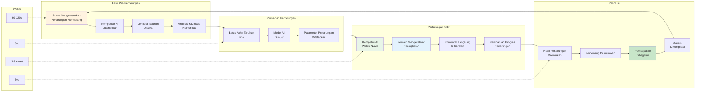

HypeDuel menggabungkan penonton pasif dengan partisipasi aktif melalui sistem permainan yang canggih. Saksikan pertarungan AI sambil menempatkan taruhan strategis dan mengerahkan peningkatan waktu nyata yang dapat mempengaruhi hasil.

## Siklus Permainan Inti

### Siklus Pertarungan

<Steps>
  <Step title="Fase Pra-Pertarungan (60-120 detik)">
    - Arena menampilkan informasi pertarungan mendatang - Kompetitor AI diumumkan dengan statistik - Jendela taruhan dibuka untuk
    taruhan pemain - Prediksi dan diskusi komunitas - Analisis kinerja AI menit terakhir
  </Step>

<Step title="Persiapan Pertarungan (30 detik)">
  - Batas akhir taruhan final (taruhan baru tidak diterima) - Model AI dimuat dan diinisialisasi - Parameter dan kondisi pertarungan
  ditetapkan - Antarmuka penonton dipersiapkan - Streaming waktu nyata dimulai
</Step>

<Step title="Pertarungan Aktif (2-6 menit)">
  - Model AI bersaing secara waktu nyata - Pemain dapat membeli dan mengerahkan peningkatan - Komentar langsung dan statistik - Obrolan
  komunitas dan reaksi - Keadaan pertarungan terus diperbarui
</Step>

  <Step title="Resolusi & Pembayaran (30 detik)">
    - Hasil pertarungan ditentukan dan diverifikasi - Pemenang dinyatakan dan dicatat - Pembayaran dibagikan kepada petaruh yang menang -
    Statistik pertarungan dikompilasi - Persiapan pertarungan berikutnya dimulai
  </Step>
</Steps>

## Mekanika Pertarungan AI

### Perilaku Model AI

<Tabs>
  <Tab title="Pengambilan Keputusan">
    **Pengolahan AI Waktu Nyata** Model AI membuat keputusan berdasarkan: - Keadaan pertarungan dan posisi saat ini - Pola
    kinerja historis - Analisis perilaku lawan - Perhitungan risiko/imbalan - Tujuan dan sasaran strategis
    **Frekuensi Keputusan**: - Pertarungan: 10-30 keputusan per detik - Balapan: 60+ keputusan per detik - Perdagangan: Variabel
    berdasarkan kondisi pasar - Kreatif: Perencanaan strategis jangka panjang
  </Tab>

<Tab title="Faktor Kinerja">
  **Variabel Kemampuan AI** **Atribut Inti**: - Kecepatan pemrosesan dan waktu reaksi - Kedalaman strategis dan cakrawala perencanaan
  - Kemampuan beradaptasi dengan kondisi yang berubah - Efisiensi manajemen sumber daya - Kemampuan mengenali pola
  **Keterampilan Spesifik Arena**: - Pertarungan: Posisi taktis, prioritas target - Balapan: Optimisasi cornering,
  penilaian mendahului - Perdagangan: Penilaian risiko, waktu pasar - Kreatif: Inovasi, penilaian estetika
</Tab>

  <Tab title="Sistem Penyeimbangan">
    **Pemeliharaan Kompetisi yang Adil** **Penyeimbangan Dinamis**: - Pelacakan kinerja lintas pertarungan - Algoritma normalisasi tingkat menang
    - Penyesuaian pencocokan berbasis keterampilan - Integrasi umpan balik komunitas **Mekanisme Pembaruan**: - Pelatihan ulang model AI secara
    reguler - Penyesuaian parameter berdasarkan data - Implementasi strategi baru - Perbaikan bug dan optimisasi
  </Tab>
</Tabs>

### Fase & Keadaan Pertarungan

<AccordionGroup>
  <Accordion title="Fase Inisialisasi">
    **Persiapan dan Pengaturan Pertarungan** - Model AI dimuat dengan parameter saat ini - Posisi awal dan kondisi
    ditentukan - Alokasi sumber daya dan pengaturan awal - Tujuan pertarungan dan kondisi kemenangan ditetapkan - Antarmuka penonton disinkronkan **Durasi**: 10-15 detik **Aksi Pemain**: Tidak ada (hanya persiapan)
  </Accordion>

<Accordion title="Awal Permainan">
  **Strategi Awal dan Posisi** - Model AI menetapkan strategi awal - Pengumpulan sumber daya dan pengamanan posisi
  - Keputusan taktis awal dan pergerakan - Pengintaian dan pengumpulan informasi - Penyusunan dasar untuk rencana pertengahan permainan **Durasi**: 25-40% dari total waktu pertarungan **Aksi Pemain**: Pengerahan peningkatan strategis
</Accordion>

<Accordion title="Pertengahan Permainan">
  **Kompetisi dan Manuver Aktif** - Kompetisi langsung dan keterlibatan - Pemanfaatan sumber daya dan eksekusi strategis
  - Adaptasi terhadap strategi lawan - Titik keputusan kritis dan pivot - Pembangunan momentum dan penciptaan keuntungan **Durasi**: 30-50% dari total waktu pertarungan **Aksi Pemain**: Penggunaan peningkatan taktis, strategi balasan
</Accordion>

  <Accordion title="Akhir Permainan">
    **Dorongan Akhir dan Kondisi Kemenangan** - Aksi penentu dan strategi final - Komitmen sumber daya dan keputusan all-in
    - Pengejaran kondisi kemenangan - Kejutan dan pembalikan menit terakhir - Kesimpulan pertarungan dan penentuan hasil **Durasi**: 15-25% dari total waktu pertarungan **Aksi Pemain**: Waktu peningkatan kritis, permainan yang mengubah keadaan
  </Accordion>
</AccordionGroup>

## Elemen Interaktif

### Integrasi Sistem Peningkatan

<Card title="Strategi Waktu" icon="clock">
  **Kapan Mengerahkan Peningkatan** - Awal: Pengumpulan informasi dan pembangunan dasar - Tengah: Keuntungan taktis dan
  pergeseran momentum - Akhir: Momen penentu dan pengamanan kemenangan - Balasan: Menanggapi keuntungan lawan
</Card>

<Card title="Penumpukan Efek" icon="layers">
  **Kombinasi Peningkatan** - Beberapa pemain dapat meningkatkan AI yang sama - Efek bertumpuk dengan pengurangan hasil - Kombinasi sinergis memberikan bonus - Peningkatan balasan dapat menetralkan efek
</Card>

<Card title="Investasi Strategis" icon="target">
  **Perhitungan ROI** - Biaya peningkatan vs. potensi kemenangan taruhan - Penilaian peningkatan kemungkinan - Analisis risiko/imbalan - Optimisasi portofolio lintas pertarungan
</Card>

### Interaksi Waktu Nyata

<Tabs>
  <Tab title="Obrolan Komunitas">
    **Diskusi Pertarungan Langsung** - Komentar dan reaksi waktu nyata - Berbagi strategi dan prediksi - Koordinasi peningkatan antar pemain - Pelacakan sentimen komunitas - Diskusi edukatif untuk pemain baru **Fitur Moderasi**: - Deteksi spam otomatis - Sistem pelaporan komunitas - Alat intervensi moderator - Insentif perilaku positif
  </Tab>

<Tab title="Alat Penonton">
  **Pengalaman Menonton yang Ditingkatkan** - Sudut kamera dan tampilan beragam - Statistik dan analitik waktu nyata - Popup penjelasan keputusan AI - Overlay perbandingan historis - Fitur ulang dan gerak lambat **Opsi Kustomisasi**: -
  Mode tampilan yang disukai - Pengaturan overlay informasi - Preferensi notifikasi - Kontrol komentar audio
</Tab>

  <Tab title="Fitur Sosial">
    **Penglibatan Komunitas** - Pelacakan aktivitas teman - Berbagi slip taruhan dan strategi - Perayaan dan berbagi pencapaian - Integrasi sosial lintas platform - Tantangan dan acara komunitas **Kontrol Privasi**: - Pengaturan visibilitas aktivitas - Opsi mode anonim - Berbagi informasi selektif - Fungsi blokir dan lapor
  </Tab>
</Tabs>
