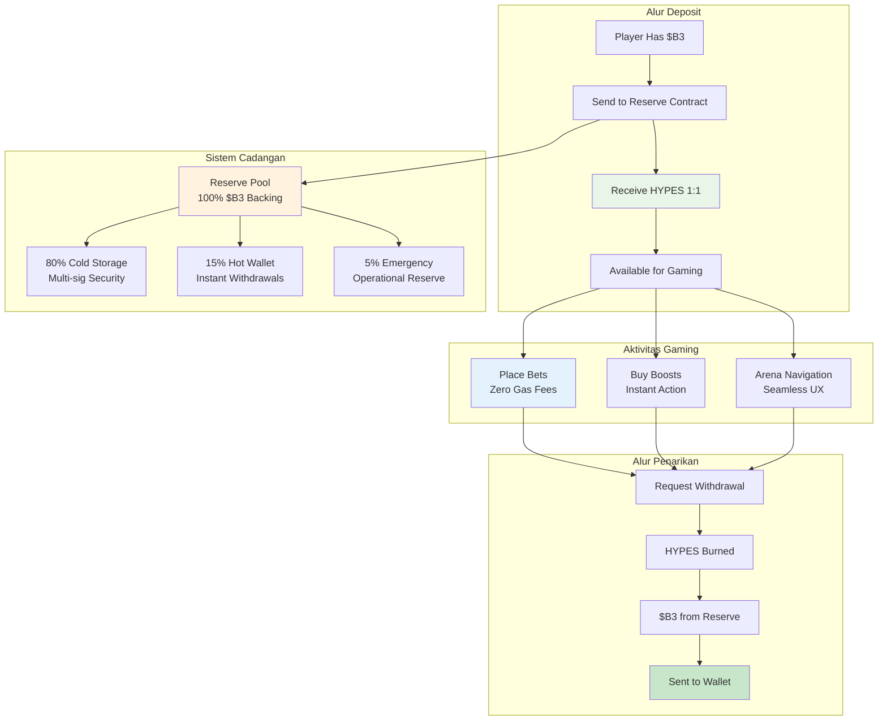

**HYPES** adalah kredit asli platform HypeDuel yang mempertahankan nilai tukar 1:1 dengan token B3. Mereka memungkinkan taruhan instan dan pembelian boost tanpa keterlambatan transaksi blockchain, menciptakan pengalaman bermain game yang mulus sambil mempertahankan dukungan penuh $B3.

## Konsep Inti

HYPES menyelesaikan masalah UX fundamental dari permainan blockchain: keterlambatan transaksi dan biaya gas yang mengganggu aliran hiburan. Dengan mempertahankan HYPES sebagai kredit platform dengan dukungan $B3 yang dijamin, pemain mendapatkan yang terbaik dari kedua dunia.

## Fitur Utama

<Card title="1:1 $B3 Backing" icon="shield">
  Setiap token HYPES didukung oleh tepat 1 token $B3 dalam cadangan
</Card>

<Card title="Transaksi Instan" icon="bolt">
  Pasang taruhan dan beli boost tanpa menunggu konfirmasi blockchain
</Card>

<Card title="Zero Gas Fees" icon="dollar-sign">
  Tidak ada biaya transaksi untuk taruhan, pembelian boost, atau transfer
</Card>

<Card title="Penarikan Kapan Saja" icon="arrow-right">
  Konversi HYPES kembali ke $B3 secara instan kapan saja
</Card>

## Proses Konversi

<Tabs>
  <Tab title="$B3 → HYPES">
    **Proses Deposit**: 
    1. Kirim B3 ke kontrak cadangan HypeDuel 
    2. Terima HYPES setara di akun platform 
    3. HYPES tersedia langsung untuk taruhan dan boost 
    4. Cadangan meningkat sejumlah jumlah yang disetor

    **Metode**: - Transfer token B3 langsung - Pembelian dengan kartu kredit (otomatis dikonversi) - Token ERC-20 apa pun (ditukar ke B3 terlebih dahulu) - Transfer bank (dikonversi ke B3)

  </Tab>

  <Tab title="HYPES → $B3">
    **Proses Penarikan**: 1. Minta penarikan dari akun platform 2. Saldo HYPES berkurang segera 3. $B3
    ditransfer dari cadangan ke dompet Anda 4. Cadangan berkurang sejumlah jumlah yang ditarik **Fitur**: - Tidak ada jumlah penarikan minimum - Tidak ada biaya penarikan - Ketersediaan 24/7 - Pengolahan instan
  </Tab>
</Tabs>

## Perbandingan HYPES vs $B3

| Fitur                | HYPES               | $B3                  |
| ---------------------- | ------------------- | -------------------- |
| **Taruhan**            | ✅ Instan          | ❌ Biaya gas + keterlambatan |
| **Pembelian Boost**    | ✅ Instan          | ❌ Biaya gas + keterlambatan |
| **Perdagangan Arena**      | ❌ Tidak didukung    | ✅ Perdagangan DEX       |
| **Lintas Platform**     | ❌ Hanya HypeDuel    | ✅ Ekosistem penuh    |
| **Biaya Transaksi**  | ✅ Gratis             | ❌ Biaya gas          |
| **Penyimpanan Dompet**     | ❌ Penyimpanan platform | ✅ Penyimpanan sendiri      |
| **Konversi Instan** | ✅ 1:1 dengan $B3     | ✅ 1:1 dengan HYPES    |

## Manajemen Cadangan

### Transparansi & Keamanan

Sistem cadangan HYPES beroperasi dengan transparansi penuh:

<AccordionGroup>
  <Accordion title="Komposisi Cadangan">
    **100% $B3 Backing**: - Setiap HYPES didukung oleh 1 token $B3 - Tidak ada cadangan fraksional atau leverage - Pemantauan cadangan waktu nyata - Alamat cadangan publik untuk verifikasi **Lokasi Cadangan**: - 80% dalam penyimpanan dingin multi-tanda tangan - 15% dalam hot wallet untuk penarikan instan - 5% cadangan darurat untuk kebutuhan operasional
  </Accordion>

<Accordion title="Tindakan Keamanan">
  **Keamanan Multi-Tanda Tangan**: - 3-dari-5 multi-sig untuk akses penyimpanan dingin - Modul keamanan perangkat keras (HSMs) -
  Mekanisme penarikan dengan penundaan waktu - Audit keamanan reguler dan pengujian penetrasi **Keamanan Operasional**: -
  Pemantauan dan peringatan waktu nyata - Rebalancing cadangan otomatis - Mekanisme jeda darurat - Asuransi untuk kegagalan teknis
</Accordion>

  <Accordion title="Verifikasi Publik">
    **Transparansi On-Chain**: - Alamat cadangan dapat dilihat publik - Pelacakan cadangan vs. HYPES diterbitkan secara waktu nyata -
    Audit pihak ketiga bulanan - Pengawasan tata kelola komunitas **Alat Monitoring**: - Dashboard publik menunjukkan status cadangan - Sistem peringatan untuk perubahan rasio cadangan - Data historis dan analisis tren - Layanan verifikasi independen
  </Accordion>
</AccordionGroup>

## Kasus Penggunaan HYPES

### Fungsi Utama

<Card title="Taruhan Pertarungan" icon="coins">
  **Aktivitas Gaming Inti** - Pasang taruhan pada pertarungan AI secara instan - Tidak perlu menunggu konfirmasi blockchain - Kemenangan dikreditkan segera - Dukungan untuk strategi taruhan cepat
</Card>

<Card title="Pembelian Boost" icon="bolt">
  **Gameplay Interaktif** - Beli power-up selama pertarungan langsung - Penyebaran waktu nyata tanpa keterlambatan - Penentuan waktu strategis tanpa kekhawatiran biaya gas - Kombinasikan beberapa boost secara efektif
</Card>

<Card title="Navigasi Platform" icon="compass">
  **Pengalaman yang Mulus** - Bergerak antar arena secara instan - Pendaftaran turnamen cepat - Akses langsung ke fitur baru - Pengalaman pengguna tanpa gesekan
</Card>
