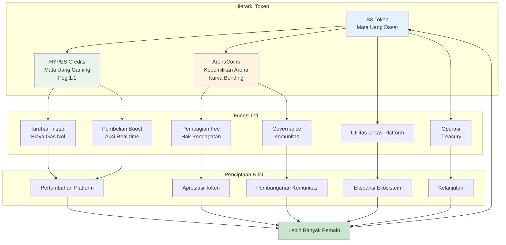
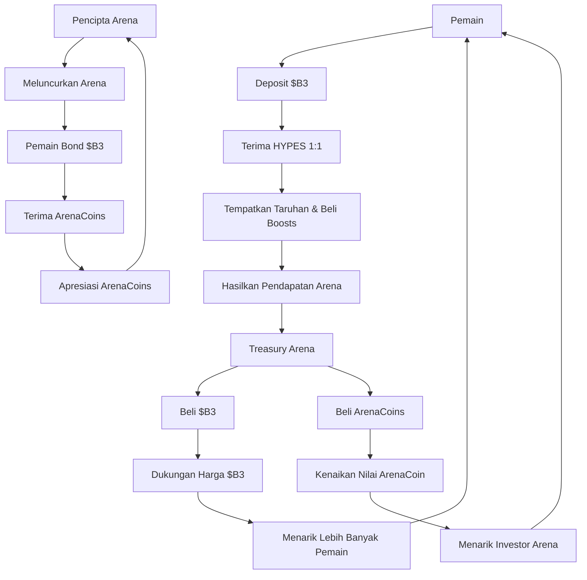

HypeDuel beroperasi pada sistem ekonomi tiga token yang canggih, dirancang untuk mengoptimalkan pengalaman pengguna, menciptakan aliran nilai yang berkelanjutan, dan memungkinkan kepemilikan komunitas. Setiap token melayani tujuan tertentu sambil bekerja bersama untuk menggerakkan seluruh ekosistem.

## Arsitektur Tiga Token

### Hierarki Token

<Tabs>
  <Tab title="$B3 Token" icon="coins">
    **Mata Uang Dasar** - Token ekosistem dasar - Penyimpanan nilai utama - Utilitas lintas-platform - Cadangan treasury
    - Bonding ArenaCoins
  </Tab>

<Tab title="HYPES Credits" icon="zap">
  **Mata Uang Gaming** - Peg 1:1 dengan $B3 - Penempatan taruhan instan - Biaya gas nol - Penarikan tanpa hambatan - Pembelian
  boost
</Tab>

  <Tab title="ArenaCoins" icon="chart-line">
    **Kepemilikan Arena** - Unik per arena - Harga kurva bonding - Hak pembagian fee - Peluang trading -
    Governance komunitas
  </Tab>
</Tabs>

## Diagram Aliran Token

## Mengapa Tiga Token?

### Optimasi Pengalaman Pengguna

Sistem tiga token menyelesaikan masalah UX kritis:

<AccordionGroup>
  <Accordion title="Transaksi Instan">
    **Masalah**: Transaksi blockchain memiliki keterlambatan dan biaya gas yang mengganggu alur permainan. **Solusi**: HYPES
    memungkinkan taruhan dan boost instan tanpa gesekan blockchain sambil mempertahankan dukungan penuh $B3.
  </Accordion>

<Accordion title="Investasi Arena">
  **Masalah**: Tidak ada cara bagi pengguna untuk berinvestasi atau mendapat manfaat dari pertumbuhan arena yang sukses. **Solusi**: ArenaCoins memungkinkan pemain memiliki bagian dari ekonomi arena dan mendapatkan keuntungan dari kesuksesannya.
</Accordion>

<Accordion title="Penangkapan Nilai">
  **Masalah**: Pendapatan platform biasanya hanya menguntungkan pemilik platform. **Solusi**: Pembelian kembali treasury dari $B3
  dan ArenaCoins mendistribusikan nilai ke semua pemangku kepentingan.
</Accordion>

  <Accordion title="Insentif Pencipta">
    **Masalah**: Sulit untuk memberi kompensasi yang adil kepada pencipta arena dan model AI. **Solusi**: ArenaCoins menyediakan
    pembagian pendapatan langsung dan potensi apresiasi untuk pencipta.
  </Accordion>
</AccordionGroup>

### Keberlanjutan Ekonomi

Setiap token menciptakan nilai dengan cara yang berbeda:

<Card title="Pendorong Nilai $B3" icon="trending-up">
  - Pertumbuhan ekosistem dasar - Tekanan pembelian kembali treasury - Utilitas lintas-platform - Integrasi Staking dan DeFi
</Card>

<Card title="Stabilitas HYPES" icon="balance-scale">
  - Jaminan dukungan 1:1 $B3 - Kemampuan konversi instan - Premi utilitas gaming - Nilai kenyamanan platform
</Card>

<Card title="Apresiasi ArenaCoin" icon="rocket">
  - Pertumbuhan popularitas arena - Peningkatan generasi fee - Pengembangan komunitas - Ekspansi volume trading
</Card>

## Matriks Utilitas Token

| Fitur              | $B3 | HYPES | ArenaCoins |
| ------------------ | --- | ----- | ---------- |
| **Taruhan**        | ❌  | ✅    | ❌         |
| **Boosts**         | ❌  | ✅    | ❌         |
| **Bonding Arena**  | ✅  | ❌    | ❌         |
| **Pendapatan Fee** | ✅  | ❌    | ✅         |
| **Trading**        | ✅  | ❌    | ✅         |
| **Governance**     | ✅  | ❌    | ✅         |
| **Lintas-Platform**| ✅  | ❌    | ❌         |

### Mekanika Treasury

Treasury arena menciptakan tekanan beli yang berkelanjutan:

1. **Pengumpulan Pendapatan**: Fee terakumulasi di treasury arena
2. **Alokasi Aset**: 50% untuk pembelian kembali $B3, 50% untuk pembelian kembali ArenaCoin
3. **Pembelian Pasar**: Pembelian pasar otomatis menciptakan dukungan harga
4. **Distribusi Nilai**: Manfaat mengalir ke semua pemegang token
