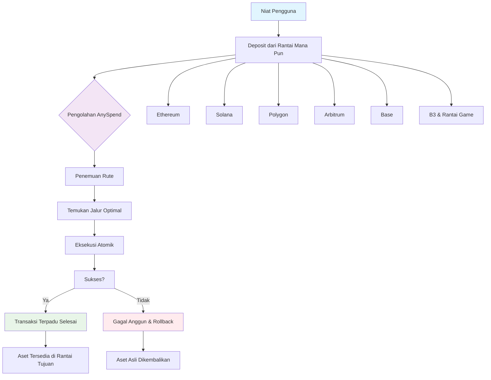

<iframe
   className="w-full aspect-video rounded-xl"
    src="https://customer-gg6qs7nm5ue94t64.cloudflarestream.com/03160a1a61ac99b9003e44a2059c7dae/iframe?muted=true&loop=true&autoplay=true&poster=https%3A%2F%2Fcustomer-gg6qs7nm5ue94t64.cloudflarestream.com%2F03160a1a61ac99b9003e44a2059c7dae%2Fthumbnails%2Fthumbnail.jpg%3Ftime%3D%26height%3D600"
    title="Fragmentasi Likuiditas"
    frameBorder="0"
  allow="accelerometer; autoplay; clipboard-write; encrypted-media; gyroscope; picture-in-picture"
  allowFullScreen
  ></iframe>

<Note>
[Explore ekosistem multichain B3 di explorer.b3.fun](https://explorer.b3.fun/chains)
</Note>

## Masalahnya

Appchains, L2s, dan L3s memiliki likuiditas yang terisolasi, membuatnya menyebalkan untuk membangun pengalaman tanpa harus memindahkan aset lintas rantai.

<CardGroup cols={2}>

<Card title="Likuiditas Terfragmentasi" icon="puzzle-piece">
  Setiap rantai mempertahankan kolam yang terisolasi, membatasi kedalaman dan meningkatkan slippage.
</Card>

<Card title="Integrasi Kompleks" icon="gears">
  Pembangun harus mengintegrasikan dengan puluhan rantai secara individu.
</Card>

<Card title="UX yang Buruk" icon="face-frown">
  Pengguna secara manual memindahkan aset dan mengelola beberapa dompet.
</Card>

<Card title="Inefisiensi Modal" icon="chart-line-down">
  Aset yang terkunci pada rantai tertentu tidak dapat mengakses peluang lain.
</Card>

</CardGroup>

## Akses Likuiditas Lintas Rantai

Didukung oleh produk kami, AnySpend, beroperasi di lapisan eksekusi klien, berada di antara niat pengguna dan eksekusi blockchain:

### Cara Kerjanya

1. **Deposit dari rantai mana pun**: Menerima token dari sebagian besar rantai
2. **Berdasarkan Niat**: Pengguna menyatakan apa yang mereka inginkan, bukan bagaimana mencapainya
3. **Penemuan Rute**: Menemukan jalur optimal lintas semua rantai yang didukung
4. **Eksekusi Atomik**: Transaksi dieksekusi secara atomik atau gagal dengan anggun
5. **Pengalaman Terpadu**: Operasi kompleks tampak sebagai transaksi tunggal

### Rantai yang Didukung

AnySpend menyediakan dukungan rantai universal:

- **Rantai EVM**: Sebagian besar rantai EVM, termasuk Ethereum, Polygon, Arbitrum, Base, BSC, Avalanche
- **Solana**: Integrasi penuh dengan ekosistem Solana
- **Ekosistem B3**: Integrasi asli dengan B3 dan rantai game

## Langkah Selanjutnya

<CardGroup cols={2}>

<Card title="Coba AnySpend" icon="rocket" href="/anyspend/introduction">
  Mulai dengan SDK AnySpend.
</Card>

<Card title="Panduan Integrasi" icon="book" href="/anyspend/installation">
  Pelajari cara mengintegrasikan AnySpend.
</Card>

<Card title="Referensi API" icon="code" href="/anyspend/api-reference/introduction">
  Jelajahi dokumentasi API lengkap.
</Card>

<Card title="Bergabung dengan Discord" icon="discord" href="https://discord.gg/b3dotfun">
  Terhubung dengan pembangun lain.
</Card>

</CardGroup>
