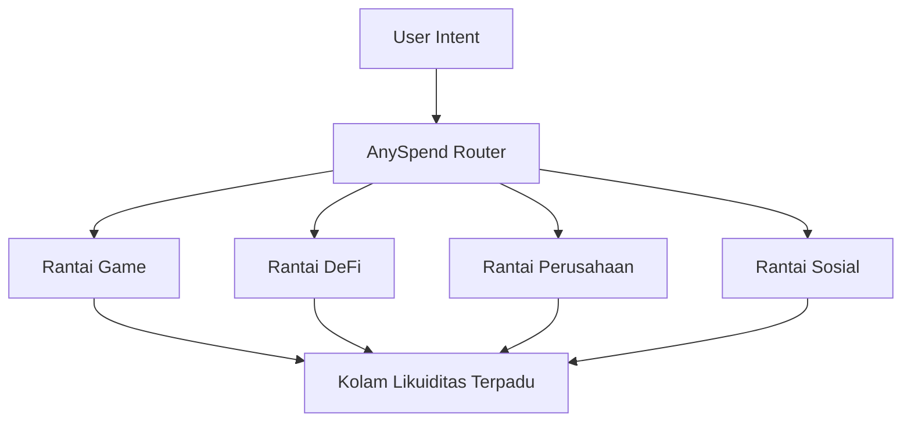

<Note>
  [Jelajahi ekosistem multichain B3 di explorer.b3.fun](https://explorer.b3.fun/chains)
</Note>

## Revolusi Skalabilitas

Skalabilitas blockchain tradisional berfokus pada membuat rantai tunggal menjadi lebih cepat. B3 mengambil pendekatan yang berbeda: **skalabilitas horizontal** melalui appchains yang dibangun khusus yang bekerja bersama sebagai ekosistem yang terpadu.

<CardGroup cols={2}>
  <Card title="Skalabilitas Vertikal" icon="arrow-up">
    Membuat satu rantai dapat menangani lebih banyak transaksi per detik
  </Card>
  <Card title="Skalabilitas Horizontal" icon="arrow-right">
    Menciptakan rantai khusus untuk aplikasi tertentu
  </Card>
</CardGroup>

## Mengapa Skalabilitas Horizontal Penting

Daripada memaksa semua aplikasi bersaing untuk sumber daya blockchain yang sama, skalabilitas horizontal memungkinkan setiap aplikasi, game, atau perusahaan memiliki lingkungan eksekusi yang dioptimalkan sendiri.

### Keuntungan Multi-Rantai

<CardGroup cols={2}>
  <Card title="Optimisasi Spesifik Aplikasi" icon="gear">
    Setiap appchain dapat disesuaikan untuk kasus penggunaan spesifiknya - rantai game untuk gameplay tanpa biaya, rantai DeFi untuk perdagangan berkapasitas tinggi.
  </Card>
  <Card title="Throughput Tak Terbatas" icon="bolt">
    Tidak lagi bersaing untuk ruang blok. Setiap aplikasi mendapatkan sumber daya khusus dan dapat diskalakan secara independen.
  </Card>
  <Card title="Risiko Terisolasi" icon="shield">
    Masalah pada satu appchain tidak mempengaruhi yang lain, menyediakan keamanan dan keandalan yang lebih baik untuk seluruh ekosistem.
  </Card>
  <Card title="Pengalaman Terpadu" icon="link">
    Meskipun merupakan rantai terpisah, pengguna mengalami interaksi yang mulus di seluruh ekosistem B3.
  </Card>
</CardGroup>

## Bagaimana B3 Memungkinkan Skalabilitas Horizontal

### 1. Appchains yang Dibangun Khusus

Setiap aplikasi di B3 dapat menerapkan rantainya sendiri yang didedikasikan, dioptimalkan untuk persyaratan spesifik:

- **Rantai Game**: Transaksi tanpa biaya, finalitas instan, precompiles spesifik game
- **Rantai DeFi**: Perdagangan berkapasitas tinggi, perlindungan MEV, primitif keuangan
- **Rantai Perusahaan**: Fitur privasi, alat kepatuhan, tata kelola khusus
- **Rantai Sosial**: Penyimpanan konten, sistem reputasi, grafik sosial

### 2. Lapisan Likuiditas Terpadu

Sementara rantai diskalakan secara horizontal, likuiditas tetap terpadu melalui [AnySpend](/protocol/liquidity):

### 3. Operasi Lintas-Rantai yang Mulus

<Steps>
  <Step title="Menyatakan Intent">
    Pengguna cukup menyatakan apa yang ingin mereka lakukan - membeli NFT, menukar token, atau melakukan pembayaran.
  </Step>
  <Step title="Pengarahan Otomatis">
    Infrastruktur B3 secara otomatis menemukan jalur optimal di semua appchains.
  </Step>
  <Step title="Eksekusi Atomik">
    Operasi multi-rantai yang kompleks dieksekusi sebagai satu transaksi dari perspektif pengguna.
  </Step>
</Steps>

## Manfaat Dunia Nyata

### Untuk Pengembang

<CardGroup cols={2}>
  <Card title="Tidak Ada Lagi Kemacetan" icon="traffic-light">
    Terapkan rantai Anda sendiri dan tidak perlu khawatir tentang kemacetan jaringan yang mempengaruhi pengguna Anda.
  </Card>
  <Card title="Ekonomi Kustom" icon="coins">
    Desain ekonomi token, struktur biaya, dan insentif spesifik untuk aplikasi Anda.
  </Card>
  <Card title="Inovasi Lebih Cepat" icon="rocket">
    Bereksperimen dengan fitur baru tanpa mempengaruhi aplikasi lain atau menunggu pembaruan jaringan.
  </Card>
  <Card title="UX Lebih Baik" icon="sparkles">
    Optimalkan biaya transaksi, waktu konfirmasi, dan alur pengguna untuk kasus penggunaan spesifik Anda.
  </Card>
</CardGroup>

### Untuk Pengguna

<CardGroup cols={2}>
  <Card title="Pengalaman Konsisten" icon="user-check">
    Akses semua aplikasi dengan dompet dan akun yang sama di seluruh ekosistem.
  </Card>
  <Card title="Biaya Lebih Rendah" icon="coins">
    Manfaatkan struktur biaya yang dioptimalkan pada setiap rantai khusus.
  </Card>
  <Card title="Transaksi Lebih Cepat" icon="clock">
    Alami konfirmasi hampir instan pada rantai yang dioptimalkan untuk kasus penggunaan Anda.
  </Card>
  <Card title="Keamanan Ditingkatkan" icon="lock">
    Nikmati keamanan penyelesaian Ethereum sambil memanfaatkan fitur rantai khusus.
  </Card>
</CardGroup>

## Skalabilitas dalam Praktik

<Note>
  [Akses data gabungan lintas rantai B3 dengan API gratis kami](/data/api-reference/introduction).
</Note>

### Gaming dalam Skala

Rantai game di B3 dapat menangani:

- **Mekanik bermain gratis** dengan biaya transaksi nol
- **Interaksi waktu nyata** dengan finalitas sub-detik
- **Event multiplayer besar** tanpa kemacetan jaringan
- **Transfer aset lintas game** melalui likuiditas terpadu

### Aplikasi Perusahaan

Rantai perusahaan memungkinkan:

- **Transaksi pribadi** untuk operasi bisnis sensitif
- **Fitur kepatuhan** terintegrasi ke dalam lapisan protokol
- **Model tata kelola kustom** untuk kebutuhan organisasi
- **Kemampuan integrasi** dengan sistem bisnis yang ada

### Inovasi DeFi

Rantai DeFi mendukung:

- **Perdagangan frekuensi tinggi** dengan throughput yang dioptimalkan
- **Instrumen keuangan kompleks** dengan precompiles khusus
- **Perlindungan MEV** melalui mekanisme pemesanan kustom
- **Arbitrase lintas-rantai** melalui akses likuiditas terpadu

## Efek Jaringan

Seiring bertambahnya aplikasi yang menerapkan appchains mereka sendiri, seluruh ekosistem B3 menjadi lebih berharga:

1. **Likuiditas Meningkat**: Lebih banyak rantai berarti lebih banyak peluang perdagangan dan kolam likuiditas yang lebih dalam
2. **Komposabilitas Ditingkatkan**: Aplikasi dapat berinteraksi lintas rantai dengan mulus
3. **Biaya Berkurang**: Biaya infrastruktur bersama berkurang seiring pertumbuhan ekosistem
4. **Akselerasi Inovasi**: Fitur baru pada satu rantai dapat diadopsi oleh yang lain

## Memulai dengan Skalabilitas Horizontal

<Card title="Terapkan Appchain Anda" icon="rocket" horizontal href="https://b3builders.typeform.com/bsmntdevelopers">
  Siap untuk diskalakan secara horizontal? Hubungi tim kami untuk membahas penerapan appchain khusus Anda di B3.
</Card>

<Note>
  [Akses data gabungan lintas rantai B3 dengan API gratis kami](/data/api-reference/introduction).
</Note>

<Note>
  [Bangun di B3 dengan alat pengembang kami](/ecosystem/introduction).
</Note>

### Pilih Strategi Skalabilitas Anda

<CardGroup cols={3}>
  <Card title="Rantai B3 Bersama" icon="users">
    Mulai membangun di rantai utama B3 sebelum diskalakan ke appchain Anda sendiri.
  </Card>
  <Card title="Appchain Khusus" icon="server">
    Terapkan rantai khusus yang dioptimalkan untuk kebutuhan aplikasi spesifik Anda.
  </Card>
  <Card title="Pendekatan Hibrida" icon="block">
    Gunakan rantai utama untuk fungsi inti dan appchains untuk fitur khusus.
  </Card>
</CardGroup>

## Masa Depan Skalabilitas

Skalabilitas horizontal mewakili evolusi berikutnya dari infrastruktur blockchain. Dengan memungkinkan eksekusi paralel tak terbatas sambil mempertahankan pengalaman pengguna dan likuiditas yang terpadu, B3 menciptakan fondasi untuk adopsi onchain yang benar-benar masif.

Internet tidak diskalakan dengan membuat server tunggal lebih cepat—ia diskalakan dengan menghubungkan jutaan server khusus. Demikian pula, blockchain akan diskalakan dengan menghubungkan ribuan rantai yang dibangun khusus, masing-masing dioptimalkan untuk aplikasi spesifik sambil bekerja bersama sebagai ekosistem yang terpadu.
