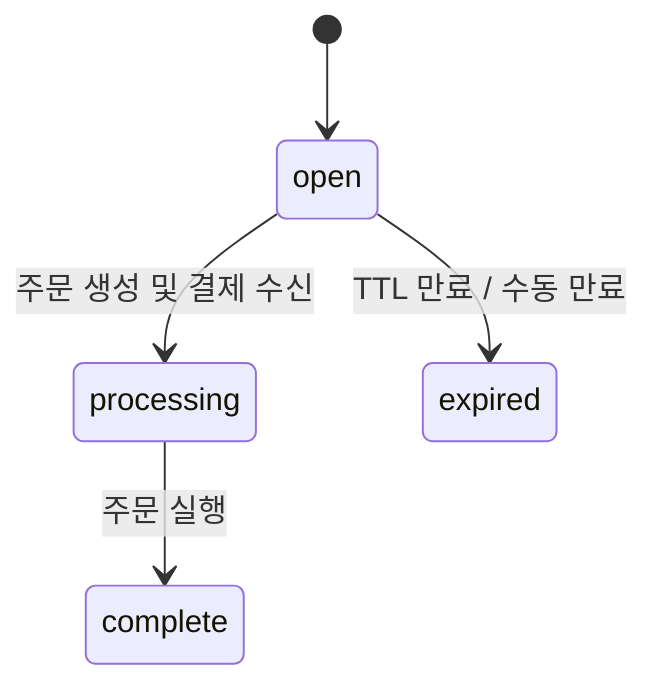

체크아웃 세션을 사용하면 사용자가 결제 방법을 선택하기 전에 서버에서 추적 객체를 생성할 수 있습니다. 세션은 가벼운 데이터베이스 레코드입니다 -- 외부 API 호출 없음, 주문 생성 없음. 주문은 나중에, 사용자가 결제를 확정할 때 발생합니다.

<Info>
  React 체크아웃 컴포넌트를 찾고 계신가요? [Checkout](/anyspend/checkout)을 참조하세요. 이 페이지는 서버 주도 흐름을 위한 **REST API**를 다룹니다.
</Info>

## 기본 URL

모든 체크아웃 세션 엔드포인트는 AnySpend 서비스에 위치해 있습니다:

```
https://api.anyspend.com
```

## 흐름

<Steps>
  <Step title="서버에서 세션 생성">
    `POST https://api.anyspend.com/checkout-sessions`은 `{ id, status: "open" }`을 반환합니다
  </Step>
  <Step title="사용자가 결제 방법 선택">
    `POST https://api.anyspend.com/orders`에 `checkoutSessionId`를 포함하여 `{ id, globalAddress, oneClickBuyUrl }`을 반환합니다
  </Step>
  <Step title="사용자 결제">
    **암호화폐:** `globalAddress`로 보내기 | **Fiat 온램프:** `oneClickBuyUrl`로 리다이렉트
  </Step>
  <Step title="완료 여부 폴링">
    `GET https://api.anyspend.com/checkout-sessions/:id`은 `{ status: "complete", order_id }`을 반환합니다
  </Step>
</Steps>

### 세션과 주문을 분리하는 이유는?

- 세션 생성 시 결제 방법을 알 필요가 없습니다.
- 호스티드 체크아웃 페이지를 통해 사용자가 결제 방법을 선택할 수 있습니다.
- 세션 생성은 로컬 DB 쓰기이므로, 제3자 API 오류로 인해 실패하지 않습니다.

## 세션 상태 라이프사이클



| 상태 | 의미 |
|--------|---------|
| `open` | 생성됨, 주문/결제 대기 중 |
| `processing` | 결제 수신됨, 주문 실행 중 |
| `complete` | 주문이 성공적으로 실행됨 |
| `expired` | TTL 만료, 결제 실패, 또는 수동으로 만료됨 |

## API 참조

### 세션 생성

```
POST https://api.anyspend.com/checkout-sessions
```

가벼운 세션을 생성합니다. 주문 없음, 외부 API 호출 없음.

```json
{
  "success_url": "https://merchant.com/success?session_id={SESSION_ID}",
  "cancel_url": "https://merchant.com/cancel",
  "metadata": { "sku": "widget-1" },
  "client_reference_id": "merchant-order-456",
  "expires_in": 1800
}
```

모든 필드는 선택 사항입니다. 결제 구성(금액, 토큰, 체인)은 주문에 있고 세션에는 없습니다.

### 세션에 연결된 주문 생성

```
POST https://api.anyspend.com/orders
```

표준 주문 본문에 `checkoutSessionId`를 전달하여 세션에 주문을 연결합니다.

```json
{
  "recipientAddress": "0x...",
  "srcChain": 8453,
  "dstChain": 8453,
  "srcTokenAddress": "0x...",
  "dstTokenAddress": "0x...",
  "srcAmount": "1000000",
  "type": "swap",
  "payload": { "expectedDstAmount": "1000000" },
  "checkoutSessionId": "550e8400-..."
}
```

**유효성 검사 규칙:**
- 세션이 존재해야 함 (`400`이면 찾을 수 없음)
- 세션이 `open`이어야 함 (`400`이면 만료/처리 중/완료됨)
- 세션에 이미 주문이 있으면 안 됨 (`409 Conflict`)

### 세션 검색

```
GET https://api.anyspend.com/checkout-sessions/:id
```

현재 세션 상태를 반환합니다. 상태는 각 검색 시 기본 주문에서 동기화됩니다.

| 쿼리 매개변수 | 설명 |
|-------------|-------------|
| `include=order` | 거래가 포함된 전체 주문 객체를 포함합니다 |

### 세션 만료

```
POST https://api.anyspend.com/checkout-sessions/:id/expire
```

`open` 상태의 세션에서만 작동합니다.

## 리다이렉트 URL 템플릿

`success_url` 및 `cancel_url`에서 템플릿 변수를 사용합니다:

| 변수 | 대체됨 |
|----------|--------------|
| `{SESSION_ID}` | 체크아웃 세션 UUID |
| `{ORDER_ID}` | 동일한 값 (별칭) |

템플릿 변수가 없는 경우, 자동으로 `?sessionId=<uuid>`가 추가됩니다.

## SDK 통합

### 서비스 메서드

```typescript
import { anyspend } from "@b3dotfun/sdk/anyspend";

// 체크아웃 세션 생성
const session = await anyspend.createCheckoutSession({
  success_url: "https://mysite.com/success/{SESSION_ID}",
  metadata: { sku: "widget-1" },
});

// 세션 상태 검색
const session = await anyspend.getCheckoutSession(sessionId);
```

### React 훅

#### `useCreateCheckoutSession`

세션 생성을 위한 변형 훅입니다.

```tsx
import { useCreateCheckoutSession } from "@b3dotfun/sdk/anyspend";

const { mutate: createSession, data, isPending } = useCreateCheckoutSession();
```

#### `useCheckoutSession`

자동 폴링이 있는 쿼리 훅입니다. 상태가 `complete`나 `expired`에 도달하면 폴링이 중지됩니다.

```tsx
import { useCheckoutSession } from "@b3dotfun/sdk/anyspend";

const { data: session, isLoading } = useCheckoutSession(sessionId);
```

### 컴포넌트 prop

`<AnySpend>`, `<AnySpendCustom>`, `<AnySpendCustomExactIn>` 컴포넌트는 선택적인 `checkoutSession` prop을 받습니다:

```tsx
<AnySpend
  defaultActiveTab="fiat"
  destinationTokenAddress="0x833589fCD6eDb6E08f4c7C32D4f71b54bdA02913"
  destinationTokenChainId={8453}
  recipientAddress="0x..."
  checkoutSession={{
    success_url: "https://myshop.com/success?session={SESSION_ID}",
    cancel_url: "https://myshop.com/cancel",
    metadata: { sku: "widget-1" },
  }}
/>
```

`checkoutSession`이 설정되면, 컴포넌트는 주문 전에 세션을 생성하고, 리다이렉트를 위해 세션의 `success_url`을 사용합니다. prop이 없으면 기존 흐름은 이전과 동일하게 작동합니다.

## 예제

### 암호화폐 결제

```typescript
const BASE_URL = "https://api.anyspend.com";

// 1. 세션 생성
const session = await fetch(`${BASE_URL}/checkout-sessions`, {
  method: "POST",
  headers: { "Content-Type": "application/json" },
  body: JSON.stringify({
    success_url: "https://mysite.com/success/{SESSION_ID}",
    metadata: { sku: "widget-1" },
  }),
}).then(r => r.json());

// 2. 세션에 연결된 주문 생성
const order = await fetch(`${BASE_URL}/orders`, {
  method: "POST",
  headers: { "Content-Type": "application/json" },
  body: JSON.stringify({
    recipientAddress: "0x...",
    srcChain: 8453,
    dstChain: 8453,
    srcTokenAddress: "0x833589fcd6edb6e08f4c7c32d4f71b54bda02913",
    dstTokenAddress: "0x833589fcd6edb6e08f4c7c32d4f71b54bda02913",
    srcAmount: "1000000",
    type: "swap",
    payload: { expectedDstAmount: "1000000" },
    checkoutSessionId: session.data.id,
  }),
}).then(r => r.json());

// 3. 사용자가 order.data.globalAddress로 암호화폐를 보냄

// 4. 세션이 완료될 때까지 폴링
const poll = setInterval(async () => {
  const s = await fetch(`${BASE_URL}/checkout-sessions/${session.data.id}`).then(r => r.json());
  if (s.data.status === "complete") {
    clearInterval(poll);
    // success_url로 리다이렉트하거나 확인 표시
  }
}, 3000);
```

### Fiat 온램프 (Coinbase/Stripe)

```typescript
const BASE_URL = "https://api.anyspend.com";

// 1-2단계는 위와 동일하지만, 주문 생성 시 온램프 구성을 포함합니다:
const order = await fetch(`${BASE_URL}/orders`, {
  method: "POST",
  headers: { "Content-Type": "application/json" },
  body: JSON.stringify({
    // ... 동일한 주문 필드 ...
    checkoutSessionId: session.data.id,
    onramp: {
      vendor: "coinbase",
      payment_method: "card",
      country: "US",
    },
  }),
}).then(r => r.json());

// 사용자를 벤더 체크아웃 페이지로 리다이렉트
window.location.href = order.data.oneClickBuyUrl;

// 벤더가 리다이렉트한 후, 완료될 때까지 GET /checkout-sessions/:id를 폴링합니다
```
