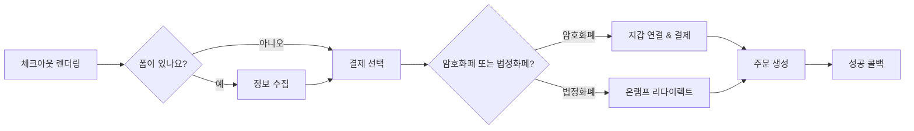

체크아웃 컴포넌트는 두 패널 레이아웃을 렌더링합니다: 한쪽에는 주문 요약, 다른 한쪽에는 결제가 있습니다. 이들은 암호화폐와 법정화폐, 사용자 정의 폼 필드, 배송 옵션, 할인 코드, 그리고 선택적인 B3 워크플로 트리거를 지원합니다. [실시간 보기](https://sdk-demo.anyspend.com/).

<Info>
  백엔드 주도, 세션 기반 플로우에 대한 **체크아웃 세션 REST API**는 [체크아웃 세션](/anyspend/checkout-sessions)을 참조하세요. 이 페이지는 **React 체크아웃 컴포넌트**를 다룹니다.
</Info>

## 작동 방식



## 빠른 시작

<Steps>
  <Step title="SDK 설치">
    ```bash
    npm install @b3dotfun/sdk
    ```
  </Step>
  <Step title="컴포넌트 임포트">
    ```tsx
    import { AnySpendCheckout } from "@b3dotfun/sdk/anyspend/react";
    ```
  </Step>
  <Step title="체크아웃 렌더링">
    ```tsx title="기본 체크아웃" icon="cart-shopping"
    <AnySpendCheckout
      recipientAddress="0xMerchantAddress..."
      destinationTokenAddress="0x833589fCD6eDb6E08f4c7C32D4f71b54bdA02913"
      destinationTokenChainId={8453}
      items={[
        {
          name: "프로 플랜 - 월간",
          description: "모든 기능에 대한 무제한 액세스",
          amount: "10000000", // 10 USDC (6자리 소수)
          quantity: 1,
        },
      ]}
      organizationName="Acme Inc"
      organizationLogo="/acme-logo.svg"
      themeColor="#4f46e5"
      onSuccess={(result) => {
        console.log("결제 완료:", result.orderId);
      }}
    />;
    ```
  </Step>
</Steps>

---

## 컴포넌트

### `<AnySpendCheckout>`

주요 체크아웃 컴포넌트는 주문 요약/장바구니 패널과 암호화폐 및 법정화폐 옵션을 지원하는 결제 패널로 구성된 두 패널 레이아웃을 렌더링합니다. 선택적으로 고객 정보 수집, 배송 선택, 할인 코드를 포함하는 폼 패널이 포함됩니다.

#### 핵심 속성

<ParamField path="recipientAddress" type="string" required>
  결제를 받을 상인 지갑 주소
</ParamField>

<ParamField path="destinationTokenAddress" type="string" required>
  결제에 사용될 토큰 계약 주소 (예: USDC)
</ParamField>

<ParamField path="destinationTokenChainId" type="number" required>
  결제에 사용될 체인 ID (예: `8453`은 Base용)
</ParamField>

<ParamField path="items" type="CheckoutItem[]" required>
  장바구니 패널에 표시될 항목
</ParamField>

#### 브랜딩

<ParamField path="organizationName" type="string">
  체크아웃 헤더에 표시될 상인 이름
</ParamField>

<ParamField path="organizationLogo" type="string">
  상인 로고의 URL
</ParamField>

<ParamField path="themeColor" type="string">
  테마 색상을 위한 16진수 색상 (예: `"#4f46e5"`)
</ParamField>

<ParamField path="buttonText" type="string">
  결제 버튼의 사용자 정의 텍스트
</ParamField>

#### 주문 요약

<ParamField path="totalAmount" type="string">
  항목 금액의 합계와 다를 때 총액을 재정의합니다 (예: 할인이나 수수료 후). wei 단위로 사용.
</ParamField>

<ParamField path="shipping" type="string | { amount: string; label?: string }">
  배송비. wei 단위의 문자열로 전달하거나 사용자 정의 레이블이 있는 객체로 전달.
</ParamField>

<ParamField path="tax" type="string | { amount: string; label?: string; rate?: string }">
  세금 금액. wei 단위의 문자열로 전달하거나 레이블과 선택적 비율 표시(예: `"8.5%"`)가 있는 객체로 전달.
</ParamField>

<ParamField path="discount" type="string | { amount: string; label?: string; code?: string }">
  할인 금액(공제로 표시됨). wei 단위의 문자열로 전달하거나 레이블과 선택적 코드가 있는 객체로 전달.
</ParamField>

<ParamField path="summaryLines" type="CheckoutSummaryLine[]">
  플랫폼 수수료, 팁 또는 서비스 요금과 같은 추가 요약 항목
</ParamField>

#### 결제

<ParamField path="defaultPaymentMethod" type="PaymentMethod">
  초기에 확장될 결제 방법. 옵션: `"crypto"`, `"coinbase"`, `"stripe"`.
</ParamField>

<ParamField path="senderAddress" type="string">
  지갑 연결 전 토큰 잔액을 표시하기 위해 발신자 주소를 미리 채움
</ParamField>

<ParamField path="checkoutSessionId" type="string">
  추적을 위해 백엔드 체크아웃 세션에 이 체크아웃을 연결
</ParamField>

#### 콜백

<ParamField path="onSuccess" type="(result: { txHash?: string; orderId?: string }) => void">
  결제 성공 시 호출됨
</ParamField>

<ParamField path="onError" type="(error: Error) => void">
  결제 오류 시 호출됨
</ParamField>

<ParamField path="returnUrl" type="string">
  결제 완료 후 리다이렉트할 URL
</ParamField>

<ParamField path="returnLabel" type="string">
  돌아가기/리다이렉트 버튼의 레이블
</ParamField>

#### 표시 옵션

<ParamField path="mode" type="'page' | 'embedded'" default="'page'">
  독립 실행형에는 `page`, 레이아웃 내 인라인에는 `embedded`
</ParamField>

<ParamField path="showPoints" type="boolean" default="false">
  주문 상태 요약에 획득한 포인트 표시
</ParamField>

<ParamField path="showOrderId" type="boolean" default="false">
  주문 상태 요약에 주문 ID 표시
</ParamField>

<ParamField path="footer" type="ReactNode | null">
  주문 요약의 사용자 정의 푸터. 기본 "Powered by" 푸터를 숨기려면 `null`을 전달.
</ParamField>

#### 사용자 정의

<ParamField path="slots" type="AnySpendSlots">
  UI 섹션 교체. [사용자 정의](/anyspend/customization#slots) 참조.
</ParamField>

<ParamField path="content" type="AnySpendContent">
  텍스트/메시지 재정의. [사용자 정의](/anyspend/customization#content) 참조.
</ParamField>

<ParamField path="theme" type="AnySpendTheme">
  색상 구성. [사용자 정의](/anyspend/customization#theme) 참조.
</ParamField>

<ParamField path="classes" type="AnySpendCheckoutClasses">
  CSS 클래스 재정의. [사용자 정의](/anyspend/customization#css-class-overrides) 참조.
</ParamField>

#### 사용자 정의 폼

체크아웃 중 고객 정보를 수집하기 위해 JSON 스키마 또는 사용자 정의 React 컴포넌트를 사용합니다.

<ParamField path="formSchema" type="CheckoutFormSchema">
  고객으로부터 수집할 필드를 정의하는 JSON 스키마(이메일, 이름, 주소 등). [CheckoutFormSchema](#checkoutformschema) 아래 참조.
</ParamField>

<ParamField path="formComponent" type="React.ComponentType<CheckoutFormComponentProps>">
  체크아웃 폼으로 렌더링할 사용자 정의 React 컴포넌트. `formSchema`가 충분히 유연하지 않을 때 사용합니다.
</ParamField>

<ParamField path="onFormSubmit" type="(data: Record<string, unknown>) => void">
  폼 데이터가 변경될 때 호출됩니다. 폼 데이터는 주문의 `callbackMetadata`에도 자동으로 포함됩니다.
</ParamField>

#### 배송 옵션

<ParamField path="shippingOptions" type="ShippingOption[]">
  라디오 버튼 선택기로 표시될 배송 옵션 배열. 선택된 옵션의 금액은 주문 총액에 자동으로 추가됩니다.
</ParamField>

<ParamField path="collectShippingAddress" type="boolean">
  `true`일 때, 배송 주소 폼(거리, 도시, 주, 우편번호, 국가)을 렌더링합니다. 주소는 주문의 `callbackMetadata`에 포함됩니다.
</ParamField>

<ParamField path="onShippingChange" type="(option: ShippingOption) => void">
  사용자가 배송 옵션을 선택할 때 호출됩니다
</ParamField>

#### 할인 코드

<ParamField path="enableDiscountCode" type="boolean">
  할인 코드 입력 필드를 표시합니다. `validateDiscount`가 설정되어 있어야 합니다.
</ParamField>

<ParamField path="validateDiscount" type="(code: string) => Promise<DiscountResult>">
  할인 코드를 백엔드에 대해 유효성 검사하는 비동기 함수입니다. 할인 금액이 포함된 `DiscountResult`를 반환합니다. 검증된 할인은 주문 총액에 자동으로 적용됩니다.
</ParamField>

<ParamField path="onDiscountApplied" type="(result: DiscountResult) => void">
  유효한 할인 코드가 적용될 때 호출됩니다
</ParamField>

---

### `<AnySpendCheckoutTrigger>`

`AnySpendCheckout`을 확장하여 B3 워크플로 통합을 제공합니다. 사용자가 결제를 완료하면 결제 데이터와 모든 사용자 정의 메타데이터와 함께 B3 워크플로가 자동으로 트리거됩니다.

```tsx title="워크플로와 함께하는 체크아웃" icon="bolt"
import { AnySpendCheckoutTrigger } from "@b3dotfun/sdk/anyspend/react";

<AnySpendCheckoutTrigger
  recipientAddress="0xMerchantAddress..."
  destinationTokenAddress="0x833589fCD6eDb6E08f4c7C32D4f71b54bdA02913"
  destinationTokenChainId={8453}
  items={[
    { name: "프로 플랜", amount: "10000000", quantity: 1 },
  ]}
  workflowId="wf_provision_subscription"
  orgId="org_acme"
  callbackMetadata={{
    inputs: {
      plan: "pro",
      userId: "user_123",
      email: "user@example.com",
    },
  }}
  onSuccess={(result) => console.log("워크플로 트리거됨:", result)}
/>;
```

#### 워크플로 속성

모든 `<AnySpendCheckout>` 속성이 지원되며, 추가로:

<ParamField path="workflowId" type="string">
  성공적인 결제에 트리거될 B3 워크플로 ID
</ParamField>

<ParamField path="orgId" type="string">
  워크플로를 소유한 조직 ID
</ParamField>

<ParamField path="callbackMetadata" type="object">
  주문에 병합된 메타데이터. `inputs` 필드는 워크플로에서 `{{root.result.inputs.*}}`를 통해 접근할 수 있습니다.
</ParamField>

<ParamField path="items" type="CheckoutItem[]">
  `AnySpendCheckoutTrigger`에 대해 선택 사항 — 생략하면 장바구니 없이 결제 패널만 표시됩니다.
</ParamField>

<ParamField path="totalAmount" type="string">
  `items`가 제공되지 않을 때 필요합니다(총액을 계산할 항목이 없기 때문).
</ParamField>

---

## 타입

### CheckoutItem

체크아웃 장바구니의 각 항목:

```typescript title="CheckoutItem" icon="code"
interface CheckoutItem {
  /** 항목의 고유 식별자 */
  id?: string;
  /** 항목 이름 */
  name: string;
  /** 짧은 설명 */
  description?: string;
  /** 항목 이미지 URL */
  imageUrl?: string;
  /** 목적지 토큰의 최소 단위(wei)로 된 가격 */
  amount: string;
  /** 수량 */
  quantity: number;
  /** 사용자 정의 메타데이터로 레이블: 값 쌍으로 표시됩니다 (예: { "Size": "Large" }) */
  metadata?: Record<string, string>;
}
```

### CheckoutSummaryLine

주문 요약의 추가 항목:

```typescript title="CheckoutSummaryLine" icon="code"
interface CheckoutSummaryLine {
  /** 표시 레이블 (예: "플랫폼 수수료", "팁") */
  label: string;
  /** wei 단위의 금액. 음수 값은 공제로 표시됩니다. */
  amount: string;
  /** 선택적 설명 또는 주석 */
  description?: string;
}
```

### CheckoutFormSchema

JSON 스키마를 사용하여 사용자 정의 폼 필드를 정의합니다:

```typescript title="CheckoutFormSchema" icon="code"
interface CheckoutFormSchema {
  fields: CheckoutFormField[];
}

interface CheckoutFormField {
  /** 고유 필드 식별자 */
  id: string;
  /** 필드 유형 */
  type: "text" | "email" | "phone" | "textarea" | "select" | "number" | "checkbox" | "address";
  /** 표시 레이블 */
  label: string;
  /** 자리 표시자 텍스트 */
  placeholder?: string;
  /** 필드가 필수인지 여부 */
  required?: boolean;
  /** 기본값 */
  defaultValue?: string;
  /** "select" 유형 필드의 옵션 */
  options?: { label: string; value: string }[];
  /** 유효성 검사 규칙 */
  validation?: {
    pattern?: string;
    minLength?: number;
    maxLength?: number;
    min?: number;
    max?: number;
  };
}
```

<Tip>
  `"address"` 필드 유형은 거리, 도시, 주
