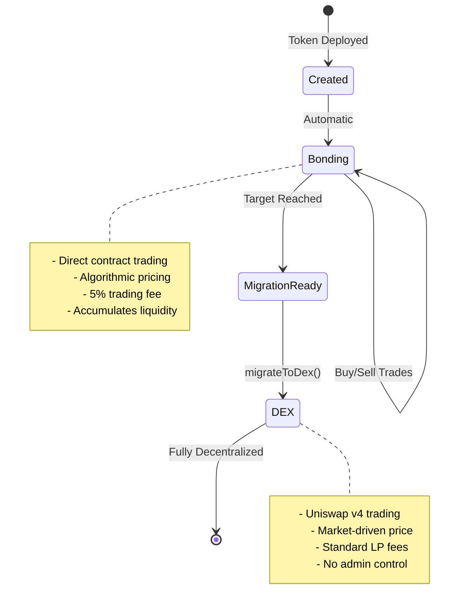
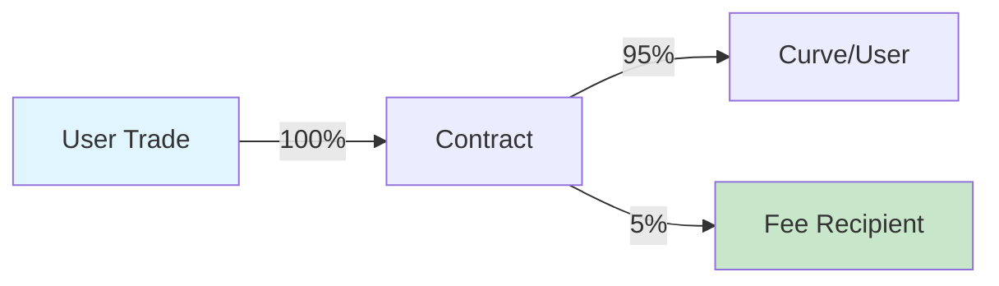

## 본딩 단계란?

본딩 단계는 토큰이 알고리즘 가격 곡선을 사용하여 스마트 계약에서 직접 구매 및 판매되는 초기 거래 기간입니다. 자동 시장 조성이 있는 분산형 사전 판매로 생각하십시오.



## 본딩 작동 방식

### 본딩 곡선 메커니즘

본딩 중에 계약은 유일한 시장 조성자로 작동합니다:

1. **주문장 없음**: 가격은 알고리즘적으로 결정됩니다
2. **즉시 유동성**: 항상 구매 또는 판매 가능
3. **경로 독립성**: 가격은 공급에만 의존하며, 이력에는 의존하지 않음
4. **자동 가격 책정**: 수동 가격 설정 필요 없음

## 거래 작업

### 토큰 구매

<Tabs>
  <Tab title="작동 방식">
    **프로세스 흐름:**
    1. 사용자가 ETH/B3를 계약에 보냄
    2. 계약이 곡선에 기반하여 토큰 계산
    3. 5% 수수료가 공제되어 수령인에게 전송
    4. 토큰이 발행되어 구매자에게 전송
    5. 곡선 상태 업데이트
    
    **코드 예시:**
    ```typescript
    // 먼저 견적을 받습니다
    const quote = await token.getAmountOfTokensToBuy(
      parseEther("1") // 1 ETH
    );
    console.log(`Will receive: ${formatEther(quote)} tokens`);
    
    // 슬리피지 보호와 함께 구매 실행
    const minTokens = quote * 0.95n; // 5% 슬리피지
    await token.buy(minTokens, "1");
    ```
  </Tab>
  
  <Tab title="파라미터">
    | Parameter | Type | Description |
    |-----------|------|-------------|
    | `minTokensOut` | uint256 | 받을 최소 토큰 (슬리피지 보호) |
    | `ethAmount` | string/uint256 | 사용할 ETH 양 |
    
    **중요 사항:**
    - 프론트러닝 방지를 위해 `minTokensOut` 설정
    - 활동이 적은 기간에만 `minTokensOut`을 0으로 사용
    - 슬리피지가 허용치를 초과하면 거래가 되돌아감
  </Tab>
  
  <Tab title="엣지 케이스">
    **목표 초과:**
    - 구매가 목표를 초과할 경우, 초과분은 환불됨
    - 예: 목표가 10 ETH, 모금액이 9.5 ETH
    - 사용자가 1 ETH를 보냄 → 0.5 ETH 사용, 0.5 ETH 환불
    
    **가스 부족:**
    - 권장 가스 한도: 200,000
    - 복잡한 계산은 더 많은 가스가 필요할 수 있음
    
    **제로 금액:**
    - 0 ETH로 거래하면 되돌아감
  </Tab>
</Tabs>

### 토큰 판매

<Tabs>
  <Tab title="작동 방식">
    **프로세스 흐름:**
    1. 사용자가 토큰 사용 승인
    2. 사용자가 판매량으로 sell 호출
    3. 계약이 곡선에 기반하여 ETH 계산
    4. 수익에서 5% 수수료 공제
    5. ETH가 판매자에게 전송, 토큰 소각
    6. 곡선 상태 업데이트 (가격 하락)
    
    **코드 예시:**
    ```typescript
    // 잔액 확인 및 견적 얻기
    const balance = await token.balanceOf(userAddress);
    const sellAmount = balance / 2n; // 절반 판매
    
    const quote = await token.getAmountOfEthToReceive(
      sellAmount
    );
    console.log(`Will receive: ${formatEther(quote)} ETH`);
    
    // 슬리피지 보호와 함께 판매 실행
    const minEth = quote * 0.95n; // 5% 슬리피지
    await token.sell(sellAmount, minEth);
    ```
  </Tab>
  
  <Tab title="파라미터">
    | Parameter | Type | Description |
    |-----------|------|-------------|
    | `tokenAmount` | uint256 | 판매할 토큰 양 |
    | `minEthOut` | uint256 | 받을 최소 ETH (슬리피지 보호) |
    
    **중요 사항:**
    - 판매 전 토큰 승인 필요
    - 대량 판매시 가격 영향이 클 수 있음
    - 유통 공급량보다 많이 판매할 수 없음
  </Tab>
  
  <Tab title="가격 영향">
    **판매 영향 이해하기:**
    
    판매는 곡선의 모금액을 줄여 가격을 떨어뜨림:
    
    | 판매 크기 | 가격 영향 | 회복 필요 |
    |-----------|--------------|-----------------|
    | 공급의 1% | ~1-2% | 소량 |
    | 공급의 5% | ~5-10% | 중간 |
    | 공급의 10% | ~15-25% | 상당 |
    | 공급의 20% | ~30-50% | 큼 |
    
    *실제 영향은 공격성 요소에 따라 다름*
  </Tab>
</Tabs>

## 수수료 구조

### 수수료 작동 방식



<AccordionGroup>
  <Accordion title="구매 수수료">
    **1 ETH 구매 시:**
    - 0.95 ETH가 본딩 곡선으로 감
    - 0.05 ETH가 수수료 수령인에게 감
    - 토큰은 0.95 ETH 가치로 계산됨
    
    **예시:**
    ```typescript
    // 사용자가 1 ETH를 보냄
    // 수수료: 0.05 ETH
    // 곡선이 받는 금액: 0.95 ETH
    // 0.95 ETH에 기반한 토큰 발행
    ```
  </Accordion>
  
  <Accordion title="판매 수수료">
    **1 ETH 가치로 판매 시:**
    - 사용자는 0.95 ETH를 받음
    - 0.05 ETH가 수수료 수령인에게 감
    - 곡선은 전체 1 ETH만큼 줄어듦
    
    **예시:**
    ```typescript
    // 곡선상의 토큰 가치가 1 ETH
    // 수수료: 0.05 ETH
    // 사용자가 받는 금액: 0.95 ETH
    // 곡선이 1 ETH만큼 줄어듦
    ```
  </Accordion>
  
  <Accordion title="수수료 분배">
    **수수료가 가는 곳:**
    - 지정된 `feeRecipient` 주소에 100%
    - 프로젝트 재무부, 개발자 또는 DAO가 될 수 있음
    - 토큰 생성 시 설정, 변경 불가
    
    **수수료 청구:**
    - 자동 - 청구 필요 없음
    - 각 거래시 직접 전송됨
    - 계약에 누적되지 않음
  </Accordion>
</AccordionGroup>

### 수수료 경제학

| 일일 거래량 | 수수료 수입 | 월간 수입 |
|-------------|------------|----------------|
| 10 ETH | 0.5 ETH | ~15 ETH |
| 50 ETH | 2.5 ETH | ~75 ETH |
| 100 ETH | 5 ETH | ~150 ETH |
| 500 ETH | 25 ETH | ~750 ETH |

## 목표 메커니즘

### 목표 이해하기

목표는 마이그레이션 전에 축적해야 하는 ETH/B3의 양입니다:

<Info>
  **목표의 목적:**
  - Uniswap v4에 충분한 유동성을 보장
  - 커뮤니티에 명확한 목표 제공
  - 조기 마이그레이션 방지
  - 본딩 중 모멘텀 구축
</Info>

### 목표에 접근하기

```typescript
// 목표에 대한 진행 상황 모니터링
async function trackProgress(token: BondkitToken) {
  const progress = await token.getBondingProgress();
  
  if (progress.progress < 0.5) {
    console.log("🌱 초기 단계 - 최고의 가격 가능");
  } else if (progress.progress < 0.8) {
    console.log("🚀 모멘텀 구축 중 - 구매 고려");
  } else if (progress.progress < 1.0) {
    console.log("🔥 거의 다 왔음 - 마이그레이션 임박");
  } else {
    console.log("✅ 목표 달성 - 마이그레이션 준비 완료!");
  }
  
  const remaining = progress.threshold - progress.raised;
  console.log(`Need ${formatEther(remaining)} more ETH`);
}
```

### 초과 처리

구매가 목표를 초과할 경우:

1. **부분 충족**: 필요한 양만 받아들임
2. **자동 환불**: 초과분은 같은 거래에서 반환됨
3. **공정 완료**: 끝에서 과다 지불할 수 없음

**예시 시나리오:**
```
목표: 100 ETH
현재: 99.5 ETH
사용자가 보낸 금액: 2 ETH

결과:
- 0.5 ETH 수락 (정확히 100 ETH 도달)
- 1.5 ETH 환불
- 사용자는 0.5 ETH에 대한 토큰을 받음
- 마이그레이션 가능
```

## 이벤트 및 모니터링

### 계약 이벤트

<Tabs>
  <Tab title="구매 이벤트">
    ```solidity
    event BondingCurveBuy(
        address indexed payer,
        address indexed recipient,
        uint256 tradingTokenIn,
        uint256 tokensOut,
        uint256 fee,
        uint256 totalRaisedBonding
    );
    ```
    
    **SDK에서 청취:**
    ```typescript
    token.onBuy((event) => {
      console.log({
        buyer: event.payer,
        ethSpent: formatEther(event.tradingTokenIn),
        tokensReceived: formatEther(event.tokensOut),
        feePaid: formatEther(event.fee),
        totalRaised: formatEther(event.totalRaisedBonding)
      });
    });
    ```
  </Tab>
  
  <Tab title="판매 이벤트">
    ```solidity
    event BondingCurveSell(
        address indexed seller,
        uint256 tokensIn,
        uint256 tradingTokenOut,
        uint256 fee,
        uint256 totalRaisedBonding
    );
    ```
    
    **SDK에서 청취:**
    ```typescript
    token.onSell((event) => {
      console.log({
        seller: event.seller,
        tokensSold: formatEther(event.tokensIn),
        ethReceived: formatEther(event.tradingTokenOut),
        feePaid: formatEther(event.fee),
        totalRaised: formatEther(event.totalRaisedBonding)
      });
    });
    ```
  </Tab>
</Tabs>

### 실시간 모니터링

```typescript
// 모니터링 설정 완료
class BondingMonitor {
  constructor(private token: BondkitToken) {}
  
  async start() {
    // 초기 상태
    const progress = await this.token.getBondingProgress();
    console.log(`Starting at ${(progress.progress * 100).toFixed(2)}%`);
    
    // 구매 모니터링
    this.token.onBuy(async (event) => {
      const newProgress = await this.token.getBondingProgress();
      console.log(`BUY: ${formatEther(event.tokensOut)} tokens`);
      console.log(`Progress: ${(newProgress.progress * 100).toFixed(2)}%`);
      
      if (newProgress.progress >= 1.0) {
        console.log("🎆 목표 달성! 마이그레이션 가능.");
      }
    });
    
    // 판매 모니터링
    this.token.onSell(async (event) => {
      const newProgress = await this.token.getBondingProgress();
      console.log(`SELL: ${formatEther(event.tokensIn)} tokens`);
      console.log(`Progress: ${(newProgress.progress * 100).toFixed(2)}%`);
    });
  }
}

// 사용법
const monitor = new BondingMonitor(token);
await monitor.start();
```

## 본딩 단계 전략

### 토큰 생성자를 위한 전략

<CardGroup cols={2}>
  <Card title="모멘텀 구축" icon="chart-line">
    - 낮은 공격성으로 시작 (30-50)
    - 달성 가능한 목표 설정
    - 커뮤니티를 일찍 참여시키기
    - 명확한 로드맵 제공
  </Card>
  
  <Card title="성공 극대화" icon="trophy">
    - 초기 유동성을 직접 조성
    - 구매 인센티브 생성
    - 발표 시기 잘 조절
    - 마이그레이션 후 계획
  </Card>
</CardGroup>

### 트레이더를 위한 전략

<CardGroup cols={2}>
  <Card title="진입 전략" icon="door-open">
    - 최고의 가격을 위해 초기에 구매
    - 큰 금액에 DCA 사용
    - 공격성 요소 모니터링
    - 목표 진행 상황 확인
  </Card>
  
  <Card title="위험 관리" icon="shield">
    - 항상 슬리피지 보호 사용
    - 가격 영향 이해
    - 목표 근처에서 FOMO하지 않기
    - 출구 전략 계획
  </Card>
</CardGroup>

## 본딩 전환 후

<Warning>
  **마이그레이션 후 중요 사항**
  
  `migrateToDex()`가 호출되면:
  - ❌
