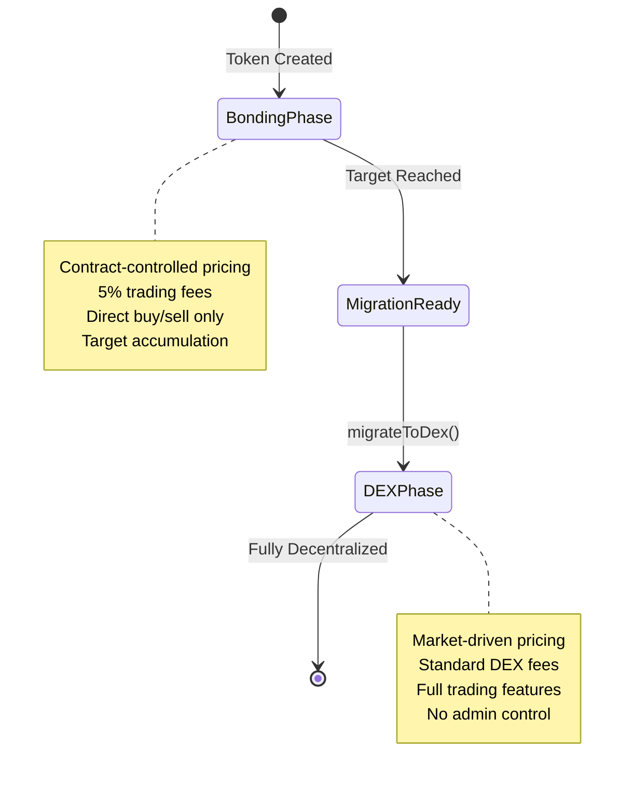

## DEX 단계란?

DEX 단계는 Bondkit 토큰의 생명주기의 최종 단계로, 거래가 자동 결합 곡선에서 완전히 분산된 Uniswap v4 풀로 전환됩니다. 이 단계는 마이그레이션 직후에 시작되며 완전한 분산화를 나타냅니다.



## 마이그레이션 작동 방식

### 전환 과정

목표에 도달한 후 `migrateToDex()`가 호출될 때:

1. **계약 상태**: 토큰 상태가 `TokenStatus.Dex`로 변경됩니다
2. **Uniswap v4 풀**: 축적된 유동성으로 새 풀 생성
3. **가격 초기화**: 결합 곡선 출구 가격에서 초기 풀 가격 계산
4. **소유권 포기**: 계약 소유권을 제로 주소로 이전
5. **거래 활성화**: 전체 DEX 거래가 즉시 시작됩니다

### 풀 구성

**자동 풀 설정:**
```typescript
// 마이그레이션에서 이러한 매개변수로 풀 생성 (from migration)
const poolConfig = {
  currency0: tradingToken < bondkitToken ? tradingToken : bondkitToken,
  currency1: tradingToken < bondkitToken ? bondkitToken : tradingToken,
  fee: 3000,        // 0.3% 표준 수수료
  tickSpacing: 60,  // 표준 tick 간격
  hooks: customHook // Bondkit 특정 후크
};
```

**초기 유동성:**
- **거래 토큰**: 결합 단계에서 축적된 모든 자금
- **Bondkit 토큰**: 출구 가격과 일치하는 계산된 양
- **LP 토큰**: 수수료 수령자와 소각/분배 사이에 분할

## DEX 단계에서의 거래

### 거래 옵션

**표준 DEX 거래:**
DEX 단계에서 Bondkit 토큰은 Uniswap v4 호환 인터페이스, DEX 집계기 또는 거래 플랫폼을 사용하여 거래할 수 있습니다.

**SDK 도우미 (선택 사항):**
필요한 경우 SDK는 간소화된 통합을 위해 `BondkitSwapService`를 제공합니다.

### 가격 발견 및 유동성

**시장 주도 가격 결정:**
- 더 이상 알고리즘 결합 곡선 없음
- 공급/수요에 의해 가격 결정
- 실시간 주문장 동역학
- 시장 변동성에 따름

**유동성 출처:**
```typescript
// 마이그레이션에서 초기 유동성
const migrationData = {
  tradingTokenLiquidity: "10.0",    // 결합에서 ETH/B3
  bondkitTokenLiquidity: "500000",  // 계산된 토큰 양
  initialPrice: "0.00002",          // 토큰당 가격
  totalValueLocked: "20.0"          // 결합된 TVL
};

// 추가 유동성 출처:
// - 커뮤니티 LP
// - 인센티브 프로그램  
// - 거래 수수료 축적
```

## 결합 단계와의 주요 차이점

### 거래 메커니즘

| 측면 | 결합 단계 | DEX 단계 |
|--------|--------------|-----------|
| **가격 결정** | 알고리즘 곡선 | 시장 공급/수요 |
| **유동성** | 무제한 (계약 발행) | 제한된 풀 유동성 |
| **수수료** | 수수료 수령자에게 5% | LP + 프로토콜에게 0.3% |
| **주문 유형** | 구매/판매만 가능 | 전체 DEX 기능 |
| **가격 영향** | 예측 가능한 곡선 | 유동성 깊이에 따름 |
| **MEV** | 해당 없음 | MEV에 따름 |

### 스마트 계약 변경

**상태 전환:**
```typescript
// 현재 단계 확인
const status = await token.getStatus();

if (status === TokenStatus.Dex) {
  // DEX 거래 방법 사용
  const swapService = new BondkitSwapService(tokenAddress);
  // ... DEX 거래 코드
} else if (status === TokenStatus.Bonding) {
  // 결합 곡선 방법 사용
  await token.buy(amount, minTokensOut);
}
```

**메소드 사용 가능 여부:**
- ✅ `token.buy()` / `token.sell()` - **사용 불가** (거부됨)
- ✅ `BondkitSwapService`를 통한 DEX 거래
- ✅ 표준 ERC20 기능 계속 사용 가능
- ✅ DEX 거래에 대한 이벤트 모니터링

## 고급 DEX 기능

### 사용자 정의 후크 통합

Uniswap v4에서 Bondkit 토큰은 향상된 기능을 위한 사용자 정의 후크를 포함합니다:

```typescript
// 후크 기능 (자동 적용)
const hookFeatures = {
  beforeSwap: "사용자 정의 수수료 계산",
  afterSwap: "분석 추적", 
  beforeAddLiquidity: "LP 보상",
  afterRemoveLiquidity: "출구 수수료 처리"
};
```

### 분석 및 모니터링

**실시간 데이터:**
```typescript
import TradingView from "@b3dotfun/sdk/bondkit/components/TradingView";

// DEX 데이터를 포함한 전문 차트
function DEXTradingInterface({ tokenAddress, tokenSymbol }) {
  return (
    <div className="space-y-6">
      {/* DEX 데이터를 포함한 가격 차트 */}
      <TradingView 
        tokenAddress={tokenAddress}
        tokenSymbol={tokenSymbol}
        className="h-96 w-full"
      />
      
      {/* 거래 인터페이스 */}
      <SwapInterface tokenAddress={tokenAddress} />
    </div>
  );
}
```

**사용 가능한 지표:**
- 실시간 가격 피드
- 24시간 거래량 및 변동  
- 유동성 깊이
- 역사적 OHLCV 데이터
- 거래 내역
- 홀더 분석

### 유동성 제공

**LP가 되기:**
```typescript
// Bondkit 토큰 풀에 유동성 추가
import { Pool, Position } from "@uniswap/v3-sdk";

const position = new Position({
  pool: bondkitPool,
  liquidity: targetLiquidity,
  tickLower: lowerTick,
  tickUpper: upperTick
});

// 거래 수수료 + 잠재적 인센티브 수익
```

**LP 혜택:**
- **거래 수수료**: 모든 스왑 볼륨의 0.3% 수익
- **인센티브 프로그램**: 잠재적 추가 보상
- **가격 상승**: 토큰 성장으로부터 혜택
- **임시 손실**: 표준 AMM 위험 적용

## 마이그레이션 영향 분석

### 토큰 홀더를 위한

**즉각적인 효과:**
- ✅ 토큰은 완전히 이전 가능
- ✅ 개방 시장에서 거래 가능
- ✅ 잠금 기간 없음
- ⚠️ 가격은 이제 시장 변동성에 따름
- ⚠️ 보장된 유동성 없음 (풀 깊이에 따라 다름)

**장기적인 이점:**
- 🚀 더 큰 거래 생태계 접근
- 🚀 DeFi 프로토콜과의 통합
- 🚀 다른 토큰과의 결합성
- 🚀 진정한 분산화 달성

### 프로젝트를 위한

**운영 변경:**
```typescript
// 마이그레이션 전: 직접 제어
await token.buy(amount, minOut);    // ✅ 작동
await token.migrateToDex();         // 일회성 조치

// 마이그레이션 후: 시장 기반
await token.buy(amount, minOut);    // ❌ 거부됨
await swapService.executeSwap(...); // ✅ 대신 이것을 사용
```

**새로운 책임:**
- **커뮤니티 구축**: 유기적 거래량 증가
- **유동성 인센티브**: LP 참여 장려  
- **마케팅**: 토큰 유틸리티와 채택 홍보
- **통합**: DEX 집계기 및 플랫폼에 상장

## DEX 단계를 위한 모범 사례

### 거래자를 위한

<AccordionGroup>
  <Accordion title="최적의 거래 전략">
    **슬리피지 관리:**
    - 소규모 거래에는 0.5-2% 슬리피지 사용
    - 큰 금액에는 더 높은 슬리피지
    - 실행 전 가격 영향 확인
    
    **시간 고려 사항:**
    - 활동 시간 동안 더 높은 유동성
    - 큰 LP 이동 모니터링
    - 가능할 때 리미트 주문 사용
    
    **예시:**
    ```typescript
    const quote = await swapService.getSwapQuote({
      // ... 매개변수
      slippageTolerance: parseFloat(quote.priceImpact) > 5 ? 0.02 : 0.005
    });
    ```
  </Accordion>
  
  <Accordion title="위험 관리">
    **유동성 분석:**
    - 큰 거래 전에 풀 TVL 확인
    - 유동성 제공자 활동 모니터링
    - LP인 경우 임시 손실 이해
    
    **가격 모니터링:**
    - 가격 알림 설정
    - 손절매 전략 사용
    - 여러 토큰에 걸쳐 다양화
  </Accordion>
</AccordionGroup>

### 개발자를 위한

<AccordionGroup>
  <Accordion title="통합 패턴">
    **상태 확인:**
    ```typescript
    async function getOptimalTradingMethod(token: BondkitToken) {
      const status = await token.getStatus();
      
      if (status === TokenStatus.Bonding) {
        return {
          method: "bonding",
          interface: token
        };
      } else if (status === TokenStatus.Dex) {
        return {
          method: "dex", 
          interface: new BondkitSwapService(token.contractAddress)
        };
      }
    }
    ```
    
    **오류 처리:**
    ```typescript
    try {
      // 항상 먼저 단계 확인
      const tradingMethod = await getOptimalTradingMethod(token);
      
      if (tradingMethod.method === "dex") {
        await tradingMethod.interface.executeSwap(params, wallet);
      }
    } catch (error) {
      if (error.message.includes("TradingDisabledDexPhaseActive")) {
        // DEX 거래로 전환
        const swapService = new BondkitSwapService(tokenAddress);
        await swapService.executeSwap(params, wallet);
      }
    }
    ```
  </Accordion>
</AccordionGroup>

## 자주 묻는 질문

<AccordionGroup>
  <Accordion title="토큰이 결합 단계로 돌아갈 수 있나요?">
    **아니요** - 마이그레이션은 영구적이며 되돌릴 수 없습니다. DEX 단계에 있으면 토큰은 항상 Uniswap v4에서 거래됩니다.
  </Accordion>
  
  <Accordion title="사용되지 않은 결합 곡선 유동성은 어떻게 되나요?">
    결합 단계에서 축적된 모든 거래 토큰은 출구 가격에서 계산된 bondkit 토큰과 함께 Uniswap v4 풀의 초기 유동성이 됩니다.
  </Accordion>
  
  <Accordion title="DEX 단계에서 제한 사항이 있나요?">
    제한 없음 - 토큰은 Uniswap v4에서 거래되는 표준 ERC20이 됩니다. 전체 DeFi 결합성이 활성화됩니다.
  </Accordion>
  
  <Accordion title="거래 수수료는 어떻게 다른가요?">
    DEX 단계는 수수료 수령자에게 5%의 결합 단계 수수료 대신 표준 Uniswap v4 수수료(0.3%)를 사용하며, 이는 유동성 제공자에게 갑니다.
  </Accordion>
</AccordionGroup>

## 다음 단계

<CardGroup cols={2}>
  <Card title="DEX 거래 시작" icon="arrow-right" href="/bondkit/sdk/reference#bondkitswapservice">
    DEX 거래를 위해 BondkitSwapService 사용 방법 알아보기
  </Card>
  <Card title="거래 차트 추가" icon="chart-line" href="/bondkit/sdk/reference#tradingview-component">  
    DEX 토큰을 위한 TradingView 차트 통합
  </Card>
  <Card title="LP가 되기" icon="coins" href="https://app.uniswap.org">
    유동성을 제공하고 거래 수수료를 벌기
  </Card>
  <Card title="분석 모니터링" icon="analytics" href="https://info.uniswap.org">
    토큰의 DEX 성능 추적  
  </Card>
</CardGroup>
