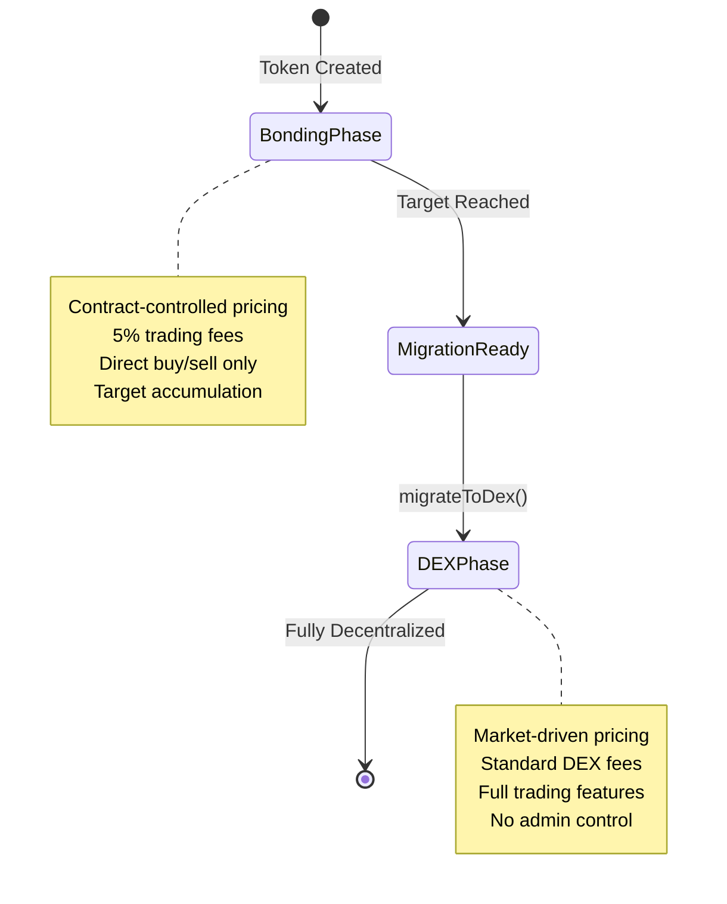

## DEX 단계란?

DEX 단계는 Bondkit 토큰의 수명주기에서 최종 단계로, 거래가 자동화된 본딩 곡선에서 완전히 분산된 Uniswap v4 풀로 전환됩니다. 이 단계는 마이그레이션 직후에 시작되며 완전한 분산화를 나타냅니다.


```mermaid
stateDiagram-v2
    [*] --> BondingPhase: Token Created
    BondingPhase --> MigrationReady: Target Reached
    MigrationReady --> DEXPhase: migrateToDex()
    DEXPhase --> [*]: Fully Decentralized
    
    note right of BondingPhase
        Contract-controlled pricing
        5% trading fees
        Direct buy/sell only
        Target accumulation
    end note
    
    note right of DEXPhase
        Market-driven pricing
        Standard DEX fees
        Full trading features
        No admin control
    end note
```

## 마이그레이션 작동 방식

### 전환 과정

목표에 도달한 후 `migrateToDex()`가 호출되면:

1. **계약 상태**: 토큰 상태가 `TokenStatus.Dex`로 변경됩니다.
2. **Uniswap v4 풀**: 축적된 유동성으로 새로운 풀 생성
3. **가격 초기화**: 본딩 곡선 출구 가격에서 초기 풀 가격 계산
4. **소유권 포기**: 계약 소유권을 제로 주소로 이전
5. **거래 활성화**: 전체 DEX 거래가 즉시 시작됩니다.

### 풀 구성

**자동 풀 설정:**
```typescript
// Pool is created with these parameters (from migration)
const poolConfig = {
  currency0: tradingToken < bondkitToken ? tradingToken : bondkitToken,
  currency1: tradingToken < bondkitToken ? bondkitToken : tradingToken,
  fee: 3000,        // 0.3% standard fee
  tickSpacing: 60,  // Standard tick spacing
  hooks: customHook // Bondkit-specific hooks
};
```

**초기 유동성:**
- **거래 토큰**: 본딩 단계에서 축적된 모든 자금
- **Bondkit 토큰**: 출구 가격과 일치하도록 계산된 양
- **LP 토큰**: 수수료 수령자와 소각/분배 사이에 분할

## DEX 단계에서의 거래

### 거래 옵션

**표준 DEX 거래:**
DEX 단계에서 Bondkit 토큰은 Uniswap v4 호환 인터페이스, DEX 집계기 또는 거래 플랫폼을 사용하여 거래할 수 있습니다.

**SDK 도우미 (선택사항):**
필요한 경우 SDK는 통합을 단순화하기 위해 `BondkitSwapService`를 제공합니다.

### 가격 발견 및 유동성

**시장 주도 가격 책정:**
- 더 이상 알고리즘 본딩 곡선 없음
- 공급/수요에 의해 가격 결정
- 실시간 주문장 동역학
- 시장 변동성에 따라 달라짐

**유동성 출처:**
```typescript
// Initial liquidity from migration
const migrationData = {
  tradingTokenLiquidity: "10.0",    // ETH/B3 from bonding
  bondkitTokenLiquidity: "500000",  // Calculated token amount
  initialPrice: "0.00002",          // Price per token
  totalValueLocked: "20.0"          // Combined TVL
};

// Additional liquidity from:
// - Community LPs
// - Incentive programs  
// - Trading fees accumulation
```

## 본딩 단계와의 주요 차이점

### 거래 메커니즘

| 측면 | 본딩 단계 | DEX 단계 |
|--------|--------------|-----------|
| **가격 책정** | 알고리즘 곡선 | 시장 공급/수요 |
| **유동성** | 무제한 (계약 민팅) | 제한된 풀 유동성 |
| **수수료** | 수수료 수령자에게 5% | LP 및 프로토콜에 0.3% |
| **주문 유형** | 구매/판매만 가능 | 전체 DEX 기능 |
| **가격 영향** | 예측 가능한 곡선 | 유동성 깊이에 따라 다름 |
| **MEV** | 적용되지 않음 | MEV에 따라 달라짐 |

### 스마트 계약 변경사항

**상태 전환:**
```typescript
// Check current phase
const status = await token.getStatus();

if (status === TokenStatus.Dex) {
  // Use DEX trading methods
  const swapService = new BondkitSwapService(tokenAddress);
  // ... DEX trading code
} else if (status === TokenStatus.Bonding) {
  // Use bonding curve methods
  await token.buy(amount, minTokensOut);
}
```

**메소드 사용 가능 여부:**
- ✅ `token.buy()` / `token.sell()` - **비활성화됨** (되돌림)
- ✅ DEX 거래는 `BondkitSwapService`를 통해 가능
- ✅ 표준 ERC20 기능 지속
- ✅ DEX 거래에 대한 이벤트 모니터링

## 고급 DEX 기능

### 사용자 정의 후크 통합

Uniswap v4에서 Bondkit 토큰은 향상된 기능을 위한 사용자 정의 후크를 포함합니다:

```typescript
// Hook features (automatically applied)
const hookFeatures = {
  beforeSwap: "Custom fee calculations",
  afterSwap: "Analytics tracking", 
  beforeAddLiquidity: "LP rewards",
  afterRemoveLiquidity: "Exit fee handling"
};
```

### 분석 및 모니터링

**실시간 데이터:**
```typescript
import TradingView from "@b3dotfun/sdk/bondkit/components/TradingView";

// Professional charts with DEX data
function DEXTradingInterface({ tokenAddress, tokenSymbol }) {
  return (
    <div className="space-y-6">
      {/* Price chart with DEX data */}
      <TradingView 
        tokenAddress={tokenAddress}
        tokenSymbol={tokenSymbol}
        className="h-96 w-full"
      />
      
      {/* Trading interface */}
      <SwapInterface tokenAddress={tokenAddress} />
    </div>
  );
}
```

**사용 가능한 지표:**
- 실시간 가격 피드
- 24시간 거래량 및 변화  
- 유동성 깊이
- 역사적 OHLCV 데이터
- 거래 내역
- 홀더 분석

### 유동성 제공

**LP가 되기:**
```typescript
// Add liquidity to Bondkit token pool
import { Pool, Position } from "@uniswap/v3-sdk";

const position = new Position({
  pool: bondkitPool,
  liquidity: targetLiquidity,
  tickLower: lowerTick,
  tickUpper: upperTick
});

// Earn trading fees + potential incentives
```

**LP 혜택:**
- **거래 수수료**: 모든 스왑 볼륨의 0.3%를 벌 수 있음
- **인센티브 프로그램**: 잠재적 추가 보상
- **가격 상승**: 토큰 성장으로부터 혜택
- **임시 손실**: 표준 AMM 위험 적용

## 마이그레이션 영향 분석

### 토큰 홀더에 대한

**즉각적인 효과:**
- ✅ 토큰은 완전히 이전 가능
- ✅ 개방 시장에서 거래 가능
- ✅ 락업 기간 없음
- ⚠️ 가격은 이제 시장 변동성에 따라 달라짐
- ⚠️ 보장된 유동성 없음 (풀 깊이에 따라 다름)

**장기적인 이점:**
- 🚀 더 큰 거래 생태계 접근
- 🚀 DeFi 프로토콜과의 통합
- 🚀 다른 토큰과의 조합성
- 🚀 진정한 분산화 달성

### 프로젝트에 대한

**운영 변경사항:**
```typescript
// Pre-migration: Direct control
await token.buy(amount, minOut);    // ✅ Works
await token.migrateToDex();         // One-time action

// Post-migration: Market-based
await token.buy(amount, minOut);    // ❌ Reverts
await swapService.executeSwap(...); // ✅ Use this instead
```

**새로운 책임:**
- **커뮤니티 구축**: 유기적 거래량 증가
- **유동성 인센티브**: LP 참여 장려  
- **마케팅**: 토큰 유틸리티와 채택 홍보
- **통합**: DEX 집계기 및 플랫폼에 상장

## DEX 단계를 위한 모범 사례

### 트레이더를 위한

<AccordionGroup>
  <Accordion title="최적의 거래 전략">
    **슬리피지 관리:**
    - 소규모 거래에는 0.5-2% 슬리피지 사용
    - 더 큰 금액에는 더 높은 슬리피지
    - 실행 전 가격 영향 확인
    
    **시간 고려사항:**
    - 활동 시간 동안 더 높은 유동성
    - 큰 LP 이동 모니터링
    - 가능할 때 제한 주문 사용
    
    **예시:**
    ```typescript
    const quote = await swapService.getSwapQuote({
      // ... parameters
      slippageTolerance: parseFloat(quote.priceImpact) > 5 ? 0.02 : 0.005
    });
    ```
  </Accordion>
  
  <Accordion title="위험 관리">
    **유동성 분석:**
    - 큰 거래 전에 풀 TVL 확인
    - 유동성 제공자 활동 모니터링
    - LP인 경우 임시 손실 이해
    
    **가격 모니터링:**
    - 가격 알림 설정
    - 손절매 전략 사용
    - 여러 토큰에 걸쳐 다양화
  </Accordion>
</AccordionGroup>

### 개발자를 위한

<AccordionGroup>
  <Accordion title="통합 패턴">
    **상태 확인:**
    ```typescript
    async function getOptimalTradingMethod(token: BondkitToken) {
      const status = await token.getStatus();
      
      if (status === TokenStatus.Bonding) {
        return {
          method: "bonding",
          interface: token
        };
      } else if (status === TokenStatus.Dex) {
        return {
          method: "dex", 
          interface: new BondkitSwapService(token.contractAddress)
        };
      }
    }
    ```
    
    **오류 처리:**
    ```typescript
    try {
      // Always check phase first
      const tradingMethod = await getOptimalTradingMethod(token);
      
      if (tradingMethod.method === "dex") {
        await tradingMethod.interface.executeSwap(params, wallet);
      }
    } catch (error) {
      if (error.message.includes("TradingDisabledDexPhaseActive")) {
        // Switch to DEX trading
        const swapService = new BondkitSwapService(tokenAddress);
        await swapService.executeSwap(params, wallet);
      }
    }
    ```
  </Accordion>
</AccordionGroup>

## 자주 묻는 질문

<AccordionGroup>
  <Accordion title="토큰이 본딩 단계로 돌아갈 수 있나요?">
    **아니요** - 마이그레이션은 영구적이며 되돌릴 수 없습니다. DEX 단계에 들어간 후에는 토큰이 항상 Uniswap v4에서 거래됩니다.
  </Accordion>
  
  <Accordion title="사용되지 않은 본딩 곡선 유동성은 어떻게 되나요?">
    본딩 단계에서 축적된 모든 거래 토큰은 출구 가격에서 계산된 bondkit 토큰과 함께 Uniswap v4 풀의 초기 유동성이 됩니다.
  </Accordion>
  
  <Accordion title="DEX 단계에서 제한 사항이 있나요?">
    제한 없음 - 토큰은 Uniswap v4에서 거래되는 표준 ERC20이 됩니다. 전체 DeFi 조합성이 활성화됩니다.
  </Accordion>
  
  <Accordion title="거래 수수료는 어떻게 다른가요?">
    DEX 단계는 수수료 수령자에게 5%를 주는 본딩 단계 수수료 대신 표준 Uniswap v4 수수료(0.3%)를 사용하며, 이는 유동성 제공자에게 갑니다.
  </Accordion>
</AccordionGroup>

## 다음 단계

<CardGroup cols={2}>
  <Card title="DEX 거래 시작" icon="arrow-right" href="/bondkit/sdk/reference#bondkitswapservice">
    DEX 거래를 위한 BondkitSwapService 사용 방법 알아보기
  </Card>
  <Card title="거래 차트 추가" icon="chart-line" href="/bondkit/sdk/reference#tradingview-component">  
    DEX 토큰을 위한 TradingView 차트 통합
  </Card>
  <Card title="LP가 되기" icon="coins" href="https://app.uniswap.org">
    유동성을 제공하고 거래 수수료를 벌기
  </Card>
  <Card title="분석 모니터링" icon="analytics" href="https://info.uniswap.org">
    토큰의 DEX 성능 추적  
  </Card>
</CardGroup>
