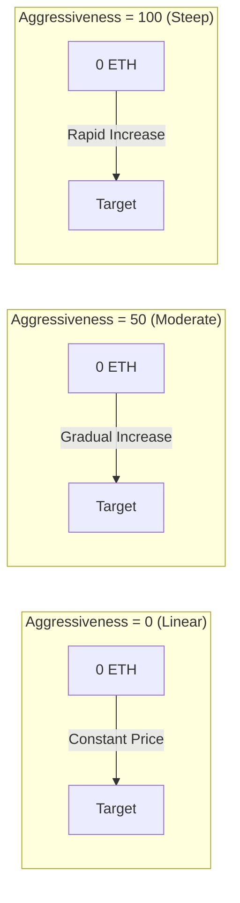

## 시각적 가격 곡선



## 본딩 곡선 모델

### 수학적 공식

<Note>
  **핵심 공식**
  ```
  S = S_final × (R / R_target)^exponent
  ```
  여기서:
  - `S` = 현재 토큰 공급량
  - `S_final` = 최종 토큰 공급량
  - `R` = 지금까지 모금된 금액
  - `R_target` = 목표 금액
  - `exponent = 1 / (1 + aggressivenessFactor/100)`
</Note>

### 지수 이해하기

공격성 지수는 가격 진행에 대한 지수의 영향을 어떻게 조절하는지 결정합니다:

| 공격성 | 지수 | 공식은 다음과 같아집니다 | 가격 행동 |
|---------------|----------|-----------------|----------------|
| 0 | 1.00 | S = S_final × (R/R_target) | 선형 - ETH당 일정한 토큰 |
| 25 | 0.80 | S = S_final × (R/R_target)^0.80 | 약간의 곡선 |
| 50 | 0.67 | S = S_final × (R/R_target)^0.67 | 중간 곡선 |
| 75 | 0.57 | S = S_final × (R/R_target)^0.57 | 가파른 곡선 |
| 100 | 0.50 | S = S_final × √(R/R_target) | 매우 가파른 곡선 (제곱근) |

### 가격 영향 예시

10 ETH 목표로 다른 단계에서 1 ETH가 구매하는 토큰 수를 살펴봅시다:

<Tabs>
  <Tab title="Aggressiveness = 0">
    **선형 가격 책정 (모두에게 공정)**
    
    | ETH 모금 | ETH당 토큰 수 | 가격 변화 |
    |------------|---------------|---------------|
    | 0 → 1 ETH | 100,000 | 기준선 |
    | 4 → 5 ETH | 100,000 | 0% |
    | 9 → 10 ETH | 100,000 | 0% |
    
    *모든 사람이 같은 조건을 받습니다*
  </Tab>
  
  <Tab title="Aggressiveness = 50">
    **중간 곡선 (균형)**
    
    | ETH 모금 | ETH당 토큰 수 | 가격 변화 |
    |------------|---------------|---------------|
    | 0 → 1 ETH | 146,000 | 기준선 |
    | 4 → 5 ETH | 87,000 | -40% |
    | 9 → 10 ETH | 51,000 | -65% |
    
    *초기 구매자는 늦은 구매자보다 3배 더 많이 받습니다*
  </Tab>
  
  <Tab title="Aggressiveness = 100">
    **가파른 곡선 (초기에 보상)**
    
    | ETH 모금 | ETH당 토큰 수 | 가격 변화 |
    |------------|---------------|---------------|
    | 0 → 1 ETH | 316,000 | 기준선 |
    | 4 → 5 ETH | 89,000 | -72% |
    | 9 → 10 ETH | 31,000 | -90% |
    
    *초기 구매자는 늦은 구매자보다 10배 더 많이 받습니다*
  </Tab>
</Tabs>

## 상호작용형 가격 계산기

```typescript
// 주어진 ETH 금액에 대해 받을 토큰 수 계산
function calculateTokensReceived(
  ethAmount: number,
  currentRaised: number,
  targetEth: number,
  totalSupply: number,
  aggressiveness: number
): number {
  const exponent = 1 / (1 + aggressiveness / 100);
  
  // 현재 모금된 금액에 대한 공급량 계산
  const currentSupply = totalSupply * 
    Math.pow(currentRaised / targetEth, exponent);
  
  // 구매 후 공급량 계산
  const newRaised = currentRaised + ethAmount;
  const newSupply = totalSupply * 
    Math.pow(newRaised / targetEth, exponent);
  
  // 받은 토큰 = 공급량 차이
  return newSupply - currentSupply;
}

// 예제 사용
const tokens = calculateTokensReceived(
  1,        // 1 ETH 구매
  5,        // 이미 모금된 5 ETH
  10,       // 10 ETH 목표
  1000000,  // 총 1M 공급량
  50        // 50% 공격성
);
console.log(`You'll receive ${tokens.toFixed(0)} tokens`);
```

## 공격성 지수 선택하기

### 결정 프레임워크

<CardGroup cols={3}>
  <Card title="낮음 (0-30)" icon="equals">
    **최적의 상황:**
    - 공정한 출시
    - 커뮤니티 토큰
    - 안정적인 가격
    
    **장점:**
    - 동등한 기회
    - 예측 가능한 비용
    - FOMO 감소
    
    **단점:**
    - 초기 인센티브 없음
    - 모멘텀 느림
  </Card>
  
  <Card title="중간 (30-70)" icon="chart-line">
    **최적의 상황:**
    - 대부분의 프로젝트
    - 균형잡힌 접근
    - 적당한 보상
    
    **장점:**
    - 일부 초기 이점
    - 여전히 접근 가능
    - 좋은 모멘텀
    
    **단점:**
    - 중간 복잡성
    - 일부 가격 변동
  </Card>
  
  <Card title="높음 (70-100)" icon="rocket">
    **최적의 상황:**
    - 하이프 출시
    - 초기 채택자 보상
    - 빠른 자금 모금
    
    **장점:**
    - 강력한 초기 인센티브
    - 긴급성 생성
    - 신봉자 보상
    
    **단점:**
    - 불공정해 보일 수 있음
    - 높은 가격 변동
    - FOMO 주도
  </Card>
</CardGroup>

## 판매 메커니즘

사용자가 곡선에 토큰을 되팔 때:

1. **가격 계산**: 구매 공식의 역을 사용
2. **수수료 공제**: 수익에서 5% 수수료 적용
3. **곡선 업데이트**: 총 모금 금액 감소
4. **가격 영향**: 큰 판매는 가격에 상당한 영향

### 판매 가격 공식

```typescript
// 판매하는 토큰에 대해 받을 ETH 계산
function calculateEthReceived(
  tokenAmount: number,
  currentSupply: number,
  currentRaised: number,
  targetEth: number,
  totalSupply: number,
  aggressiveness: number
): number {
  const exponent = 1 / (1 + aggressiveness / 100);
  
  // 판매 후 새로운 공급량 계산
  const newSupply = currentSupply - tokenAmount;
  
  // 해당하는 모금 금액 계산
  const supplyRatio = newSupply / totalSupply;
  const newRaised = targetEth * 
    Math.pow(supplyRatio, 1 / exponent);
  
  // 수수료 전 ETH (수익)
  const ethBeforeFees = currentRaised - newRaised;
  
  // 5% 수수료 적용
  return ethBeforeFees * 0.95;
}
```

## 경계 사례 및 한계

<Warning>
  **중요 고려 사항:**
  
  1. **환불**: 구매가 목표를 초과하면 초과 ETH가 환불됩니다
  2. **최소 금액**: 매우 작은 거래는 반올림으로 인해 되돌아갈 수 있습니다
  3. **최대 공급량**: `finalTokenSupply`를 초과할 수 없습니다
  4. **가격 한계**: 극도의 공격성은 가격 급등을 일으킬 수 있습니다
  5. **미끄러짐**: 항상 `minTokensOut`을 사용하여 보호하세요
</Warning>

## 실제 사례

### 사례 연구: 공정 출시 토큰
- **공격성**: 10
- **목표**: 50 ETH
- **결과**: 거의 선형 가격, 커뮤니티가 공정함을 높이 평가함

### 사례 연구: 하이프 토큰
- **공격성**: 85
- **목표**: 100 ETH
- **결과**: 2시간 만에 목표 달성, 초기 구매자는 8배의 이득

### 사례 연구: 균형잡힌 프로젝트
- **공격성**: 45
- **목표**: 25 ETH
- **결과**: 3일 동안의 꾸준한 성장, 초기 구매자는 2.5배의 이점

## 다음 단계

<CardGroup cols={2}>
  <Card title="공격성 설정" icon="sliders" href="/bondkit/guides/set-aggressiveness">
    올바른 요소를 선택하는 방법 배우기
  </Card>
  <Card title="가격 추정" icon="calculator" href="/bondkit/guides/est-migration-price">
    이주 가격 추정하기
  </Card>
</CardGroup>
