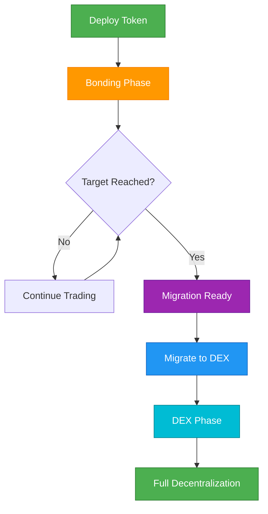

## 개요

이 가이드는 초기 생성부터 완전한 분산화에 이르기까지 Bondkit 토큰의 전체 수명주기를 안내합니다. 이 흐름을 이해하는 것은 성공적인 토큰 출시와 관리에 필수적입니다.



## 단계 1: 토큰 생성

### 배포 전 계획

<AccordionGroup>
  <Accordion title="파라미터 선택">
    **중요 결정사항:**
    
    | 파라미터 | 영향 | 권장사항 |
    |-----------|---------|----------------|
    | **finalTokenSupply** | 생성된 총 토큰 수 | 일반적으로 1M-100M 토큰 |
    | **aggressivenessFactor** | 가격 곡선의 가파름 | 균형 있는 출시를 위해 30-60 |
    | **targetAmount** | 이주 임계값 | 5-50 거래 토큰 |
    | **tradingToken** | 사용자가 지불하는 것 | Base 메인넷에 B3 사용 |
    
    **예시 구성:**
    ```typescript
    const tokenConfig = {
      name: "MyToken",
      symbol: "MTK",
      finalTokenSupply: parseEther("10000000"), // 10M 토큰
      aggressivenessFactor: 45, // 중간 곡선
      targetAmount: parseEther("20"), // 20 B3 토큰
      tradingToken: "0xB3B32F9f8827D4634fE7d973Fa1034Ec9fdDB3B3"
    };
    ```
  </Accordion>
  
  <Accordion title="수수료 구조 설정">
    **수수료 분배 전략:**
    
    ```typescript
    const feeConfig = {
      feeRecipient: "0x...", // 당신의 재무/팀 주소
      lpSplitRatioFeeRecipientBps: 2000n, // 수수료 수령자에게 20%
      // 나머지 80%는 이주 후 LP 토큰이 됨
    };
    ```
    
    **수수료 흐름:**
    - **본딩 단계**: 모든 거래의 5% → `feeRecipient`
    - **이주 후**: 0.3% 거래 수수료 → LP 제공자
  </Accordion>
</AccordionGroup>

### 배포 실행

```typescript
import { BondkitTokenFactory } from "@b3dotfun/sdk/bondkit";
import { base } from "viem/chains";

// 1. 팩토리 초기화
const factory = new BondkitTokenFactory(
  base.id,
  process.env.WALLET_PRIVATE_KEY
);

// 2. 전체 구성으로 배포
const tokenAddress = await factory.deployBondkitToken({
  // 토큰 메타데이터
  name: "MyToken",
  symbol: "MTK",
  
  // 경제학
  finalTokenSupply: parseEther("10000000"),
  aggressivenessFactor: 45,
  targetAmount: parseEther("20"),
  
  // 수수료 구조  
  feeRecipient: process.env.TREASURY_ADDRESS,
  lpSplitRatioFeeRecipientBps: 2000n,
  
  // 관리자 & 이주
  migrationAdminAddress: process.env.ADMIN_ADDRESS,
  
  // Uniswap V4 구성
  bondingPhaseSplitter: "0x2AB69e0d9D20D3700466153D84a6574128154Fd2",
  v4PoolManager: "0x498581fF718922c3f8e6A244956aF099B2652b2b",
  v4Hook: "0xB36f4A2FB18b745ef8eD31452781a463d2B3f0cC",
  v4PoolFee: 3000,
  v4TickSpacing: 60,
  tradingToken: "0xB3B32F9f8827D4634fE7d973Fa1034Ec9fdDB3B3"
});

console.log(`✅ 토큰 배포됨: ${tokenAddress}`);
```

## 단계 2: 본딩 단계 관리

### 출시 전략

<Tabs>
  <Tab title="커뮤니티 구축">
    **출시 전 체크리스트:**
    - [ ] Basescan에서 토큰 계약 검증
    - [ ] 커뮤니티 채널 구축 (Discord/Telegram)  
    - [ ] 마케팅 자료 준비
    - [ ] 초기 구매 전략 계획
    - [ ] 가격 추적 대시보드 준비
    
    **출시일:**
    ```typescript
    // 토큰에 연결
    const token = new BondkitToken(tokenAddress, privateKey);
    
    // 가격 확립을 위한 초기 구매
    await token.buy(parseEther("1"), 0n); // 1 B3 토큰
    
    // 실제 데이터로 출시 발표
    const price = await token.getCurrentPrice();
    const progress = await token.getBondingProgress();
    
    console.log(`🚀 ${formatEther(price)} B3 당 토큰으로 출시됨`);
    console.log(`🎯 이주까지 ${(progress.progress * 100).toFixed(1)}% 진행`);
    ```
  </Tab>
  
  <Tab title="진행 상황 모니터링">
    **핵심 지표 대시보드:**
    ```typescript
    async function getDashboardData(token) {
      const [
        tokenDetails,
        currentPrice, 
        progress,
        totalSupply,
        status
      ] = await Promise.all([
        token.getTokenDetails(),
        token.getCurrentPrice(),
        token.getBondingProgress(), 
        token.getTotalSupply(),
        token.currentStatus()
      ]);
      
      return {
        // 토큰 정보
        name: tokenDetails.name,
        symbol: tokenDetails.symbol,
        
        // 경제학
        currentPrice: formatEther(currentPrice),
        progress: (progress.progress * 100).toFixed(2) + '%',
        raised: formatEther(progress.raised),
        target: formatEther(progress.threshold),
        remaining: formatEther(progress.threshold - progress.raised),
        
        // 공급
        circulatingSupply: formatEther(totalSupply),
        
        // 상태
        phase: status === 1 ? '본딩' : status === 2 ? 'DEX' : '기타'
      };
    }
    
    // 대시보드에서 사용
    const data = await getDashboardData(token);
    ```
  </Tab>
  
  <Tab title="커뮤니티 참여">
    **실시간 업데이트:**
    ```typescript
    // 커뮤니티 업데이트를 위한 이벤트 모니터링 설정
    token.onBuy((event) => {
      const announcement = `
        🟢 새 구매: ${formatEther(event.tokensOut)} ${symbol}
        💰 지출: ${formatEther(event.ethIn)} B3
        👤 구매자: ${event.buyer}
      `;
      
      // Discord/Telegram 봇에 게시
      postToDiscord(announcement);
    });
    
    token.onSell((event) => {
      const announcement = `
        🔴 판매: ${formatEther(event.tokensIn)} ${symbol}
        💰 수령: ${formatEther(event.ethOut)} B3  
        👤 판매자: ${event.seller}
      `;
      
      postToDiscord(announcement);
    });
    
    // 진행 상황 마일스톤
    const progress = await token.getBondingProgress();
    if (progress.progress >= 0.5 && progress.progress < 0.6) {
      postToDiscord("🎯 50% 자금 조달됨! 이주까지 절반 완료!");
    } else if (progress.progress >= 0.9) {
      postToDiscord("🔥 90% 자금 조달됨! 이주 임박!");
    }
    ```
  </Tab>
</Tabs>

### 본딩 곡선 관리

**건강한 본딩 단계 지표:**
- 안정적인 거래량
- 성장하는 보유자 기반  
- 활발한 커뮤니티 참여
- 목표 달성을 향한 진행 (하지만 너무 빠르지 않게)
- 큰 규모의 매도 최소화

**경고 신호:**
- 24시간 이상 거래 활동 없음
- 단일 고래가 큰 비율을 제어
- 커뮤니티 없이 빠른 목표 달성
- 봇에 의한 과도한 변동성

## 단계 3: 이주 준비

### 이주 전 체크리스트

```typescript
async function checkMigrationReadiness(token) {
  const [canMigrate, progress, status] = await Promise.all([
    token.canMigrate(),
    token.getBondingProgress(),
    token.currentStatus()
  ]);
  
  const checks = {
    targetReached: canMigrate,
    progressComplete: progress.progress >= 1.0,
    stillBondingPhase: status === 1,
    communityReady: await checkCommunityConsensus(), // 당신의 로직
    liquidityPlan: await checkPostMigrationPlan()     // 당신의 로직
  };
  
  const allReady = Object.values(checks).every(Boolean);
  
  return {
    ready: allReady,
    checks,
    recommendation: allReady ? 
      "✅ 이주 준비 완료!" : 
      "⏳ 이주 전 문제 해결"
  };
}
```

### 이주 타이밍 전략

<AccordionGroup>
  <Accordion title="최적 타이밍">
    **모범 사례:**
    - 이주를 24-48시간 전에 발표
    - 커뮤니티의 활동이 높은 시간 선택
    - 충분한 커뮤니티 합의 확보
    - 이주 후 마케팅 준비
    
    **이주 전 발표:**
    ```typescript
    const migrationData = await token.getMigrationData();
    
    const announcement = `
      🚀 이주 예정
      
      📊 최종 본딩 통계:
      • 조달된 자금: ${formatEther(progress.raised)} B3
      • 분배된 토큰: ${formatEther(totalSupply)}
      
      🔄 이주로 생성될 것:
      • 초기 LP: ${formatEther(migrationData.ethForLp)} B3 + 토큰
      • 개시 가격: ~${calculateOpeningPrice(migrationData)} B3/토큰
      
      ⏰ 24시간 후 이주!
    `;
    ```
  </Accordion>
  
  <Accordion title="이주 실행">
    **이주 과정:**
    ```typescript
    // 최종 확인
    const readiness = await checkMigrationReadiness(token);
    if (!readiness.ready) {
      throw new Error(`준비되지 않음: ${JSON.stringify(readiness.checks)}`);
    }
    
    // 이주 실행
    console.log("🔄 Uniswap V4로 이주 시작...");
    const migrationTx = await token.migrateToDex();
    
    // 확인 대기
    const receipt = await token.waitForTransaction(migrationTx);
    
    if (receipt.status === 'success') {
      console.log("✅ 이주 성공!");
      
      // 새 상태 확인
      const newStatus = await token.currentStatus();
      console.log(`상태: ${newStatus === 2 ? 'DEX 단계' : '알 수 없음'}`);
      
      // 커뮤니티에 발표
      const announcement = `
        🎉 이주 완료!
        
        📍 이제 Uniswap V4에서 거래
        🔗 거래: ${migrationTx}
        💫 토큰이 이제 완전히 분산화됨!
      `;
      
      postToDiscord(announcement);
    }
    ```
  </Accordion>
</AccordionGroup>

## 단계 4: DEX 단계 운영

### 이주 직후 (첫 24시간)

```typescript
// DEX 거래 도구 초기화
import { BondkitSwapService } from "@b3dotfun/sdk/bondkit";

const swapService = new BondkitSwapService(tokenAddress);

// DEX 기능 검증
const isSwapAvailable = await token.isSwapAvailable();
if (isSwapAvailable) {
  console.log("✅ DEX 거래 활성화됨");
  
  // 스왑 견적 테스트
  const quote = await swapService.getSwapQuote({
    tokenIn: "0xB3B32F9f8827D4634fE7d973Fa1034Ec9fdDB3B3",
    tokenOut: tokenAddress,
    amountIn: "1",
    tokenInDecimals: 18,
    tokenOutDecimals: 18,
    slippageTolerance: 0.005,
    recipient: testAddress
  });
  
  console.log(`DEX 가격: ${quote.executionPrice} B3 당 토큰`);
}
```

### 장기 DEX 전략

<Tabs>
  <Tab title="유동성 관리">
    **초기 유동성 분석:**
    ```typescript
    async function analyzeLiquidity() {
      // 풀 정보 가져오기 (설정에 따라 다름)
      const poolData = await getUniswapV4PoolData(tokenAddress);
      
      return {
        totalValueLocked: poolData.tvl,
        tradingVolume24h: poolData.volume24h,
        priceImpactFor1k: await calculatePriceImpact(1000),
        liquidityUtilization: poolData.utilization,
        
        recommendations: {
          needsMoreLiquidity: poolData.tvl < minimumTVL,
          shouldIncentivize: poolData.utilization > 0.8,
          healthyTrading: poolData.volume24h > minimumVolume
        }
      };
    }
    ```
    
    **유동성 인센티브 프로그램:**
    ```typescript
    // 예시 LP 보상 구조
    const lpIncentives = {
      rewardToken: tokenAddress,
      dailyRewards: parseEther("1000"), // 하루에 1000 토큰
      minimumLPTime: 7 * 24 * 3600, // 최소 7일
      bonusMultipliers: {
        week1: 2.0,  // 첫 주 2배 보상
        month1: 1.5, // 첫 달 1.5배 보상
        longTerm: 1.0 // 그 후 표준 보상
      }
    };
    ```
  </Tab>
  
  <Tab title="커뮤니티 전환">
    **교육 콘텐츠:**
    ```typescript
    const migrationGuideForUsers = {
      trading: {
        before: "token.buy() 및 token.sell() 사용",
        after: "DEX 인터페이스 또는 swapService.executeSwap() 사용",
        walletSetup: "MetaMask에 토큰 추가, Uniswap 인터페이스 사용"
      },
      
      benefits: {
        moreFeatures: "한도 주문, 고급 거래 도구",
        composability: "다른 DeFi 프로토콜과 사용 가능", 
        decentralization: "남은 관리자 제어 없음"
      },
      
      risks: {
        priceVolatility: "시장 주도 가격, 변동성 있을 수 있음",
        liquidityRisk: "큰 거래는 가격에 영향을 줄 수 있음",
        smartContractRisk: "표준 DeFi 위험 적용"
      }
    };
    ```
    
    **커뮤니티 리소스:**
    - 업데이트된 문서
    - 거래 튜토리얼 비디오  
    - DEX 인터페이스 통합 가이드
    - 유동성 제공 튜토리얼
  </Tab>
  
  <Tab title="모니터링 및 분석">
    **DEX 단계 대시보드:**
    ```typescript
    async function getDEXPhaseMetrics(tokenAddress) {
      return {
        // 가격 및 거래량
        currentPrice: await getCurrentDEXPrice(tokenAddress),
        volume24h: await get24hVolume(tokenAddress),
        priceChange24h: await getPriceChange24h(tokenAddress),
        
        // 유동성
        totalLiquidity: await getTotalLiquidity(tokenAddress),
        lpTokenHolders: await getLPHolderCount(tokenAddress),
        
        // 거래
        transactions24h: await getTransactionCount24h(tokenAddress),
        uniqueTraders24h: await getUniqueTraders24h(tokenAddress),
        avgTradeSize: await getAvgTradeSize(tokenAddress),
        
        // 건강 지표
        liquidityUtilization: await getLiquidityUtilization(tokenAddress),
        priceImpact1k: await getPriceImpact(tokenAddress, 1000),
        holderDistribution: await getHolderDistribution(tokenAddress)
      };
    }
    ```
    
    **자동화된 모니터링:**
    ```typescript
    // 중요 이벤트에 대한 알림 설정
    const monitoringConfig = {
      priceAlerts: {
        change24h: 20, // 가격 변화 >20% 시 알림
        volume: 10000, // 거래량이 임계값을 초과하면 알림
        liquidity: 5000 // TVL이 임계값 아래로 떨어지면 알림
      },
      
      actions: {
        onLowLiquidity: () => announceIncentiveProgram(),
        onHighVolatility: () => checkForManipulation(),
        onTradingHalt: () => investigateIssues()
      }
    };
    ```
  </Tab>
</Tabs>
