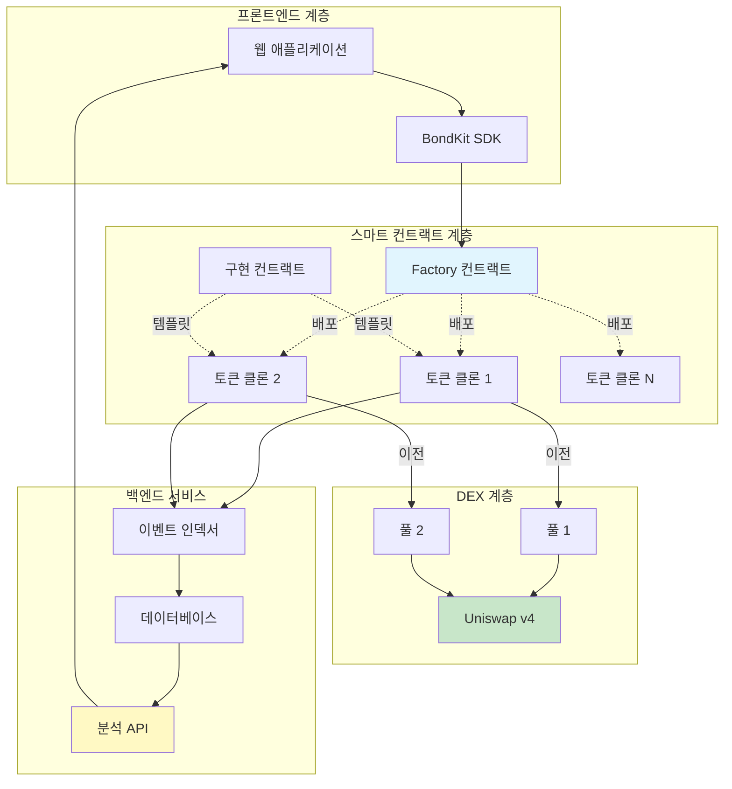

## 아키텍처 개요



## 제품 흐름 상세

<Steps>
  <Step title="단계 1: 토큰 생성">
    **발생하는 일:**
    - 사용자가 Factory 컨트랙트에서 `deployBondkitToken()` 호출
    - Factory가 최소 프록시 패턴을 사용하여 구현 컨트랙트를 복제
    - 새 토큰이 사용자 정의 매개변수로 초기화됨
    - 토큰이 자동으로 본딩 단계로 진입
    
    **가스 비용:** ~200,000 가스 (전체 배포보다 90% 저렴)
    **시간:** ~15초
  </Step>
  
  <Step title="단계 2: 본딩 커브 거래">
    **발생하는 일:**
    - 사용자가 직접 컨트랙트에서 토큰을 사고 팜
    - 가격은 알고리즘 본딩 커브를 따름: `S = S_final × (R/R_target)^exponent`
    - 모든 거래에 대해 5% 수수료가 수수료 수령인에게 지급됨
    - 컨트랙트는 목표에 도달할 때까지 견적 자산(ETH/B3)을 축적
    - 백엔드가 모든 거래를 분석을 위해 색인 생성
    
    **거래 메커니즘:**
    - 구매: ETH/B3을 보내고 현재 커브 가격에 토큰을 받음
    - 판매: 토큰을 보내고 수수료를 제외한 ETH/B3을 받음
    - 목표를 초과할 구매 시 자동 환불
    
    **기간:** 목표 도달까지 (몇 시간에서 몇 주)
  </Step>
  
  <Step title="단계 3: DEX 마이그레이션">
    **발생하는 일:**
    - 관리자가 목표 도달 시 `migrateToDex()` 호출
    - 컨트랙트가 공정한 시장 가격을 `sqrtPriceX96`로 계산
    - Uniswap v4 풀을 생성하고 초기화
    - 축적된 유동성을 풀로 이전
    - 소유권을 제로 주소로 포기
    - 토큰이 표준 ERC20으로 DEX 거래 가능
    
    **마이그레이션 후:**
    - 본딩 커브 영구 비활성화
    - 모든 거래는 Uniswap v4를 통해 이루어짐
    - 관리자 제어권 없음
    - 완전한 탈중앙화 달성
    
    **가스 비용:** ~500,000 가스
    **시간:** ~30초
  </Step>
</Steps>

## 시스템 구성요소

### 스마트 컨트랙트

<AccordionGroup>
  <Accordion title="🏭 Factory 컨트랙트">
    **목적:** 새로운 본드 토큰을 효율적으로 배포
    
    **주요 기능:**
    - `deployBondkitToken()` - 새 토큰 클론 생성
    - `getImplementationAddress()` - 템플릿 주소 반환
    - `setAllowedQuoteAsset()` - 자산을 화이트리스트에 추가하는 관리자 기능
    
    **가스 최적화:**
    - EIP-1167 최소 프록시 패턴 사용
    - 모든 토큰에 걸쳐 로직 공유
    - 개별 배포 대비 ~90% 가스 절약
  </Accordion>
  
  <Accordion title="📜 구현 컨트랙트">
    **목적:** 모든 본드 토큰의 템플릿
    
    **핵심 기능:**
    - ERC20 표준 준수
    - 본딩 커브 수학
    - Uniswap v4로의 마이그레이션 로직
    - 수수료 분배 시스템
    
    **상태 전환:**
    1. 초기화되지 않음 → 본딩 단계
    2. 본딩 단계 → 마이그레이션 준비
    3. 마이그레이션 준비 → DEX 단계
  </Accordion>
  
  <Accordion title="🪙 토큰 클론">
    **목적:** 개별 토큰 인스턴스
    
    **라이프사이클:**
    - 팩토리를 통해 생성됨
    - 고유 매개변수로 초기화됨
    - 자체 본딩 커브 관리
    - 자체적으로 Uniswap v4로 마이그레이션
    
    **저장소:**
    - 토큰 메타데이터(이름, 심볼)
    - 공급 및 분배
    - 본딩 커브 상태
    - 마이그레이션 매개변수
  </Accordion>
</AccordionGroup>

### 백엔드 서비스

<AccordionGroup>
  <Accordion title="🔍 이벤트 인덱서">
    **목적:** 모든 온체인 활동 캡처
    
    **모니터링:**
    - 토큰 생성
    - 구매/판매 거래
    - 마이그레이션 이벤트
    - 전송 활동
    
    **기술:**
    - 실시간 블록체인 스캐닝
    - 이벤트 로그 처리
    - 데이터베이스 동기화
  </Accordion>
  
  <Accordion title="📊 분석 엔진">
    **목적:** 원시 데이터를 통찰력으로 처리
    
    **생성:**
    - OHLCV 캔들스틱 데이터
    - 거래량 메트릭
    - 유동성 추적
    - 가격 이력
    - 사용자 통계
    
    **업데이트:** 매 블록마다 (~2초)
  </Accordion>
  
  <Accordion title="🌐 REST API">
    **목적:** 프론트엔드에 데이터 제공
    
    **엔드포인트:**
    - `/tokens` - 모든 토큰 나열
    - `/tokens/{address}` - 토큰 세부 정보
    - `/tokens/{address}/transactions` - 거래 내역
    - `/tokens/{address}/ohlcv` - 차트 데이터
    - `/users/{address}/portfolio` - 사용자 보유
    
    **형식:** 페이지네이션을 포함한 JSON
  </Accordion>
</AccordionGroup>

### 사용자 역할

| 역할 | 책임 | 권한 |
|------|-----------------|-------------|
| **생성자** | 토큰 배포, 매개변수 설정, 마이그레이션 시작 | 마이그레이션까지 전체 제어 |
| **트레이더** | 본딩 중 구매/판매, DEX에서 거래 | 표준 거래 권리 |
| **수수료 수령인** | 거래 수수료 수령 | 수동 수입만 |
| **마이그레이션 관리자** | 준비가 되면 마이그레이션 실행 | 일회성 마이그레이션 권리 |
| **LP 제공자** | (마이그레이션 후) Uniswap에 유동성 추가 | 표준 LP 권리 |

## 기술적 심층 분석

### 본딩 커브 수학

본딩 커브는 공급에 기반하여 토큰 가격을 결정합니다:

```
가격 공식:
S = S_final × (R / R_target)^exponent

여기서:
- S = 현재 토큰 공급
- S_final = 최종 토큰 공급
- R = 모금액 (ETH/B3)
- R_target = 목표액
- exponent = 1 / (1 + aggressivenessFactor/100)
```

**예제 계산:**

| 공격성 | 지수 | 가격 행동 |
|---------------|----------|----------------|
| 0 | 1.00 | 선형 (일정한 가격) |
| 25 | 0.80 | 부드러운 커브 |
| 50 | 0.67 | 중간 커브 |
| 75 | 0.57 | 가파른 커브 |
| 100 | 0.50 | 매우 가파른 (제곱근) |

### 마이그레이션 가격 계산

Uniswap v4로 마이그레이션할 때, 컨트랙트는:

1. **본딩 커브에서 출구 가격 계산**
2. **sqrtPriceX96** 형식으로 변환:
   ```
   sqrtPriceX96 = sqrt(price) × 2^96
   ```
3. **이 가격으로 풀 초기화**
4. **축적된 자금을 사용하여 유동성 추가**

### 가스 최적화 기법

<Info>
  **최소 프록시 패턴 (EIP-1167)**
  
  각 토큰에 대해 전체 컨트랙트 코드를 배포하는 대신:
  - 하나의 구현 컨트랙트 배포 (600KB)
  - 아주 작은 프록시 컨트랙트 배포 (각 45바이트)
  - 프록시가 구현에 모든 호출을 위임
  - 결과: 배포당 90% 가스 절약
</Info>

## 구성 매개변수

### 토큰 생성 매개변수

| 매개변수 | 유형 | 범위/형식 | 영향 |
|-----------|------|--------------|--------|
| `name` | 문자열 | 1-50자 | 토큰 표시 이름 |
| `symbol` | 문자열 | 2-10자 | 거래 심볼 |
| `finalTokenSupply` | uint256 | > 0 | 총 발행 가능 토큰 |
| `aggressivenessFactor` | uint8 | 0-100 | 커브 가파름 |
| `targetEth` | uint256 | > 0 | 마이그레이션 임계값 |
| `feeRecipient` | 주소 | 유효한 주소 | 수수료 수령 |
| `lpSplitRatioFeeRecipientBps` | uint256 | 0-10000 | LP 수수료 분배 (기준점) |
| `migrationAdminAddress` | 주소 | 유효한 주소 | 마이그레이션 트리거 가능 |

### 런타임 매개변수

| 액션 | 매개변수 | 유효성 검사 |
|--------|------------|------------|
| 구매 | `minTokensOut`, `ethAmount` | 슬리피지 보호 |
| 판매 | `tokenAmount`, `minEthOut` | 잔액 확인, 슬리피지 |
| 마이그레이션 | 없음 | 목표 도달, 관리자만 |

### 시스템 상수

| 상수 | 값 | 설명 |
|----------|-------|-------------|
| 거래 수수료 | 5% | 모든 거래에 적용 |
| 소수점 | 18 | 표준 ERC20 소수점 |
| 최소 목표 | 0.1 ETH | 최소 실행 가능 목표 |
| 최대 공격성 | 100 | 최대 커브 요소 |

## 보안 고려사항

<Warning>
  **중요 보안 기능:**
  
  1. **소유권 포기**: 마이그레이션 후 자동
  2. **발행 기능 없음**: 생성 시 공급량 고정
  3. **변경 불가능한 매개변수**: 배포 후 변경 불가
  4. **감사된 컨트랙트**: 전문적으로 검토된 코드
  5. **관리자 백도어 없음**: 진정한 탈중앙화
  6. **슬리피지 보호**: 구매/판매 기능에 내장
  7. **오버플로우 보호**: 안전한 수학 사용
</Warning>

## 실패 시나리오 및 처리

| 시나리오 | 시스템 반응 |
|----------|----------------|
| 목표 초과 구매 | 부분 채우기, 초과 환불 |
| 판매를 위한 불충분한 유동성 | 트랜잭션 되돌림 |
| 목표 전 마이그레이션 | 트랜잭션 되돌림 |
| 비관리자 마이그레이션 시도 | 트랜잭션 되돌림 |
| 이중 마이그레이션 시도 | 트랜잭션 되돌림 |
| 제로 주소 작업 | 트랜잭션 되돌림 |

## 다음 단계

<CardGroup cols={2}>
  <Card title="가격 메커니즘" icon="chart-line" href="/bondkit/concepts/pricing">
    본딩 커브 수학 이해하기
  </Card>
  <Card title="마이그레이션 가이드" icon="rocket" href="/bondkit/guides/migration">
    마이그레이션
