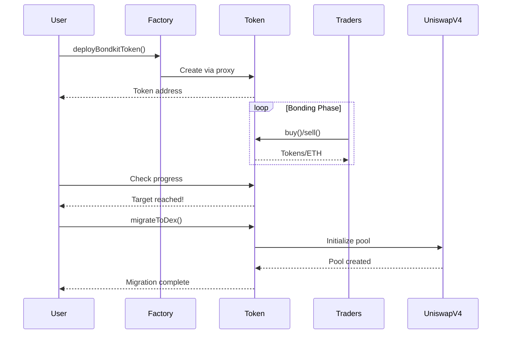

## 개요

이 빠른 시작 가이드는 5분 이내에 BondKit 토큰의 전체 라이프사이클을 안내합니다. 다음을 배울 수 있습니다:

1. **배포** 새로운 채권 토큰
2. **거래** 본딩 단계 동안
3. **모니터링** 목표 달성 진행 상황
4. **마이그레이션** Uniswap v4로

<Info>
  **사전 요구 사항**: [설치](/bondkit/installation)를 완료했고 Base에 자금이 있는 지갑이 있는지 확인하세요.
</Info>

## 전체 흐름 다이어그램



## 1단계: 토큰 배포하기

### 기본 배포

```typescript
import { BondkitTokenFactory } from "@b3dotfun/sdk/bondkit";
import { base } from "viem/chains";
import { parseEther } from "viem";

// 팩토리 초기화
const factory = new BondkitTokenFactory(
  base.id, 
  process.env.WALLET_PRIVATE_KEY
);

// 토큰 배포
const tokenAddress = await factory.deployBondkitToken({
  // 토큰 메타데이터
  name: "My Awesome Token",
  symbol: "MAT",
  
  // 공급 설정 (100만 토큰)
  finalTokenSupply: parseEther("1000000"),
  
  // 본딩 곡선 설정
  aggressivenessFactor: 35,  // 0-100, 높을수록 곡선이 가파름
  targetEth: parseEther("10"), // 마이그레이션을 위한 10 ETH 목표
  
  // 수수료 설정
  feeRecipient: "0x742d35Cc6634C0532925a3b844Bc9e7595f0bEb1", // 당신의 주소
  lpSplitRatioFeeRecipientBps: 1000n, // 수수료 수령인에게 10%
  
  // 마이그레이션 설정
  migrationAdminAddress: "0x742d35Cc6634C0532925a3b844Bc9e7595f0bEb1",
  uniswapV2RouterAddress: "0x4752ba5DBc23f44D87826276BF6Fd6b1C372aD24" // V4 라우터
});

console.log("✅ 토큰 배포됨:", tokenAddress);
```

### 파라미터 이해하기

<ParamField path="finalTokenSupply" type="bigint" required>
  토큰의 총 공급량 (18자리 소수). 예: `parseEther("1000000")`은 100만 토큰.
</ParamField>

<ParamField path="aggressivenessFactor" type="number" required>
  본딩 곡선의 가파름을 조절 (0-100):
  - **0-30**: 선형 가격, 모든 구매자에게 공정
  - **30-60**: 중간 곡선, 균형잡힌 접근
  - **60-100**: 공격적, 초기 구매자에게 보상
</ParamField>

<ParamField path="targetEth" type="bigint" required>
  마이그레이션을 활성화하기 위해 필요한 ETH 양. 10 ETH를 위해 `parseEther("10")` 사용.
</ParamField>

<ParamField path="feeRecipient" type="address" required>
  거래 수수료를 받는 주소 (모든 거래의 5%).
</ParamField>

<ParamField path="lpSplitRatioFeeRecipientBps" type="bigint" required>
  LP 수수료 분할의 기준점 (1/100의 1%). 1000 = 10%.
</ParamField>

## 2단계: 본딩 단계 동안 거래하기

### 토큰 인스턴스 초기화

```typescript
import { BondkitToken } from "@b3dotfun/sdk/bondkit";
import { parseEther, formatEther } from "viem";

// 배포된 토큰에 연결
const token = new BondkitToken(
  tokenAddress, 
  process.env.WALLET_PRIVATE_KEY
);
```

### 토큰 구매하기

```typescript
// 먼저 가격 견적을 받습니다
const ethAmount = parseEther("1"); // 1 ETH
const expectedTokens = await token.getAmountOfTokensToBuy(ethAmount);

console.log(`1 ETH로 구매할 수 있는 토큰: ${formatEther(expectedTokens)} 토큰`);

// 구매 실행
const buyTx = await token.buy(
  0n,    // minTokensOut (0 = 어떤 양이든 수락, 슬리피지 보호용)
  "1"    // ETH 양을 문자열로
);

console.log("구매 완료! Tx:", buyTx);
```

### 토큰 판매하기

```typescript
// 토큰 잔액 확인
const balance = await token.getBalance(userAddress);
console.log(`당신의 잔액: ${formatEther(balance)} 토큰`);

// 판매 견적 받기
const tokensToSell = parseEther("1000");
const expectedEth = await token.getAmountOfEthToReceive(tokensToSell);

console.log(`1000 토큰을 판매하면 반환될 것: ${formatEther(expectedEth)} ETH`);

// 판매 실행
const sellTx = await token.sell(
  tokensToSell,  // 판매할 토큰 양
  0n             // 최소 ETH 출력 (슬리피지 보호용)
);

console.log("판매 완료! Tx:", sellTx);
```

### 진행 상황 모니터링

```typescript
// 본딩 진행 상황 확인
const progress = await token.getBondingProgress();

console.log(`
  진행 상황: ${(progress.progress * 100).toFixed(2)}%
  모금: ${formatEther(progress.raised)} ETH
  목표: ${formatEther(progress.threshold)} ETH
  남은 양: ${formatEther(progress.threshold - progress.raised)} ETH
`);

// 현재 토큰 가격 확인
const currentPrice = await token.getCurrentPrice();
console.log(`현재 가격: ${formatEther(currentPrice)} ETH 당 토큰`);

// 마이그레이션이 가능한지 확인
const canMigrate = await token.canMigrate();
console.log(`마이그레이션 준비 완료: ${canMigrate}`);
```

### 이벤트 모니터링

```typescript
// 구매 이벤트 듣기
token.onBuy((event) => {
  console.log("새로운 구매:", {
    buyer: event.buyer,
    ethIn: formatEther(event.ethIn),
    tokensOut: formatEther(event.tokensOut)
  });
});

// 판매 이벤트 듣기
token.onSell((event) => {
  console.log("새로운 판매:", {
    seller: event.seller,
    tokensIn: formatEther(event.tokensIn),
    ethOut: formatEther(event.ethOut)
  });
});
```

## 3단계: Uniswap v4로 마이그레이션

### 마이그레이션 준비 상태 확인

```typescript
// 목표가 달성되었는지 확인
const progress = await token.getBondingProgress();

if (progress.progress >= 1.0) {
  console.log("✅ 목표 달성! 마이그레이션 준비 완료.");
  
  // 마이그레이션 세부 정보 받기
  const migrationData = await token.getMigrationData();
  console.log("풀 생성을 위한 마이그레이션:", {
    ethLiquidity: formatEther(migrationData.ethForLp),
    tokenLiquidity: formatEther(migrationData.tokensForLp),
    initialPrice: formatEther(migrationData.sqrtPriceX96)
  });
} else {
  console.log(`⏳ 필요한 ETH 더: ${formatEther(progress.threshold - progress.raised)}`);
}
```

### 마이그레이션 실행

```typescript
// 마이그레이션 관리자만 이를 호출할 수 있습니다
if (await token.isMigrationAdmin(userAddress)) {
  console.log("🚀 Uniswap v4로 마이그레이션 시작...");
  
  const migrationTx = await token.migrateToDex();
  console.log("마이그레이션 트랜잭션:", migrationTx);
  
  // 확인을 기다립니다
  const receipt = await token.waitForTransaction(migrationTx);
  
  if (receipt.status === "success") {
    console.log("✅ 마이그레이션 완료!");
    console.log("Uniswap v4 풀 주소:", await token.getPoolAddress());
  }
} else {
  console.log("❌ 마이그레이션은 마이그레이션 관리자만 실행할 수 있습니다");
}
```

<Warning>
  **중요**: 마이그레이션 후:
  - 계약 소유권은 자동으로 포기됩니다
  - 본딩 곡선 거래는 영구적으로 비활성화됩니다
  - 모든 거래는 Uniswap v4로 이동합니다
  - 추가 관리자 조치는 불가능합니다
</Warning>

## 전체 예제

전체 라이프사이클을 보여주는 완전한 작동 예제입니다:

```typescript
import { 
  BondkitTokenFactory, 
  BondkitToken 
} from "@b3dotfun/sdk/bondkit";
import { base } from "viem/chains";
import { parseEther, formatEther } from "viem";

async function launchToken() {
  // 1. 토큰 배포
  const factory = new BondkitTokenFactory(
    base.id,
    process.env.WALLET_PRIVATE_KEY
  );
  
  const tokenAddress = await factory.deployBondkitToken({
    name: "Demo Token",
    symbol: "DEMO",
    finalTokenSupply: parseEther("1000000"),
    aggressivenessFactor: 50,
    targetEth: parseEther("5"),
    feeRecipient: process.env.WALLET_ADDRESS,
    lpSplitRatioFeeRecipientBps: 1000n,
    migrationAdminAddress: process.env.WALLET_ADDRESS,
    uniswapV2RouterAddress: "0x4752ba5DBc23f44D87826276BF6Fd6b1C372aD24"
  });
  
  console.log("토큰 배포됨:", tokenAddress);
  
  // 2. 본딩 동안 거래
  const token = new BondkitToken(
    tokenAddress,
    process.env.WALLET_PRIVATE_KEY
  );
  
  // 일부 토큰 구매
  await token.buy(0n, "0.5");
  console.log("0.5 ETH로 토큰 구매됨");
  
  // 진행 상황 확인
  const progress = await token.getBondingProgress();
  console.log(`진행 상황: ${(progress.progress * 100).toFixed(2)}%`);
  
  // 3. 목표가 달성될 때까지 거래 계속...
  // (실제 상황에서는 다른 사용자들이 거래할 것입니다)
  
  // 4. 준비되면 마이그레이션
  if (progress.progress >= 1.0) {
    await token.migrateToDex();
    console.log("마이그레이션 완료! 토큰은 이제 Uniswap v4에 있습니다");
  }
}

launchToken().catch(console.error);
```

## 다음 단계

<CardGroup cols={2}>
  <Card title="개념" icon="book" href="/bondkit/concepts/bonding-phase">
    본딩 곡선과 가격 책정에 대한 심층 탐구
  </Card>
  <Card title="SDK 참조" icon="code" href="/bondkit/sdk/reference">
    사용 가능한 모든 메서드 탐색
  </Card>
  <Card title="가이드" icon="compass" href="/bondkit/guides/choose-quote-asset">
    고급 전략 배우기
  </Card>
  <Card title="데모 앱" icon="desktop" href="https://github.com/b3dotfun/b3-monorepo/tree/main/apps/bondkit-demo">
    완전한 구현 보기
  </Card>
</CardGroup>
