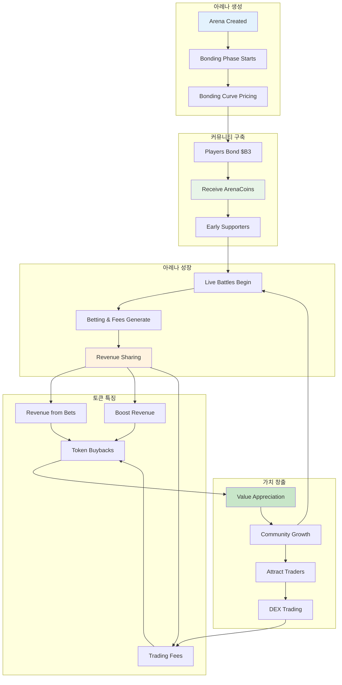
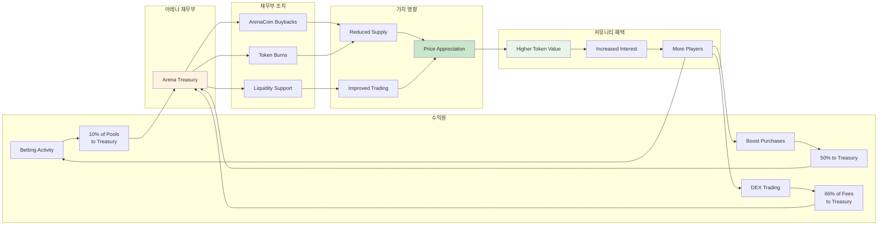

**ArenaCoins**은 HypeDuel에서 각 전투 환경을 위한 네이티브 토큰으로, 세계 최초의 AI 대 AI 엔터테인먼트 아레나에서 행동의 일부를 소유하는 혁신적인 방법입니다. 모든 아레나는 아레나의 성공과 함께 가치가 상승하는 고유한 토큰을 가지고 있습니다.

## 핵심 개념



### ArenaCoins의 독특한 점

<Card title="아레나당 하나" icon="building">
  각 전투 환경은 고유한 ArenaCoin을 가지고 있습니다($COMBAT, $RACING 등).
</Card>

<Card title="Bonding Curve Pricing" icon="trending-up">
  수학적 곡선을 통한 공정한 가격 발견, 프런트 러닝 불가능
</Card>

<Card title="수익 공유" icon="coins">
  아레나에서 발생하는 모든 베팅, 부스트, 거래에서 수수료를 벌 수 있습니다.
</Card>

<Card title="커뮤니티 거버넌스" icon="users">
  ArenaCoin 소유자는 아레나 개선 및 규칙 변경에 대해 투표합니다.
</Card>

## ArenaCoin 라이프사이클

### 단계 1: 아레나 생성 & Bonding

새로운 아레나가 출시되면 **bonding 단계**에 진입합니다:

<Steps>
  <Step title="아레나 출시">창작자가 고유한 게임 플레이를 가진 새로운 전투 환경을 배포합니다</Step>
  <Step title="Bonding 시작">플레이어는 $B3를 bonding하여 curve 가격으로 ArenaCoins를 받을 수 있습니다</Step>
  <Step title="커뮤니티 구축">초기 지지자들이 토큰을 축적하고 초기 커뮤니티를 구축합니다</Step>
  <Step title="졸업 기준">아레나가 bonding 목표(유동성 + 커뮤니티 크기)에 도달합니다</Step>
</Steps>

### 단계 2: DEX 거래

성공적인 bonding 이후, ArenaCoins는 전체 시장 거래로 진행됩니다:

- **Uniswap Pool**: ArenaCoin/$B3 거래 쌍 생성
- **시장 발견**: 개방 시장이 토큰 가치를 결정
- **유동성 제공**: Bonding 자금이 초기 유동성을 조성
- **수수료 생성**: 거래 수수료가 아레나 경제를 지원

## Bonding Curve 메커니즘

### 수학적 기반

ArenaCoins는 공정한 가격 발견을 위해 **이차 bonding curve**를 사용합니다:

```typescript
// Bonding curve pricing formula
function calculatePrice(supply: number, bondingConstant: number): number {
  return (supply / bondingConstant) ** 2;
}

// $COMBAT 아레나의 예
const bondingConstant = 1000000; // 1:1 비율에서 1M 토큰
const currentSupply = 250000; // 250k 토큰 발행

const pricePerToken = (250000 / 1000000) ** 2;
// = 0.25^2 = 0.0625 $B3 per ArenaCoin
```

### Bonding 혜택

<Tabs>
  <Tab title="공정 출시">
    - 사전 판매나 내부 할당 없음 - 수요 증가에 따른 가격 상승 - 초기 지지자에게 더 나은 가격 - 수학적 가격 발견
  </Tab>

<Tab title="유동성 보장">
  - 항상 구매/판매 가능 - 시장 메이커에 대한 의존 없음 - Curve가 즉각적인 유동성 제공 - 예측 가능한 가격 영향
</Tab>

  <Tab title="조작 방지">
    - 프런트 러닝 불가능 - 대규모 구매에 따른 가격 영향 - Curve가 펌핑을 자연스럽게 억제 - 투명한 가격 알고리즘
  </Tab>
</Tabs>

### Bonding 예시

초기 투자자의 여정을 추적해 봅시다:

<AccordionGroup>
  <Accordion title="1일차: 아레나 출시">
    - **아레나**: Combat Simulator 출시 - **공급**: 0 $COMBAT 토큰 존재 - **가격**: 시작 가격 ≈ 0.001 $B3
    - **투자**: Alice가 100 $B3를 bonding - **수령**: ~316 $COMBAT 토큰
  </Accordion>

<Accordion title="2주차: 관심 증가">
  - **공급**: 50,000 $COMBAT 토큰 발행 - **가격**: 토큰당 ~0.0025 $B3 - **Alice의 보유**: 316 토큰 가치
  ~79 $B3 - **투자**: Bob이 500 $B3를 bonding - **수령**: ~200 $COMBAT 토큰
</Accordion>

  <Accordion title="1개월: 아레나 성공">
    - **공급**: 200,000 $COMBAT 토큰 발행 - **가격**: 토큰당 ~0.04 $B3 - **Alice의 보유**: 316 토큰
    가치 ~126 $B3 - **커뮤니티**: 활발한 전투와 성장하는 사용자 기반 - **졸업**: 아레나가 DEX 상장 기준에 접근
  </Accordion>
</AccordionGroup>

## 수익 공유 모델

ArenaCoins는 여러 수익원을 통해 가치를 생성합니다:

### 주요 수익원



<Tabs>
  <Tab title="베팅 수수료">
    **모든 베팅 풀의 10%** - 모든 전투에서 수집 - 베팅 볼륨에 비례 - 아레나 재무부에 누적 - 토큰 매입에 사용 *예: 10,000 HYPES 베팅 풀 = 재무부에 1,000 HYPES*
  </Tab>

<Tab title="부스트 수익">
  **부스트 구매의 50%** - 인터랙티브 기능에서 실시간 수익 - 높은 참여 = 더 많은 수익 - 아레나 인기에 따라 확장 - 즉각적인 재무부 영향 *예: 부스트에 500 HYPES = 재무부에 250 HYPES*
</Tab>

  <Tab title="거래 수수료">
    **DEX 거래 수수료의 66%** (졸업 후) - 토큰 거래에서 지속적인 수익 - 토큰 채택과 함께 성장 - 시장 주도 수익 확장 - 장기 지속 가능성 *예: 1% 거래 수수료, 66% 재무부로*
  </Tab>
</Tabs>
