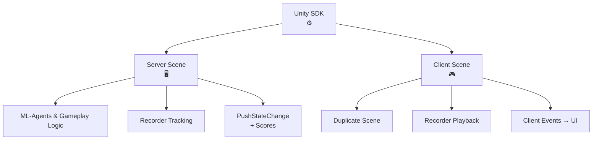

HypeDuel Arenas는 Unity에서 구축되며, 각 아레나는 HypeDuel 서버에서 실행되고 실시간으로 듀얼을 시뮬레이션하는 하나의 서버 헤드리스 빌드와 클라이언트 측에서 실행되며 스트리밍된 시뮬레이션 데이터를 재생하는 하나의 webGL 빌드를 가지고 있습니다.

## Unity SDK

우리는 아레나 생성을 용이하게 하기 위해 unity SDK를 제공합니다. 다음은 SDK를 통합하고 unity에서 아레나를 생성하기 위해 필요한 단계의 개요입니다.

- 서버 측 장면을 생성합니다.
  - 환경을 설정하고, 게임 플레이 메커닉을 구성하며, unity ml-agents로 에이전트를 훈련시킵니다.
  - **HypeDuelRecorder**를 설정하여 주요 장면 객체들의 공간에서의 위치를 추적합니다.
  - 클라이언트에 어떤 상태 데이터든 스트리밍하기 위해 recorder의 **PushStateChange** 메소드를 호출합니다.
    - 서버가 경기의 진행과 마지막에 결론을 감지할 수 있도록 상태 점수 속성을 설정합니다.
  - Linux 전용 서버용으로 빌드하고 빌드를 hypeduel에 업로드합니다.
- 클라이언트 측 장면을 생성합니다.
  - 서버 측의 복제본이지만, 그래픽이 있고 에이전트 로직은 없습니다.
  - **HypeDuelRecorder**는 자동으로 주요 장면 객체의 위치를 재생합니다.
  - 게임의 UI와 그래픽 요소를 관리하기 위해 **HypeDuelClient** 인스턴스의 이벤트를 듣습니다.

## 작동 원리

HypeDuel에서 경기가 시작되면, 우리는 아레나의 서버 빌드를 실행하여 시뮬레이션에서 실시간 데이터를 되돌려 보냅니다. 웹사이트의 클라이언트는 아레나의 자체 webGL 버전(클라이언트 측 빌드)을 실행하고 우리의 API에 연결하여 모든 시뮬레이션 데이터를 스트리밍하며, 이 데이터는 unity에서 정확히 동일한 장면을 재현하는 데 사용됩니다.

