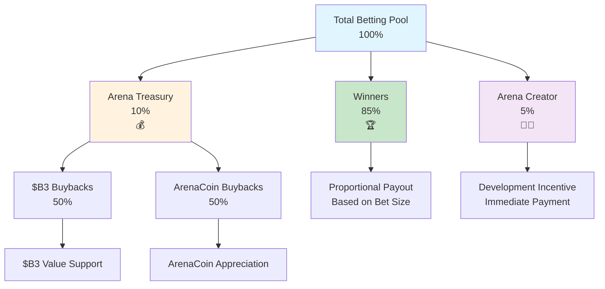

HypeDuel은 플레이어, 창작자, 그리고 생태계 간의 가치를 공정하게 분배하는 투명하고 지속 가능한 수수료 구조를 운영합니다. 이러한 수수료를 이해하는 것은 전략을 최적화하고 플랫폼이 장기적인 생존력을 유지하는 방법을 평가하는 데 도움이 됩니다.

## 개요

최대 이익을 추구하는 전통적인 게임 플랫폼과 달리, HypeDuel의 수수료 구조는 다음을 목표로 합니다:

- **승자 보상**: 베팅 풀의 85%가 승리한 플레이어에게 직접 지급됩니다
- **창작자 지원**: 아레나 및 AI 개발자가 지속 가능한 수익을 얻습니다
- **생태계 성장**: 트레저리 바이백이 모든 토큰 홀더에게 혜택을 줍니다
- **플랫폼 유지**: 운영 및 개발 자금 조달



## 베팅 수수료

### 주요 수익원

**모든 베팅 풀은 다음 분배를 따릅니다:**

```
Total Betting Pool: 100%
├── 85% → Winners (shared proportionally)
├── 10% → Arena Treasury (token buybacks)
└── 5% → Arena Creator (development incentive)
```

### 자세한 분석

<Tabs>
  <Tab title="Winner Payouts (85%)">
    **플레이어에게 가장 큰 부분이 돌아갑니다** **분배 방법**: - 승자들은 베팅 크기에 비례하여 분배됩니다 - 하우스 에지나 숨겨진 수수료 없음 - 전투 종료 후 즉시 지급 - 모든 플레이어에게 투명하게 계산 공개 **예시 계산**: ``` Total Pool: 10,000 HYPES Winner Pool: 8,500 HYPES (85%) Your Bet: 500 HYPES on
    winning AI Total Winning Bets: 2,000 HYPES Your Share: 500/2,000 = 25% Your Payout: 500 + (6,500 × 0.25) = 2,125
    HYPES ```
  </Tab>

<Tab title="Arena Treasury (10%)">
  **토큰 바이백 메커니즘** **트레저리 기능**: - 모든 아레나 활동에서 수수료를 축적 - 자동 토큰 바이백 실행 - ArenaCoin 및 $B3 가치 지원 - 지속 가능한 가치 상승 압력 생성 **바이백 전략**: -
  50%는 $B3 토큰 구매용 - 50%는 ArenaCoin 구매용 - 시장 타이밍 최적화 - 투명한 실행 기록 **플레이어에 대한 영향**: - 보유 토큰의 가치 증가 - 장기적인 가치 상승 - 플랫폼 충성도 보상 - 성장 동기 부여
</Tab>

  <Tab title="Arena Creator (5%)">
    **개발 인센티브** **창작자 혜택**: - 아레나 성공으로부터 직접적인 수익 - 각 전투 후 즉시 지급 - 커뮤니티 성장과 함께 확장 - 지속 가능한 장기 수입 **수익 사용처**: - 지속적인 아레나 개발 -
    AI 모델 개선 - 커뮤니티 구축 활동 - 마케팅 및 성장 이니셔티브 **창작자 동기**: -
    플레이어 만족도와 일치 - 고품질 콘텐츠 유도 - 커뮤니티 구축 보상 - 혁신 장려
  </Tab>
</Tabs>

## 부스트 수수료

### 상호작용 수익 모델

**부스트 구매는 추가 수익을 생성합니다:**

```
Boost Purchase: 100%
├── 50% → Arena Treasury (ArenaCoin buybacks)
└── 50% → Arena Creator (immediate revenue)
```

### 부스트 경제학

<AccordionGroup>
  <Accordion title="Revenue Distribution">
    **동등 분할 모델** **트레저리 부분 (50%)**: - ArenaCoin 바이백을 위해 특별히 사용됨 - 아레나 투자자에게 직접적인 가치 창출 - 시간이 지남에 따라 토큰 희소성 증가 - 아레나 커뮤니티 충성도 보상 **창작자 부분
    (50%)**: - 아레나 개발자에게 즉각적인 수익 - 부스트 시스템 개발 유도 - 상호작용 기능 창조 보상 - 지속적인 밸런스 개선 자금
  </Accordion>

<Accordion title="Dynamic Pricing">
  **시장 반응 비용** **기본 가격**: - 아레나 창작자가 설정한 표준 부스트 비용 - 게임플레이 영향에 균형 - 효과에 따라 정기적 조정 - 커뮤니티 피드백 통합 **급증 가격**: - 고요구 기간 동안 증가 - 전투 말기 배치에 대한 프리미엄 - 다수 구매 벌칙 - 희소성 기반 비용 상승 **예시 가격 진화**: ``` Shield Boost Base Price: 50 HYPES After 3 purchases: 60 HYPES (+20%)
  Final 30 seconds: 90 HYPES (+50% urgency) Total with both factors: 108 HYPES ```
</Accordion>

  <Accordion title="ROI Considerations">
    **전략적 투자 분석** **비용-편익 계산**: - 부스트 비용 대비 잠재적 베팅 수익 - 확률 개선 추정 - 기대 가치 계산 - 위험 조정 수익 평가 **최적화 전략**: - 낮은 비용으로 초기 배치 - 다른 플레이어와의 조정 - 최대 영향을 위한 타이밍 - 전투별 포트폴리오 접근
  </Accordion>
</AccordionGroup>

## 거래 수수료

### 졸업 후 수익

**ArenaCoin DEX 거래는 지속적인 수수료를 생성합니다:**

<Tabs>
  <Tab title="Bonding Phase Fees">
    **초기 출시 동안** ``` Bonding Transaction: 100% ├── 97% → User (ArenaCoins received) ├── 2% → B3 Treasury
    (ecosystem support) └── 1% → Arena Creator (launch incentive) ``` **특징**: - 낮은 수수료로 초기 채택 장려 - 생태계 전반의 개발 지원 - 창작자 출시 인센티브 제공 - 초기 커뮤니티 구축
  </Tab>

<Tab title="DEX Trading Fees">
  **아레나 졸업 후** ``` DEX Trading Fee: 3% total ├── 2% → Arena Treasury (66.7% of total) └── 1% → Arena
  Creator (33.3% of total) ``` **장기적인 혜택**: - 토큰 성공으로부터 지속적인 수익 - 성공적인 아레나에 대한 수동 수입 - 지속 가능한 창작자 보상 - 커뮤니티 가치 상승 **수수료 비교**: - 일반적인 DEX 수수료보다 낮음 (0.3-1%) - 가치 추가 서비스로 정당화 - 프리미엄 플랫폼과 경쟁 - 투명한 수수료 구조
</Tab>

  <Tab title="Fee Optimization">
    **스마트 수수료 관리** **플레이어 전략**: - 수수료 최소화를 위한 거래 일괄 처리 - 저가스 기간 동안 구매 타이밍 - 더 나은 실행을 위한 리미트 주문 사용 - 수수료 효율성을 위한 보유 기간 고려 **플랫폼 최적화**: - 가스 효율적인 스마트 계약 설계 - 다수 사용자를 위한 일괄 처리 - 고용량 거래자와의 수수료 공유 - 자주 사용하는 사용자를 위한 로열티 프로그램
  </Tab>
</Tabs>

## 비교 분석

### 업계 비교

<AccordionGroup>
  <Accordion title="Traditional Gaming">
    **전통적인 플랫폼과 비교** **전통적 모델**: - 모든 베팅에서 하우스 에지: 5-15% - 플레이어와의 수익 공유 없음 - 불투명한 수수료 구조 - 중앙집중식 이익 추출 **HypeDuel 장점**: - 투명한 총 15% 수수료
    - 승자에게 직접 85% - 토큰을 통한 커뮤니티 소유 - 창작자 경제 참여
  </Accordion>

<Accordion title="DeFi Platforms">
  **탈중앙화 금융과 비교** **전형적인 DeFi 수수료**: - 거래당: 0.3-1% - 연간 수수료: 2-20% - 엔터테인먼트 가치 없음 - 복잡한 사용자 경험 **HypeDuel 혜택**: - 엔터테인먼트 + 금융 기회
  - 단순화된 사용자 경험 - 통합된 생태계 보상 - 커뮤니티 주도 개발
</Accordion>

  <Accordion title="Creator Platforms">
    **콘텐츠 생성 사이트와 비교** **플랫폼 창작자 수익 분배**: - YouTube: 광고 수익의 약 45% - Twitch: 구독 수익의 50% - OnlyFans: 창작자 수익의 20% - 앱 스토어: 판매의 30% **아레나 창작자 혜택**: - 베팅의 5% + 부스트의 50% - 직접적인 커뮤니티 연결 - 토큰 가치 상승의 잠재력 - 전체 창의적 통제
  </Accordion>
</AccordionGroup>

## 수수료 투명성

### 실시간 추적

<Card title="Public Dashboards" icon="dashboard">
  **완전한 투명성** - 실시간 수수료 수집 추적 - 트레저리 잔액 및 바이백 역사 - 아레나별 창작자 수익 - 플랫폼 전반의 수익 분석
</Card>

<Card title="Player Tools" icon="calculator">
  **개인 분석** - 개인 수수료 지불 내역 - 베팅당 효과적인 비용 계산 - 수수료를 포함한 ROI 분석 - 최적화 권장 사항
</Card>

<Card title="Community Oversight" icon="users">
  **거버넌스 통합** - 수수료 조정에 대한 커뮤니티 투표 - 성과 지표 모니터링 - 창작자 책임 조치 - 플랫폼 개선 제안
</Card>
