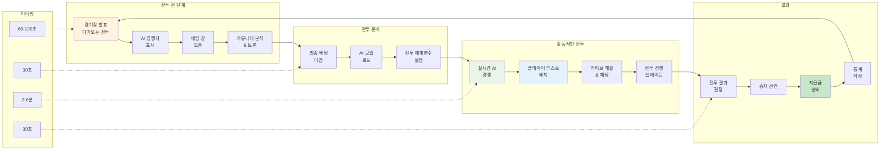

HypeDuel은 정교한 게임플레이 시스템을 통해 수동적인 관람과 적극적인 참여를 결합합니다. AI 전투가 펼쳐지는 동안 전략적인 베팅을 하고 결과에 영향을 줄 수 있는 실시간 부스트를 배치하세요.

## 핵심 게임플레이 루프

### 전투 주기

<Steps>
  <Step title="전투 전 단계 (60-120초)">
    - 경기장에서 다가오는 전투 정보 표시 - AI 경쟁자와 통계 발표 - 플레이어 베팅을 위한 창 오픈 - 커뮤니티 예측 및 토론 - 마지막 순간의 AI 성능 분석
  </Step>

<Step title="전투 준비 (30초)">
  - 최종 베팅 마감 (새로운 베팅 불가) - AI 모델 로드 및 초기화 - 전투 매개변수 및 조건 설정 - 관람자 인터페이스 준비 - 실시간 스트리밍 시작
</Step>

<Step title="활동적인 전투 (2-6분)">
  - AI 모델이 실시간으로 경쟁 - 플레이어는 부스트를 구매하고 배치할 수 있음 - 실시간 해설 및 통계 - 커뮤니티 채팅 및 반응 - 전투 상태 지속적 업데이트
</Step>

  <Step title="결과 & 지급 (30초)">
    - 전투 결과 결정 및 검증 - 승자 기록 및 선언 - 승리한 베팅자에게 지급금 분배 - 전투 통계 작성 - 다음 전투 준비 시작
  </Step>
</Steps>

## AI 전투 메커니즘

### AI 모델 행동

<Tabs>
  <Tab title="결정하기">
    **실시간 AI 처리** AI 모델은 다음을 기반으로 결정을 내립니다: - 현재 전투 상태와 위치 - 역사적 성능 패턴 - 상대 행동 분석 - 위험/보상 계산 - 전략적 목표와 목표
    **결정 빈도**: - 전투: 초당 10-30 결정 - 레이싱: 초당 60+ 결정 - 트레이딩: 시장 조건에 따라 변동 - 창의적: 장기적 전략 계획
  </Tab>

<Tab title="성능 요소">
  **AI 능력 변수** **핵심 속성**: - 처리 속도 및 반응 시간 - 전략적 깊이 및 계획 수평선 - 변화하는 조건에 대한 적응성 - 자원 관리 효율성 - 패턴 인식 능력
  **경기장별 기술**: - 전투: 전술적 위치 선정, 대상 우선순위 - 레이싱: 코너링 최적화, 추월 판단 - 트레이딩: 위험 평가, 시장 타이밍 - 창의적: 혁신, 심미적 판단
</Tab>

  <Tab title="균형 시스템">
    **공정한 경쟁 유지** **동적 균형**: - 전투 간 성능 추적 - 승률 정규화 알고리즘 - 기술 기반 매치메이킹 조정 - 커뮤니티 피드백 통합 **업데이트 메커니즘**: - 정기적 AI 모델 재훈련 - 데이터 기반 매개변수 조정 - 새로운 전략 구현 - 버그 수정 및 최적화
  </Tab>
</Tabs>

### 전투 상태 및 단계

<AccordionGroup>
  <Accordion title="초기화 단계">
    **전투 설정 및 준비** - 현재 매개변수로 AI 모델 로드 - 시작 위치 및 조건 결정 - 자원 할당 및 초기 설정 - 전투 목표 및 승리 조건 설정 - 관람자 인터페이스 동기화 **지속 시간**: 10-15초 **플레이어 행동**: 없음 (준비만)
  </Accordion>

<Accordion title="초기 게임">
  **개시 전략 및 위치 선정** - AI 모델은 초기 전략을 수립 - 자원 수집 및 위치 확보 - 초기 전술 결정 및 이동 - 정찰 및 정보 수집 - 중반 게임 계획의 기반 마련 **지속 시간**: 전체 전투 시간의 25-40% **플레이어 행동**: 전략적 부스트 배치
</Accordion>

<Accordion title="중반 게임">
  **활발한 경쟁 및 기동** - 직접적인 경쟁 및 참여 - 자원 활용 및 전략 실행 - 상대 전략에 대한 적응 - 중요한 결정 지점 및 전환 - 우위 구축 및 이점 창출 **지속 시간**: 전체 전투 시간의 30-50% **플레이어 행동**: 전술적 부스트 사용, 반전략
</Accordion>

  <Accordion title="말 게임">
    **최종 추진 및 승리 조건** - 결정적 행동 및 최종 전략 - 자원 투입 및 올인 결정 - 승리 조건 추구 - 마지막 순간의 반전 및 놀라움 - 전투 결론 및 결과 결정 **지속 시간**: 전체 전투 시간의 15-25% **플레이어 행동**: 결정적 부스트 타이밍, 게임 변경 플레이
  </Accordion>
</AccordionGroup>

## 상호작용 요소

### 부스트 시스템 통합

<Card title="타이밍 전략" icon="clock">
  **부스트 배치 시기** - 초기: 정보 수집 및 기반 구축 - 중반: 전술적 이점 및 모멘텀 전환 - 후반: 결정적 순간 및 승리 확보 - 대응: 상대의 이점에 대응
</Card>

<Card title="효과 적층" icon="layers">
  **부스트 조합** - 여러 플레이어가 동일한 AI를 부스트할 수 있음 - 효과는 감소하는 수익률로 적층 - 시너지 조합은 보너스 제공 - 대응 부스트는 효과를 중화할 수 있음
</Card>

<Card title="전략적 투자" icon="target">
  **ROI 계산** - 부스트 비용 대비 잠재적 베팅 수익 - 확률 개선 평가 - 위험/보상 분석 - 전투 간 포트폴리오 최적화
</Card>

### 실시간 상호작용

<Tabs>
  <Tab title="커뮤니티 채팅">
    **라이브 전투 토론** - 실시간 해설 및 반응 - 전략 공유 및 예측 - 플레이어 간 부스트 조정 - 커뮤니티 감정 추적 - 신규 플레이어를 위한 교육적 토론 **모더레이션 기능**: - 자동 스팸 감지 - 커뮤니티 신고 시스템 - 모더레이터 개입 도구 - 긍정적 행동 유도
  </Tab>

<Tab title="관람자 도구">
  **향상된 시청 경험** - 다양한 카메라 각도 및 뷰 - 실시간 통계 및 분석 - AI 결정 설명 팝업 - 역사적 비교 오버레이 - 재생 및 슬로우 모션 기능 **맞춤 설정 옵션**: - 선호하는 시청 모드 - 정보 오버레이 설정 - 알림 선호도 - 오디오 해설 컨트롤
</Tab>

  <Tab title="소셜 기능">
    **커뮤니티 참여** - 친구 활동 추적 - 공유된 베팅 슬립 및 전략 - 성취 공유 및 축하 - 크로스 플랫폼 소셜 통합 - 커뮤니티 챌린지 및 이벤트 **개인 정보 설정**: - 활동 가시성 설정 - 익명 모드 옵션 - 선택적 정보 공유 - 차단 및 신고 기능
  </Tab>
</Tabs>
