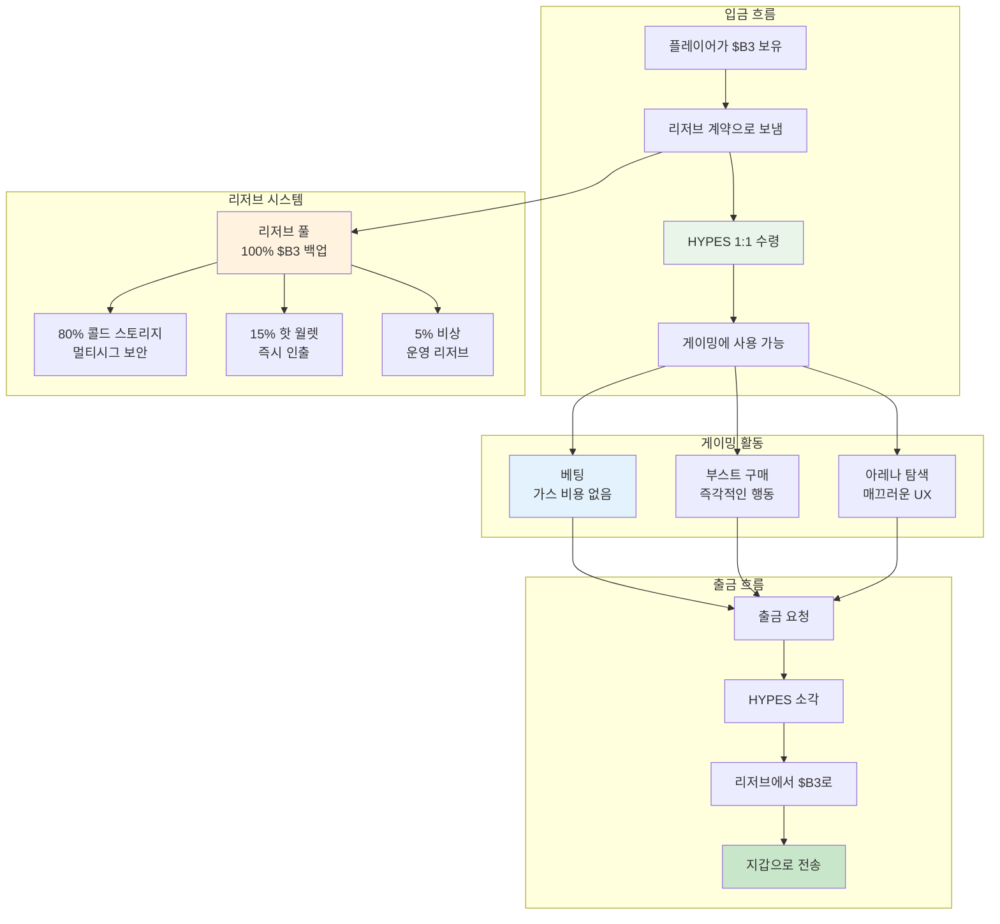

**HYPES**는 HypeDuel 플랫폼의 네이티브 크레딧으로, B3 토큰과 1:1 교환 비율을 유지합니다. 이들은 블록체인 거래 지연 없이 즉각적인 베팅과 부스트 구매를 가능하게 하여, 완전한 $B3 백업을 유지하면서도 매끄러운 게이밍 경험을 제공합니다.

## 핵심 개념

HYPES는 블록체인 게이밍의 근본적인 UX 문제인 거래 지연과 가스 비용을 해결합니다. 이는 엔터테인먼트의 흐름을 방해합니다. HYPES를 보장된 $B3 백업을 가진 플랫폼 크레딧으로 유지함으로써, 플레이어는 두 세계의 장점을 모두 누릴 수 있습니다.

## 주요 기능

<Card title="1:1 $B3 백업" icon="shield">
  모든 HYPES 토큰은 리저브에 있는 정확히 1 $B3 토큰에 의해 백업됩니다
</Card>

<Card title="즉각적인 거래" icon="bolt">
  블록체인 확인을 기다리지 않고 베팅하고 부스트를 구매하세요
</Card>

<Card title="가스 비용 없음" icon="dollar-sign">
  베팅, 부스트 구매, 이전에 대한 거래 비용 없음
</Card>

<Card title="언제든지 출금" icon="arrow-right">
  언제든지 HYPES를 $B3로 즉시 전환
</Card>

## 전환 과정

<Tabs>
  <Tab title="$B3 → HYPES">
    **입금 과정**: 
    1. HypeDuel 리저브 계약으로 B3 전송 
    2. 플랫폼 계정에 해당하는 HYPES 수령 
    3. 베팅과 부스트를 위해 즉시 HYPES 사용 가능 
    4. 입금된 금액만큼 리저브 증가

    **방법**: - 직접 B3 토큰 전송 - 신용카드 구매 (자동 변환) - 모든 ERC-20 토큰 (먼저 B3로 교환) - 은행 송금 (B3로 변환)

  </Tab>

  <Tab title="HYPES → $B3">
    **출금 과정**: 1. 플랫폼 계정에서 출금 요청 2. HYPES 잔액 즉시 감소 3. 리저브에서 지갑으로 $B3 전송 4. 출금된 금액만큼 리저브 감소 **특징**: - 최소 출금 금액 없음 - 출금 수수료 없음 - 24/7 이용 가능 - 즉시 처리
  </Tab>
</Tabs>

## HYPES vs $B3 비교

| 기능                | HYPES               | $B3                  |
| ---------------------- | ------------------- | -------------------- |
| **베팅**            | ✅ 즉각적          | ❌ 가스 비용 + 지연 |
| **부스트 구매**    | ✅ 즉각적          | ❌ 가스 비용 + 지연 |
| **아레나 거래**      | ❌ 지원 안 함    | ✅ DEX 거래       |
| **크로스 플랫폼**     | ❌ HypeDuel만    | ✅ 전체 생태계    |
| **거래 비용**  | ✅ 무료             | ❌ 가스 비용          |
| **지갑 보관**     | ❌ 플랫폼 보관 | ✅ 자체 보관      |
| **즉각적인 전환** | ✅ $B3와 1:1     | ✅ HYPES와 1:1    |

## 리저브 관리

### 투명성 & 보안

HYPES 리저브 시스템은 완전한 투명성으로 운영됩니다:

<AccordionGroup>
  <Accordion title="리저브 구성">
    **100% $B3 백업**: - 모든 HYPES는 1 $B3 토큰으로 백업됩니다 - 분할 리저브나 레버리지 없음 - 실시간
    리저브 모니터링 - 검증을 위한 공개 리저브 주소 **리저브 위치**: - 80% 멀티시그너처 콜드 스토리지 - 15% 즉시 인출을 위한 핫 월렛 - 5% 비상 운영 리저브
  </Accordion>

<Accordion title="보안 조치">
  **멀티시그너처 보안**: - 콜드 스토리지 접근을 위한 3-of-5 멀티시그 - 하드웨어 보안 모듈 (HSMs) -
  시간 지연 출금 메커니즘 - 정기적인 보안 감사 및 침투 테스트 **운영 보안**: -
  실시간 모니터링 및 알림 - 자동 리저브 재조정 - 비상 정지 메커니즘 - 기술적 실패에 대한 보험 커버리지
</Accordion>

  <Accordion title="공개 검증">
    **체인상 투명성**: - 리저브 주소 공개적으로 조회 가능 - 실시간 리저브 대비 HYPES 발행 추적 -
    월간 제3자 감사 - 커뮤니티 거버넌스 감독 **모니터링 도구**: - 리저브 상태를 보여주는 공개 대시보드 - 리저브 비율 변화에 대한 알림 시스템 - 역사적 데이터 및 추세 분석 - 독립적 검증 서비스
  </Accordion>
</AccordionGroup>

## HYPES 사용 사례

### 주요 기능

<Card title="배틀 베팅" icon="coins">
  **핵심 게이밍 활동** - AI 배틀에 즉시 베팅 - 블록체인 확인 대기 없음 - 당첨금 즉시 지급 - 빠른 베팅 전략 지원
</Card>

<Card title="부스트 구매" icon="bolt">
  **인터랙티브 게임플레이** - 실시간 전투 중 파워업 구매 - 지연 없는 실시간 배치 - 가스 걱정 없는 전략적 타이밍 - 여러 부스트 효과적 결합
</Card>

<Card title="플랫폼 탐색" icon="compass">
  **매끄러운 경험** - 아레나 간 즉시 이동 - 빠른 토너먼트 등록 - 새로운 기능에 즉시 접근 - 무마찰 사용자 경험
</Card>
