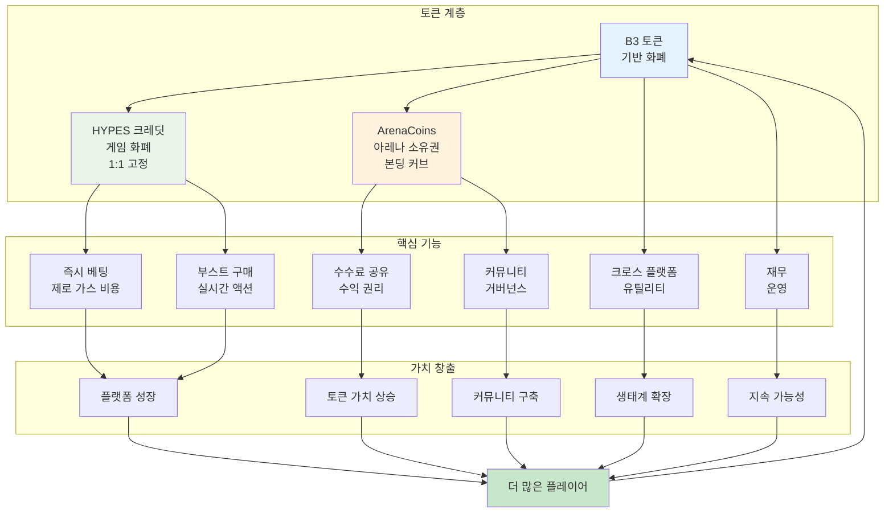
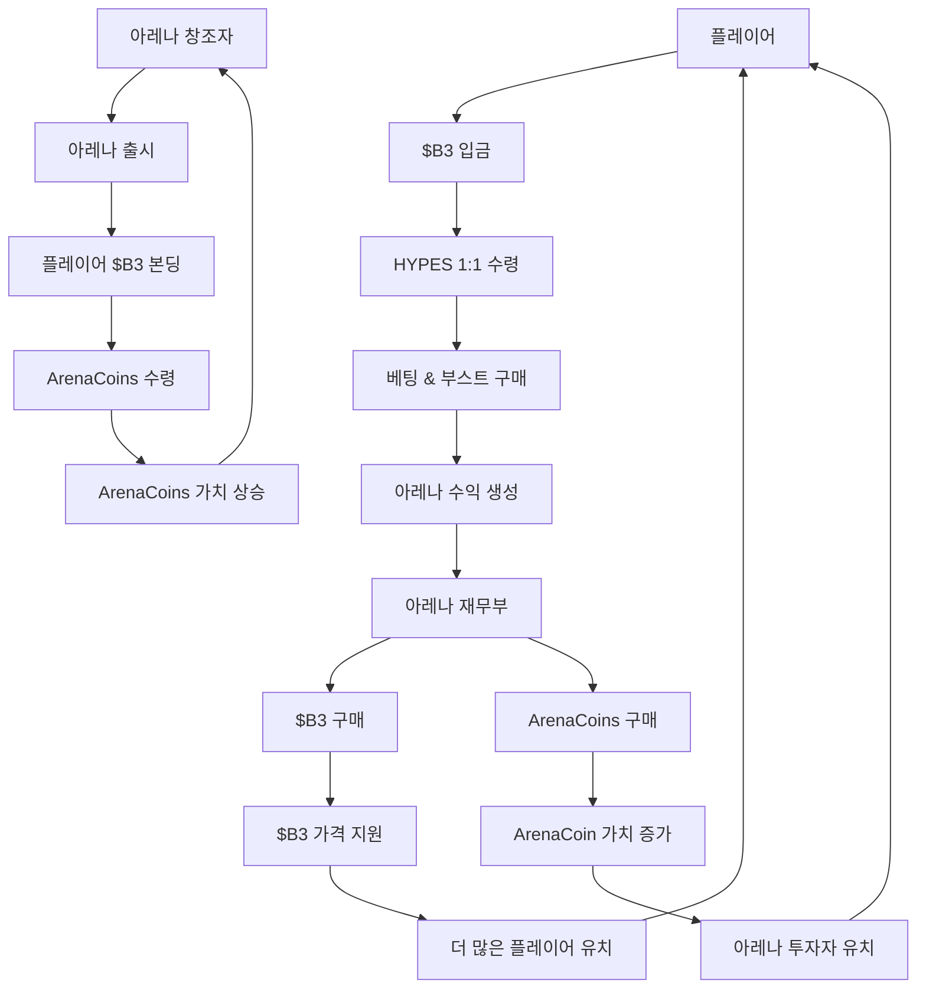

HypeDuel은 사용자 경험을 최적화하고, 지속 가능한 가치 흐름을 창출하며, 커뮤니티 소유권을 가능하게 하는 세 가지 토큰 경제 시스템을 운영합니다. 각 토큰은 특정 목적을 가지면서 전체 생태계를 지원하기 위해 함께 작동합니다.

## 세 가지 토큰 아키텍처

### 토큰 계층

<Tabs>
  <Tab title="$B3 토큰" icon="coins">
    **기반 화폐** - 기본 생태계 토큰 - 주요 가치 저장소 - 크로스 플랫폼 유틸리티 - 재무 예비금
    - ArenaCoins 본딩
  </Tab>

<Tab title="HYPES 크레딧" icon="bolt">
  **게임 화폐** - $B3와 1:1 고정 - 즉시 베팅 배치 - 제로 가스 비용 - 원활한 출금 - 부스트
  구매
</Tab>

  <Tab title="ArenaCoins" icon="chart-line">
    **아레나 소유권** - 아레나별 고유 - 본딩 커브 가격 책정 - 수수료 공유 권리 - 거래 기회 -
    커뮤니티 거버넌스
  </Tab>
</Tabs>

## 토큰 흐름 다이어그램

## 왜 세 가지 토큰인가?

### 사용자 경험 최적화

세 가지 토큰 시스템은 중요한 UX 문제를 해결합니다:

<AccordionGroup>
  <Accordion title="즉시 거래">
    **문제**: 블록체인 거래에는 게임 흐름을 방해하는 지연과 가스 비용이 있습니다. **해결책**: HYPES는 블록체인 마찰 없이 즉시 베팅과 부스트를 가능하게 하면서 $B3의 전체 백업을 유지합니다.
  </Accordion>

<Accordion title="아레나 투자">
  **문제**: 사용자가 성공적인 아레나 성장에 투자하거나 그로부터 이익을 얻는 방법이 없습니다. **해결책**: ArenaCoins는 플레이어가 아레나 경제의 일부를 소유하고 그 성공으로부터 수익을 얻을 수 있게 합니다.
</Accordion>

<Accordion title="가치 포착">
  **문제**: 플랫폼 수익은 일반적으로 플랫폼 소유자에게만 이익을 줍니다. **해결책**: $B3 및 ArenaCoins의 재무 부문 매입은 모든 이해관계자에게 가치를 분배합니다.
</Accordion>

  <Accordion title="창조자 인센티브">
    **문제**: 아레나 및 AI 모델 창조자를 공정하게 보상하는 것이 어렵습니다. **해결책**: ArenaCoins는 창조자에게 직접적인 수익 공유와 가치 상승 가능성을 제공합니다.
  </Accordion>
</AccordionGroup>

### 경제 지속 가능성

각 토큰은 다양한 방식으로 가치를 창출합니다:

<Card title="$B3 가치 동력" icon="trending-up">
  - 기본 생태계 성장 - 재무 매입 압력 - 크로스 플랫폼 유틸리티 - 스테이킹 및 DeFi 통합
</Card>

<Card title="HYPES 안정성" icon="balance-scale">
  - 1:1 $B3 백업 보장 - 즉시 전환 능력 - 게임 유틸리티 프리미엄 - 플랫폼 편의 가치
</Card>

<Card title="ArenaCoin 가치 상승" icon="rocket">
  - 아레나 인기 성장 - 수수료 생성 증가 - 커뮤니티 개발 - 거래량 확장
</Card>

## 토큰 유틸리티 매트릭스

| 기능              | $B3 | HYPES | ArenaCoins |
| ------------------ | --- | ----- | ---------- |
| **베팅**          | ❌  | ✅    | ❌         |
| **부스트**         | ❌  | ✅    | ❌         |
| **아레나 본딩**    | ✅  | ❌    | ❌         |
| **수수료 수익**    | ✅  | ❌    | ✅         |
| **거래**           | ✅  | ❌    | ✅         |
| **거버넌스**       | ✅  | ❌    | ✅         |
| **크로스 플랫폼** | ✅  | ❌    | ❌         |

### 재무 메커니즘

아레나 재무부는 지속적인 구매 압력을 생성합니다:

1. **수익 수집**: 수수료는 아레나 재무부에 쌓입니다
2. **자산 배분**: 50%는 $B3 매입을 위해, 50%는 ArenaCoin 매입을 위해 사용됩니다
3. **시장 구매**: 자동 시장 구매는 가격 지원을 생성합니다
4. **가치 분배**: 모든 토큰 소유자에게 혜택이 흐릅니다
