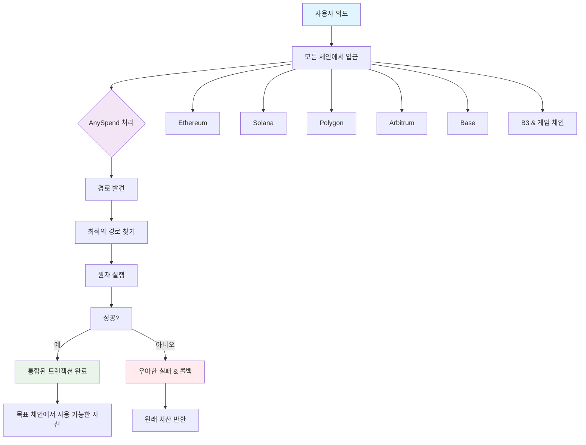

<iframe
   className="w-full aspect-video rounded-xl"
    src="https://customer-gg6qs7nm5ue94t64.cloudflarestream.com/4453d7f20bb58fb822f0e114e4887ab5/iframe?muted=true&loop=true&autoplay=true&poster=https%3A%2F%2Fcustomer-gg6qs7nm5ue94t64.cloudflarestream.com%2F4453d7f20bb58fb822f0e114e4887ab5%2Fthumbnails%2Fthumbnail.jpg%3Ftime%3D%26height%3D600"
    title="유동성 분열"
    frameBorder="0"
  allow="accelerometer; autoplay; clipboard-write; encrypted-media; gyroscope; picture-in-picture"
  allowFullScreen
  ></iframe>

<Note>
[explorer.b3.fun에서 B3의 멀티체인 생태계 탐색하기](https://explorer.b3.fun/chains)
</Note>

## 문제점

Appchains, L2s, 그리고 L3s는 고립된 유동성을 가지고 있어, 체인 간에 자산을 브리지하지 않고는 경험을 구축하기 어렵습니다.

<CardGroup cols={2}>

<Card title="분열된 유동성" icon="puzzle-piece">
  각 체인은 고립된 풀을 유지하여 깊이를 제한하고 슬리피지를 증가시킵니다.
</Card>

<Card title="복잡한 통합" icon="gears">
  빌더는 수십 개의 체인을 개별적으로 통합해야 합니다.
</Card>

<Card title="불편한 UX" icon="face-frown">
  사용자는 자산을 수동으로 브리지하고 여러 지갑을 관리해야 합니다.
</Card>

<Card title="자본 비효율성" icon="chart-line-down">
  특정 체인에 잠긴 자산은 다른 기회에 접근할 수 없습니다.
</Card>

</CardGroup>

## 체인 간 유동성 접근

우리의 제품인 AnySpend에 의해 구동되며, 사용자 의도와 블록체인 실행 사이의 클라이언트 실행 계층에서 작동합니다:

### 작동 방식

1. **모든 체인에서 입금**: 대부분의 체인에서 토큰을 받아들입니다
2. **의도 기반**: 사용자는 어떻게 달성할지가 아닌, 무엇을 원하는지를 표현합니다
3. **경로 발견**: 모든 지원 체인을 통해 최적의 경로를 찾습니다
4. **원자 실행**: 트랜잭션이 원자적으로 실행되거나 우아하게 실패합니다
5. **통합된 경험**: 복잡한 작업이 단일 트랜잭션으로 나타납니다

### 지원 체인

AnySpend는 범용 체인 지원을 제공합니다:

- **EVM 체인**: Ethereum, Polygon, Arbitrum, Base, BSC, Avalanche를 포함한 대부분의 EVM 체인
- **Solana**: Solana 생태계와의 완전한 통합
- **B3 생태계**: B3 및 게임 체인과의 네이티브 통합

## 다음 단계

<CardGroup cols={2}>

<Card title="AnySpend 시도하기" icon="rocket" href="/anyspend/introduction">
  AnySpend SDK로 시작하기.
</Card>

<Card title="통합 가이드" icon="book" href="/anyspend/installation">
  AnySpend 통합 방법 배우기.
</Card>

<Card title="API 참조" icon="code" href="/anyspend/api-reference/introduction">
  완전한 API 문서 탐색하기.
</Card>

<Card title="Discord에 참여하기" icon="discord" href="https://discord.gg/b3dotfun">
  다른 빌더들과 연결하기.
</Card>

</CardGroup>
