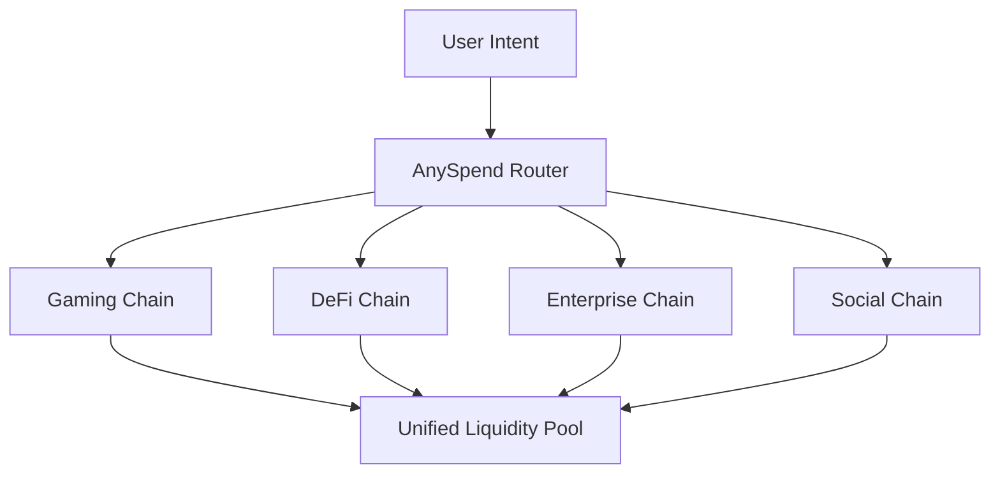

<Note>
  [B3의 멀티체인 생태계를 explorer.b3.fun에서 탐색하세요](https://explorer.b3.fun/chains)
</Note>

## 스케일링 혁명

전통적인 블록체인 스케일링은 단일 체인을 더 빠르게 만드는 데 초점을 맞추었습니다. B3는 다른 접근 방식을 취합니다: 통합된 생태계로 함께 작동하는 목적에 맞게 구축된 앱체인을 통한 **수평 스케일링**.

<CardGroup cols={2}>
  <Card title="수직 스케일링" icon="arrow-up">
    하나의 체인이 더 많은 거래를 초당 처리하도록 만듭니다
  </Card>
  <Card title="수평 스케일링" icon="arrow-right">
    특정 애플리케이션을 위한 전문 체인을 생성합니다
  </Card>
</CardGroup>

## 수평 스케일링이 중요한 이유

모든 애플리케이션이 같은 블록체인 자원을 경쟁하는 대신, 수평 스케일링은 각 앱, 게임 또는 기업이 최적화된 실행 환경을 갖도록 합니다.

### 멀티 체인의 이점

<CardGroup cols={2}>
  <Card title="애플리케이션 특화 최적화" icon="gear">
    각 앱체인은 그 특정 사용 사례에 맞게 커스터마이징될 수 있습니다 - 게임 체인은 수수료 없는 게임플레이, DeFi 체인은 고속 거래를 위해.
  </Card>
  <Card title="무제한 처리량" icon="bolt">
    블록 공간을 경쟁할 필요가 없습니다. 각 애플리케이션은 전용 자원을 받고 독립적으로 스케일할 수 있습니다.
  </Card>
  <Card title="격리된 위험" icon="shield">
    한 앱체인의 문제가 다른 체인에 영향을 미치지 않아 전체 생태계에 대한 보안과 신뢰성을 향상시킵니다.
  </Card>
  <Card title="통합된 경험" icon="link">
    체인이 분리되어 있음에도 불구하고 사용자는 전체 B3 생태계를 통해 원활한 상호 작용을 경험합니다.
  </Card>
</CardGroup>

## B3가 수평 스케일링을 가능하게 하는 방법

### 1. 목적에 맞게 구축된 앱체인

B3의 모든 애플리케이션은 특정 요구 사항에 최적화된 전용 체인을 배포할 수 있습니다:

- **게임 체인**: 수수료 없는 거래, 즉각적인 확정성, 게임 특화 프리컴파일
- **DeFi 체인**: 고속 거래, MEV 보호, 금융 원시물
- **기업 체인**: 개인 정보 보호 기능, 규정 준수 도구, 맞춤형 거버넌스
- **소셜 체인**: 콘텐츠 저장소, 평판 시스템, 소셜 그래프

### 2. 통합 유동성 레이어

체인이 수평으로 스케일되는 동안, 유동성은 [AnySpend](/protocol/liquidity)를 통해 통합됩니다:

### 3. 원활한 크로스 체인 작업

<Steps>
  <Step title="의도 표현">
    사용자는 NFT 구매, 토큰 교환, 결제 등 원하는 작업을 간단히 표현합니다.
  </Step>
  <Step title="자동 라우팅">
    B3의 인프라는 모든 앱체인을 통해 최적의 경로를 자동으로 찾습니다.
  </Step>
  <Step title="원자 실행">
    복잡한 멀티 체인 작업이 사용자 관점에서 단일 거래로 실행됩니다.
  </Step>
</Steps>

## 실제 세계의 이점

### 개발자를 위해

<CardGroup cols={2}>
  <Card title="더 이상의 혼잡 없음" icon="traffic-light">
    자체 체인을 배포하고 사용자에게 영향을 미치는 네트워크 혼잡에 대해 걱정하지 마십시오.
  </Card>
  <Card title="맞춤형 경제" icon="coins">
    애플리케이션에 특화된 토큰 경제, 수수료 구조 및 인센티브를 설계합니다.
  </Card>
  <Card title="보다 빠른 혁신" icon="rocket">
    네트워크 업그레이드를 기다리거나 다른 애플리케이션에 영향을 주지 않고 새로운 기능을 실험합니다.
  </Card>
  <Card title="더 나은 UX" icon="sparkles">
    특정 사용 사례에 대해 거래 비용, 확인 시간 및 사용자 흐름을 최적화합니다.
  </Card>
</CardGroup>

### 사용자를 위해

<CardGroup cols={2}>
  <Card title="일관된 경험" icon="user-check">
    전체 생태계를 통해 동일한 지갑과 계정으로 모든 애플리케이션에 접근합니다.
  </Card>
  <Card title="낮은 비용" icon="coins">
    각 전문 체인에서 최적화된 수수료 구조의 혜택을 누립니다.
  </Card>
  <Card title="보다 빠른 거래" icon="clock">
    사용 사례에 최적화된 체인에서 거의 즉각적인 확인을 경험합니다.
  </Card>
  <Card title="향상된 보안" icon="lock">
    이더리움 결제의 보안을 즐기면서 전문 체인 기능의 혜택을 누립니다.
  </Card>
</CardGroup>

## 실제로 스케일링하기

<Note>
  [B3 멀티 체인을 통한 통합 데이터에 접근하세요](/data/api-reference/introduction).
</Note>

### 대규모 게임

B3의 게임 체인은 다음을 처리할 수 있습니다:

- **무료 플레이 메커니즘**으로 거래 비용 없음
- **실시간 상호 작용**으로 초 단위의 확정성
- **대규모 멀티플레이어 이벤트**로 네트워크 혼잡 없음
- **통합 유동성을 통한 게임 간 자산 이전**

### 기업 애플리케이션

기업 체인은 다음을 가능하게 합니다:

- **민감한 비즈니스 작업을 위한 개인 거래**
- **프로토콜 계층에 구축된 규정 준수 기능**
- **조직의 요구에 맞는 맞춤형 거버넌스 모델**
- **기존 비즈니스 시스템과의 통합 기능**

### DeFi 혁신

DeFi 체인은 다음을 지원합니다:

- **최적화된 처리량으로 고주파 거래**
- **전문 프리컴파일을 사용한 복잡한 금융 도구**
- **맞춤형 정렬 메커니즘을 통한 MEV 보호**
- **통합 유동성 접근을 통한 크로스 체인 차익 거래**

## 네트워크 효과

더 많은 애플리케이션이 자체 앱체인을 배포함에 따라 전체 B3 생태계는 더 가치 있게 됩니다:

1. **유동성 증가**: 더 많은 체인은 더 많은 거래 기회와 더 깊은 유동성 풀을 의미합니다
2. **향상된 조합성**: 애플리케이션이 체인을 넘나들며 원활하게 상호 작용할 수 있습니다
3. **감소된 비용**: 생태계가 성장함에 따라 공유 인프라 비용이 감소합니다
4. **혁신 가속화**: 한 체인의 새로운 기능이 다른 체인에 의해 채택될 수 있습니다

## 수평 스케일링 시작하기

<Card title="앱체인 배포" icon="rocket" horizontal href="https://b3builders.typeform.com/bsmntdevelopers">
  수평으로 스케일하고 싶으신가요? B3에서 자체 목적에 맞는 앱체인을 배포하는 것에 대해 우리 팀과 논의하세요.
</Card>

<Note>
  [B3 멀티 체인을 통한 통합 데이터에 접근하세요](/data/api-reference/introduction).
</Note>

<Note>
  [B3에서 개발자 도구로 빌드하세요](/ecosystem/introduction).
</Note>

### 스케일링 전략 선택하기

<CardGroup cols={3}>
  <Card title="공유 B3 체인" icon="users">
    자체 앱체인으로 스케일하기 전에 메인 B3 체인에서 빌드를 시작합니다.
  </Card>
  <Card title="전용 앱체인" icon="server">
    특정 애플리케이션 요구에 최적화된 맞춤 체인을 배포합니다.
  </Card>
  <Card title="하이브리드 접근법" icon="block">
    핵심 기능에는 메인 체인을 사용하고 전문 기능에는 앱체인을 사용합니다.
  </Card>
</CardGroup>

## 스케일링의 미래

수평 스케일링은 블록체인 인프라의 다음 진화를 대표합니다. 제한 없는 병렬 실행을 가능하게 하면서 통합된 사용자 경험과 유동성을 유지함으로써, B3는 진정으로 대규모 온체인 채택을 위한 기반을 만듭니다.

인터넷은 단일 서버를 더 빠르게 만듦으로써 스케일되지 않았습니다 - 수백만 개의 전문 서버를 연결함으로써 스케일되었습니다. 마찬가지로, 블록체인은 특정 애플리케이션에 최적화된 수천 개의 목적에 맞게 구축된 체인을 연결함으로써 스케일될 것입니다.
