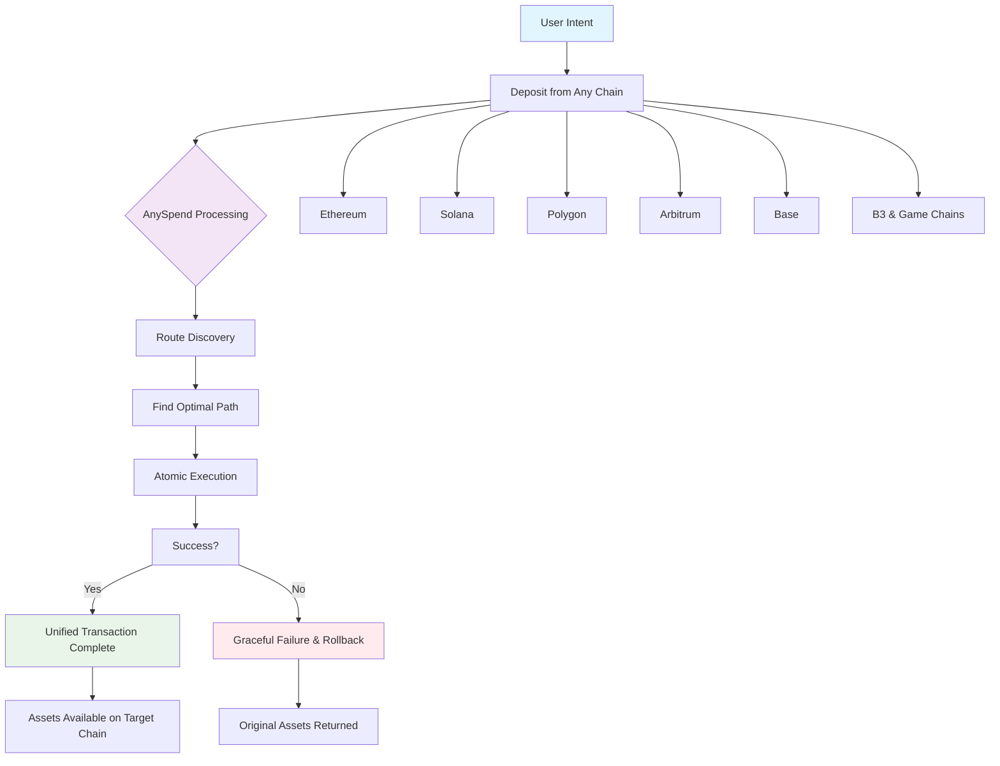

 <iframe
   className="w-full aspect-video rounded-xl"
    src="https://customer-gg6qs7nm5ue94t64.cloudflarestream.com/03160a1a61ac99b9003e44a2059c7dae/iframe?muted=true&loop=true&autoplay=true&poster=https%3A%2F%2Fcustomer-gg6qs7nm5ue94t64.cloudflarestream.com%2F03160a1a61ac99b9003e44a2059c7dae%2Fthumbnails%2Fthumbnail.jpg%3Ftime%3D%26height%3D600"
    title="Liquidity Fragmentation"
    frameBorder="0"
  allow="accelerometer; autoplay; clipboard-write; encrypted-media; gyroscope; picture-in-picture"
  allowFullScreen
  ></iframe>

<Note>
[Explore B3's multichain ecosystem on explorer.b3.fun](https://explorer.b3.fun/chains)
</Note>

## The Problem

Appchains, L2s, and L3s have isolated liquidity, making it annoying to build experiences without having to bridge assets across chains.

<CardGroup cols={2}>

<Card title="Fragmented Liquidity" icon="puzzle-piece">
  Each chain maintains isolated pools, limiting depth and increasing slippage.
</Card>

<Card title="Complex Integration" icon="gears">
  Builders must integrate with dozens of chains individually.
</Card>

<Card title="Poor UX" icon="face-frown">
  Users manually bridge assets and manage multiple wallets.
</Card>

<Card title="Capital Inefficiency" icon="chart-line-down">
  Assets locked on specific chains can't access other opportunities.
</Card>

</CardGroup>

## Access Liquidity Across Chains

Powered by our product, AnySpend, operates at the client execution layer, sitting between user intent and blockchain execution:

### How It Works

1. **Deposit from any chain**: Accepts tokens from most chains
2. **Intent-Based**: Users express what they want, not how to achieve it
3. **Route Discovery**: Finds optimal paths across all supported chains
4. **Atomic Execution**: Transactions execute atomically or fail gracefully
5. **Unified Experience**: Complex operations appear as single transactions

### Supported Chains

AnySpend provides universal chain support:

- **EVM Chains**: Most EVM chains, including Ethereum, Polygon, Arbitrum, Base, BSC, Avalanche
- **Solana**: Full integration with Solana's ecosystem
- **B3 Ecosystem**: Native integration with B3 and game chains

## Next Steps

<CardGroup cols={2}>

<Card title="Try AnySpend" icon="rocket" href="/anyspend/introduction">
  Get started with the AnySpend SDK.
</Card>

<Card title="Integration Guide" icon="book" href="/anyspend/installation">
  Learn how to integrate AnySpend.
</Card>

<Card title="API Reference" icon="code" href="/anyspend/api-reference/introduction">
  Explore the complete API documentation.
</Card>

<Card title="Join Discord" icon="discord" href="https://discord.gg/b3dotfun">
  Connect with other builders.
</Card>

</CardGroup>
