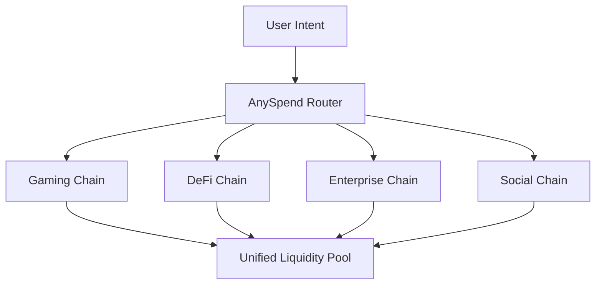

<Note>
  [Explore B3's multichain ecosystem on explorer.b3.fun](https://explorer.b3.fun/chains)
</Note>

## The Scaling Revolution

Traditional blockchain scaling has focused on making single chains faster. B3 takes a different approach: **horizontal scaling** through purpose-built appchains that work together as a unified ecosystem.

<CardGroup cols={2}>
  <Card title="Vertical Scaling" icon="arrow-up">
    Making one chain handle more transactions per second
  </Card>
  <Card title="Horizontal Scaling" icon="arrow-right">
    Creating specialized chains for specific applications
  </Card>
</CardGroup>

## Why Horizontal Scaling Matters

Rather than forcing all applications to compete for the same blockchain resources, horizontal scaling allows each app, game, or enterprise to have their own optimized execution environment.

### The Multi-Chain Advantage

<CardGroup cols={2}>
  <Card title="Application-Specific Optimization" icon="gear">
    Each appchain can be customized for its specific use case - gaming chains for zero-fee gameplay, DeFi chains for high-throughput trading.
  </Card>
  <Card title="Unlimited Throughput" icon="bolt">
    No more competing for block space. Each application gets dedicated resources and can scale independently.
  </Card>
  <Card title="Isolated Risk" icon="shield">
    Problems on one appchain don't affect others, providing better security and reliability for the entire ecosystem.
  </Card>
  <Card title="Unified Experience" icon="link">
    Despite being separate chains, users experience seamless interactions across the entire B3 ecosystem.
  </Card>
</CardGroup>

## How B3 Enables Horizontal Scaling

### 1. Purpose-Built Appchains

Every application on B3 can deploy its own dedicated chain, optimized for specific requirements:

- **Gaming Chains**: Zero-fee transactions, instant finality, gaming-specific precompiles
- **DeFi Chains**: High-throughput trading, MEV protection, financial primitives
- **Enterprise Chains**: Privacy features, compliance tools, custom governance
- **Social Chains**: Content storage, reputation systems, social graphs

### 2. Unified Liquidity Layer

While chains scale horizontally, liquidity remains unified through [AnySpend](/protocol/liquidity):

### 3. Seamless Cross-Chain Operations

<Steps>
  <Step title="Express Intent">
    Users simply express what they want to do - buy an NFT, swap tokens, or make a payment.
  </Step>
  <Step title="Automatic Routing">
    B3's infrastructure automatically finds the optimal path across all appchains.
  </Step>
  <Step title="Atomic Execution">
    Complex multi-chain operations execute as a single transaction from the user's perspective.
  </Step>
</Steps>

## Real-World Benefits

### For Developers

<CardGroup cols={2}>
  <Card title="No More Congestion" icon="traffic-light">
    Deploy your own chain and never worry about network congestion affecting your users.
  </Card>
  <Card title="Custom Economics" icon="coins">
    Design token economics, fee structures, and incentives specific to your application.
  </Card>
  <Card title="Faster Innovation" icon="rocket">
    Experiment with new features without affecting other applications or waiting for network upgrades.
  </Card>
  <Card title="Better UX" icon="sparkles">
    Optimize transaction costs, confirmation times, and user flows for your specific use case.
  </Card>
</CardGroup>

### For Users

<CardGroup cols={2}>
  <Card title="Consistent Experience" icon="user-check">
    Access all applications with the same wallet and account across the entire ecosystem.
  </Card>
  <Card title="Lower Costs" icon="coins">
    Benefit from optimized fee structures on each specialized chain.
  </Card>
  <Card title="Faster Transactions" icon="clock">
    Experience near-instant confirmations on chains optimized for your use case.
  </Card>
  <Card title="Enhanced Security" icon="lock">
    Enjoy the security of Ethereum settlement while benefiting from specialized chain features.
  </Card>
</CardGroup>

## Scaling in Practice

<Note>
  [Access merged data across B3 multi-chains with our free API](/data/api-reference/introduction).
</Note>

### Gaming at Scale

Gaming chains on B3 can handle:

- **Free-to-play mechanics** with zero transaction costs
- **Real-time interactions** with sub-second finality
- **Massive multiplayer events** without network congestion
- **Cross-game asset transfers** through unified liquidity

### Enterprise Applications

Enterprise chains enable:

- **Private transactions** for sensitive business operations
- **Compliance features** built into the protocol layer
- **Custom governance** models for organizational needs
- **Integration capabilities** with existing business systems

### DeFi Innovation

DeFi chains support:

- **High-frequency trading** with optimized throughput
- **Complex financial instruments** with specialized precompiles
- **MEV protection** through custom ordering mechanisms
- **Cross-chain arbitrage** through unified liquidity access

## The Network Effect

As more applications deploy their own appchains, the entire B3 ecosystem becomes more valuable:

1. **Increased Liquidity**: More chains mean more trading opportunities and deeper liquidity pools
2. **Enhanced Composability**: Applications can interact across chains seamlessly
3. **Reduced Costs**: Shared infrastructure costs decrease as the ecosystem grows
4. **Innovation Acceleration**: New features on one chain can be adopted by others

## Getting Started with Horizontal Scaling

<Card title="Deploy Your Appchain" icon="rocket" horizontal href="https://b3builders.typeform.com/bsmntdevelopers">
  Ready to scale horizontally? Contact our team to discuss deploying your own purpose-built appchain on B3.
</Card>

<Note>
  [Access merged data across B3 multi-chains with our free API](/data/api-reference/introduction).
</Note>

<Note>
  [Build on B3 with our developer tools](/ecosystem/introduction).
</Note>

### Choose Your Scaling Strategy

<CardGroup cols={3}>
  <Card title="Shared B3 Chain" icon="users">
    Start building on the main B3 chain before scaling to your own appchain.
  </Card>
  <Card title="Dedicated Appchain" icon="server">
    Deploy a custom chain optimized for your specific application needs.
  </Card>
  <Card title="Hybrid Approach" icon="block">
    Use the main chain for core functions and appchains for specialized features.
  </Card>
</CardGroup>

## The Future of Scaling

Horizontal scaling represents the next evolution of blockchain infrastructure. By enabling unlimited parallel execution while maintaining unified user experience and liquidity, B3 creates the foundation for truly massive onchain adoption.

The internet didn't scale by making single servers faster—it scaled by connecting millions of specialized servers. Similarly, blockchain will scale by connecting thousands of purpose-built chains, each optimized for specific applications while working together as a unified ecosystem.
