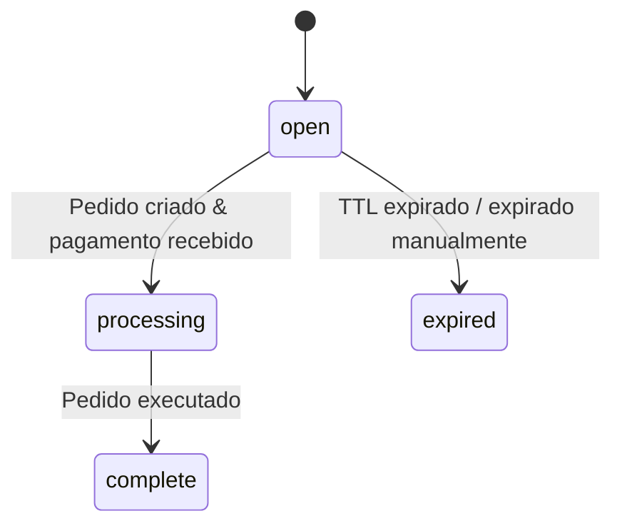

Sessões de checkout permitem que você crie um objeto de rastreamento no seu servidor antes do usuário escolher um método de pagamento. A sessão é um registro leve no banco de dados -- sem chamadas de API externas, sem criação de pedido. O pedido vem depois, quando o usuário se compromete a pagar.

<Info>
  Procurando pelo componente de checkout do React? Veja [Checkout](/anyspend/checkout). Esta página cobre a **API REST** para fluxos controlados pelo servidor.
</Info>

## URL Base

Todos os endpoints de sessão de checkout estão no serviço AnySpend:

```
https://api.anyspend.com
```

## Fluxo

<Steps>
  <Step title="Crie uma sessão no seu servidor">
    `POST https://api.anyspend.com/checkout-sessions` retorna `{ id, status: "open" }`
  </Step>
  <Step title="Usuário escolhe um método de pagamento">
    `POST https://api.anyspend.com/orders` com `checkoutSessionId` retorna `{ id, globalAddress, oneClickBuyUrl }`
  </Step>
  <Step title="Usuário paga">
    **Cripto:** envie para `globalAddress` | **Entrada de fiat:** redirecione para `oneClickBuyUrl`
  </Step>
  <Step title="Verifique a conclusão">
    `GET https://api.anyspend.com/checkout-sessions/:id` retorna `{ status: "complete", order_id }`
  </Step>
</Steps>

### Por que desacoplar sessões de pedidos?

- O método de pagamento não precisa ser conhecido na criação da sessão.
- Uma página de checkout hospedada pode permitir que os usuários escolham como pagar.
- A criação da sessão é uma escrita local no DB, então nunca falha devido a erros de API de terceiros.

## Ciclo de vida do status da sessão



| Status | Significado |
|--------|-------------|
| `open` | Criado, aguardando pedido/pagamento |
| `processing` | Pagamento recebido, pedido em execução |
| `complete` | Pedido executado com sucesso |
| `expired` | TTL expirado, pagamento falhou ou expirado manualmente |

## Referência da API

### Criar sessão

```
POST https://api.anyspend.com/checkout-sessions
```

Cria uma sessão leve. Sem pedido, sem chamadas de API externas.

```json
{
  "success_url": "https://merchant.com/success?session_id={SESSION_ID}",
  "cancel_url": "https://merchant.com/cancel",
  "metadata": { "sku": "widget-1" },
  "client_reference_id": "merchant-order-456",
  "expires_in": 1800
}
```

Todos os campos são opcionais. A configuração de pagamento (quantidade, tokens, cadeias) fica no pedido, não na sessão.

### Criar pedido vinculado a uma sessão

```
POST https://api.anyspend.com/orders
```

Passe `checkoutSessionId` no corpo padrão do pedido para vincular o pedido a uma sessão.

```json
{
  "recipientAddress": "0x...",
  "srcChain": 8453,
  "dstChain": 8453,
  "srcTokenAddress": "0x...",
  "dstTokenAddress": "0x...",
  "srcAmount": "1000000",
  "type": "swap",
  "payload": { "expectedDstAmount": "1000000" },
  "checkoutSessionId": "550e8400-..."
}
```

**Regras de validação:**
- A sessão deve existir (`400` se não encontrada)
- A sessão deve estar `open` (`400` se expirada/processando/complete)
- A sessão não deve já ter um pedido (`409 Conflict`)

### Recuperar sessão

```
GET https://api.anyspend.com/checkout-sessions/:id
```

Retorna o estado atual da sessão. O status é sincronizado do pedido subjacente a cada recuperação.

| Parâmetro de consulta | Descrição |
|-------------|-------------|
| `include=order` | Incorpora o objeto de pedido completo com transações |

### Expirar uma sessão

```
POST https://api.anyspend.com/checkout-sessions/:id/expire
```

Só funciona em sessões com status `open`.

## Modelos de URL de redirecionamento

Use variáveis de template em `success_url` e `cancel_url`:

| Variável | Substituído por |
|----------|--------------|
| `{SESSION_ID}` | O UUID da sessão de checkout |
| `{ORDER_ID}` | Mesmo valor (alias) |

Se nenhuma variável de template estiver presente, `?sessionId=<uuid>` é acrescentado automaticamente.

## Integração SDK

### Métodos de serviço

```typescript
import { anyspend } from "@b3dotfun/sdk/anyspend";

// Criar uma sessão de checkout
const session = await anyspend.createCheckoutSession({
  success_url: "https://mysite.com/success/{SESSION_ID}",
  metadata: { sku: "widget-1" },
});

// Recuperar status da sessão
const session = await anyspend.getCheckoutSession(sessionId);
```

### Hooks React

#### `useCreateCheckoutSession`

Hook de mutação para criar sessões.

```tsx
import { useCreateCheckoutSession } from "@b3dotfun/sdk/anyspend";

const { mutate: createSession, data, isPending } = useCreateCheckoutSession();
```

#### `useCheckoutSession`

Hook de consulta com auto-polling. Para de fazer polling quando o status chega a `complete` ou `expired`.

```tsx
import { useCheckoutSession } from "@b3dotfun/sdk/anyspend";

const { data: session, isLoading } = useCheckoutSession(sessionId);
```

### Prop de componente

Os componentes `<AnySpend>`, `<AnySpendCustom>`, e `<AnySpendCustomExactIn>` aceitam uma prop `checkoutSession` opcional:

```tsx
<AnySpend
  defaultActiveTab="fiat"
  destinationTokenAddress="0x833589fCD6eDb6E08f4c7C32D4f71b54bdA02913"
  destinationTokenChainId={8453}
  recipientAddress="0x..."
  checkoutSession={{
    success_url: "https://myshop.com/success?session={SESSION_ID}",
    cancel_url: "https://myshop.com/cancel",
    metadata: { sku: "widget-1" },
  }}
/>
```

Quando `checkoutSession` está definido, o componente cria uma sessão antes do pedido e usa o `success_url` da sessão para redirecionamentos. Sem a prop, os fluxos existentes funcionam da mesma forma que antes.

## Exemplos

### Pagamento em cripto

```typescript
const BASE_URL = "https://api.anyspend.com";

// 1. Criar sessão
const session = await fetch(`${BASE_URL}/checkout-sessions`, {
  method: "POST",
  headers: { "Content-Type": "application/json" },
  body: JSON.stringify({
    success_url: "https://mysite.com/success/{SESSION_ID}",
    metadata: { sku: "widget-1" },
  }),
}).then(r => r.json());

// 2. Criar pedido vinculado à sessão
const order = await fetch(`${BASE_URL}/orders`, {
  method: "POST",
  headers: { "Content-Type": "application/json" },
  body: JSON.stringify({
    recipientAddress: "0x...",
    srcChain: 8453,
    dstChain: 8453,
    srcTokenAddress: "0x833589fcd6edb6e08f4c7c32d4f71b54bda02913",
    dstTokenAddress: "0x833589fcd6edb6e08f4c7c32d4f71b54bda02913",
    srcAmount: "1000000",
    type: "swap",
    payload: { expectedDstAmount: "1000000" },
    checkoutSessionId: session.data.id,
  }),
}).then(r => r.json());

// 3. Usuário envia cripto para order.data.globalAddress

// 4. Verificar sessão até estar completa
const poll = setInterval(async () => {
  const s = await fetch(`${BASE_URL}/checkout-sessions/${session.data.id}`).then(r => r.json());
  if (s.data.status === "complete") {
    clearInterval(poll);
    // redirecionar para success_url ou mostrar confirmação
  }
}, 3000);
```

### Entrada de fiat (Coinbase/Stripe)

```typescript
const BASE_URL = "https://api.anyspend.com";

// Passos 1-2 os mesmos de cima, mas inclua configuração de entrada no pedido:
const order = await fetch(`${BASE_URL}/orders`, {
  method: "POST",
  headers: { "Content-Type": "application/json" },
  body: JSON.stringify({
    // ... mesmos campos de pedido ...
    checkoutSessionId: session.data.id,
    onramp: {
      vendor: "coinbase",
      payment_method: "card",
      country: "US",
    },
  }),
}).then(r => r.json());

// Redirecionar usuário para a página de checkout do fornecedor
window.location.href = order.data.oneClickBuyUrl;

// Após o fornecedor redirecionar de volta, faça polling em GET /checkout-sessions/:id para conclusão
```
