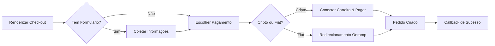

Os componentes de checkout renderizam um layout de dois painéis: resumo do pedido de um lado, pagamento do outro. Eles suportam cripto e fiat, campos de formulário personalizados, opções de envio, códigos de desconto e gatilhos de fluxo de trabalho B3 opcionais. [Veja ao vivo](https://sdk-demo.anyspend.com/).

<Info>
  Para a **API REST de sessões de checkout** (fluxos baseados em sessão e impulsionados pelo backend), veja [Sessões de Checkout](/anyspend/checkout-sessions). Esta página cobre os **componentes de checkout React**.
</Info>

## Como funciona



## Início rápido

<Steps>
  <Step title="Instalar o SDK">
    ```bash
    npm install @b3dotfun/sdk
    ```
  </Step>
  <Step title="Importar o componente">
    ```tsx
    import { AnySpendCheckout } from "@b3dotfun/sdk/anyspend/react";
    ```
  </Step>
  <Step title="Renderizar o checkout">
    ```tsx title="Checkout Básico" icon="cart-shopping"
    <AnySpendCheckout
      recipientAddress="0xEndereçoDoComerciante..."
      destinationTokenAddress="0x833589fCD6eDb6E08f4c7C32D4f71b54bdA02913"
      destinationTokenChainId={8453}
      items={[
        {
          name: "Plano Pro - Mensal",
          description: "Acesso ilimitado a todas as funcionalidades",
          amount: "10000000", // 10 USDC (6 decimais)
          quantity: 1,
        },
      ]}
      organizationName="Acme Inc"
      organizationLogo="/acme-logo.svg"
      themeColor="#4f46e5"
      onSuccess={(result) => {
        console.log("Pagamento completo:", result.orderId);
      }}
    />;
    ```
  </Step>
</Steps>

---

## Componentes

### `<AnySpendCheckout>`

O componente principal de checkout renderiza um layout de dois painéis com um painel de resumo do pedido/carrinho e um painel de pagamento suportando opções de cripto e fiat. Inclui opcionalmente um painel de formulário para coletar informações do cliente, seleção de envio e códigos de desconto.

#### Propriedades principais

<ParamField path="recipientAddress" type="string" required>
  Endereço da carteira do comerciante para receber o pagamento
</ParamField>

<ParamField path="destinationTokenAddress" type="string" required>
  Endereço do contrato do token para liquidação (ex.: USDC)
</ParamField>

<ParamField path="destinationTokenChainId" type="number" required>
  ID da cadeia para liquidação (ex.: `8453` para Base)
</ParamField>

<ParamField path="items" type="CheckoutItem[]" required>
  Itens de linha exibidos no painel do carrinho
</ParamField>

#### Branding

<ParamField path="organizationName" type="string">
  Nome do comerciante mostrado no cabeçalho do checkout
</ParamField>

<ParamField path="organizationLogo" type="string">
  URL para o logo do comerciante
</ParamField>

<ParamField path="themeColor" type="string">
  Cor hexadecimal para o tema (ex.: `"#4f46e5"`)
</ParamField>

<ParamField path="buttonText" type="string">
  Texto personalizado para o botão de pagamento
</ParamField>

#### Resumo do pedido

<ParamField path="totalAmount" type="string">
  Substitui o total calculado em wei. Use quando o total difere da soma dos montantes dos itens (ex.: após descontos ou taxas).
</ParamField>

<ParamField path="shipping" type="string | { amount: string; label?: string }">
  Custo de envio. Passe uma string para o montante em wei, ou um objeto com um rótulo personalizado.
</ParamField>

<ParamField path="tax" type="string | { amount: string; label?: string; rate?: string }">
  Montante do imposto. Passe uma string para o montante em wei, ou um objeto com rótulo e taxa de exibição opcional (ex.: `"8,5%"`).
</ParamField>

<ParamField path="discount" type="string | { amount: string; label?: string; code?: string }">
  Montante do desconto (exibido como uma dedução). Passe uma string para o montante em wei, ou um objeto com rótulo e código opcional.
</ParamField>

<ParamField path="summaryLines" type="CheckoutSummaryLine[]">
  Itens adicionais de linha de resumo como taxas de plataforma, gorjetas ou cobranças de serviço
</ParamField>

#### Pagamento

<ParamField path="defaultPaymentMethod" type="PaymentMethod">
  Qual método de pagamento expandir inicialmente. Opções: `"crypto"`, `"coinbase"`, `"stripe"`.
</ParamField>

<ParamField path="senderAddress" type="string">
  Preencher previamente o endereço do remetente para mostrar saldos de token antes da conexão da carteira
</ParamField>

<ParamField path="checkoutSessionId" type="string">
  Vincule este checkout a uma sessão de checkout backend para rastreamento
</ParamField>

#### Callbacks

<ParamField path="onSuccess" type="(result: { txHash?: string; orderId?: string }) => void">
  Chamado após o pagamento bem-sucedido
</ParamField>

<ParamField path="onError" type="(error: Error) => void">
  Chamado em caso de erro de pagamento
</ParamField>

<ParamField path="returnUrl" type="string">
  URL para redirecionar após a conclusão do pagamento
</ParamField>

<ParamField path="returnLabel" type="string">
  Rótulo para o botão de retorno/redirecionamento
</ParamField>

#### Opções de exibição

<ParamField path="mode" type="'page' | 'embedded'" default="'page'">
  `page` para autônomo, `embedded` para inline dentro do seu layout
</ParamField>

<ParamField path="showPoints" type="boolean" default="false">
  Mostrar pontos ganhos no resumo do status do pedido
</ParamField>

<ParamField path="showOrderId" type="boolean" default="false">
  Mostrar o ID do pedido no resumo do status do pedido
</ParamField>

<ParamField path="footer" type="ReactNode | null">
  Rodapé personalizado para o resumo do pedido. Passe `null` para ocultar o rodapé "Powered by" padrão.
</ParamField>

#### Personalização

<ParamField path="slots" type="AnySpendSlots">
  Substituir seções da UI. Veja [Personalização](/anyspend/customization#slots).
</ParamField>

<ParamField path="content" type="AnySpendContent">
  Substituir textos/mensagens. Veja [Personalização](/anyspend/customization#content).
</ParamField>

<ParamField path="theme" type="AnySpendTheme">
  Configurar cores. Veja [Personalização](/anyspend/customization#theme).
</ParamField>

<ParamField path="classes" type="AnySpendCheckoutClasses">
  Sobrescritas de classes CSS. Veja [Personalização](/anyspend/customization#css-class-overrides).
</ParamField>

#### Formulários personalizados

Coletar informações do cliente durante o checkout usando um esquema JSON ou um componente React personalizado.

<ParamField path="formSchema" type="CheckoutFormSchema">
  Esquema JSON definindo campos para coletar do cliente (email, nome, endereço, etc.). Veja [CheckoutFormSchema](#checkoutformschema) abaixo.
</ParamField>

<ParamField path="formComponent" type="React.ComponentType<CheckoutFormComponentProps>">
  Componente React personalizado para renderizar como o formulário de checkout. Use isso quando `formSchema` não for flexível o suficiente.
</ParamField>

<ParamField path="onFormSubmit" type="(data: Record<string, unknown>) => void">
  Chamado quando os dados do formulário mudam. Os dados do formulário também são automaticamente incluídos no `callbackMetadata` do pedido.
</ParamField>

#### Opções de envio

<ParamField path="shippingOptions" type="ShippingOption[]">
  Array de opções de envio para exibir como um seletor de botão de rádio. O montante da opção selecionada é automaticamente adicionado ao total do pedido.
</ParamField>

<ParamField path="collectShippingAddress" type="boolean">
  Quando `true`, renderiza um formulário de endereço de envio (rua, cidade, estado, CEP, país). O endereço é incluído no `callbackMetadata` do pedido.
</ParamField>

<ParamField path="onShippingChange" type="(option: ShippingOption) => void">
  Chamado quando o usuário seleciona uma opção de envio
</ParamField>

#### Códigos de desconto

<ParamField path="enableDiscountCode" type="boolean">
  Mostrar um campo de entrada de código de desconto. Requer que `validateDiscount` seja definido.
</ParamField>

<ParamField path="validateDiscount" type="(code: string) => Promise<DiscountResult>">
  Função assíncrona para validar um código de desconto contra seu backend. Retorna um `DiscountResult` com o montante do desconto. O desconto validado é automaticamente aplicado ao total do pedido.
</ParamField>

<ParamField path="onDiscountApplied" type="(result: DiscountResult) => void">
  Chamado quando um código de desconto válido é aplicado
</ParamField>

---

### `<AnySpendCheckoutTrigger>`

Estende `AnySpendCheckout` com integração de fluxo de trabalho B3. Quando um usuário completa o pagamento, um fluxo de trabalho B3 é automaticamente acionado com os dados do pagamento e qualquer metadado personalizado.

```tsx title="Checkout com Workflow" icon="bolt"
import { AnySpendCheckoutTrigger } from "@b3dotfun/sdk/anyspend/react";

<AnySpendCheckoutTrigger
  recipientAddress="0xEndereçoDoComerciante..."
  destinationTokenAddress="0x833589fCD6eDb6E08f4c7C32D4f71b54bdA02913"
  destinationTokenChainId={8453}
  items={[
    { name: "Plano Pro", amount: "10000000", quantity: 1 },
  ]}
  workflowId="wf_provision_subscription"
  orgId="org_acme"
  callbackMetadata={{
    inputs: {
      plan: "pro",
      userId: "user_123",
      email: "user@example.com",
    },
  }}
  onSuccess={(result) => console.log("Workflow acionado:", result)}
/>;
```

#### Propriedades do Workflow

Todas as propriedades de `<AnySpendCheckout>` são suportadas, além de:

<ParamField path="workflowId" type="string">
  ID do fluxo de trabalho B3 para acionar após o pagamento bem-sucedido
</ParamField>

<ParamField path="orgId" type="string">
  ID da organização que possui o fluxo de trabalho
</ParamField>

<ParamField path="callbackMetadata" type="object">
  Metadados mesclados ao pedido. O campo `inputs` é acessível nos fluxos de trabalho via `{{root.result.inputs.*}}`.
</ParamField>

<ParamField path="items" type="CheckoutItem[]">
  Opcional para `AnySpendCheckoutTrigger` — se omitido, apenas o painel de pagamento é mostrado (sem carrinho).
</ParamField>

<ParamField path="totalAmount" type="string">
  Necessário quando `items` não é fornecido (já que não há nada para calcular um total).
</ParamField>

---

## Tipos

### CheckoutItem

Cada item no carrinho de checkout:

```typescript title="CheckoutItem" icon="code"
interface CheckoutItem {
  /** Identificador único para o item */
  id?: string;
  /** Nome do item */
  name: string;
  /** Descrição curta */
  description?: string;
  /** URL da imagem do item */
  imageUrl?: string;
  /** Preço em wei (menor unidade do token de destino) */
  amount: string;
  /** Quantidade */
  quantity: number;
  /** Metadados personalizados exibidos como pares de rótulo: valor (ex.: { "Tamanho": "Grande" }) */
  metadata?: Record<string, string>;
}
```

### CheckoutSummaryLine

Itens de linha adicionais no resumo do pedido:

```typescript title="CheckoutSummaryLine" icon="code"
interface CheckoutSummaryLine {
  /** Rótulo de exibição (ex.: "Taxa de Plataforma", "Gorjeta") */
  label: string;
  /** Montante em wei. Valores negativos são mostrados como deduções. */
  amount: string;
  /** Descrição ou nota opcional */
  description?: string;
}
```

### CheckoutFormSchema

Defina campos de formulário personalizados usando um esquema JSON:

```typescript title="CheckoutFormSchema" icon="code"
interface CheckoutFormSchema {
  fields: CheckoutFormField[];
}

interface CheckoutFormField {
  /** Identificador único do campo */
  id: string;
  /** Tipo do campo */
  type: "text" | "email" | "phone" | "textarea" | "select" | "number" | "checkbox" | "address";
  /** Rótulo de exibição */
  label: string;
  /** Texto de espaço reservado */
  placeholder?: string;
  /** Se o campo é obrigatório */
  required?: boolean;
  /** Valor padrão */
  defaultValue?: string;
  /** Opções para campos do tipo "select" */
  options?: { label: string; value: string }[];
  /** Regras de validação */
  validation?: {
    pattern?: string;
    minLength?: number;
    maxLength?: number;
    min?: number;
    max?: number;
  };
}
```

<Tip>
  O tipo de campo `"address"` renderiza automaticamente um formulário de endereço completo (rua, cidade, estado, CEP, país) — não é necessário definir cada subcampo.
</Tip>

### ShippingOption

```typescript title="ShippingOption" icon="code"
interface ShippingOption {
  /** Identificador único da opção */
  id: string;
  /** Nome de exibição (ex.: "Envio Padrão") */
  name: string;
  /** Descrição opcional */
  description?: string;
  /** Custo em wei */
  amount: string;
  /** Tempo estimado de entrega (ex.: "5-7 dias úteis") */
  estimated_days?: string;
}
```

### DiscountResult

Retornado pela sua função `validateDiscount`:

```typescript title="DiscountResult" icon="code"
interface DiscountResult {
  /** Se o código é válido */
  valid: boolean;
  /** Tipo de desconto */
  discount_type?: "percentage" | "fixed";
  /** O valor do desconto (ex.: "10" para 10%) */
  discount_value?: string;
  /** Montante do desconto calculado em wei */
  discount_amount?: string;
  /** Montante final após desconto em wei */
  final_amount?: string;
  /** Mensagem de erro se inválido */
  error?: string;
}
```

### AddressData

Estrutura para endereços de envio coletados:

```typescript title="AddressData" icon="code"
interface AddressData {
  rua: string;
  cidade: string;
  estado: string;
  cep: string;
  país: string;
}
```

### CheckoutFormComponentProps

Propriedades passadas para componentes de formulário personalizados (via `formComponent` ou o slot `checkoutForm`):

```typescript title="CheckoutFormComponentProps" icon="code"
interface CheckoutFormComponentProps {
  /** Chamar quando os valores do formulário mudarem */
  onSubmit: (data: Record<string, unknown>) => void;
  /** Sinalizar se o formulário é válido */
  onValidationChange: (isValid: boolean) => void;
  /** Dados atuais do formulário */
  formData: Record<string, unknown>;
  /** Atualizar dados do formulário */
  setFormData: (data: Record<string, unknown>) => void;
}
```

---

## Exemplos

### Loja de e-commerce

```tsx title="Checkout Completo de E-Commerce" icon="store"
function CheckoutPage({ cart, shippingAddress }) {
  const subtotal = cart.reduce(
    (sum, item) => sum + BigInt(item.amount) * BigInt(item.quantity),
    0n
  );

  return (
    <AnySpendCheckout
      mode="page"
      recipientAddress="0xEndereçoDaCarteiraDoComerciante..."
      destinationTokenAddress="0x833589fCD6eDb6E08f4c7C32D4f71b54bdA02913"
      destinationTokenChainId={8453}

      // Itens do carrinho
      items={cart.map((item) => ({
        name: item.name,
        description: item.variant,
        imageUrl: item.imageUrl,
        amount: item.amount,
        quantity: item.quantity,
        metadata: {
          "Tamanho": item.size,
          "Cor": item.color,
        },
      }))}

      // Resumo do pedido
      shipping={{ amount: "2000000", label: "Envio Padrão" }}
      tax={{ amount: "850000", label: "Imposto sobre Vendas
