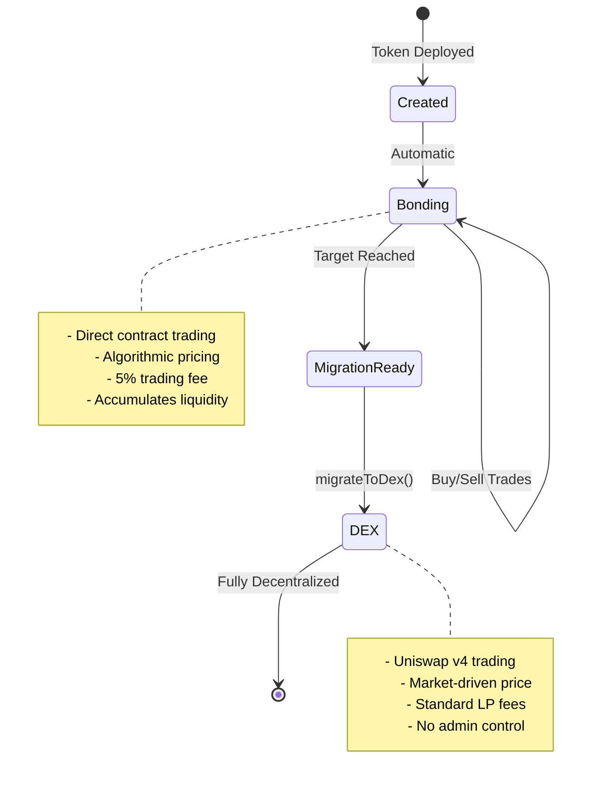
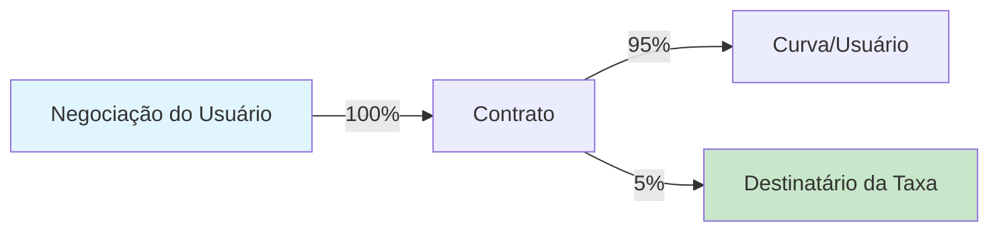

## O que é a Fase de Vinculação?

A fase de vinculação é o período inicial de negociação onde tokens são comprados e vendidos diretamente de um contrato inteligente usando uma curva de precificação algorítmica. Pense nisso como uma pré-venda descentralizada com criação de mercado automática.



## Como Funciona a Vinculação

### O Mecanismo da Curva de Vinculação

Durante a vinculação, o contrato atua como o único formador de mercado:

1. **Sem Livro de Ordens**: Preços determinados algoritmicamente
2. **Liquidez Instantânea**: Sempre possível comprar ou vender
3. **Independência de Caminho**: Preço depende apenas da oferta, não do histórico
4. **Precificação Automática**: Não é necessário definir preços manualmente

## Operações de Negociação

### Comprando Tokens

<Tabs>
  <Tab title="Como Funciona">
    **Fluxo do Processo:**
    1. Usuário envia ETH/B3 para o contrato
    2. Contrato calcula tokens baseado na curva
    3. Taxa de 5% deduzida e enviada ao destinatário
    4. Tokens cunhados e enviados ao comprador
    5. Estado da curva atualizado
    
    **Exemplo de Código:**
    ```typescript
    // Obtenha uma cotação primeiro
    const quote = await token.getAmountOfTokensToBuy(
      parseEther("1") // 1 ETH
    );
    console.log(`Will receive: ${formatEther(quote)} tokens`);
    
    // Execute a compra com proteção contra deslizamento
    const minTokens = quote * 0.95n; // 5% de deslizamento
    await token.buy(minTokens, "1");
    ```
  </Tab>
  
  <Tab title="Parâmetros">
    | Parâmetro | Tipo | Descrição |
    |-----------|------|-------------|
    | `minTokensOut` | uint256 | Mínimo de tokens a receber (proteção contra deslizamento) |
    | `ethAmount` | string/uint256 | Quantidade de ETH a gastar |
    
    **Notas Importantes:**
    - Defina `minTokensOut` para proteger contra front-running
    - Use 0 para `minTokensOut` apenas em períodos de baixa atividade
    - Transação reverte se o deslizamento exceder a tolerância
  </Tab>
  
  <Tab title="Casos de Borda">
    **Excedente do Alvo:**
    - Se a compra exceder o alvo, o excesso é reembolsado
    - Exemplo: Alvo é 10 ETH, arrecadado é 9.5 ETH
    - Usuário envia 1 ETH → 0.5 ETH usado, 0.5 ETH reembolsado
    
    **Gás Insuficiente:**
    - Limite de gás recomendado: 200,000
    - Cálculos complexos podem requerer mais
    
    **Quantidade Zero:**
    - Transações com 0 ETH serão revertidas
  </Tab>
</Tabs>

### Vendendo Tokens

<Tabs>
  <Tab title="Como Funciona">
    **Fluxo do Processo:**
    1. Usuário autoriza gasto do token
    2. Usuário chama sell com quantidade de tokens
    3. Contrato calcula ETH baseado na curva
    4. Taxa de 5% deduzida dos rendimentos
    5. ETH enviado ao vendedor, tokens queimados
    6. Estado da curva atualizado (preço diminui)
    
    **Exemplo de Código:**
    ```typescript
    // Verifique o saldo e obtenha uma cotação
    const balance = await token.balanceOf(userAddress);
    const sellAmount = balance / 2n; // Vender metade
    
    const quote = await token.getAmountOfEthToReceive(
      sellAmount
    );
    console.log(`Will receive: ${formatEther(quote)} ETH`);
    
    // Execute a venda com proteção contra deslizamento
    const minEth = quote * 0.95n; // 5% de deslizamento
    await token.sell(sellAmount, minEth);
    ```
  </Tab>
  
  <Tab title="Parâmetros">
    | Parâmetro | Tipo | Descrição |
    |-----------|------|-------------|
    | `tokenAmount` | uint256 | Quantidade de tokens a vender |
    | `minEthOut` | uint256 | Mínimo de ETH a receber (proteção contra deslizamento) |
    
    **Notas Importantes:**
    - Requer autorização do token antes de vender
    - Impacto no preço pode ser significativo para vendas grandes
    - Não pode vender mais do que a oferta circulante
  </Tab>
  
  <Tab title="Impacto no Preço">
    **Entendendo o Impacto da Venda:**
    
    Vender reduz a quantidade arrecadada pela curva, causando queda no preço:
    
    | Tamanho da Venda | Impacto no Preço | Recuperação Necessária |
    |-----------|--------------|-----------------|
    | 1% da oferta | ~1-2% | Pequena |
    | 5% da oferta | ~5-10% | Moderada |
    | 10% da oferta | ~15-25% | Significativa |
    | 20% da oferta | ~30-50% | Grande |
    
    *O impacto real depende do fator de agressividade*
  </Tab>
</Tabs>

## Estrutura de Taxas

### Como Funcionam as Taxas



<AccordionGroup>
  <Accordion title="Taxas de Compra">
    **Em uma compra de 1 ETH:**
    - 0.95 ETH vai para a curva de vinculação
    - 0.05 ETH vai para o destinatário da taxa
    - Tokens calculados com base no valor de 0.95 ETH
    
    **Exemplo:**
    ```typescript
    // Usuário envia 1 ETH
    // Taxa: 0.05 ETH
    // Curva recebe: 0.95 ETH
    // Tokens cunhados com base em 0.95 ETH
    ```
  </Accordion>
  
  <Accordion title="Taxas de Venda">
    **Ao vender por um valor de 1 ETH:**
    - Usuário recebe 0.95 ETH
    - 0.05 ETH vai para o destinatário da taxa
    - Curva reduzida pelo 1 ETH completo
    
    **Exemplo:**
    ```typescript
    // Tokens valem 1 ETH na curva
    // Taxa: 0.05 ETH
    // Usuário recebe: 0.95 ETH
    // Curva cai por 1 ETH
    ```
  </Accordion>
  
  <Accordion title="Distribuição de Taxas">
    **Para onde vão as taxas:**
    - 100% para o endereço `feeRecipient` designado
    - Pode ser o tesouro do projeto, desenvolvedor, ou DAO
    - Definido na criação do token, não pode ser alterado
    
    **Reivindicando taxas:**
    - Automático - não é necessário reivindicar
    - Enviado diretamente em cada negociação
    - Sem acumulação no contrato
  </Accordion>
</AccordionGroup>

### Economia das Taxas

| Volume Diário | Renda de Taxas | Renda Mensal |
|-------------|------------|----------------|
| 10 ETH | 0.5 ETH | ~15 ETH |
| 50 ETH | 2.5 ETH | ~75 ETH |
| 100 ETH | 5 ETH | ~150 ETH |
| 500 ETH | 25 ETH | ~750 ETH |

## Mecânica do Alvo

### Entendendo o Alvo

O alvo é a quantidade de ETH/B3 que deve ser acumulada antes da migração:

<Info>
  **Propósito do Alvo:**
  - Garante liquidez suficiente para o Uniswap v4
  - Cria um objetivo claro para a comunidade
  - Impede migração prematura
  - Constrói momentum durante a vinculação
</Info>

### Aproximando-se do Alvo

```typescript
// Monitorar progresso em direção ao alvo
async function trackProgress(token: BondkitToken) {
  const progress = await token.getBondingProgress();
  
  if (progress.progress < 0.5) {
    console.log("🌱 Estágio inicial - melhores preços disponíveis");
  } else if (progress.progress < 0.8) {
    console.log("🚀 Momentum crescendo - considere comprar");
  } else if (progress.progress < 1.0) {
    console.log("🔥 Quase lá - migração iminente");
  } else {
    console.log("✅ Alvo alcançado - pronto para migrar!");
  }
  
  o restante = progress.threshold - progress.raised;
  console.log(`Precisa de mais ${formatEther(remaining)} ETH`);
}
```

### Tratamento de Excedente

Quando uma compra excederia o alvo:

1. **Preenchimento Parcial**: Apenas a quantidade necessária é aceita
2. **Reembolso Automático**: Excesso retornado na mesma transação
3. **Conclusão Justa**: Ninguém pode pagar a mais no final

**Cenário de Exemplo:**
```
Alvo: 100 ETH
Atual: 99.5 ETH
Usuário envia: 2 ETH

Resultado:
- 0.5 ETH aceito (atinge exatamente 100 ETH)
- 1.5 ETH reembolsado
- Usuário recebe tokens por 0.5 ETH
- Migração agora disponível
```

## Eventos & Monitoramento

### Eventos do Contrato

<Tabs>
  <Tab title="Evento de Compra">
    ```solidity
    event BondingCurveBuy(
        address indexed payer,
        address indexed recipient,
        uint256 tradingTokenIn,
        uint256 tokensOut,
        uint256 fee,
        uint256 totalRaisedBonding
    );
    ```
    
    **Ouvindo no SDK:**
    ```typescript
    token.onBuy((event) => {
      console.log({
        comprador: event.payer,
        ethGasto: formatEther(event.tradingTokenIn),
        tokensRecebidos: formatEther(event.tokensOut),
        taxaPaga: formatEther(event.fee),
        totalArrecadado: formatEther(event.totalRaisedBonding)
      });
    });
    ```
  </Tab>
  
  <Tab title="Evento de Venda">
    ```solidity
    event BondingCurveSell(
        address indexed seller,
        uint256 tokensIn,
        uint256 tradingTokenOut,
        uint256 fee,
        uint256 totalRaisedBonding
    );
    ```
    
    **Ouvindo no SDK:**
    ```typescript
    token.onSell((event) => {
      console.log({
        vendedor: event.seller,
        tokensVendidos: formatEther(event.tokensIn),
        ethRecebido: formatEther(event.tradingTokenOut),
        taxaPaga: formatEther(event.fee),
        totalArrecadado: formatEther(event.totalRaisedBonding)
      });
    });
    ```
  </Tab>
</Tabs>

### Monitoramento em Tempo Real

```typescript
// Configuração completa de monitoramento
class BondingMonitor {
  constructor(private token: BondkitToken) {}
  
  async start() {
    // Estado inicial
    const progress = await this.token.getBondingProgress();
    console.log(`Iniciando em ${(progress.progress * 100).toFixed(2)}%`);
    
    // Monitorar compras
    this.token.onBuy(async (event) => {
      const newProgress = await this.token.getBondingProgress();
      console.log(`COMPRA: ${formatEther(event.tokensOut)} tokens`);
      console.log(`Progresso: ${(newProgress.progress * 100).toFixed(2)}%`);
      
      if (newProgress.progress >= 1.0) {
        console.log("🎆 ALVO ATINGIDO! Migração disponível.");
      }
    });
    
    // Monitorar vendas
    this.token.onSell(async (event) => {
      const newProgress = await this.token.getBondingProgress();
      console.log(`VENDA: ${formatEther(event.tokensIn)} tokens`);
      console.log(`Progresso: ${(newProgress.progress * 100).toFixed(2)}%`);
    });
  }
}

// Uso
const monitor = new BondingMonitor(token);
await monitor.start();
```

## Estratégias da Fase de Vinculação

### Para Criadores de Tokens

<CardGroup cols={2}>
  <Card title="Construir Momentum" icon="chart-line">
    - Comece com menor agressividade (30-50)
    - Defina alvos alcançáveis
    - Engaje a comunidade cedo
    - Forneça um roteiro claro
  </Card>
  
  <Card title="Maximizar Sucesso" icon="trophy">
    - Semeie a liquidez inicial você mesmo
    - Crie incentivos para compra
    - Planeje anúncios com cuidado
    - Planeje para pós-migração
  </Card>
</CardGroup>

### Para Traders

<CardGroup cols={2}>
  <Card title="Estratégia de Entrada" icon="door-open">
    - Compre cedo pelos melhores preços
    - Use DCA para grandes quantidades
    - Monitore o fator de agressividade
    - Verifique o progresso do alvo
  </Card>
  
  <Card title="Gestão de Risco" icon="shield">
    - Sempre use proteção contra deslizamento
    - Entenda o impacto no preço
    - Não entre em FOMO perto do alvo
    - Planeje estratégia de saída
  </Card>
</CardGroup>

## Transição Pós-Vinculação

<Warning>
  **Crítico: Após a Migração**
  
  Uma vez chamado `migrateToDex()`:
  - ❌ Negociação na curva de vinculação permanentemente desabilitada
  - ❌ Nenhuma função de buy() ou sell() mais
  - ✅ Todas as negociações movem-se para o Uniswap v4
  - ✅ Mecânicas AMM padrão aplicam-se
  - ✅ Qualquer um pode fornecer liquidez
  - ✅ Negociação totalmente descentralizada
</Warning>

## Próximos Passos

<CardGroup cols={3}>
  <Card title="Guia de Precificação" icon="tags" href="/bondkit/concepts/pricing">
    Entenda a mecânica de preços
  </Card>
  <Card title="Definição de Alvo" icon="bullseye" href="/bondkit/concepts/targets">
    Escolha o alvo certo
  </Card>
  <Card title="Processo de Migração" icon="rocket" href="/bondkit/guides/migration">
    Aprenda sobre a transição para DEX
  </Card>
</CardGroup>
