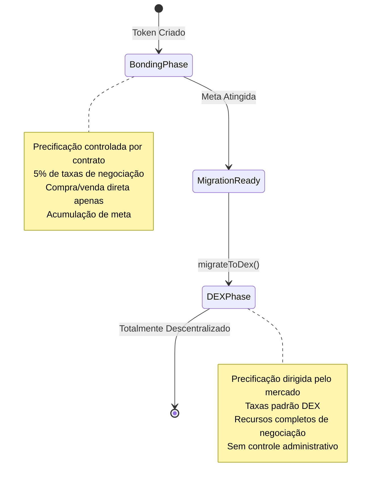

## O que é a Fase DEX?

A fase DEX é a etapa final do ciclo de vida de um token Bondkit, onde a negociação transita da curva de bonding automatizada para um pool totalmente descentralizado no Uniswap v4. Esta fase começa imediatamente após a migração e representa a descentralização completa.



## Como Funciona a Migração

### O Processo de Transição

Quando `migrateToDex()` é chamado após atingir a meta:

1. **Status do Contrato**: Status do token muda para `TokenStatus.Dex`
2. **Pool Uniswap v4**: Novo pool criado com liquidez acumulada
3. **Inicialização do Preço**: Preço inicial do pool calculado a partir do preço de saída da curva de bonding
4. **Renúncia de Propriedade**: Propriedade do contrato transferida para o endereço zero
5. **Negociação Habilitada**: Negociação completa DEX começa imediatamente

### Configuração do Pool

**Configuração Automática do Pool:**
```typescript
// Pool é criado com estes parâmetros (da migração)
const poolConfig = {
  currency0: tradingToken < bondkitToken ? tradingToken : bondkitToken,
  currency1: tradingToken < bondkitToken ? bondkitToken : tradingToken,
  fee: 3000,        // Taxa padrão de 0.3%
  tickSpacing: 60,  // Espaçamento padrão de ticks
  hooks: customHook // Hooks específicos do Bondkit
};
```

**Liquidez Inicial:**
- **Token de Negociação**: Todos os fundos acumulados da fase de bonding
- **Tokens Bondkit**: Quantidade calculada para corresponder ao preço de saída
- **Tokens LP**: Divididos entre o destinatário da taxa e queimados/distribuídos

## Negociação na Fase DEX

### Opções de Negociação

**Negociação DEX Padrão:**
Tokens Bondkit na fase DEX podem ser negociados usando qualquer interface compatível com Uniswap v4, agregador DEX ou plataforma de negociação.

**SDK Helper (Opcional):**
O SDK fornece `BondkitSwapService` para integração simplificada, se necessário.

### Descoberta de Preço & Liquidez

**Precificação Dirigida pelo Mercado:**
- Sem mais curva de bonding algorítmica
- Preço determinado por oferta/demanda
- Dinâmica de livro de ordens em tempo real
- Sujeito a volatilidade do mercado

**Fontes de Liquidez:**
```typescript
// Liquidez inicial da migração
const migrationData = {
  tradingTokenLiquidity: "10.0",    // ETH/B3 da bonding
  bondkitTokenLiquidity: "500000",  // Quantidade de token calculada
  initialPrice: "0.00002",          // Preço por token
  totalValueLocked: "20.0"          // TVL combinado
};

// Liquidez adicional de:
// - LPs da comunidade
// - Programas de incentivo  
// - Acumulação de taxas de negociação
```

## Principais Diferenças da Fase de Bonding

### Mecânicas de Negociação

| Aspecto | Fase de Bonding | Fase DEX |
|--------|--------------|-----------|
| **Precificação** | Curva algorítmica | Oferta/demanda do mercado |
| **Liquidez** | Ilimitada (contrato emite) | Liquidez limitada do pool |
| **Taxas** | 5% para o destinatário da taxa | 0.3% para LPs + protocolo |
| **Tipos de Ordem** | Compra/venda apenas | Recursos completos DEX |
| **Impacto no Preço** | Curva previsível | Depende da profundidade da liquidez |
| **MEV** | Não aplicável | Sujeito a MEV |

### Mudanças no Contrato Inteligente

**Transição de Status:**
```typescript
// Verificar fase atual
const status = await token.getStatus();

if (status === TokenStatus.Dex) {
  // Usar métodos de negociação DEX
  const swapService = new BondkitSwapService(tokenAddress);
  // ... código de negociação DEX
} else if (status === TokenStatus.Bonding) {
  // Usar métodos da curva de bonding
  await token.buy(amount, minTokensOut);
}
```

**Disponibilidade de Método:**
- ✅ `token.buy()` / `token.sell()` - **Desabilitado** (vai reverter)
- ✅ Negociação DEX via `BondkitSwapService`
- ✅ Funcionalidade ERC20 padrão continua
- ✅ Monitoramento de eventos para negociações DEX

## Recursos Avançados DEX

### Integração de Hooks Personalizados

Tokens Bondkit no Uniswap v4 incluem hooks personalizados para funcionalidades aprimoradas:

```typescript
// Recursos do hook (aplicados automaticamente)
const hookFeatures = {
  beforeSwap: "Cálculos de taxa personalizados",
  afterSwap: "Rastreamento de análises", 
  beforeAddLiquidity: "Recompensas LP",
  afterRemoveLiquidity: "Manuseio de taxa de saída"
};
```

### Análises & Monitoramento

**Dados em Tempo Real:**
```typescript
import TradingView from "@b3dotfun/sdk/bondkit/components/TradingView";

// Gráficos profissionais com dados DEX
function DEXTradingInterface({ tokenAddress, tokenSymbol }) {
  return (
    <div className="space-y-6">
      {/* Gráfico de preço com dados DEX */}
      <TradingView 
        tokenAddress={tokenAddress}
        tokenSymbol={tokenSymbol}
        className="h-96 w-full"
      />
      
      {/* Interface de negociação */}
      <SwapInterface tokenAddress={tokenAddress} />
    </div>
  );
}
```

**Métricas Disponíveis:**
- Feeds de preço em tempo real
- Volume e mudança de 24h  
- Profundidade de liquidez
- Dados históricos OHLCV
- Histórico de transações
- Análises de detentores

### Provisão de Liquidez

**Tornando-se um LP:**
```typescript
// Adicionar liquidez ao pool de token Bondkit
import { Pool, Position } from "@uniswap/v3-sdk";

const position = new Position({
  pool: bondkitPool,
  liquidity: targetLiquidity,
  tickLower: lowerTick,
  tickUpper: upperTick
});

// Ganhar taxas de negociação + incentivos potenciais
```

**Benefícios LP:**
- **Taxas de Negociação**: Ganhar 0.3% de todo o volume de swap
- **Programas de Incentivo**: Recompensas adicionais potenciais
- **Valorização do Preço**: Beneficiar-se do crescimento do token
- **Perda Impermanente**: Riscos padrão AMM aplicam-se

## Análise de Impacto da Migração

### Para Detentores de Token

**Efeitos Imediatos:**
- ✅ Tokens permanecem totalmente transferíveis
- ✅ Podem negociar no mercado aberto
- ✅ Sem períodos de bloqueio
- ⚠️ Preço agora sujeito a volatilidade do mercado
- ⚠️ Sem liquidez garantida (depende da profundidade do pool)

**Benefícios a Longo Prazo:**
- 🚀 Acesso a um ecossistema de negociação maior
- 🚀 Integração com protocolos DeFi
- 🚀 Composabilidade com outros tokens
- 🚀 Verdadeira descentralização alcançada

### Para Projetos

**Mudanças Operacionais:**
```typescript
// Pré-migração: Controle direto
await token.buy(amount, minOut);    // ✅ Funciona
await token.migrateToDex();         // Ação única

// Pós-migração: Baseado no mercado
await token.buy(amount, minOut);    // ❌ Reverte
await swapService.executeSwap(...); // ✅ Use isso em vez disso
```

**Novas Responsabilidades:**
- **Construção de Comunidade**: Impulsionar volume de negociação orgânico
- **Incentivos de Liquidez**: Encorajar participação LP  
- **Marketing**: Promover utilidade e adoção do token
- **Integração**: Listar em agregadores e plataformas DEX

## Melhores Práticas para a Fase DEX

### Para Traders

<AccordionGroup>
  <Accordion title="Estratégias de Negociação Ótimas">
    **Gerenciamento de Slippage:**
    - Use slippage de 0.5-2% para pequenas negociações
    - Slippage maior para quantidades maiores
    - Verifique o impacto no preço antes da execução
    
    **Considerações de Tempo:**
    - Maior liquidez durante horários ativos
    - Monitorar grandes movimentos de LP
    - Usar ordens limitadas quando disponível
    
    **Exemplo:**
    ```typescript
    const quote = await swapService.getSwapQuote({
      // ... parâmetros
      slippageTolerance: parseFloat(quote.priceImpact) > 5 ? 0.02 : 0.005
    });
    ```
  </Accordion>
  
  <Accordion title="Gerenciamento de Risco">
    **Análise de Liquidez:**
    - Verificar TVL do pool antes de grandes negociações
    - Monitorar atividade do provedor de liquidez
    - Entender perda impermanente se LP
    
    **Monitoramento de Preço:**
    - Configurar alertas de preço
    - Usar estratégias de stop-loss
    - Diversificar entre vários tokens
  </Accordion>
</AccordionGroup>

### Para Desenvolvedores

<AccordionGroup>
  <Accordion title="Padrões de Integração">
    **Verificação de Status:**
    ```typescript
    async function getOptimalTradingMethod(token: BondkitToken) {
      const status = await token.getStatus();
      
      if (status === TokenStatus.Bonding) {
        return {
          method: "bonding",
          interface: token
        };
      } else if (status === TokenStatus.Dex) {
        return {
          method: "dex", 
          interface: new BondkitSwapService(token.contractAddress)
        };
      }
    }
    ```
    
    **Tratamento de Erros:**
    ```typescript
    try {
      // Sempre verificar a fase primeiro
      const tradingMethod = await getOptimalTradingMethod(token);
      
      if (tradingMethod.method === "dex") {
        await tradingMethod.interface.executeSwap(params, wallet);
      }
    } catch (error) {
      if (error.message.includes("TradingDisabledDexPhaseActive")) {
        // Mudar para negociação DEX
        const swapService = new BondkitSwapService(tokenAddress);
        await swapService.executeSwap(params, wallet);
      }
    }
    ```
  </Accordion>
</AccordionGroup>

## Perguntas Comuns

<AccordionGroup>
  <Accordion title="Os tokens podem voltar para a fase de bonding?">
    **Não** - A migração é permanente e irreversível. Uma vez na fase DEX, o token sempre negociará no Uniswap v4.
  </Accordion>
  
  <Accordion title="O que acontece com a liquidez não utilizada da curva de bonding?">
    Todos os tokens de negociação acumulados da fase de bonding tornam-se a liquidez inicial no pool Uniswap v4, emparelhados com tokens bondkit calculados ao preço de saída.
  </Accordion>
  
  <Accordion title="Existem restrições na fase DEX?">
    Sem restrições - os tokens tornam-se ERC20s padrão negociando no Uniswap v4. A composabilidade completa DeFi é habilitada.
  </Accordion>
  
  <Accordion title="Como as taxas de negociação são diferentes?">
    A fase DEX utiliza taxas padrão do Uniswap v4 (0.3%) que vão para os provedores de liquidez em vez da taxa de 5% da fase de bonding para o destinatário da taxa.
  </Accordion>
</AccordionGroup>

## Próximos Passos

<CardGroup cols={2}>
  <Card title="Começar a Negociação DEX" icon="arrow-right" href="/bondkit/sdk/reference#bondkitswapservice">
    Aprenda a usar BondkitSwapService para negociação DEX
  </Card>
  <Card title="Adicionar Gráficos de Negociação" icon="chart-line" href="/bondkit/sdk/reference#tradingview-component">  
    Integre gráficos TradingView para seus tokens DEX
  </Card>
  <Card title="Tornar-se um LP" icon="coins" href="https://app.uniswap.org">
    Forneça liquidez e ganhe taxas de negociação
  </Card>
  <Card title="Monitorar Análises" icon="analytics" href="https://info.uniswap.org">
    Acompanhe o desempenho DEX do seu token  
  </Card>
</CardGroup>
