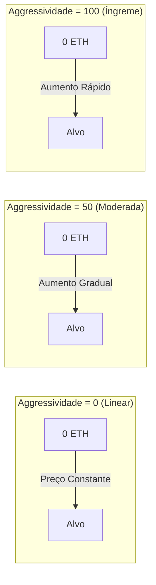

## Curvas de Preço Visual



## Modelo de Curva de Ligação

### Fórmula Matemática

<Note>
  **Fórmula Central**
  ```
  S = S_final × (R / R_alvo)^exponente
  ```
  Onde:
  - `S` = Fornecimento atual de tokens
  - `S_final` = Fornecimento final de tokens
  - `R` = Quantia arrecadada até agora
  - `R_alvo` = Quantia alvo
  - `exponente = 1 / (1 + fatorDeAggressividade/100)`
</Note>

### Entendendo o Exponente

O fator de agressividade controla como o expoente afeta a progressão do preço:

| Agressividade | Exponente | A Fórmula Torna-se | Comportamento do Preço |
|---------------|----------|-----------------|----------------|
| 0 | 1.00 | S = S_final × (R/R_alvo) | Linear - tokens constantes por ETH |
| 25 | 0.80 | S = S_final × (R/R_alvo)^0.80 | Levemente curvada |
| 50 | 0.67 | S = S_final × (R/R_alvo)^0.67 | Curva moderada |
| 75 | 0.57 | S = S_final × (R/R_alvo)^0.57 | Curva íngreme |
| 100 | 0.50 | S = S_final × √(R/R_alvo) | Muito íngreme (raiz quadrada) |

### Exemplos de Impacto no Preço

Vamos ver quantos tokens 1 ETH compra em diferentes estágios com uma meta de 10 ETH:

<Tabs>
  <Tab title="Agressividade = 0">
    **Preço Linear (Justo para todos)**
    
    | ETH Arrecadado | Tokens por ETH | Mudança de Preço |
    |------------|---------------|---------------|
    | 0 → 1 ETH | 100,000 | Base |
    | 4 → 5 ETH | 100,000 | 0% |
    | 9 → 10 ETH | 100,000 | 0% |
    
    *Todos recebem o mesmo acordo*
  </Tab>
  
  <Tab title="Agressividade = 50">
    **Curva Moderada (Equilibrada)**
    
    | ETH Arrecadado | Tokens por ETH | Mudança de Preço |
    |------------|---------------|---------------|
    | 0 → 1 ETH | 146,000 | Base |
    | 4 → 5 ETH | 87,000 | -40% |
    | 9 → 10 ETH | 51,000 | -65% |
    
    *Compradores iniciais recebem 3x mais que os tardios*
  </Tab>
  
  <Tab title="Agressividade = 100">
    **Curva Íngreme (Recompensa os primeiros)**
    
    | ETH Arrecadado | Tokens por ETH | Mudança de Preço |
    |------------|---------------|---------------|
    | 0 → 1 ETH | 316,000 | Base |
    | 4 → 5 ETH | 89,000 | -72% |
    | 9 → 10 ETH | 31,000 | -90% |
    
    *Compradores iniciais recebem 10x mais que os tardios*
  </Tab>
</Tabs>

## Calculadora de Preço Interativa

```typescript
// Calcula tokens recebidos para uma dada quantidade de ETH
function calculateTokensReceived(
  ethAmount: number,
  currentRaised: number,
  targetEth: number,
  totalSupply: number,
  aggressiveness: number
): number {
  const exponent = 1 / (1 + aggressiveness / 100);
  
  // Calcula fornecimento na quantia atual arrecadada
  const currentSupply = totalSupply * 
    Math.pow(currentRaised / targetEth, exponent);
  
  // Calcula fornecimento após compra
  const newRaised = currentRaised + ethAmount;
  const newSupply = totalSupply * 
    Math.pow(newRaised / targetEth, exponent);
  
  // Tokens recebidos = diferença no fornecimento
  return newSupply - currentSupply;
}

// Exemplo de uso
const tokens = calculateTokensReceived(
  1,        // Compra de 1 ETH
  5,        // 5 ETH já arrecadados
  10,       // Meta de 10 ETH
  1000000,  // Fornecimento total de 1M
  50        // 50% de agressividade
);
console.log(`Você receberá ${tokens.toFixed(0)} tokens`);
```

## Escolhendo Seu Fator de Agressividade

### Estrutura de Decisão

<CardGroup cols={3}>
  <Card title="Baixo (0-30)" icon="equals">
    **Melhor para:**
    - Lançamentos justos
    - Tokens comunitários
    - Preços estáveis
    
    **Prós:**
    - Oportunidade igual
    - Custos previsíveis
    - Menos FOMO
    
    **Contras:**
    - Sem incentivo inicial
    - Momento mais lento
  </Card>
  
  <Card title="Médio (30-70)" icon="chart-line">
    **Melhor para:**
    - A maioria dos projetos
    - Abordagem equilibrada
    - Recompensas moderadas
    
    **Prós:**
    - Alguma vantagem inicial
    - Ainda acessível
    - Bom momento
    
    **Contras:**
    - Complexidade moderada
    - Alguma variação de preço
  </Card>
  
  <Card title="Alto (70-100)" icon="rocket">
    **Melhor para:**
    - Lançamentos com hype
    - Recompensar adotantes iniciais
    - Arrecadação rápida
    
    **Prós:**
    - Forte incentivo inicial
    - Cria urgência
    - Recompensa os crentes
    
    **Contras:**
    - Pode parecer injusto
    - Alta variação de preço
    - Impulsionado por FOMO
  </Card>
</CardGroup>

## Mecânicas de Venda

Quando os usuários vendem tokens de volta para a curva:

1. **Cálculo de Preço**: Usa o inverso da fórmula de compra
2. **Dedução de Taxa**: Taxa de 5% aplicada aos rendimentos
3. **Atualização da Curva**: Reduz a quantia total arrecadada
4. **Impacto no Preço**: Vendas grandes impactam significativamente o preço

### Fórmula de Preço de Venda

```typescript
// Calcula o ETH recebido por vender tokens
function calculateEthReceived(
  tokenAmount: number,
  currentSupply: number,
  currentRaised: number,
  targetEth: number,
  totalSupply: number,
  aggressiveness: number
): number {
  const exponent = 1 / (1 + aggressiveness / 100);
  
  // Calcula novo fornecimento após venda
  const newSupply = currentSupply - tokenAmount;
  
  // Calcula a quantia correspondente arrecadada
  const supplyRatio = newSupply / totalSupply;
  const newRaised = targetEth * 
    Math.pow(supplyRatio, 1 / exponent);
  
  // ETH recebido (antes das taxas)
  const ethBeforeFees = currentRaised - newRaised;
  
  // Aplica taxa de 5%
  return ethBeforeFees * 0.95;
}
```

## Casos Limite & Limites

<Warning>
  **Considerações Importantes:**
  
  1. **Reembolsos**: Se uma compra exceder a meta, o excesso de ETH é reembolsado
  2. **Quantias Mínimas**: Negociações muito pequenas podem ser revertidas devido ao arredondamento
  3. **Fornecimento Máximo**: Não pode exceder `finalTokenSupply`
  4. **Limites de Preço**: Agressividade extrema pode causar picos de preço
  5. **Derrapagem**: Sempre use `minTokensOut` para proteção
</Warning>

## Exemplos do Mundo Real

### Estudo de Caso: Token de Lançamento Justo
- **Agressividade**: 10
- **Meta**: 50 ETH
- **Resultado**: Preço quase linear, comunidade apreciou a justiça

### Estudo de Caso: Token Hype
- **Agressividade**: 85
- **Meta**: 100 ETH
- **Resultado**: Alcançou a meta em 2 horas, compradores iniciais ganharam 8x

### Estudo de Caso: Projeto Equilibrado
- **Agressividade**: 45
- **Meta**: 25 ETH
- **Resultado**: Crescimento constante ao longo de 3 dias, vantagem de 2.5x para compradores iniciais

## Próximos Passos

<CardGroup cols={2}>
  <Card title="Definir Agressividade" icon="sliders" href="/bondkit/guides/set-aggressiveness">
    Aprenda a escolher o fator correto
  </Card>
  <Card title="Estimativa de Preço" icon="calculator" href="/bondkit/guides/est-migration-price">
    Estime seu preço de migração
  </Card>
</CardGroup>

