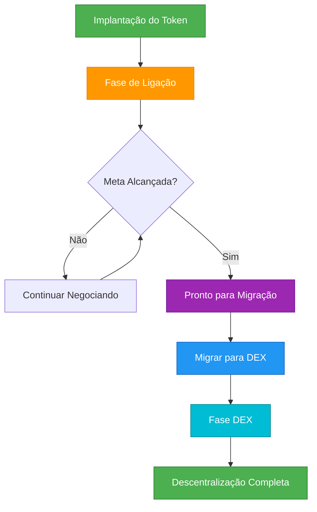

## Visão Geral

Este guia o conduz pelo ciclo de vida completo de um token Bondkit, desde a criação inicial até a descentralização total. Entender esse fluxo é essencial para lançamentos e gerenciamento de tokens bem-sucedidos.



## Fase 1: Criação do Token

### Planejamento Pré-Implantação

<AccordionGroup>
  <Accordion title="Escolha Seus Parâmetros">
    **Decisões Críticas:**
    
    | Parâmetro | Impacto | Recomendação |
    |-----------|---------|----------------|
    | **finalTokenSupply** | Total de tokens criados | 1M-100M tokens típico |
    | **aggressivenessFactor** | Inclinação da curva de preço | 30-60 para lançamentos equilibrados |
    | **targetAmount** | Limiar para migração | 5-50 tokens de negociação |
    | **tradingToken** | Com o que os usuários pagam | Use B3 para mainnet Base |
    
    **Exemplo de Configuração:**
    ```typescript
    const tokenConfig = {
      name: "MyToken",
      symbol: "MTK",
      finalTokenSupply: parseEther("10000000"), // 10M tokens
      aggressivenessFactor: 45, // Curva moderada
      targetAmount: parseEther("20"), // 20 tokens B3
      tradingToken: "0xB3B32F9f8827D4634fE7d973Fa1034Ec9fdDB3B3"
    };
    ```
  </Accordion>
  
  <Accordion title="Estrutura de Taxas">
    **Estratégia de Distribuição de Taxas:**
    
    ```typescript
    const feeConfig = {
      feeRecipient: "0x...", // Seu endereço de tesouraria/equipe
      lpSplitRatioFeeRecipientBps: 2000n, // 20% para o destinatário da taxa
      // Os 80% restantes se tornam tokens LP após a migração
    };
    ```
    
    **Fluxo de Taxas:**
    - **Fase de Ligação**: 5% de todas as negociações → `feeRecipient`
    - **Pós-Migração**: 0,3% de taxas de negociação → provedores de LP
  </Accordion>
</AccordionGroup>

### Execução da Implantação

```typescript
import { BondkitTokenFactory } from "@b3dotfun/sdk/bondkit";
import { base } from "viem/chains";

// 1. Inicialize a fábrica
const factory = new BondkitTokenFactory(
  base.id,
  process.env.WALLET_PRIVATE_KEY
);

// 2. Implante com a configuração completa
const tokenAddress = await factory.deployBondkitToken({
  // Metadados do token
  name: "MyToken",
  symbol: "MTK",
  
  // Economia
  finalTokenSupply: parseEther("10000000"),
  aggressivenessFactor: 45,
  targetAmount: parseEther("20"),
  
  // Estrutura de taxas  
  feeRecipient: process.env.TREASURY_ADDRESS,
  lpSplitRatioFeeRecipientBps: 2000n,
  
  // Administração & migração
  migrationAdminAddress: process.env.ADMIN_ADDRESS,
  
  // Configuração Uniswap V4
  bondingPhaseSplitter: "0x2AB69e0d9D20D3700466153D84a6574128154Fd2",
  v4PoolManager: "0x498581fF718922c3f8e6A244956aF099B2652b2b",
  v4Hook: "0xB36f4A2FB18b745ef8eD31452781a463d2B3f0cC",
  v4PoolFee: 3000,
  v4TickSpacing: 60,
  tradingToken: "0xB3B32F9f8827D4634fE7d973Fa1034Ec9fdDB3B3"
});

console.log(`✅ Token implantado: ${tokenAddress}`);
```

## Fase 2: Gerenciamento da Fase de Ligação

### Estratégia de Lançamento

<Tabs>
  <Tab title="Construção da Comunidade">
    **Checklist Pré-Lançamento:**
    - [ ] Contrato do token verificado no Basescan
    - [ ] Canais da comunidade estabelecidos (Discord/Telegram)  
    - [ ] Materiais de marketing preparados
    - [ ] Estratégia de compra inicial planejada
    - [ ] Painel de acompanhamento de preços pronto
    
    **Dia do Lançamento:**
    ```typescript
    // Conecte-se ao seu token
    const token = new BondkitToken(tokenAddress, privateKey);
    
    // Compra inicial para estabelecer o preço
    await token.buy(parseEther("1"), 0n); // 1 token B3
    
    // Anuncie o lançamento com dados reais
    const price = await token.getCurrentPrice();
    const progress = await token.getBondingProgress();
    
    console.log(`🚀 Ao vivo a ${formatEther(price)} B3 por token`);
    console.log(`🎯 ${(progress.progress * 100).toFixed(1)}% para migração`);
    ```
  </Tab>
  
  <Tab title="Monitoramento do Progresso">
    **Painel de Métricas Chave:**
    ```typescript
    async function getDashboardData(token) {
      const [
        tokenDetails,
        currentPrice, 
        progress,
        totalSupply,
        status
      ] = await Promise.all([
        token.getTokenDetails(),
        token.getCurrentPrice(),
        token.getBondingProgress(), 
        token.getTotalSupply(),
        token.currentStatus()
      ]);
      
      return {
        // Informações do Token
        name: tokenDetails.name,
        symbol: tokenDetails.symbol,
        
        // Economia
        currentPrice: formatEther(currentPrice),
        progress: (progress.progress * 100).toFixed(2) + '%',
        arrecadado: formatEther(progress.raised),
        meta: formatEther(progress.threshold),
        restante: formatEther(progress.threshold - progress.raised),
        
        // Suprimento
        suprimentoCirculante: formatEther(totalSupply),
        
        // Status
        fase: status === 1 ? 'Ligação' : status === 2 ? 'DEX' : 'Outro'
      };
    }
    
    // Use no seu painel
    const data = await getDashboardData(token);
    ```
  </Tab>
  
  <Tab title="Engajamento da Comunidade">
    **Atualizações em Tempo Real:**
    ```typescript
    // Configure o monitoramento de eventos para atualizações da comunidade
    token.onBuy((event) => {
      const announcement = `
        🟢 NOVA COMPRA: ${formatEther(event.tokensOut)} ${symbol}
        💰 Gasto: ${formatEther(event.ethIn)} B3
        👤 Comprador: ${event.buyer}
      `;
      
      // Poste no bot do Discord/Telegram
      postToDiscord(announcement);
    });
    
    token.onSell((event) => {
      const announcement = `
        🔴 VENDA: ${formatEther(event.tokensIn)} ${symbol}
        💰 Recebido: ${formatEther(event.ethOut)} B3  
        👤 Vendedor: ${event.seller}
      `;
      
      postToDiscord(announcement);
    });
    
    // Marcos de progresso
    const progress = await token.getBondingProgress();
    if (progress.progress >= 0.5 && progress.progress < 0.6) {
      postToDiscord("🎯 50% financiado! Metade do caminho para migração!");
    } else if (progress.progress >= 0.9) {
      postToDiscord("🔥 90% financiado! Migração iminente!");
    }
    ```
  </Tab>
</Tabs>

### Gerenciando a Curva de Ligação

**Indicadores de uma Fase de Ligação Saudável:**
- Volume de negociação constante
- Base de detentores crescendo  
- Engajamento ativo da comunidade
- Progresso em direção à meta (mas não muito rápido)
- Vendas grandes mínimas

**Sinais de Alerta:**
- Nenhuma atividade de negociação por mais de 24 horas
- Único "whale" controlando grande porcentagem
- Alcance rápido da meta sem comunidade
- Volatilidade excessiva por bots

## Fase 3: Prontidão para Migração

### Checklist Pré-Migração

```typescript
async function checkMigrationReadiness(token) {
  const [canMigrate, progress, status] = await Promise.all([
    token.canMigrate(),
    token.getBondingProgress(),
    token.currentStatus()
  ]);
  
  const checks = {
    metaAlcançada: canMigrate,
    progressoCompleto: progress.progress >= 1.0,
    aindaEmFaseDeLigação: status === 1,
    comunidadePronta: await checkCommunityConsensus(), // Sua lógica
    planoDeLiquidez: await checkPostMigrationPlan()     // Sua lógica
  };
  
  const tudoPronto = Object.values(checks).every(Boolean);
  
  return {
    pronto: tudoPronto,
    checks,
    recomendação: tudoPronto ? 
      "✅ Pronto para migrar!" : 
      "⏳ Resolva os problemas antes da migração"
  };
}
```

### Estratégia de Temporização da Migração

<AccordionGroup>
  <Accordion title="Temporização Ideal">
    **Melhores Práticas:**
    - Anuncie a migração com 24-48 horas de antecedência
    - Escolha um horário de alta atividade para sua comunidade
    - Garanta consenso suficiente da comunidade
    - Tenha marketing pós-migração pronto
    
    **Anúncio Pré-Migração:**
    ```typescript
    const migrationData = await token.getMigrationData();
    
    const announcement = `
      🚀 MIGRAÇÃO AGENDADA
      
      📊 Estatísticas Finais de Ligação:
      • Arrecadado: ${formatEther(progress.raised)} B3
      • Tokens Distribuídos: ${formatEther(totalSupply)}
      
      🔄 A Migração Criará:
      • LP Inicial: ${formatEther(migrationData.ethForLp)} B3 + tokens
      • Preço de Abertura: ~${calculateOpeningPrice(migrationData)} B3/token
      
      ⏰ Migração em 24 horas!
    `;
    ```
  </Accordion>
  
  <Accordion title="Execução da Migração">
    **O Processo de Migração:**
    ```typescript
    // Verificações finais
    const readiness = await checkMigrationReadiness(token);
    if (!readiness.ready) {
      throw new Error(`Não está pronto: ${JSON.stringify(readiness.checks)}`);
    }
    
    // Executar migração
    console.log("🔄 Iniciando migração para Uniswap V4...");
    const migrationTx = await token.migrateToDex();
    
    // Aguardar confirmação
    const receipt = await token.waitForTransaction(migrationTx);
    
    if (receipt.status === 'success') {
      console.log("✅ Migração bem-sucedida!");
      
      // Verificar novo status
      const newStatus = await token.currentStatus();
      console.log(`Status: ${newStatus === 2 ? 'Fase DEX' : 'Desconhecido'}`);
      
      // Anunciar à comunidade
      const announcement = `
        🎉 MIGRAÇÃO COMPLETA!
        
        📍 Agora negociando na Uniswap V4
        🔗 Transação: ${migrationTx}
        💫 Token agora é totalmente descentralizado!
      `;
      
      postToDiscord(announcement);
    }
    ```
  </Accordion>
</AccordionGroup>

## Fase 4: Operações na Fase DEX

### Imediatamente Pós-Migração (Primeiras 24 Horas)

```typescript
// Inicialize ferramentas de negociação DEX
import { BondkitSwapService } from "@b3dotfun/sdk/bondkit";

const swapService = new BondkitSwapService(tokenAddress);

// Verificar funcionalidade DEX
const isSwapAvailable = await token.isSwapAvailable();
if (isSwapAvailable) {
  console.log("✅ Negociação DEX ativa");
  
  // Testar cotação de troca
  const quote = await swapService.getSwapQuote({
    tokenIn: "0xB3B32F9f8827D4634fE7d973Fa1034Ec9fdDB3B3",
    tokenOut: tokenAddress,
    amountIn: "1",
    tokenInDecimals: 18,
    tokenOutDecimals: 18,
    slippageTolerance: 0.005,
    recipient: testAddress
  });
  
  console.log(`Preço DEX: ${quote.executionPrice} B3 por token`);
}
```

### Estratégia DEX de Longo Prazo

<Tabs>
  <Tab title="Gerenciamento de Liquidez">
    **Análise Inicial de Liquidez:**
    ```typescript
    async function analyzeLiquidity() {
      // Obter informações do pool (implementação depende da sua configuração)
      const poolData = await getUniswapV4PoolData(tokenAddress);
      
      return {
        valorTotalBloqueado: poolData.tvl,
        volumeNegociação24h: poolData.volume24h,
        impactoPreçoPara1k: await calculatePriceImpact(1000),
        utilizaçãoLiquidez: poolData.utilization,
        
        recomendações: {
          precisaMaisLiquidez: poolData.tvl < minimumTVL,
          deveIncentivar: poolData.utilization > 0.8,
          negociaçãoSaudável: poolData.volume24h > minimumVolume
        }
      };
    }
    ```
    
    **Programa de Incentivo à Liquidez:**
    ```typescript
    // Estrutura de recompensa LP de exemplo
    const lpIncentives = {
      rewardToken: tokenAddress,
      dailyRewards: parseEther("1000"), // 1000 tokens por dia
      minimumLPTime: 7 * 24 * 3600, // Mínimo de 7 dias
      bonusMultipliers: {
        week1: 2.0,  // 2x recompensas primeira semana
        month1: 1.5, // 1.5x recompensas primeiro mês
        longTerm: 1.0 // Recompensas padrão depois
      }
    };
    ```
  </Tab>
  
  <Tab title="Transição da Comunidade">
    **Conteúdo Educacional:**
    ```typescript
    const migrationGuideForUsers = {
      trading: {
        before: "Use token.buy() e token.sell()",
        after: "Use interfaces DEX ou swapService.executeSwap()",
        walletSetup: "Adicione o token ao MetaMask, use a interface Uniswap"
      },
      
      benefícios: {
        moreFeatures: "Ordens limitadas, ferramentas de negociação avançadas",
        composability: "Use com outros protocolos DeFi", 
        decentralization: "Sem controles de admin restantes"
      },
      
      riscos: {
        priceVolatility: "Preços determinados pelo mercado, podem ser voláteis",
        liquidityRisk: "Grandes negociações podem impactar o preço",
        smartContractRisk: "Riscos DeFi padrão se aplicam"
      }
    };
    ```
    
    **Recursos da Comunidade:**
    - Documentação atualizada
    - Vídeos tutoriais de negociação  
    - Guias de integração de interface DEX
    - Tutoriais de provisão de liquidez
  </Tab>
  
  <Tab title="Monitoramento & Análise">
    **Painel da Fase DEX:**
    ```typescript
    async function getDEXPhaseMetrics(tokenAddress) {
      return {
        // Preço & Volume
        preçoAtual: await getCurrentDEXPrice(tokenAddress),
        volume24h: await get24hVolume(tokenAddress),
        mudançaPreço24h: await getPriceChange24h(tokenAddress),
        
        // Liquidez
        liquidezTotal: await getTotalLiquidity(tokenAddress),
        detentoresTokenLP: await getLPHolderCount(tokenAddress),
        
        // Negociação
        transações24h: await getTransactionCount24h(tokenAddress),
        negociantesÚnicos24h: await getUniqueTraders24h(tokenAddress),
        tamanhoMédioNegociação: await getAvgTradeSize(tokenAddress),
        
        // Métricas de Saúde
        utilizaçãoLiquidez: await getLiquidityUtilization(tokenAddress),
        impactoPreço1k: await getPriceImpact(tokenAddress, 1000),
        distribuiçãoDetentores
