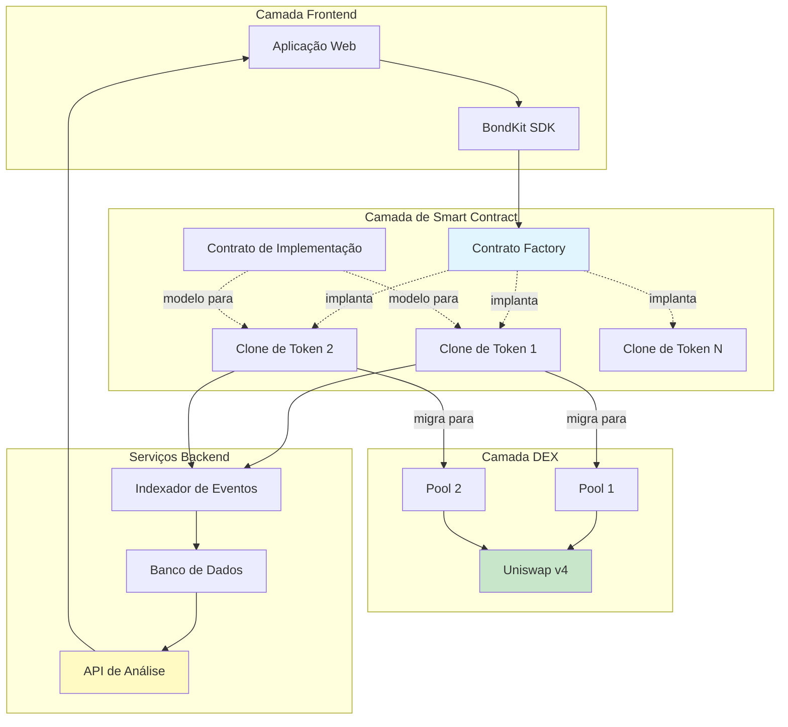

## Visão Geral da Arquitetura



## Fluxo do Produto em Detalhes

<Steps>
  <Step title="Fase 1: Criação de Token">
    **O que acontece:**
    - Usuário chama `deployBondkitToken()` no contrato Factory
    - Factory clona o contrato de Implementação usando o padrão de proxy mínimo
    - Novo token é inicializado com parâmetros personalizados
    - Token entra automaticamente na fase de bonding
    
    **Custo de Gas:** ~200.000 gas (90% mais barato que uma implantação completa)
    **Tempo:** ~15 segundos
  </Step>
  
  <Step title="Fase 2: Trading na Curva de Bonding">
    **O que acontece:**
    - Usuários compram/vendem tokens diretamente do contrato
    - Preço segue a curva de bonding algorítmica: `S = S_final × (R/R_target)^exponente`
    - Taxa de 5% em todas as transações vai para o destinatário da taxa
    - Contrato acumula ativos de cotação (ETH/B3) em direção ao alvo
    - Backend indexa todas as transações para análise
    
    **Mecânica de Trading:**
    - Compra: Envie ETH/B3, receba tokens pelo preço atual da curva
    - Venda: Envie tokens, receba ETH/B3 menos taxas
    - Reembolsos automáticos se a compra exceder o alvo
    
    **Duração:** Até o alvo ser alcançado (horas a semanas)
  </Step>
  
  <Step title="Fase 3: Migração para DEX">
    **O que acontece:**
    - Admin chama `migrateToDex()` quando o alvo é alcançado
    - Contrato calcula o preço justo de mercado como `sqrtPriceX96`
    - Cria e inicializa o pool Uniswap v4
    - Transfere a liquidez acumulada para o pool
    - Renuncia à propriedade para o endereço zero
    - Token se torna um ERC20 padrão com trading na DEX
    
    **Pós-migração:**
    - Curva de bonding permanentemente desabilitada
    - Todo trading via Uniswap v4
    - Sem controles de administração restantes
    - Descentralização completa alcançada
    
    **Custo de Gas:** ~500.000 gas
    **Tempo:** ~30 segundos
  </Step>
</Steps>

## Componentes do Sistema

### Smart Contracts

<AccordionGroup>
  <Accordion title="🏭 Contrato Factory">
    **Propósito:** Implanta novos tokens de bond de forma eficiente
    
    **Funções Principais:**
    - `deployBondkitToken()` - Cria novo clone de token
    - `getImplementationAddress()` - Retorna endereço do modelo
    - `setAllowedQuoteAsset()` - Função de admin para listar ativos
    
    **Otimização de Gas:**
    - Usa o padrão de proxy mínimo EIP-1167
    - Compartilha lógica entre todos os tokens
    - ~90% de economia de gas vs implantações individuais
  </Accordion>
  
  <Accordion title="📜 Contrato de Implementação">
    **Propósito:** Modelo para todos os tokens de bond
    
    **Características Principais:**
    - Conformidade com o padrão ERC20
    - Matemática da curva de bonding
    - Lógica de migração para Uniswap v4
    - Sistema de distribuição de taxas
    
    **Transições de Estado:**
    1. Não inicializado → Fase de Bonding
    2. Fase de Bonding → Pronto para Migração
    3. Pronto para Migração → Fase DEX
  </Accordion>
  
  <Accordion title="🪙 Clones de Token">
    **Propósito:** Instâncias individuais de token
    
    **Ciclo de Vida:**
    - Criado via factory
    - Inicializado com parâmetros únicos
    - Gerencia sua própria curva de bonding
    - Auto-migra para Uniswap v4
    
    **Armazenamento:**
    - Metadados do token (nome, símbolo)
    - Suprimento e distribuição
    - Estado da curva de bonding
    - Parâmetros de migração
  </Accordion>
</AccordionGroup>

### Serviços Backend

<AccordionGroup>
  <Accordion title="🔍 Indexador de Eventos">
    **Propósito:** Captura toda atividade on-chain
    
    **Monitora:**
    - Criações de token
    - Transações de compra/venda
    - Eventos de migração
    - Atividades de transferência
    
    **Tecnologia:**
    - Varredura blockchain em tempo real
    - Processamento de logs de eventos
    - Sincronização com banco de dados
  </Accordion>
  
  <Accordion title="📊 Motor de Análise">
    **Propósito:** Processa dados brutos em insights
    
    **Gera:**
    - Dados de candlestick OHLCV
    - Métricas de volume
    - Rastreamento de liquidez
    - Histórico de preços
    - Estatísticas de usuários
    
    **Atualizações:** A cada bloco (~2 segundos)
  </Accordion>
  
  <Accordion title="🌐 API REST">
    **Propósito:** Fornece dados para frontends
    
    **Endpoints:**
    - `/tokens` - Lista todos os tokens
    - `/tokens/{address}` - Detalhes do token
    - `/tokens/{address}/transactions` - Histórico de transações
    - `/tokens/{address}/ohlcv` - Dados para gráfico
    - `/users/{address}/portfolio` - Posse do usuário
    
    **Formato:** JSON com paginação
  </Accordion>
</AccordionGroup>

### Papéis dos Usuários

| Papel | Responsabilidades | Permissões |
|------|-----------------|-------------|
| **Criador** | Implanta token, define parâmetros, inicia migração | Controle total até a migração |
| **Traders** | Compra/venda durante o bonding, trade na DEX | Direitos padrão de trading |
| **Destinatário da Taxa** | Recebe taxas de trading | Renda passiva apenas |
| **Admin de Migração** | Executa migração quando pronto | Direito de migração único |
| **Provedores de LP** | (Pós-migração) Adiciona liquidez ao Uniswap | Direitos padrão de LP |

## Mergulho Técnico

### Matemática da Curva de Bonding

A curva de bonding determina o preço do token baseado no suprimento:

```
Fórmula de Preço:
S = S_final × (R / R_target)^exponente

Onde:
- S = Suprimento atual do token
- S_final = Suprimento final do token
- R = Quantia arrecadada (ETH/B3)
- R_target = Quantia alvo
- exponente = 1 / (1 + fatorDeAgressividade/100)
```

**Exemplos de Cálculos:**

| Agressividade | Exponente | Comportamento do Preço |
|---------------|----------|----------------|
| 0 | 1.00 | Linear (preço constante) |
| 25 | 0.80 | Curva suave |
| 50 | 0.67 | Curva moderada |
| 75 | 0.57 | Curva acentuada |
| 100 | 0.50 | Muito acentuada (raiz quadrada) |

### Cálculo do Preço de Migração

Ao migrar para Uniswap v4, o contrato:

1. **Calcula o preço de saída** da curva de bonding
2. **Converte para o formato sqrtPriceX96**:
   ```
   sqrtPriceX96 = sqrt(preço) × 2^96
   ```
3. **Inicializa o pool** com esse preço
4. **Adiciona liquidez** usando os fundos acumulados

### Técnicas de Otimização de Gas

<Info>
  **Padrão de Proxy Mínimo (EIP-1167)**
  
  Em vez de implantar o código completo do contrato para cada token:
  - Implanta um contrato de implementação (600KB)
  - Implanta contratos proxy minúsculos (45 bytes cada)
  - Proxies delegam todas as chamadas para a implementação
  - Resultado: 90% de economia de gas por implantação
</Info>

## Parâmetros de Configuração

### Parâmetros de Criação de Token

| Parâmetro | Tipo | Faixa/Formato | Impacto |
|-----------|------|--------------|--------|
| `name` | string | 1-50 chars | Nome de exibição do token |
| `symbol` | string | 2-10 chars | Símbolo de trading |
| `finalTokenSupply` | uint256 | > 0 | Total de tokens que podem ser cunhados |
| `aggressivenessFactor` | uint8 | 0-100 | Inclinação da curva |
| `targetEth` | uint256 | > 0 | Limiar para migração |
| `feeRecipient` | address | Endereço válido | Recebe taxas |
| `lpSplitRatioFeeRecipientBps` | uint256 | 0-10000 | Participação da taxa de LP (pontos base) |
| `migrationAdminAddress` | address | Endereço válido | Pode acionar migração |

### Parâmetros de Execução

| Ação | Parâmetros | Validação |
|--------|------------|------------|
| Compra | `minTokensOut`, `ethAmount` | Proteção contra slippage |
| Venda | `tokenAmount`, `minEthOut` | Verificação de saldo, slippage |
| Migração | Nenhum | Alvo alcançado, apenas admin |

### Constantes do Sistema

| Constante | Valor | Descrição |
|----------|-------|-------------|
| Taxa de Trading | 5% | Aplicada a todas as transações |
| Decimais | 18 | Decimais padrão ERC20 |
| Min Alvo | 0.1 ETH | Alvo mínimo viável |
| Máx Agressividade | 100 | Fator máximo da curva |

## Considerações de Segurança

<Warning>
  **Características de Segurança Importantes:**
  
  1. **Renúncia de Propriedade**: Automática após migração
  2. **Sem Função de Cunhagem**: Suprimento fixo na criação
  3. **Parâmetros Imutáveis**: Não podem ser alterados após implantação
  4. **Contratos Auditados**: Código revisado profissionalmente
  5. **Sem Backdoors de Admin**: Verdadeira descentralização
  6. **Proteção contra Slippage**: Incorporada nas funções de compra/venda
  7. **Proteção contra Overflow**: Matemática segura em todo o lugar
</Warning>

## Cenários de Falha e Tratamento

| Cenário | Resposta do Sistema |
|----------|----------------|
| Compra excede o alvo | Preenchimento parcial, reembolso do excesso |
| Liquidez insuficiente para venda | Transação reverte |
| Migração antes do alvo | Transação reverte |
| Tentativa de migração por não-admin | Transação reverte |
| Tentativa de dupla migração | Transação reverte |
| Operações com endereço zero | Transação reverte |

## Próximos Passos

<CardGroup cols={2}>
  <Card title="Mecânica de Preços" icon="chart-line" href="/bondkit/concepts/pricing">
    Entenda a matemática da curva de bonding
  </Card>
  <Card title="Guia de Migração" icon="rocket" href="/bondkit/guides/migration">
    Aprenda o processo de migração
  </Card>
</CardGroup>
