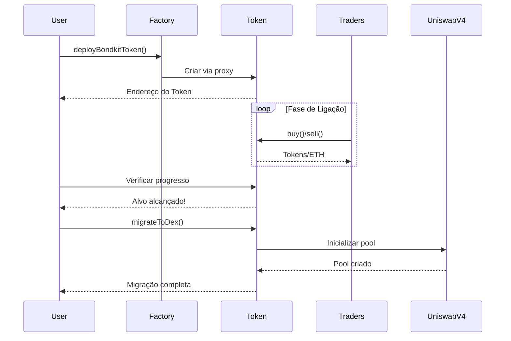

## Visão Geral

Este guia rápido irá conduzi-lo pelo ciclo de vida completo de um token BondKit em menos de 5 minutos. Você aprenderá como:

1. **Implantar** um novo token de obrigação
2. **Negociar** durante a fase de ligação
3. **Monitorar** o progresso em direção ao alvo
4. **Migrar** para Uniswap v4

<Info>
  **Pré-requisitos**: Certifique-se de ter completado a [instalação](/bondkit/installation) e possuir uma carteira financiada na Base.
</Info>

## Diagrama de Fluxo Completo



## Passo 1: Implante Seu Token

### Implantação Básica

```typescript
import { BondkitTokenFactory } from "@b3dotfun/sdk/bondkit";
import { base } from "viem/chains";
import { parseEther } from "viem";

// Inicializar a fábrica
const factory = new BondkitTokenFactory(
  base.id, 
  process.env.WALLET_PRIVATE_KEY
);

// Implantar seu token
const tokenAddress = await factory.deployBondkitToken({
  // Metadados do token
  name: "My Awesome Token",
  symbol: "MAT",
  
  // Configuração de fornecimento (1 milhão de tokens)
  finalTokenSupply: parseEther("1000000"),
  
  // Configurações da curva de ligação
  aggressivenessFactor: 35,  // 0-100, quanto maior, mais íngreme a curva
  targetEth: parseEther("10"), // Alvo de 10 ETH para migração
  
  // Configuração de taxa
  feeRecipient: "0x742d35Cc6634C0532925a3b844Bc9e7595f0bEb1", // Seu endereço
  lpSplitRatioFeeRecipientBps: 1000n, // 10% para o destinatário da taxa
  
  // Configurações de migração
  migrationAdminAddress: "0x742d35Cc6634C0532925a3b844Bc9e7595f0bEb1",
  uniswapV2RouterAddress: "0x4752ba5DBc23f44D87826276BF6Fd6b1C372aD24" // Roteador V4
});

console.log("✅ Token implantado em:", tokenAddress);
```

### Entendendo os Parâmetros

<ParamField path="finalTokenSupply" type="bigint" required>
  Fornecimento total de tokens (com 18 decimais). Exemplo: `parseEther("1000000")` para 1M de tokens.
</ParamField>

<ParamField path="aggressivenessFactor" type="number" required>
  Controla a inclinação da curva de ligação (0-100):
  - **0-30**: Precificação linear, justa para todos os compradores
  - **30-60**: Curva moderada, abordagem equilibrada
  - **60-100**: Agressiva, recompensa os compradores iniciais
</ParamField>

<ParamField path="targetEth" type="bigint" required>
  Quantidade de ETH necessária para habilitar a migração. Use `parseEther("10")` para 10 ETH.
</ParamField>

<ParamField path="feeRecipient" type="address" required>
  Endereço que recebe as taxas de negociação (5% de todas as negociações).
</ParamField>

<ParamField path="lpSplitRatioFeeRecipientBps" type="bigint" required>
  Pontos base (1/100 de 1%) para divisão da taxa do LP. 1000 = 10%.
</ParamField>

## Passo 2: Negociação Durante a Fase de Ligação

### Inicializar Instância do Token

```typescript
import { BondkitToken } from "@b3dotfun/sdk/bondkit";
import { parseEther, formatEther } from "viem";

// Conectar ao seu token implantado
const token = new BondkitToken(
  tokenAddress, 
  process.env.WALLET_PRIVATE_KEY
);
```

### Comprando Tokens

```typescript
// Obter uma cotação de preço primeiro
const ethAmount = parseEther("1"); // 1 ETH
const expectedTokens = await token.getAmountOfTokensToBuy(ethAmount);

console.log(`1 ETH comprará: ${formatEther(expectedTokens)} tokens`);

// Executar a compra
const buyTx = await token.buy(
  0n,    // minTokensOut (0 = aceitar qualquer quantidade, usar para proteção contra deslizamento)
  "1"    // Quantidade de ETH como string
);

console.log("Compra completa! Tx:", buyTx);
```

### Vendendo Tokens

```typescript
// Verificar seu saldo de tokens
const balance = await token.getBalance(userAddress);
console.log(`Seu saldo: ${formatEther(balance)} tokens`);

// Obter cotação de venda
const tokensToSell = parseEther("1000");
const expectedEth = await token.getAmountOfEthToReceive(tokensToSell);

console.log(`Vender 1000 tokens retornará: ${formatEther(expectedEth)} ETH`);

// Executar a venda
const sellTx = await token.sell(
  tokensToSell,  // Quantidade de tokens a vender
  0n             // Min ETH out (para proteção contra deslizamento)
);

console.log("Venda completa! Tx:", sellTx);
```

### Monitorando o Progresso

```typescript
// Verificar o progresso da ligação
const progress = await token.getBondingProgress();

console.log(`
  Progresso: ${(progress.progress * 100).toFixed(2)}%
  Arrecadado: ${formatEther(progress.raised)} ETH
  Alvo: ${formatEther(progress.threshold)} ETH
  Restante: ${formatEther(progress.threshold - progress.raised)} ETH
`);

// Obter preço atual do token
const currentPrice = await token.getCurrentPrice();
console.log(`Preço atual: ${formatEther(currentPrice)} ETH por token`);

// Verificar se a migração está disponível
const canMigrate = await token.canMigrate();
console.log(`Pronto para migrar: ${canMigrate}`);
```

### Monitoramento de Eventos

```typescript
// Ouvir por eventos de compra
token.onBuy((event) => {
  console.log("Nova compra:", {
    comprador: event.buyer,
    ethIn: formatEther(event.ethIn),
    tokensOut: formatEther(event.tokensOut)
  });
});

// Ouvir por eventos de venda
token.onSell((event) => {
  console.log("Nova venda:", {
    vendedor: event.seller,
    tokensIn: formatEther(event.tokensIn),
    ethOut: formatEther(event.ethOut)
  });
});
```

## Passo 3: Migração para Uniswap v4

### Verificar Prontidão para Migração

```typescript
// Verificar se o alvo foi alcançado
const progress = await token.getBondingProgress();

if (progress.progress >= 1.0) {
  console.log("✅ Alvo alcançado! Pronto para migrar.");
  
  // Obter detalhes da migração
  const migrationData = await token.getMigrationData();
  console.log("Migração criará pool com:", {
    ethLiquidity: formatEther(migrationData.ethForLp),
    tokenLiquidity: formatEther(migrationData.tokensForLp),
    initialPrice: formatEther(migrationData.sqrtPriceX96)
  });
} else {
  console.log(`⏳ Necessário mais ${formatEther(progress.threshold - progress.raised)} ETH`);
}
```

### Executar Migração

```typescript
// Apenas o administrador da migração pode chamar isso
if (await token.isMigrationAdmin(userAddress)) {
  console.log("🚀 Iniciando migração para Uniswap v4...");
  
  const migrationTx = await token.migrateToDex();
  console.log("Transação de migração:", migrationTx);
  
  // Aguardar confirmação
  const receipt = await token.waitForTransaction(migrationTx);
  
  if (receipt.status === "success") {
    console.log("✅ Migração completa!");
    console.log("Endereço do pool Uniswap v4:", await token.getPoolAddress());
  }
} else {
  console.log("❌ Apenas o administrador da migração pode executar a migração");
}
```

<Warning>
  **Importante**: Após a migração:
  - A propriedade do contrato é automaticamente renunciada
  - A negociação da curva de ligação é permanentemente desabilitada
  - Todas as negociações se movem para Uniswap v4
  - Nenhuma ação administrativa adicional é possível
</Warning>

## Exemplo Completo

Aqui está um exemplo completo de trabalho que demonstra todo o ciclo de vida:

```typescript
import { 
  BondkitTokenFactory, 
  BondkitToken 
} from "@b3dotfun/sdk/bondkit";
import { base } from "viem/chains";
import { parseEther, formatEther } from "viem";

async function launchToken() {
  // 1. Implantar token
  const factory = new BondkitTokenFactory(
    base.id,
    process.env.WALLET_PRIVATE_KEY
  );
  
  const tokenAddress = await factory.deployBondkitToken({
    name: "Demo Token",
    symbol: "DEMO",
    finalTokenSupply: parseEther("1000000"),
    aggressivenessFactor: 50,
    targetEth: parseEther("5"),
    feeRecipient: process.env.WALLET_ADDRESS,
    lpSplitRatioFeeRecipientBps: 1000n,
    migrationAdminAddress: process.env.WALLET_ADDRESS,
    uniswapV2RouterAddress: "0x4752ba5DBc23f44D87826276BF6Fd6b1C372aD24"
  });
  
  console.log("Token implantado:", tokenAddress);
  
  // 2. Negociar durante a ligação
  const token = new BondkitToken(
    tokenAddress,
    process.env.WALLET_PRIVATE_KEY
  );
  
  // Comprar alguns tokens
  await token.buy(0n, "0.5");
  console.log("Comprou tokens com 0.5 ETH");
  
  // Verificar progresso
  const progress = await token.getBondingProgress();
  console.log(`Progresso: ${(progress.progress * 100).toFixed(2)}%`);
  
  // 3. Continuar negociando até o alvo ser alcançado...
  // (Na produção, outros usuários estariam negociando)
  
  // 4. Migrar quando estiver pronto
  if (progress.progress >= 1.0) {
    await token.migrateToDex();
    console.log("Migração completa! Token agora está no Uniswap v4");
  }
}

launchToken().catch(console.error);
```

## Próximos Passos

<CardGroup cols={2}>
  <Card title="Conceitos" icon="book" href="/bondkit/concepts/bonding-phase">
    Mergulho profundo em curvas de ligação e precificação
  </Card>
  <Card title="Referência do SDK" icon="code" href="/bondkit/sdk/reference">
    Explore todos os métodos disponíveis
  </Card>
  <Card title="Guias" icon="compass" href="/bondkit/guides/choose-quote-asset">
    Aprenda estratégias avançadas
  </Card>
  <Card title="Aplicativo de Demonstração" icon="desktop" href="https://github.com/b3dotfun/b3-monorepo/tree/main/apps/bondkit-demo">
    Veja uma implementação completa
  </Card>
</CardGroup>
