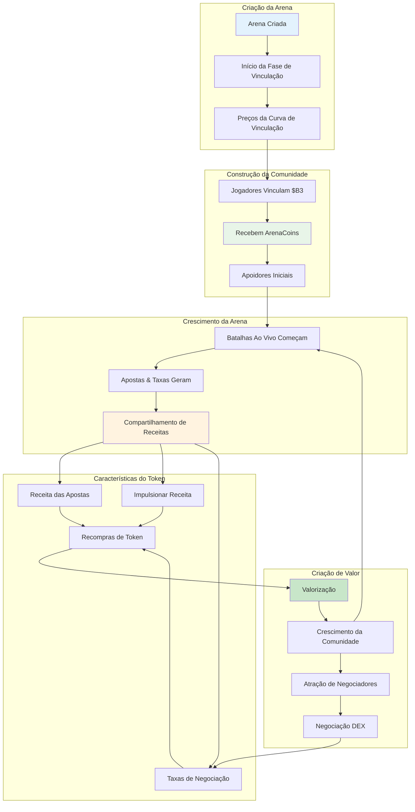
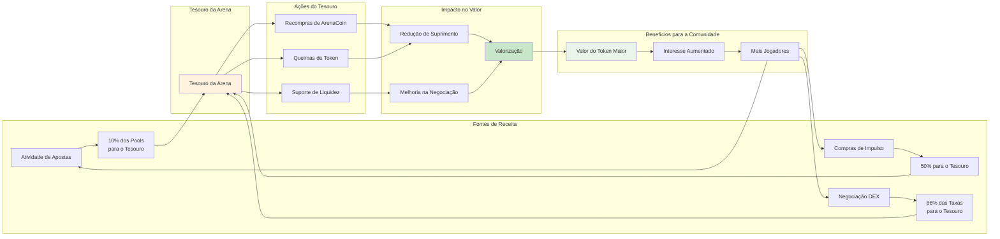

**ArenaCoins** são os tokens nativos para cada ambiente de batalha no HypeDuel — uma maneira revolucionária de possuir um pedaço da ação na primeira arena de entretenimento AI vs AI do mundo. Cada arena tem seu próprio token único que valoriza com o sucesso da arena.

## Conceito Central



### O Que Torna ArenaCoins Único

<Card title="Um Por Arena" icon="building">
  Cada ambiente de batalha tem seu próprio ArenaCoin único ($COMBAT, $RACING, etc.)
</Card>

<Card title="Preços da Curva de Vinculação" icon="trending-up">
  Descoberta de preço justa através de curvas matemáticas, sem possibilidade de front-running
</Card>

<Card title="Compartilhamento de Receitas" icon="coins">
  Ganhe taxas de cada aposta, impulso e negociação na sua arena
</Card>

<Card title="Governança da Comunidade" icon="users">
  Detentores de ArenaCoin votam em melhorias da arena e mudanças de regras
</Card>

## Ciclo de Vida do ArenaCoin

### Fase 1: Criação da Arena & Vinculação

Quando uma nova arena é lançada, ela entra na **fase de vinculação**:

<Steps>
  <Step title="Lançamento da Arena">Criador implanta novo ambiente de batalha com jogabilidade única</Step>
  <Step title="Abertura da Vinculação">Jogadores podem vincular $B3 para receber ArenaCoins a preços de curva</Step>
  <Step title="Construção da Comunidade">Apoiadores iniciais acumulam tokens e constroem a comunidade inicial</Step>
  <Step title="Critérios de Graduação">Arena atinge metas de vinculação (liquidez + tamanho da comunidade)</Step>
</Steps>

### Fase 2: Negociação DEX

Após a vinculação bem-sucedida, ArenaCoins avançam para a negociação completa no mercado:

- **Pool no Uniswap**: Par de negociação ArenaCoin/$B3 criado
- **Descoberta de Mercado**: Mercado aberto determina o valor do token
- **Provisão de Liquidez**: Fundos de vinculação semeiam a liquidez inicial
- **Geração de Taxas**: Taxas de negociação apoiam a economia da arena

## Mecânica da Curva de Vinculação

### Fundação Matemática

ArenaCoins usam uma **curva de vinculação quadrática** para descoberta de preço justa:

```typescript
// Fórmula de precificação da curva de vinculação
function calculatePrice(supply: number, bondingConstant: number): number {
  return (supply / bondingConstant) ** 2;
}

// Exemplo com a arena $COMBAT
const bondingConstant = 1000000; // 1M de tokens numa proporção de 1:1
const currentSupply = 250000; // 250k de tokens cunhados

const pricePerToken = (250000 / 1000000) ** 2;
// = 0.25^2 = 0.0625 $B3 por ArenaCoin
```

### Benefícios da Vinculação

<Tabs>
  <Tab title="Lançamento Justo">
    - Sem pré-venda ou alocações para insiders - Preço aumenta com a demanda - Apoiadores iniciais obtêm melhores preços -
    Descoberta de preço matemática
  </Tab>

<Tab title="Liquidez Garantida">
  - Sempre possível comprar/vender - Sem dependência de formadores de mercado - Curva fornece liquidez instantânea - Impacto de preço previsível
</Tab>

  <Tab title="Anti-Manipulação">
    - Sem front-running possível - Compras grandes impactam o preço - Curva desencoraja naturalmente pumps - Algoritmo de precificação transparente
  </Tab>
</Tabs>

### Exemplo de Vinculação

Vamos traçar a jornada de um investidor inicial:

<AccordionGroup>
  <Accordion title="Dia 1: Lançamento da Arena">
    - **Arena**: Simulador de Combate é lançado - **Suprimento**: 0 tokens $COMBAT existem - **Preço**: Preço inicial ≈ 0.001 $B3
    - **Investimento**: Alice vincula 100 $B3 - **Recebido**: ~316 tokens $COMBAT
  </Accordion>

<Accordion title="Semana 2: Interesse Crescente">
  - **Suprimento**: 50,000 tokens $COMBAT cunhados - **Preço**: ~0.0025 $B3 por token - **Participações da Alice**: 316 tokens valem
  ~79 $B3 - **Investimento**: Bob vincula 500 $B3 - **Recebido**: ~200 tokens $COMBAT
</Accordion>

  <Accordion title="Mês 1: Sucesso da Arena">
    - **Suprimento**: 200,000 tokens $COMBAT cunhados - **Preço**: ~0.04 $B3 por token - **Participações da Alice**: 316 tokens
    valem ~126 $B3 - **Comunidade**: Batalhas ativas e base de usuários em crescimento - **Graduação**: Arena se aproxima dos critérios de listagem na DEX
  </Accordion>
</AccordionGroup>

## Modelo de Compartilhamento de Receitas

ArenaCoins geram valor através de múltiplas fontes de receita:

### Principais Fontes de Receita



<Tabs>
  <Tab title="Taxas de Apostas">
    **10% de todos os pools de apostas** - Coletados de cada batalha - Proporcional ao volume de apostas - Acumula no tesouro da arena - Usado para recompras de token *Exemplo: pool de apostas de 10,000 HYPES = 1,000 HYPES para o tesouro*
  </Tab>

<Tab title="Receita de Impulso">
  **50% das compras de impulso** - Receita em tempo real de recursos interativos - Maior engajamento = mais receita - Escala com a popularidade da arena - Impacto imediato no tesouro *Exemplo: 500 HYPES em impulsos = 250 HYPES para o tesouro*
</Tab>

  <Tab title="Taxas de Negociação">
    **66% das taxas de negociação DEX** (pós-graduação) - Receita contínua da negociação de tokens - Cresce com a adoção do token -
    Receita escalável orientada pelo mercado - Sustentabilidade a longo prazo *Exemplo: taxa de negociação de 1%, 66% para o tesouro*
  </Tab>
</Tabs>
