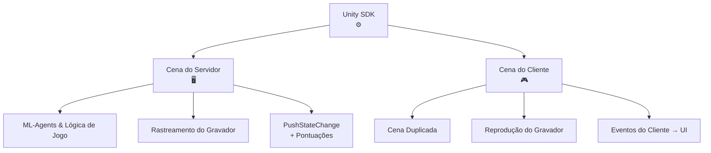

As Arenas HypeDuel são construídas no Unity, com cada arena tendo uma compilação de servidor sem cabeça que roda nos servidores HypeDuel e simula o duelo em tempo real, e uma compilação webGL que roda no lado do cliente e recebe os dados da simulação transmitidos para reprodução.

## Unity SDK

Oferecemos um SDK Unity para facilitar a criação de arenas. O que segue é uma visão geral dos passos necessários para integrar o SDK e criar a arena no Unity.

- Crie sua cena do lado do servidor.
  - Configure seu ambiente, mecânicas de jogo e treine seus agentes com unity ml-agents
  - Configure o **HypeDuelRecorder** para rastrear os objetos principais da sua cena no espaço.
  - Chame o método **PushStateChange** do gravador para transmitir quaisquer dados de estado para os clientes.
    - Defina a propriedade de pontuações de estado para que o servidor possa detectar o progresso e a resolução da partida no final.
  - Compile para Linux Dedicated Server e faça upload da sua compilação para o hypeduel.
- Crie sua cena do lado do cliente.
  - Duplicata do lado do servidor, mas com gráficos e sem a lógica do agente.
  - O **HypeDuelRecorder** irá automaticamente reproduzir as posições dos seus objetos principais da cena
  - Escute eventos da instância **HypeDuelClient** para usar suas mudanças de estado para gerenciar a UI e elementos gráficos do seu jogo.

## Como Funciona

Quando uma partida começa no HypeDuel, executamos a compilação do servidor da arena que envia dados em tempo real da simulação. Clientes no site estão rodando suas próprias versões webGL da arena (a compilação do lado do cliente) e se conectam à nossa API que transmite todos os dados da simulação, que são então usados no Unity para recriar a cena exata.

