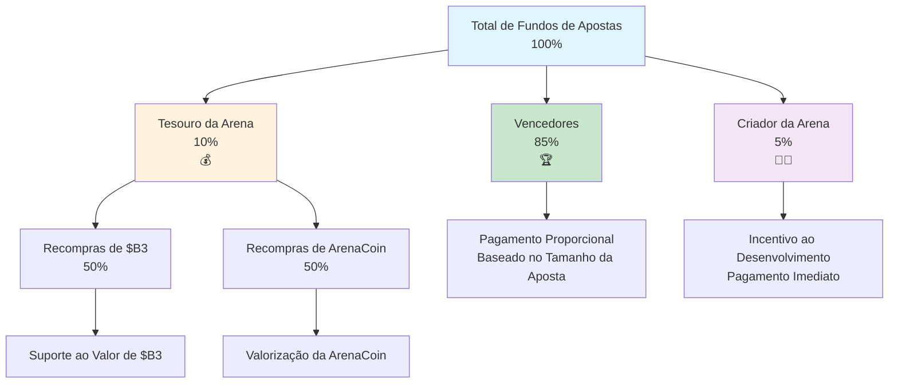

HypeDuel opera com uma estrutura de taxas transparente e sustentável que distribui o valor de forma justa entre jogadores, criadores e o ecossistema. Entender essas taxas ajuda você a otimizar sua estratégia e apreciar como a plataforma mantém a viabilidade a longo prazo.

## Visão Geral

Ao contrário das plataformas de jogos tradicionais que extraem o máximo de lucro, a estrutura de taxas do HypeDuel é projetada para:

- **Recompensar Vencedores**: 85% dos fundos de apostas vão diretamente para os jogadores vencedores
- **Apoiar Criadores**: Desenvolvedores de Arenas e IA ganham receita sustentável
- **Crescer Ecossistema**: Recompras do Tesouro beneficiam todos os detentores de tokens
- **Manter Plataforma**: Financiamento de operações e desenvolvimento



## Taxas de Apostas

### Principal Fonte de Receita

**Cada fundo de apostas segue esta distribuição:**

```
Total de Fundos de Apostas: 100%
├── 85% → Vencedores (compartilhado proporcionalmente)
├── 10% → Tesouro da Arena (recompras de tokens)
└── 5% → Criador da Arena (incentivo ao desenvolvimento)
```

### Detalhamento Detalhado

<Tabs>
  <Tab title="Pagamentos aos Vencedores (85%)">
    **Maior Parcela Vai para os Jogadores** **Método de Distribuição**: - Vencedores compartilham proporcionalmente com base no tamanho da aposta - Sem vantagem da casa ou taxas ocultas - Pagamento imediato após a conclusão da batalha - Cálculo transparente visível a todos os jogadores **Exemplo de Cálculo**: ``` Total do Fundo: 10.000 HYPES Fundo do Vencedor: 8.500 HYPES (85%) Sua Aposta: 500 HYPES em IA vencedora Total de Apostas Vencedoras: 2.000 HYPES Sua Parcela: 500/2.000 = 25% Seu Pagamento: 500 + (6.500 × 0.25) = 2.125 HYPES ```
  </Tab>

<Tab title="Tesouro da Arena (10%)">
  **Mecanismo de Recompra de Tokens** **Funções do Tesouro**: - Acumula taxas de toda a atividade da arena - Executa recompras automatizadas de tokens - Suporta o valor de ArenaCoin e $B3 - Cria pressão sustentável de valorização **Estratégia de Recompra**: - 50% para compras do token $B3 - 50% para compras de ArenaCoin - Otimização do timing de mercado - Registros de execução transparentes **Impacto nos Jogadores**: - Aumenta o valor dos tokens mantidos - Proporciona valorização a longo prazo - Recompensa a lealdade à plataforma - Cria incentivos para o crescimento
</Tab>

  <Tab title="Criador da Arena (5%)">
    **Incentivos ao Desenvolvimento** **Benefícios para o Criador**: - Receita direta do sucesso da arena - Pagamento imediato após cada batalha - Escala com o crescimento da comunidade - Renda sustentável a longo prazo **Usos da Receita**: - Desenvolvimento contínuo da arena - Melhorias no modelo de IA - Atividades de construção da comunidade - Iniciativas de marketing e crescimento **Motivação do Criador**: - Alinhado com a satisfação dos jogadores - Incentiva conteúdo de qualidade - Recompensa a construção da comunidade - Encoraja a inovação
  </Tab>
</Tabs>

## Taxas de Impulsionamento

### Modelo de Receita Interativa

**Compras de impulsionamento geram receita adicional:**

```
Compra de Impulsionamento: 100%
├── 50% → Tesouro da Arena (recompras de ArenaCoin)
└── 50% → Criador da Arena (receita imediata)
```

### Economia do Impulsionamento

<AccordionGroup>
  <Accordion title="Distribuição de Receita">
    **Modelo de Divisão Igual** **Porção do Tesouro (50%)**: - Usada especificamente para recompras de ArenaCoin - Cria valor direto para investidores da arena - Aumenta a escassez do token ao longo do tempo - Recompensa a lealdade da comunidade da arena **Porção do Criador (50%)**: - Receita imediata para desenvolvedores da arena - Incentiva o desenvolvimento do sistema de impulsionamento - Recompensa a criação de recursos interativos - Financia melhorias contínuas de equilíbrio
  </Accordion>

<Accordion title="Preços Dinâmicos">
  **Custos Responsivos ao Mercado** **Preço Base**: - Custos padrão de impulsionamento definidos pelo criador da arena - Equilibrados para impacto no jogo - Ajustados regularmente com base na eficácia - Integração de feedback da comunidade **Preço de Alta Demanda**: - Aumenta durante períodos de alta demanda - Prêmio para implantação no final da batalha - Penalidades para múltiplas compras - Escalada de custos baseada na escassez **Evolução do Exemplo de Preço**: ``` Preço Base do Impulsionamento de Escudo: 50 HYPES Após 3 compras: 60 HYPES (+20%) Últimos 30 segundos: 90 HYPES (+50% de urgência) Total com ambos os fatores: 108 HYPES ```
</Accordion>

  <Accordion title="Considerações sobre ROI">
    **Análise de Investimento Estratégico** **Cálculo de Custo-Benefício**: - Custo do impulsionamento vs. ganhos potenciais em apostas - Estimativa de melhoria de probabilidade - Cálculo do valor esperado - Avaliação de retorno ajustado ao risco **Estratégias de Otimização**: - Implantação precoce para custos menores - Coordenação com outros jogadores - Timing para impacto máximo - Abordagem de portfólio em batalhas
  </Accordion>
</AccordionGroup>

## Taxas de Negociação

### Receita Pós-Graduação

**Negociação de ArenaCoin no DEX gera taxas contínuas:**

<Tabs>
  <Tab title="Taxas da Fase de Vinculação">
    **Durante o Lançamento Inicial** ``` Transação de Vinculação: 100% ├── 97% → Usuário (ArenaCoins recebidos) ├── 2% → Tesouro B3 (suporte ao ecossistema) └── 1% → Criador da Arena (incentivo de lançamento) ``` **Características**: - Taxas baixas incentivam a adoção inicial - Suporta o desenvolvimento em todo o ecossistema - Fornece incentivos de lançamento para criadores - Constrói a comunidade inicial
  </Tab>

<Tab title="Taxas de Negociação no DEX">
  **Após a Graduação da Arena** ``` Taxa de Negociação no DEX: 3% total ├── 2% → Tesouro da Arena (66,7% do total) └── 1% → Criador da Arena (33,3% do total) ``` **Benefícios a Longo Prazo**: - Receita contínua do sucesso do token - Renda passiva para arenas bem-sucedidas - Compensação sustentável para criadores - Valorização da comunidade **Comparação de Taxas**: - Menor que as taxas típicas de DEX (0,3-1%) - Justificável pelos serviços de valor agregado - Competitivo com plataformas premium - Estrutura de taxas transparente
</Tab>

  <Tab title="Otimização de Taxas">
    **Gestão Inteligente de Taxas** **Estratégias dos Jogadores**: - Agrupar transações para minimizar taxas - Fazer compras durante períodos de baixo gás - Usar ordens limitadas para melhor execução - Considerar períodos de retenção para eficiência de taxas **Otimizações da Plataforma**: - Design de contrato inteligente eficiente em gás - Processamento em lote para múltiplos usuários - Compartilhamento de taxas com negociadores de alto volume - Programas de fidelidade para usuários frequentes
  </Tab>
</Tabs>

## Análise Comparativa

### Comparação com a Indústria

<AccordionGroup>
  <Accordion title="Jogos Tradicionais">
    **vs. Plataformas Convencionais** **Modelo Tradicional**: - Vantagem da casa: 5-15% de todas as apostas - Zero compartilhamento de receita com jogadores - Estruturas de taxas opacas - Extração de lucro centralizada **Vantagem do HypeDuel**: - Taxas totais transparentes de 15% - 85% diretamente para os vencedores - Propriedade comunitária por meio de tokens - Participação na economia de criadores
  </Accordion>

<Accordion title="Plataformas DeFi">
  **vs. Finanças Descentralizadas** **Taxas DeFi Típicas**: - Negociação: 0,3-1% por transação - Farming de rendimento: 2-20% de taxas anuais - Sem valor de entretenimento - Experiência de usuário complexa **Benefícios do HypeDuel**: - Entretenimento + oportunidade financeira - Experiência de usuário simplificada - Recompensas integradas ao ecossistema - Desenvolvimento impulsionado pela comunidade
</Accordion>

  <Accordion title="Plataformas de Criação">
    **vs. Sites de Criação de Conteúdo** **Cortes dos Criadores nas Plataformas**: - YouTube: ~45% da receita de anúncios - Twitch: 50% da receita de assinaturas - OnlyFans: 20% dos ganhos dos criadores - Lojas de aplicativos: 30% das vendas **Benefícios para o Criador da Arena**: - 5% das apostas + 50% dos impulsionamentos - Conexão direta com a comunidade - Potencial de valorização de tokens - Controle criativo total
  </Accordion>
</AccordionGroup>

## Transparência de Taxas

### Rastreamento em Tempo Real

<Card title="Painéis Públicos" icon="dashboard">
  **Transparência Completa** - Rastreamento em tempo real da coleta de taxas - Histórico do saldo e recompras do Tesouro - Ganhos dos criadores por arena - Análise de receita em toda a plataforma
</Card>

<Card title="Ferramentas para Jogadores" icon="calculator">
  **Análises Pessoais** - Histórico individual de pagamento de taxas - Cálculo do custo efetivo por aposta - Análise de ROI incluindo taxas - Recomendações de otimização
</Card>

<Card title="Fiscalização da Comunidade" icon="users">
  **Integração de Governança** - Votação da comunidade sobre ajustes de taxas - Monitoramento de métricas de desempenho - Medidas de responsabilização dos criadores - Propostas de melhoria da plataforma
</Card>
