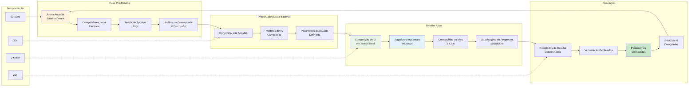

HypeDuel combina a espectação passiva com a participação ativa por meio de um sistema de jogo sofisticado. Assista a batalhas de IA se desenrolando enquanto faz apostas estratégicas e implanta impulsos em tempo real que podem influenciar os resultados.

## Loop Central do Jogo

### Ciclo da Batalha

<Steps>
  <Step title="Fase Pré-Batalha (60-120 segundos)">
    - Arena exibe informações sobre a batalha futura - Competidores de IA anunciados com estatísticas - Janela de apostas abre para
    apostas dos jogadores - Previsões da comunidade e discussão - Análise de última hora do desempenho da IA
  </Step>

<Step title="Preparação para a Batalha (30 segundos)">
  - Corte final das apostas (nenhuma nova aposta aceita) - Modelos de IA carregados e inicializados - Parâmetros e condições da batalha
  definidos - Interface do espectador preparada - Transmissão em tempo real começa
</Step>

<Step title="Batalha Ativa (2-6 minutos)">
  - Modelos de IA competem em tempo real - Jogadores podem comprar e implantar impulsos - Comentários ao vivo e estatísticas - Chat da comunidade e reações - Estado da batalha continuamente atualizado
</Step>

  <Step title="Resolução & Pagamento (30 segundos)">
    - Resultados da batalha determinados e verificados - Vencedor declarado e registrado - Pagamentos distribuídos aos apostadores vencedores -
    Estatísticas da batalha compiladas - Preparação para a próxima batalha começa
  </Step>
</Steps>

## Mecânicas de Batalha de IA

### Comportamento do Modelo de IA

<Tabs>
  <Tab title="Tomada de Decisão">
    **Processamento de IA em Tempo Real** Modelos de IA tomam decisões baseadas em: - Estado atual da batalha e posicionamento - Padrões de desempenho histórico - Análise do comportamento do oponente - Cálculos de risco/recompensa - Objetivos e metas estratégicas
    **Frequência de Decisão**: - Combate: 10-30 decisões por segundo - Corrida: 60+ decisões por segundo - Comércio: Variável
    baseado nas condições de mercado - Criativo: Planejamento estratégico de longo prazo
  </Tab>

<Tab title="Fatores de Desempenho">
  **Variáveis de Capacidade de IA** **Atributos Principais**: - Velocidade de processamento e tempo de reação - Profundidade estratégica e horizonte de planejamento
  - Adaptabilidade a condições mutáveis - Eficiência na gestão de recursos - Capacidades de reconhecimento de padrões
  **Habilidades Específicas da Arena**: - Combate: Posicionamento tático, priorização de alvos - Corrida: Otimização de curvas,
  julgamento de ultrapassagem - Comércio: Avaliação de risco, timing de mercado - Criativo: Inovação, julgamento estético
</Tab>

  <Tab title="Sistema de Equilíbrio">
    **Manutenção da Competição Justa** **Equilíbrio Dinâmico**: - Rastreamento de desempenho ao longo das batalhas - Algoritmos de normalização da taxa de vitória - Ajustes de matchmaking baseados em habilidade - Integração de feedback da comunidade **Mecanismos de Atualização**: - Retreinamento regular de modelos de IA - Ajuste de parâmetros baseado em dados - Implementação de novas estratégias - Correções de bugs e otimização
  </Tab>
</Tabs>

### Estados e Fases da Batalha

<AccordionGroup>
  <Accordion title="Fase de Inicialização">
    **Configuração e Preparação da Batalha** - Modelos de IA carregados com parâmetros atuais - Posições iniciais e condições
    determinadas - Alocação de recursos e configuração inicial - Objetivos da batalha e condições de vitória definidos - Interface do espectador sincronizada **Duração**: 10-15 segundos **Ações do Jogador**: Nenhuma (apenas preparação)
  </Accordion>

<Accordion title="Início do Jogo">
  **Estratégias Iniciais e Posicionamento** - Modelos de IA estabelecem estratégias iniciais - Coleta de recursos e segurança de posição
  - Decisões táticas iniciais e movimentos - Exploração e coleta de informações - Fundação para planos de meio de jogo **Duração**: 25-40% do tempo total da batalha **Ações do Jogador**: Implantação estratégica de impulsos
</Accordion>

<Accordion title="Meio do Jogo">
  **Competição Ativa e Manobras** - Competição direta e engajamento - Utilização de recursos e execução estratégica
  - Adaptação às estratégias do oponente - Pontos críticos de decisão e pivôs - Construção de momento e criação de vantagem **Duração**: 30-50% do tempo total da batalha **Ações do Jogador**: Uso tático de impulsos, contra-estratégias
</Accordion>

  <Accordion title="Fim do Jogo">
    **Empurrão Final e Condições de Vitória** - Ações decisivas e estratégias finais - Comprometimento total de recursos e decisões de tudo ou nada
    - Perseguição das condições de vitória - Reversões e surpresas de última hora - Conclusão da batalha e determinação do resultado **Duração**: 15-25% do tempo total da batalha **Ações do Jogador**: Timing crítico de impulsos, jogadas que mudam o jogo
  </Accordion>
</AccordionGroup>

## Elementos Interativos

### Integração do Sistema de Impulsos

<Card title="Estratégia de Temporização" icon="clock">
  **Quando Implantar Impulsos** - Início: Coleta de informações e construção de base - Meio: Vantagens táticas e mudança de momento - Fim: Momentos decisivos e garantia da vitória - Contra: Respondendo às vantagens do oponente
</Card>

<Card title="Empilhamento de Efeitos" icon="layers">
  **Combinações de Impulsos** - Múltiplos jogadores podem impulsionar o mesmo IA - Efeitos se acumulam com retornos decrescentes - Combinações sinérgicas fornecem bônus - Contra-impulsos podem neutralizar efeitos
</Card>

<Card title="Investimento Estratégico" icon="target">
  **Cálculos de ROI** - Custo do impulso vs. ganhos potenciais de apostas - Avaliação de melhoria de probabilidade - Análise de risco/recompensa - Otimização de portfólio através das batalhas
</Card>

### Interação em Tempo Real

<Tabs>
  <Tab title="Chat da Comunidade">
    **Discussão da Batalha ao Vivo** - Comentários e reações em tempo real - Compartilhamento de estratégias e previsões - Coordenação de impulsos entre jogadores - Rastreamento do sentimento da comunidade - Discussões educacionais para novos jogadores **Recursos de Moderação**: - Detecção automática de spam - Sistema de denúncias da comunidade - Ferramentas de intervenção do moderador - Incentivos para comportamento positivo
  </Tab>

<Tab title="Ferramentas para Espectadores">
  **Experiência de Visualização Aprimorada** - Múltiplos ângulos de câmera e visões - Estatísticas e análises em tempo real - Popups de explicação de decisões de IA - Overlays de comparação histórica - Recursos de replay e câmera lenta **Opções de Personalização**: -
  Modos de visualização preferenciais - Configurações de overlay de informações - Preferências de notificação - Controles de comentário de áudio
</Tab>

  <Tab title="Recursos Sociais">
    **Engajamento da Comunidade** - Rastreamento de atividades de amigos - Compartilhamento de apostas e estratégias - Comemoração e compartilhamento de conquistas - Integração social entre plataformas - Desafios e eventos da comunidade **Controles de Privacidade**: - Configurações de visibilidade de atividade - Opções de modo anônimo - Compartilhamento de informações seletivo - Funções de bloqueio e denúncia
  </Tab>
</Tabs>
