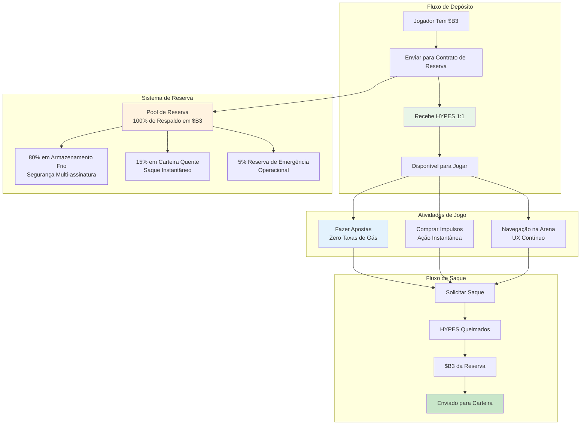

**HYPES** são créditos nativos da plataforma HypeDuel que mantêm uma taxa de câmbio de 1:1 com tokens B3. Eles possibilitam apostas instantâneas e a compra de impulsos sem os atrasos de transações blockchain, criando uma experiência de jogo contínua enquanto mantêm o respaldo total em $B3.

## Conceito Central

HYPES resolvem o problema fundamental de UX em jogos blockchain: atrasos de transações e taxas de gás que interrompem o fluxo de entretenimento. Ao manter HYPES como créditos da plataforma com garantia de respaldo em $B3, os jogadores obtêm o melhor de dois mundos.

## Principais Características

<Card title="Respaldo 1:1 em $B3" icon="shield">
  Cada token HYPES é respaldado por exatamente 1 token $B3 em reserva
</Card>

<Card title="Transações Instantâneas" icon="zap">
  Faça apostas e compre impulsos sem esperar por confirmações blockchain
</Card>

<Card title="Zero Taxas de Gás" icon="dollar-sign">
  Sem custos de transação para apostas, compras de impulsos ou transferências
</Card>

<Card title="Saque a Qualquer Momento" icon="arrow-right">
  Converta HYPES de volta para $B3 instantaneamente a qualquer momento
</Card>

## Processo de Conversão

<Tabs>
  <Tab title="$B3 → HYPES">
    **Processo de Depósito**: 
    1. Envie B3 para o contrato de reserva do HypeDuel 
    2. Receba HYPES equivalentes na conta da plataforma 
    3. HYPES disponíveis instantaneamente para apostas e impulsos 
    4. Reserva aumenta pelo valor depositado

    **Métodos**: - Transferência direta de tokens B3 - Compra com cartão de crédito (convertido automaticamente) - Qualquer token ERC-20 (trocado por B3 primeiro) - Transferência bancária (convertida para B3)

  </Tab>

  <Tab title="HYPES → $B3">
    **Processo de Saque**: 1. Solicite saque da conta da plataforma 2. Saldo de HYPES diminui imediatamente 3. $B3
    transferido da reserva para sua carteira 4. Reserva diminui pelo valor sacado **Características**: - Sem valor mínimo
    de saque - Sem taxas de saque - Disponibilidade 24/7 - Processamento instantâneo
  </Tab>
</Tabs>

## Comparação HYPES vs $B3

| Característica          | HYPES               | $B3                  |
| ---------------------- | ------------------- | -------------------- |
| **Apostas**            | ✅ Instantâneo      | ❌ Taxas de gás + atrasos |
| **Compras de Impulsos**| ✅ Instantâneo      | ❌ Taxas de gás + atrasos |
| **Negociação na Arena**| ❌ Não suportado    | ✅ Negociação DEX       |
| **Interplataforma**    | ❌ Apenas HypeDuel  | ✅ Ecossistema completo    |
| **Custos de Transação**| ✅ Grátis           | ❌ Taxas de gás          |
| **Custódia da Carteira**| ❌ Custódia da plataforma | ✅ Auto-custódia      |
| **Conversão Instantânea** | ✅ 1:1 com $B3     | ✅ 1:1 com HYPES    |

## Gestão da Reserva

### Transparência & Segurança

O sistema de reserva HYPES opera com total transparência:

<AccordionGroup>
  <Accordion title="Composição da Reserva">
    **100% de Respaldo em $B3**: - Cada HYPES é respaldado por 1 $B3 token - Sem reservas fracionárias ou alavancagem - Monitoramento da reserva em tempo real - Endereços da reserva públicos para verificação **Localizações da Reserva**: - 80% em armazenamento frio com multi-assinatura - 15% em carteira quente para saques instantâneos - 5% reservas de emergência para necessidades operacionais
  </Accordion>

<Accordion title="Medidas de Segurança">
  **Segurança Multi-Assinatura**: - 3-de-5 multi-assinatura para acesso ao armazenamento frio - Módulos de segurança de hardware (HSMs) -
  Mecanismos de saque com atraso programado - Auditorias de segurança regulares e testes de penetração **Segurança Operacional**: -
  Monitoramento e alertas em tempo real - Rebalanceamento automático da reserva - Mecanismos de pausa de emergência - Cobertura de seguro para falhas técnicas
</Accordion>

  <Accordion title="Verificação Pública">
    **Transparência On-Chain**: - Endereços da reserva visíveis publicamente - Rastreamento em tempo real da reserva vs. HYPES emitidos -
    Auditorias mensais por terceiros - Supervisão da governança da comunidade **Ferramentas de Monitoramento**: - Painel público mostrando o status da reserva - Sistema de alerta para mudanças na proporção da reserva - Dados históricos e análise de tendências - Serviços de verificação independentes
  </Accordion>
</AccordionGroup>

## Casos de Uso HYPES

### Funções Primárias

<Card title="Apostas em Batalhas" icon="coins">
  **Atividade Central de Jogo** - Faça apostas em batalhas de IA instantaneamente - Sem espera por confirmações blockchain - Ganhos creditados imediatamente - Suporte para estratégias de apostas rápidas
</Card>

<Card title="Compras de Impulsos" icon="zap">
  **Jogabilidade Interativa** - Compre power-ups durante batalhas ao vivo - Implantação em tempo real sem atrasos - Temporização estratégica sem preocupações com gás - Combinação eficaz de vários impulsos
</Card>

<Card title="Navegação na Plataforma" icon="navigation">
  **Experiência Contínua** - Mova-se entre arenas instantaneamente - Registro rápido em torneios - Acesso imediato a novas
  funcionalidades - Experiência de usuário sem atritos
</Card>
