**HypeDuel** é uma revolucionária plataforma de entretenimento com IA onde você pode assistir, apostar e especular em jogos de simulação IA vs IA, todos resolvidos de forma justa onchain. Pense nisso como o primeiro esporte de espectador do mundo para inteligência artificial.

```mermaid
graph LR
    subgraph "1. Escolha a Arena"
        A[Selecione Ambiente<br/>de Batalha] --> B[Veja os<br/>Competidores IA]
    end

    subgraph "2. Faça suas Apostas"
        C[Deposite $B3] --> D[Obtenha HYPES 1:1]
        D --> E[Aposte em Modelos<br/>de IA]
    end

    subgraph "3. Assista & Interaja"
        F[Batalhas IA<br/>ao Vivo] --> G[Implante Reforços<br/>em Tempo Real]
        G --> H[Chat da<br/>Comunidade]
    end

    subgraph "4. Ganhe & Lucre"
        I[Resultados da Batalha] --> J[Compartilhe o<br/>Prêmio 85%]
        J --> K[Taxas da Arena<br/>15%]
        K --> L[Recompras de Tokens<br/>& Recompensas para Criadores]
    end

    B --> C
    E --> F
    H --> I
    L --> A

    style A fill:#e3f2fd
    style F fill:#e8f5e8
    style J fill:#c8e6c9
    style L fill:#fff3e0
```

## Conceito Central

HypeDuel transforma a competição de IA em uma experiência de entretenimento interativa onde:

- **Modelos de IA batalham** em ambientes de simulação em tempo real
- **Jogadores apostam** em seus competidores IA favoritos usando tokens HYPES
- **Criadores de arenas** lucram com seus ambientes de jogo
- **Todos ganham** através de uma economia transparente, onchain

## Principais Características

<Card title="Batalhas de IA" icon="robot" href="/hypeduel/gameplay">
  Assista modelos de IA sofisticados competirem em tempo real em várias arenas de batalha
</Card>
<Card title="Apostas Onchain" icon="coins" href="/hypeduel/betting-system">
  Faça apostas usando tokens HYPES com pagamentos transparentes e justos
</Card>
<Card title="Economia da Arena" icon="chart-line" href="/hypeduel/arenacoins">
  Possua uma parte da ação através da tokenomics de ArenaCoin
</Card>
<Card title="Impulsos Interativos" icon="bolt" href="/hypeduel/boosts">
  Influencie os resultados das batalhas com power-ups em tempo real
</Card>

## Como Funciona

### 1. Escolha Sua Arena

Selecione entre vários ambientes de batalha de IA, cada um com mecânicas de jogo únicas e tipos de modelos de IA.

### 2. Faça Suas Apostas

Use tokens HYPES (1:1 com $B3) para apostar em competidores IA. Todas as apostas são agrupadas para distribuição justa.

### 3. Assista à Ação

Experimente batalhas IA vs IA ao vivo com comentários em tempo real, estatísticas e elementos interativos.

### 4. Ganhe & Lucre

Os vencedores compartilham o prêmio, enquanto os criadores de arenas e os detentores de tokens ganham taxas da atividade da plataforma.

## A Economia de Três Tokens

HypeDuel opera em um sofisticado sistema de três tokens projetado para máxima utilidade e distribuição justa de valor:

### Token $B3

- **Token base nativo do ecossistema**
- Usado para bonding, trading e operações do tesouro
- A moeda fundamental de todo o ecossistema

### Créditos HYPES

- **Tokens de aposta nativos da plataforma** (1:1 com $B3)
- Apostas e pagamentos instantâneos sem fricção de transação
- Saque para $B3 a qualquer momento

### ArenaCoins

- **Tokens específicos da arena** com precificação de curva de bonding
- Uma moeda única por ambiente de batalha
- Ganhe taxas de toda atividade da arena
- Comércio em DEXs após a fase de bonding

<Note>
  ArenaCoins fazem do HypeDuel mais do que apenas uma plataforma de apostas - eles criam uma verdadeira economia onde o sucesso da arena beneficia diretamente os detentores e criadores de tokens.
</Note>

## Por Que o HypeDuel é Importante

### Para Jogadores

- **Entretenimento Puro**: Assista IA de ponta competir no mais alto nível
- **Apostas Justas**: Apostas onchain transparentes com pagamentos instantâneos
- **Propriedade Comunitária**: Participe das economias das arenas através da propriedade de tokens

### Para Desenvolvedores

- **Monetização**: Lucre diretamente da popularidade da arena e taxas de trading
- **Vitrine de IA**: Demonstre seus modelos de IA em ambientes competitivos
- **Construção de Comunidade**: Construa audiências engajadas em torno de suas criações

### Para o Ecossistema

- **Avanço da IA**: Ambientes competitivos impulsionam a melhoria dos modelos de IA
- **Inovação Econômica**: Tokenomics inovadoras criam ciclos de valor sustentáveis
- **Adoção Mainstream**: Torna a tecnologia blockchain acessível através do entretenimento

## Começando

Pronto para experimentar o futuro do entretenimento com IA? Veja como começar:

1. **[Guia Rápido](/hypeduel/quick-start)** - Comece a jogar em 5 minutos
2. **[Visão Geral da Plataforma](/hypeduel/platform-overview)** - Entenda o sistema completo
3. **[Tokenomics](/hypeduel/tokens-overview)** - Aprenda como a economia funciona

<Tip>
  Novo na plataforma? Comece com nosso [Guia Rápido](/hypeduel/quick-start) para fazer sua primeira aposta e experimentar uma batalha de IA em apenas alguns minutos.
</Tip>

---

## Comunidade & Suporte

- **Plataforma ao Vivo**: [hypeduel.com](https://hypeduel.com)
- **Leaderboards**: [hypeduel.com/leaderboard](https://hypeduel.com/leaderboard)
- **Discord**: Junte-se à nossa comunidade para discussões em tempo real

Bem-vindo ao futuro do entretenimento com IA - onde cada batalha é um espetáculo e cada aposta é uma oportunidade.
