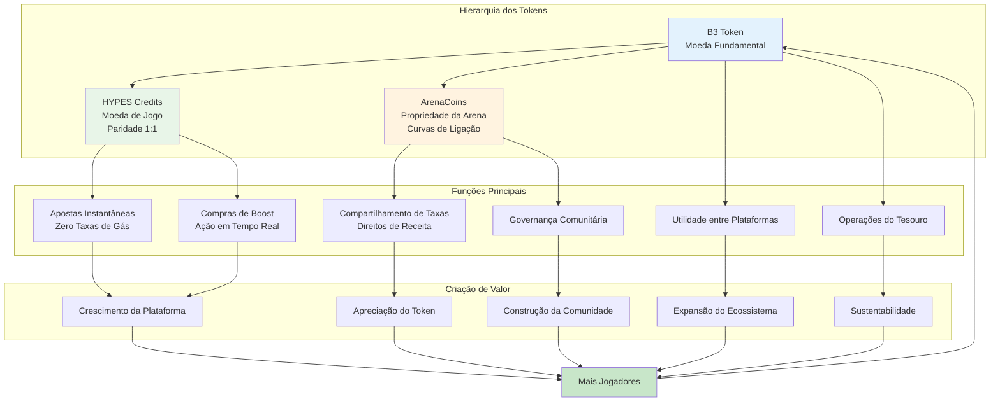
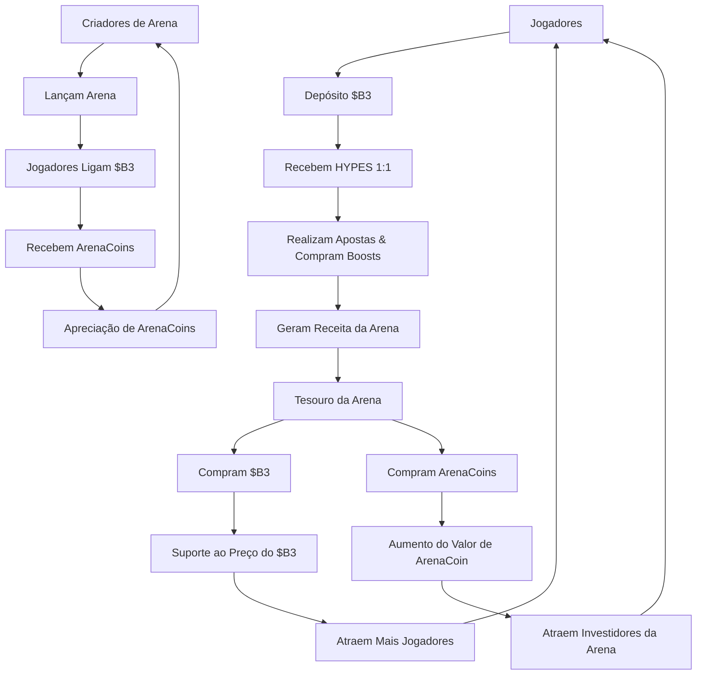

HypeDuel opera com um sofisticado sistema econômico de três tokens projetado para otimizar a experiência do usuário, criar fluxos de valor sustentáveis e possibilitar a propriedade comunitária. Cada token serve a um propósito específico enquanto trabalha em conjunto para alimentar todo o ecossistema.

## A Arquitetura de Três Tokens

### Hierarquia dos Tokens

<Tabs>
  <Tab title="$B3 Token" icon="coins">
    **Moeda Fundamental** - Token base do ecossistema - Principal reserva de valor - Utilidade entre plataformas - Reservas do tesouro
    - Ligação com ArenaCoins
  </Tab>

<Tab title="HYPES Credits" icon="zap">
  **Moeda de Jogo** - Paridade 1:1 com $B3 - Colocação instantânea de apostas - Zero taxas de gás - Saques sem interrupções - Compras de boost
</Tab>

  <Tab title="ArenaCoins" icon="chart-line">
    **Propriedade da Arena** - Única por arena - Precificação por curva de ligação - Direitos de compartilhamento de taxas - Oportunidades de negociação -
    Governança comunitária
  </Tab>
</Tabs>

## Diagrama de Fluxo dos Tokens

## Por Que Três Tokens?

### Otimização da Experiência do Usuário

O sistema de três tokens resolve problemas críticos de UX:

<AccordionGroup>
  <Accordion title="Transações Instantâneas">
    **Problema**: Transações em blockchain têm atrasos e custos de gás que interrompem o fluxo de jogo. **Solução**: HYPES
    possibilitam apostas e boosts instantâneos sem atritos de blockchain enquanto mantêm o respaldo total em $B3.
  </Accordion>

<Accordion title="Investimento em Arena">
  **Problema**: Não há como os usuários investirem ou se beneficiarem do crescimento bem-sucedido de uma arena. **Solução**: ArenaCoins permitem
  que os jogadores possuam uma parte das economias das arenas e ganhem com seu sucesso.
</Accordion>

<Accordion title="Captura de Valor">
  **Problema**: A receita da plataforma normalmente beneficia apenas o proprietário da plataforma. **Solução**: Compras de volta do tesouro de ambos $B3
  e ArenaCoins distribuem valor para todos os stakeholders.
</Accordion>

  <Accordion title="Incentivos para Criadores">
    **Problema**: Difícil compensar de forma justa os criadores de arena e modelos de IA. **Solução**: ArenaCoins fornecem compartilhamento direto
    de receitas e potencial de valorização para os criadores.
  </Accordion>
</AccordionGroup>

### Sustentabilidade Econômica

Cada token cria valor de maneiras diferentes:

<Card title="Impulsionadores de Valor do $B3" icon="trending-up">
  - Crescimento do ecossistema base - Pressão de recompra do tesouro - Utilidade entre plataformas - Integração com Staking e DeFi
</Card>

<Card title="Estabilidade dos HYPES" icon="balance-scale">
  - Garantia de respaldo 1:1 com $B3 - Capacidade de conversão instantânea - Prêmio de utilidade de jogo - Valor de conveniência da plataforma
</Card>

<Card title="Valorização de ArenaCoin" icon="rocket">
  - Crescimento da popularidade da arena - Aumento da geração de taxas - Desenvolvimento da comunidade - Expansão do volume de negociação
</Card>

## Matriz de Utilidade dos Tokens

| Funcionalidade     | $B3 | HYPES | ArenaCoins |
| ------------------ | --- | ----- | ---------- |
| **Apostas**        | ❌  | ✅    | ❌         |
| **Boosts**         | ❌  | ✅    | ❌         |
| **Ligação com Arena**  | ✅  | ❌    | ❌         |
| **Ganho de Taxas**    | ✅  | ❌    | ✅         |
| **Negociação**     | ✅  | ❌    | ✅         |
| **Governança**     | ✅  | ❌    | ✅         |
| **Entre Plataformas** | ✅  | ❌    | ❌         |

### Mecânicas do Tesouro

Tesouros de arena criam pressão de compra sustentada:

1. **Coleta de Receita**: Taxas se acumulam nos tesouros das arenas
2. **Alocação de Ativos**: 50% para recompras de $B3, 50% para recompras de ArenaCoin
3. **Compras no Mercado**: Compras automáticas no mercado criam suporte de preço
4. **Distribuição de Valor**: Benefícios fluem para todos os detentores de tokens
